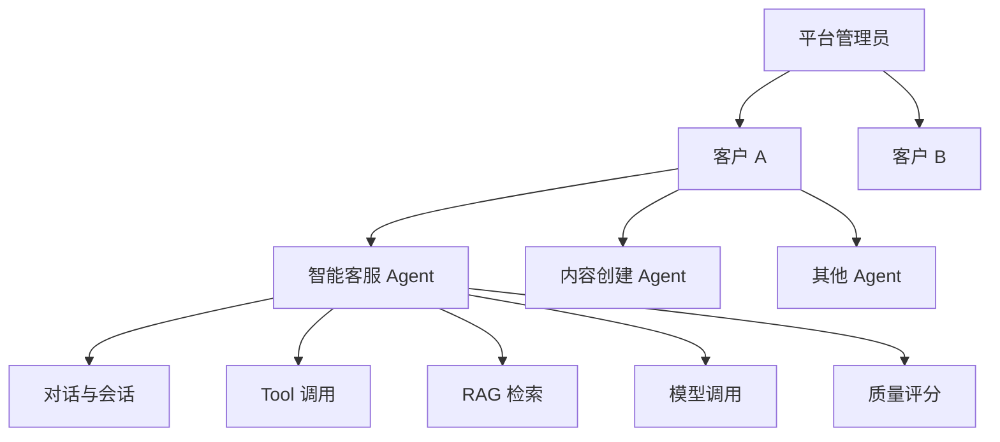
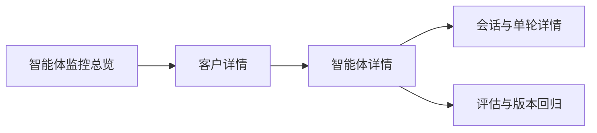
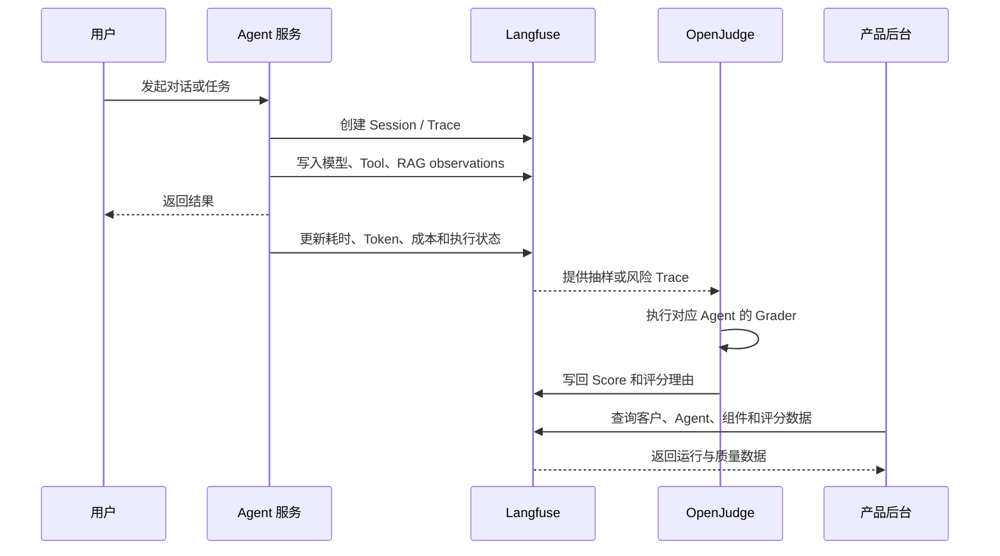
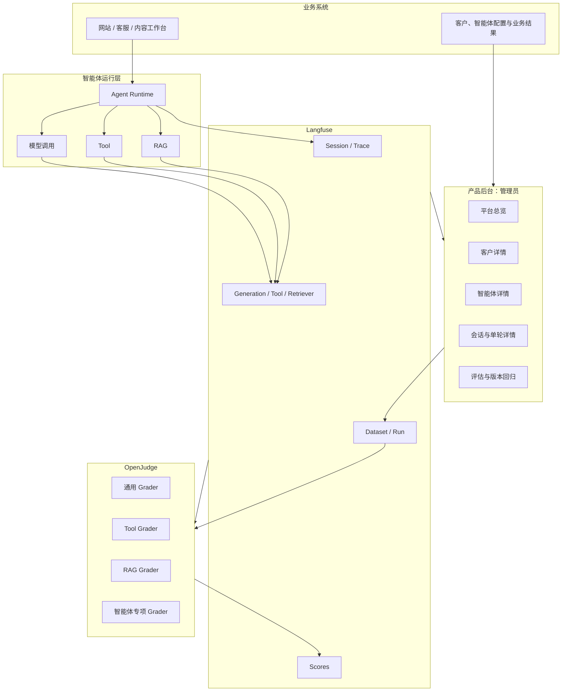
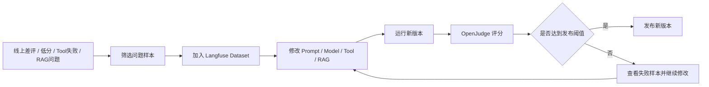

# Langfuse 与 OpenJudge 智能体监控评估产品方案（精简版）

> 面向角色：平台管理员  
> 管理层级：平台管理员 → 客户 → 智能体 → Tool / RAG / 对话 / 模型调用  
> 核心目标：用最少但有效的指标，帮助管理员发现问题、定位原因、比较版本并验证优化效果。

---

## 1. 产品定位

本方案不是复制 Langfuse 的全部能力，也不是建立一个复杂的算法评测平台，而是在产品后台形成一个面向管理员的智能体运营入口。

系统只解决四个问题：

1. 哪个客户、哪个智能体运行异常？
2. 异常来自响应性能、模型、Tool、RAG，还是回答质量？
3. 当前 Prompt、模型、Tool、RAG 版本是否比上一版本更好？
4. 修改后能否通过回归评估再发布？

核心分工：

- **Langfuse**：记录智能体的运行过程，提供会话、链路、耗时、Token、成本、Tool、RAG 和版本数据。
- **OpenJudge**：根据不同智能体类型，对回答质量和执行行为进行自动评分。
- **产品后台**：按“客户—智能体”组织数据，以业务语言展示结果，不直接暴露 Langfuse 的底层对象。

---

## 2. 管理对象层级



### 2.1 对象定义

| 层级 | 对象 | 说明 |
|---|---|---|
| 平台层 | 管理员 | 查看全部客户及其智能体的运行与质量情况 |
| 客户层 | 客户 / 租户 | 一个独立客户，可配置多个智能体 |
| 智能体层 | Agent | 独立运行和评估的业务智能体 |
| 会话层 | Session / Trace | 多轮会话及每一轮智能体执行 |
| 组件层 | Tool / RAG / Model | 智能体执行过程中调用的能力 |
| 评估层 | Evaluator / Score | OpenJudge 或规则生成的质量评分 |

### 2.2 必须统一的标识

每次智能体运行至少记录：

```text
tenantId
agentId
agentType
agentVersion
sessionId
turnSeq
promptVersion
modelName
toolsetVersion
kbVersion
environment
```

这些字段用于权限隔离、指标聚合和版本对比。

---

## 3. Langfuse 与 OpenJudge 的功能范围

### 3.1 Langfuse：运行监控与数据底座

Langfuse 负责回答“发生了什么”：

- 用户与智能体进行了多少次会话和对话；
- 一次回答经过了哪些模型、Tool 和 RAG 调用；
- 哪一步耗时、失败或重试；
- 消耗了多少 Token 和成本；
- 使用了哪个 Prompt、模型、Tool 和知识库版本；
- OpenJudge 的评分结果是多少；
- 哪些问题样本需要进入回归数据集。

Langfuse 使用的主要对象：

| Langfuse 对象 | 产品含义 |
|---|---|
| Session | 一次完整多轮对话 |
| Trace | 一轮用户请求及 Agent 完整执行 |
| Generation | 一次模型调用 |
| Tool Observation | 一次 Tool 调用 |
| Retriever Observation | 一次 RAG 检索 |
| Score | 用户反馈、规则分和 OpenJudge 评分 |
| Dataset / Run | 回归样本和版本测试结果 |

### 3.2 OpenJudge：质量评分引擎

OpenJudge 负责回答“做得好不好”：

- 是否完成用户任务；
- 回答是否正确、相关并遵循要求；
- Tool 是否选对，参数是否正确；
- RAG 内容是否真正支撑最终回答；
- 多轮对话是否正确理解上下文；
- 内容是否符合品牌、事实和格式要求。

OpenJudge 不负责长期存储、会话统计、Token 和成本分析。评分完成后，结果统一写回 Langfuse Score。

### 3.3 功能边界

| 功能 | Langfuse | OpenJudge |
|---|---:|---:|
| 会话与 Trace 追踪 | 负责 | 不负责 |
| 模型、Tool、RAG 过程记录 | 负责 | 读取后评分 |
| 延迟、Token、成本统计 | 负责 | 不负责 |
| Prompt 与版本关联 | 负责 | 按版本评测 |
| 回答质量评分 | 保存与展示 | 负责生成 |
| Tool 与行动质量评分 | 保存与展示 | 负责生成 |
| Dataset 与版本回归 | 负责管理 | 负责评分 |
| 产品后台业务化展示 | 提供底层数据 | 提供评分数据 |

---

## 4. 产品功能结构

产品后台只保留五个核心页面，避免功能过度扩散。



### 4.1 智能体监控总览

面向平台管理员，展示全部客户的整体情况。

核心内容：

- 客户数量；
- 智能体数量；
- 会话量；
- 请求成功率；
- P95 响应时间；
- 用户满意率；
- 低分智能体数量；
- 异常客户与智能体排行。

管理员应能快速回答：

> 今天哪里出现问题，应优先进入哪个客户或智能体？

### 4.2 客户详情

展示某个客户下的全部智能体。

| 内容 | 说明 |
|---|---|
| 智能体列表 | 名称、类型、状态和当前版本 |
| 使用情况 | 会话量、对话轮数、活跃用户 |
| 运行健康 | 成功率、P95 响应、错误数 |
| 质量摘要 | 用户满意率、OpenJudge 核心评分 |
| 组件摘要 | Tool 成功率、RAG 命中率 |

客户层不展示复杂的单次 Tool 参数和 RAG 切片内容，只用于找到存在问题的智能体。

### 4.3 智能体详情

智能体详情是核心页面，分为四个区域。

#### A. 运行概览

- 会话数；
- 对话轮数；
- 平均对话轮数；
- 请求成功率；
- 平均响应时间；
- P95 响应时间；
- 首字响应时间；
- Token 与成本。

#### B. Tool 与 RAG

- Tool 调用次数；
- Tool 成功率；
- Tool 平均 / P95 耗时；
- Tool 低分调用；
- RAG 调用率；
- RAG 命中率；
- RAG 无命中数；
- Groundedness 平均分。

#### C. 回答质量

- 用户点赞 / 点踩；
- 用户满意率；
- Task Success；
- Correctness；
- Relevance；
- 专项评分。

#### D. 版本信息

- Agent 版本；
- Prompt 版本；
- 模型；
- Toolset 版本；
- 知识库版本；
- 当前版本与上一版本的关键指标变化。

### 4.4 会话与单轮详情

用于定位具体问题。

展示：

1. 用户输入与最终回答；
2. 当前会话上下文；
3. 模型调用；
4. Tool 名称、参数、返回、耗时和错误；
5. RAG query、命中文档 / 切片和检索分数；
6. OpenJudge 分数与评分理由；
7. 用户反馈；
8. 当前运行版本信息。

单轮详情必须支持：

- 标记问题类型；
- 加入 Dataset；
- 查看 Langfuse 原始 Trace。

### 4.5 评估与版本回归

只解决两个问题：

- 新版本比旧版本是否更好；
- 是否满足发布标准。

核心功能：

- 从差评、低分、Tool 失败、RAG 无命中样本加入 Dataset；
- 选择 Agent / Prompt / Toolset / 知识库版本；
- 执行 OpenJudge 评分；
- 对比新旧版本；
- 查看失败样本；
- 给出“通过 / 不通过”结论。

---

## 5. 分层监测指标

监测指标分为四个层级：平台、客户、智能体、组件。质量评分单独由 OpenJudge 提供。

### 5.1 平台层指标

用于判断整体系统是否健康。

| 维度 | 关键指标 |
|---|---|
| 规模 | 客户数、智能体数、会话数 |
| 稳定性 | 请求成功率、异常智能体数 |
| 性能 | 全平台 P95 响应时间 |
| 质量 | 用户满意率、低分 Trace 数 |
| 成本 | 总 Token、总成本 |

### 5.2 客户层指标

用于比较客户下各智能体表现。

| 维度 | 关键指标 |
|---|---|
| 使用 | 会话数、对话轮数、活跃智能体数 |
| 稳定性 | 请求成功率、错误数 |
| 性能 | P95 响应时间 |
| 质量 | 满意率、Task Success 平均分 |
| 组件 | Tool 成功率、RAG 命中率 |

### 5.3 智能体层指标

用于运营和优化单个智能体。

| 维度 | 关键指标 |
|---|---|
| 会话 | 会话数、平均轮次 |
| 稳定性 | 请求成功率、错误率、超时率 |
| 性能 | 首字响应、平均响应、P95 响应 |
| 成本 | 输入 / 输出 Token、单次请求成本 |
| 用户反馈 | 点赞、点踩、满意率 |
| 执行 | Tool 调用数、Tool 成功率、RAG 调用率 |
| 质量 | Task Success、Correctness、Relevance、专项评分 |

### 5.4 组件层指标

#### Tool

| 维度 | 关键指标 |
|---|---|
| 使用 | 调用次数、每轮平均调用数 |
| 稳定性 | 成功率、错误率、超时率 |
| 性能 | 平均耗时、P95 耗时 |
| 质量 | Tool Selection、Tool Parameter Accuracy |

#### RAG

RAG 在执行链路中作为一种特殊 Tool，但在产品页面中独立展示。

| 维度 | 关键指标 |
|---|---|
| 使用 | RAG 调用率 |
| 检索 | 命中率、无命中率 |
| 参数 | Query Quality |
| 回答 | Groundedness |
| 明细 | 命中文档、切片、检索分数、kbVersion |

#### 模型

| 维度 | 关键指标 |
|---|---|
| 使用 | 调用次数、模型版本 |
| 性能 | 首 Token、完整耗时 |
| 消耗 | 输入 Token、输出 Token、成本 |
| 稳定性 | 调用错误率、重试率 |

---

## 6. OpenJudge 评分体系

原则：所有智能体使用少量通用评分，再根据智能体类型增加专项评分。不得默认开启全部 Grader。

### 6.1 全部智能体通用评分

| 评分 | 说明 |
|---|---|
| Task Success | 是否完成用户实际目标 |
| Correctness | 回答或执行结果是否正确 |
| Relevance | 是否围绕用户问题回答 |
| Instruction Following | 是否遵循用户要求和约束 |

第一期大盘建议重点展示：

- Task Success；
- Correctness；
- 用户满意率。

Relevance 和 Instruction Following 用于低分样本下钻，不必全部放在总览卡片中。

### 6.2 使用 Tool 的智能体

增加：

| 评分 | 说明 |
|---|---|
| Tool Selection | 是否选择了正确 Tool |
| Tool Parameter Accuracy | 参数是否准确、完整 |
| Action Alignment | 执行动作是否符合用户目标 |
| Action Loop Detection | 是否发生重复行动或循环 |

Tool Call Success 属于运行结果，优先由 Langfuse 根据实际执行状态统计，不需要全部交给 LLM Judge。

### 6.3 使用 RAG 的智能体

增加：

| 评分 | 说明 |
|---|---|
| Query Quality | 检索 query 是否准确 |
| Groundedness | 最终回答是否基于检索内容 |
| Context Relevance | 检索内容是否与用户问题相关 |

RAG 命中率和无命中率属于运行指标，由 Langfuse 统计；OpenJudge只评价“命中的内容是否正确、回答是否真正使用”。

### 6.4 智能客服 Agent

建议评分卡：

| 类型 | 关键评分 |
|---|---|
| 通用 | Task Success、Correctness、Relevance |
| 多轮 | Context Memory、Clarification Quality |
| Tool | Tool Selection、Tool Parameter Accuracy |
| RAG | Groundedness |
| 业务 | 转人工合理性、留资触发合理性（自定义 Grader） |

业务结果指标由业务系统记录：

- 问题解决率；
- 转人工率；
- 用户满意率；
- 有效留资率。

### 6.5 内容创建 Agent

建议评分卡：

| 类型 | 关键评分 |
|---|---|
| 通用 | Instruction Following、Correctness、Relevance |
| 内容 | Completeness、Style Alignment、Format Compliance |
| 事实 | Groundedness、Hallucination Detection |

业务结果指标由业务系统记录：

- 首稿采用率；
- 平均修改次数；
- 人工修改幅度；
- 内容发布或转化效果。

---

## 7. Langfuse 与 OpenJudge 配合方式

### 7.1 在线运行流程



### 7.2 评估触发策略

OpenJudge 不应阻塞正常对话响应。

建议：

| 场景 | 策略 |
|---|---|
| 用户点踩 | 100% 评估 |
| Tool 失败 | 100% 评估相关维度 |
| RAG 无命中 | 评估 Query Quality 或进入问题样本 |
| 正常生产流量 | 5%–20% 抽样 |
| 发布前 Dataset | 100% 评估 |

### 7.3 分数写回位置

| Score | 建议挂载对象 |
|---|---|
| Task Success | Trace |
| Correctness / Relevance | Trace |
| Tool Selection | Trace 或 Tool Observation |
| Tool Parameter Accuracy | Tool Observation |
| Query Quality | Retriever Observation |
| Groundedness | Trace |
| 用户点赞 / 点踩 | Trace |

---

## 8. 整体架构



### 8.1 数据职责

| 系统 | 负责的数据 |
|---|---|
| 业务库 | 客户、智能体配置、用户、留资、转人工、内容发布等业务主数据 |
| Langfuse | Session、Trace、模型、Tool、RAG、Token、成本、版本和 Score |
| OpenJudge | 自动评分及评分理由 |
| 产品后台 | 权限、筛选、聚合、展示、问题下钻和回归操作 |

---

## 9. 数据与权限设计

### 9.1 查询范围

所有产品后台查询必须带：

```text
tenantId
agentId（进入智能体详情后必填）
timeRange
```

必要时增加：

```text
agentType
agentVersion
promptVersion
toolType
kbVersion
```

### 9.2 权限原则

- 管理员可以查看全部客户和智能体；
- 客户之间的数据必须严格隔离；
- 普通运营查看业务化指标和脱敏内容；
- 只有研发、算法或高级质检角色可以跳转 Langfuse 原始 Trace；
- 手机号、邮箱、姓名等敏感数据写入 Langfuse 前必须脱敏。

---

## 10. 版本回归闭环



### 10.1 发布前最小门禁

不同智能体可配置不同门槛，但第一期建议至少检查：

- Task Success 不下降；
- Correctness 不下降；
- Tool Selection / Parameter Accuracy 不下降；
- Groundedness 不下降；
- 严重失败样本数不得增加；
- P95 响应时间和单次成本不能超过设定上限。

不建议把多个评分简单加权成一个总分。应同时展示各关键维度，并对严重错误设置硬门槛。

---

## 11. 第一阶段落地范围

第一阶段只实现完整主链路，不做复杂扩展。

### 11.1 P0 功能

1. 平台总览；
2. 客户列表及客户详情；
3. 客户下智能体列表；
4. 智能体运行概览；
5. Tool / RAG 核心指标；
6. 会话和 Trace 详情；
7. 用户点赞 / 点踩；
8. OpenJudge 核心评分写回 Langfuse；
9. 从问题 Trace 加入 Dataset；
10. 新旧版本回归对比。

### 11.2 P0 指标

#### Langfuse 运行指标

- 会话数；
- 对话轮数；
- 请求成功率；
- P95 响应时间；
- 首字响应时间；
- Token 与成本；
- Tool 调用次数与成功率；
- RAG 调用率与命中率；
- 用户满意率。

#### OpenJudge 通用评分

- Task Success；
- Correctness；
- Relevance；
- Instruction Following。

#### 按 Agent 增加

- 智能客服：Context Memory、Tool Selection、Groundedness；
- 内容创建：Completeness、Style Alignment、Groundedness、Format Compliance。

### 11.3 第一阶段暂不实现

- 全量启用所有 Evaluator；
- 复杂综合评分模型；
- 独立的跨平台 Tool 质量中心；
- 复杂告警升级流程；
- 自动问题归因；
- 客户侧自助查看完整 Trace；
- 用 Langfuse 替代业务数据库；
- 在智能体后台重复建设完整知识库健康系统。

---

## 12. 最终原则

1. **产品导航按管理员 → 客户 → 智能体组织，不按 Langfuse 技术对象组织。**
2. **Langfuse 只负责记录、存储、查询和版本数据，不负责定义所有业务结果。**
3. **OpenJudge 只启用能够解释问题、指导优化的评分维度。**
4. **RAG 是执行层的一种 Tool，但在产品层需要独立展示关键质量。**
5. **运行指标与质量评分必须分开：成功执行不代表回答正确。**
6. **业务结果保留在业务系统，通过 tenantId、agentId、sessionId 或 traceId 关联。**
7. **第一期优先建立问题发现—下钻—评估—回归的完整闭环，而不是追求指标数量。**
