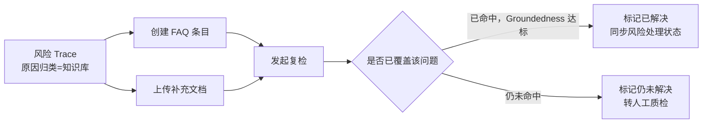
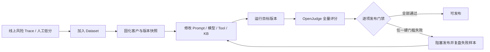
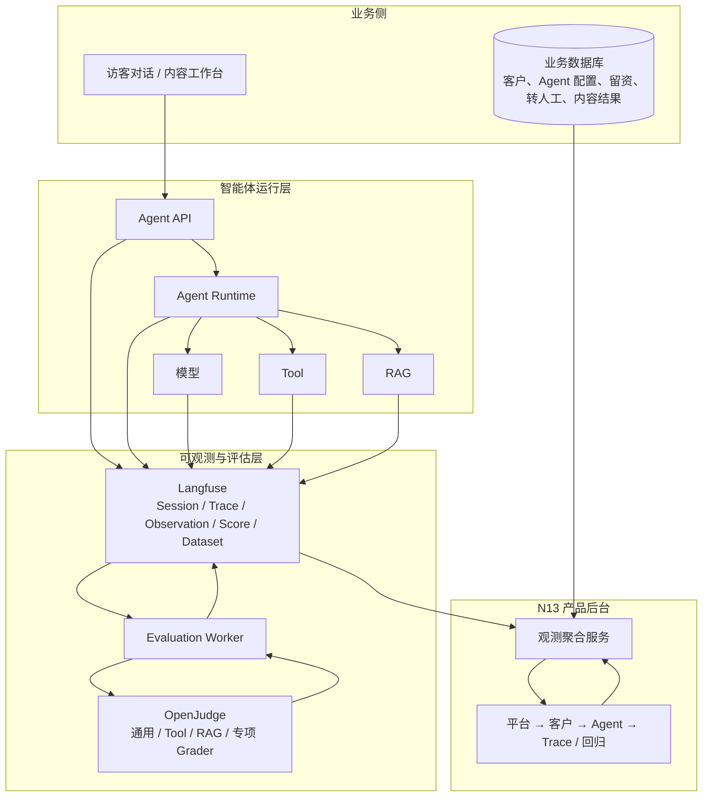
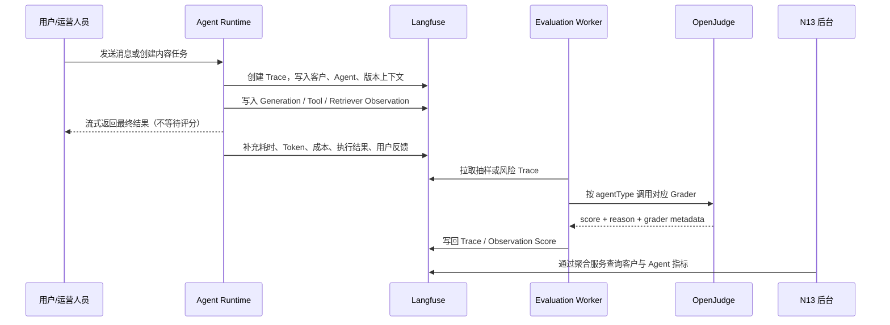

# Langfuse 与 OpenJudge 智能体监控评估产品方案

> v2.4 · 2026-07-29  
> 面向角色：平台管理员、客户成功、产品运营、算法/研发、知识运营、质检人员  
> 配套原型：`prototype/src/pages/agent-observability/`（N13 智能体运营中心）  
> 本文档定义 N13 的产品边界、数据架构、运行流程与 Langfuse / OpenJudge 配置方式。v2.4 补齐进入企业后客户、Agent、Session、Trace、Tool、RAG、反馈、成本、风险和业务结果等全部可见指标的计算口径；客户侧仍不展示版本、Prompt、模型和知识库配置。

---

# 一、背景与核心目标

## 1.1 为什么要做

智能体上线后，平台目前只能看到“能不能回复”，无法稳定回答以下问题：

| 问题 | 当前风险 | 本期要解决的结果 |
|---|---|---|
| **客户风险无法优先处理** | 平台不知道哪个客户质量下降、成本异常或版本被阻塞 | 首页按客户聚合风险、规模、质量和发布状态，帮助运营人员先找到应处理的客户 |
| **问题无法定位** | 一次低分回答可能来自模型、Prompt、Tool、RAG 或业务配置，人工只能猜 | 从客户下钻到 Agent、Trace、Tool / RAG Observation 和评分理由 |
| **运行成功被误认为回答正确** | Tool 调用成功、请求未报错，不等于回答有事实依据或完成任务 | Langfuse 统计运行事实；OpenJudge 单独判断质量与执行合理性 |
| **改版后缺少回归依据** | 修改 Prompt、模型、工具或知识库后，只能凭感觉上线 | 将线上坏例沉淀为 Dataset，对比基线和目标版本，按门禁决定是否发布 |
| **不同智能体被同一套指标误导** | 客服关注 RAG、转人工和留资；运营助手关注品牌、事实和格式 | 按 Agent 类型配置专项评分卡与业务结果，不比较语义不同的指标 |

## 1.2 核心目标

**核心目的：建立“发现问题 → 定位原因 → 修复验证 → 安全发布”的智能体运营闭环。**

本期只聚焦两类智能体：

1. **智能客服PRO**：面向访客的多轮服务 Agent，重点监测 RAG、Tool、转人工、留资和会话质量。
2. **运营助手**：面向内容创建的 Agent，重点监测指令遵循、事实正确性、品牌风格、完整性和格式合规。

不追求堆砌指标，也不完整复制 Langfuse 控制台。N13 在 Agent 诊断层复用业界熟悉的 Trace 列表、筛选和详情交互，降低实现与学习成本；同时把底层 Trace、Observation、Score 转成平台运营人员可理解、可行动的字段。客户可见页面不强调“数据来自 Langfuse 还是 OpenJudge”，底层来源与映射只在本方案、接口和元数据中维护。

---

# 二、产品定位与范围

## 2.1 三方职责

| 系统 | 回答的问题 | 核心职责 | 不负责的内容 |
|---|---|---|---|
| **Langfuse** | 发生了什么？ | 记录 Session、Trace、模型调用、Tool、RAG、耗时、Token、成本、版本、Score、Dataset Run | 客户业务指标定义、平台权限、业务化页面 |
| **OpenJudge** | 做得好不好？ | 对回答、Tool 调用、RAG 证据和内容结果执行自动评分，输出分数和理由 | Trace 长期存储、成本统计、客户聚合 |
| **N13 产品后台** | 谁需要处理、下一步做什么？ | 客户聚合、权限隔离、业务指标、风险下钻、Dataset 入集、回归和发布门禁 | 直接替代 Langfuse UI 或业务数据库 |
| **业务数据库** | 业务是否产生结果？ | 客户、Agent 配置、转人工、留资、内容发布、人工修改、转化等业务主数据 | 代替可观测链路与 Judge 评分 |

## 2.2 管理层级

```text
平台（所有客户聚合）
└── 客户 / 租户
    └── 智能体
        └── Session（一次完整会话）
            └── Trace（一次请求或一轮对话）
            ├── Generation（模型调用）
            ├── Tool Observation（工具调用）
            ├── Retriever Observation（RAG 检索）
            └── Score（运行结果、用户反馈、OpenJudge 评分）
```

### N13 页面层级

```text
N13 平台首页（所有客户的聚合字段）
  └── 客户监控页（该客户的共享指标、全部 Agent、统一风险样本）
       └── Agent 诊断（Session 列表 → Session 详情 / Trace 列表 → Trace 独立详情页）
            ├── 会话质检
            └── 告警治理
```

**明确约束：**

- N13 首页只展示客户聚合字段，不能展示 Agent 名称、Prompt/模型版本、专项评分或原始 Trace。
- 点击客户后才进入深度监测范围。
- 客户监控页展示当前租户和环境下全部已接入 Agent，包括通常由其他 Agent 调用的专业子 Agent；未接入深度监测的客户保留明确空状态，不得展示其他客户的数据作为替代。
- Agent 调用另一个 Agent 时，在父 Trace 中按 `agent_call` Tool Observation 记录；子 Agent 仍是普通 Agent，并拥有自己的 Session、Trace、版本和诊断入口。
- 从客户风险、质检队列、Tool 低质量调用或父 Trace 进入 Trace 详情时，页面必须携带内部 `returnTo` 和返回标签；详情主返回按钮恢复原入口（例如返回工具详情、返回风险样本或返回父级 Trace）。直接打开 Trace URL 时安全回退到所属 Session。

---

# 三、产品功能范围

## 3.1 平台首页：客户聚合运营总览

**用户目标：哪些客户存在需要跟进的运行、质量、Tool 或知识风险？**

### 页面内容

| 区块 | 展示字段 | 操作 |
|---|---|---|
| 平台 KPI | 客户数、活跃 Agent 数、会话/轮次、按轮次加权的请求成功率与满意率、客户 P95 最大值、总成本、风险客户数、风险 Trace 数 | 选择时间范围、刷新 |
| 客户监控与优先处置工作列表 | 客户名称、行业/套餐、健康状态、由客户指标推导的优先级与主问题、Agent 数、会话/轮次、请求成功率/客户 P95、满意率、Tool/RAG 概览、风险、最后活跃时间 | 关键词搜索、状态多选、行业多选、Tool 调用/RAG 调用类型多选、仅 Tool 异常筛选、按优先级和客户聚合指标排序、查看客户监控 |

### 首页不展示

- 具体 Agent 名称、模型、Prompt、知识库版本；
- 单条对话、原始 Trace、Tool 参数、RAG 切片；
- 客服或运营助手的专项评分；
- 直接进入 Agent 诊断的入口。

首页只使用客户汇总字段：比率按基础分子/分母重新计算，不能平均客户百分比；客户 P95 最大值不能被描述为平台 P95，真实平台 P95 必须由可合并时延分布重新计算。客户工作列表的状态、行业和调用类型（Tool 调用/RAG 调用）筛选支持多选，筛选条件跨维度按 AND 组合、同一维度内按 OR 组合；表格在“质量与组件”列统一展示满意率、Tool 成功率和 RAG 命中率，各保留一个核心指标；“仅 Tool 异常”严格指客户 Tool 成功率低于 95%。优先级按客户健康状态、Tool/RAG/质量异常和风险数量派生，排序不代表持久化严重等级。这样可确保首页是**客户经营视角**，而不是被技术细节淹没的监控大盘。

---

## 3.2 客户监控页：本期核心工作台

**用户目标：这个客户的问题来自哪个 Agent，是否影响发布？**

### 客户级内容

| 区块 | 关键内容 |
|---|---|
| 客户上下文 | 客户名称、行业、套餐、客户成功负责人、Langfuse Project、接入时间、环境、时间范围 |
| 客户运营结论 | 当前优先问题、风险 Trace 数、阻塞发布数、建议下一步动作 |
| 客户共享 KPI | 会话量、轮次、请求成功率、最慢 P95、满意率、风险 Trace、成本 |
| Agent 对照 | 仅比较成功率、P95、Task Success、Correctness、Tool 成功率、RAG 证据质量、单次成本、发布状态 |
| 风险样本 | 从每轮 Trace 筛出的未回答、点踩、低分、Tool/RAG 异常、超时和告警命中记录；展示风险分析、人工质检与解决状态 |

### 全部 Agent 卡片

每张卡片必须包含：

1. Agent 名称、类型与当前运行状态；
2. 运行健康：会话/轮次、成功率、P95/首字、Token/成本；
3. 通用质量评分和当前 Agent 专项评分；页面不额外标注评分底层来源；
4. Tool / RAG 摘要；
5. 当前版本对比基线版本的门禁结论；
6. “进入智能体诊断”入口；
7. 若版本被阻塞，提供“修复后重新回归”操作。

客户页底部不再设置独立“版本回归”和“监测参数”页签；版本与门禁信息保留在 Agent 卡片和 Agent 诊断中，风险样本直接作为客户页主要处理列表。

---

## 3.3 Agent 诊断：Session → Trace 逐级下钻

**用户目标：先在 Session 列表识别异常会话，再进入 Session 查看每一轮 Trace，最后在独立 Trace 页面查看完整运行、评分、Tool 与 RAG 证据。**

### 3.3.1 页面与路由结构

Agent 诊断采用三级独立页面，不再使用 Session 行内展开或 Trace 详情弹窗：

1. **Agent Session 列表**：`/tenants/{tenantId}/agents/{agentId}`；
2. **Session 详情 / Trace 列表**：`/tenants/{tenantId}/agents/{agentId}/sessions/{sessionId}`；
3. **Trace 详情**：`/tenants/{tenantId}/agents/{agentId}/sessions/{sessionId}/traces/{traceId}`。

客户侧页面只展示运行结果和证据，不展示 Agent/Baseline 版本、Prompt、模型、Tool 版本、知识库版本或环境配置。底层埋点仍保存这些字段，供内部审计、回归和问题复现使用。“知识库”在客户页面表示 RAG 调用、命中和检索证据，不代表知识库配置。

### 3.3.2 Session 列表与筛选

筛选条件可以在 Trace 数据上执行；只要一个 Trace 命中，所属 Session 就保留在列表。关键词覆盖 Session ID、用户 ID、会话摘要、输入输出和被调用子 Agent 名称。

| Session 列 | 展示内容 |
|---|---|
| ID | `sessionId` |
| 创建时间 | Session 开始时间 |
| 会话摘要 | 业务摘要；无独立摘要时由首问和末次回复生成 |
| 耗时 | Session 内 Trace 总耗时 |
| 用户 ID | 脱敏后的会话用户标识 |
| 交互轮数 | Session 内 Trace 数 |
| 质量 | 有效 Task Success 的聚合分和待复盘数量 |
| Tool / 子 Agent | Tool 总调用数与 `agent_call` 次数 |
| 知识库 | RAG 调用次数和命中次数 |
| 反馈 | 点赞、点踩或未反馈的聚合结果 |
| 操作 | “跳转至对话”占位（暂不实现）和“查看” |

评分与 Tool 筛选只能使用当前 Agent 对应的评分项和 enabled Tool，不得使用无关的全局选项。

### 3.3.3 Session 详情与 Trace 列表

Session 详情顶部展示 Session ID、创建/完成时间、用户 ID、会话摘要、总耗时、交互轮数、聚合质量、Tool/子 Agent、RAG 与反馈，不展示 `tenantId`、`siteId`、`agentId`、`environment` 或版本配置。

每一轮 Trace 一行，按 `turnSeq` 排序：

| Trace 列 | 展示内容 |
|---|---|
| 时间 | Trace 发生时间与轮次 |
| ID | `traceId` |
| 对话 | 本轮用户输入和 Agent 回复摘要 |
| 状态 | 成功、异常、超时、待复盘 |
| 综合评分 | 优先展示 Task Success；缺失时使用该 Trace 首个有效 Trace 级质量分，没有评估则显示“未评估” |
| 循环次数 | 本轮 Agent 推理/执行循环次数 |
| Tool | 普通 Tool 与子 Agent 调用 |
| 知识库 | 未调用、未命中或命中数量 |
| 耗时 | Trace 端到端总耗时 |
| 反馈 | 点赞、点踩或未反馈 |
| 操作 | “查看”进入独立 Trace 页面 |

Session 表不展开每个评分项，因为一轮 Trace 只运行与场景相关的 Grader。细分评分统一进入 Trace 详情，只展示该 Trace 实际产生的评分，避免用大量“未评估”列误导用户。

父 Agent 调用子 Agent 时显示“子 Agent：名称”，并通过 `targetAgentId`、`childSessionId`、`childTraceId` 进入子 Agent 对应的 Trace 详情页。

### 3.3.4 Trace 完整详情页

Trace “查看”必须进入可复制、可分享地址的独立页面。基础标识应包含上一层 Session 的细项和当前轮次信息，但不显示 `tenantId`、`siteId`、`agentId`、`environment` 或版本/配置字段。

**基础标识与会话上下文**

- Session ID、Trace ID、用户 ID、创建/发生时间；
- 会话摘要、Session 总耗时、交互轮数、聚合质量、Tool/子 Agent、RAG 与反馈；
- 当前轮次、循环次数、状态、反馈、端到端首响和 Trace 总耗时。

**完整对话**

- 当前 Trace 的完整用户输入和 Agent 输出，不截断；
- 所属 Session 的全部历史轮次，按 `turnSeq` 排序并高亮当前 Trace。

**Generation 运行**

- Observation ID、状态、首 Token、Generation 总耗时；
- 输入 Token、输出 Token和成本；
- 不展示模型和 Prompt 信息。

**Tool / 子 Agent 证据**

- Observation ID、Tool 名称和类型；
- 完整输入/输出摘要、状态、错误和耗时；
- Tool Selection、Action Alignment、Tool Success、Parameter Accuracy；
- `agent_call` 展示子 Session/Trace 并允许继续下钻；不展示 Tool 版本。

**RAG 证据**

- Observation ID、Query、topK 和允许客户查看的业务过滤条件；
- hitCount、文档标题、docId、chunkId 和检索分数；
- Query Quality、Context Relevance、Groundedness；no-hit 时按规则显示未评估；
- 不展示 `kbVersion`、tenant/site/agent/environment 等内部范围字段。

**评分记录**

- 评分名称优先显示中文，英文名称和 score code 作为研发对照信息；
- 只展示当前 Trace 实际产生的评分，不补造未运行的 Grader；
- 展示中文挂载位置、标准化分数、`rawScore`、`scoreRange` 和完整 reason；
- 不展示 Judge Model、grader/rubric 版本。

**操作**

- 风险 Trace 可进入人工质检、加入知识库或标记解决；
- 在 Session 时间线中进入其他轮次；
- 客户后台不提供 Dataset 或外部原始 Trace 操作。

### 3.3.5 原型首条 Trace 示例

原型不增加独立“工程参考样例”区域。默认 Session `session_8ab3f921` 的第一轮 `trace_anvil_9281` 作为完整详情示例，研发沿正常的“Session 查看 → 第一轮 Trace 查看”路径即可看到。

该 Trace 顶部展示本轮执行总结；Tool 表直接示例普通 Tool、子 Agent、成功、失败、超时、参数缺失和失败后人工兜底；知识库表直接示例高质量命中、no-hit、低相关命中和部分证据/低 Groundedness。RAG Tool 的 error/timeout 记录放在同一 Tool 表中，并明确因为没有可用检索结果而不生成 Retriever Observation。

其他 Session 只承担正常业务数据展示，不额外加入研发不会进入的参考入口或参考列表。

### 原始 Trace 权限

“原始 Trace”仅向研发、算法或高级质检角色开放；普通运营人员只看脱敏后的输入输出、完整产品字段、评分理由与建议动作。详情页中的“完整”是指当前角色权限范围内不截断、不漏字段，不代表绕过脱敏和权限控制。

---

## 3.4 风险 Trace、质检和 Dataset

风险样本来源：

- 未回答或明确知识缺口；
- 用户点踩；
- Tool 调用失败；
- RAG 无命中、低相关或 Groundedness 低；
- OpenJudge 关键分数低于阈值；
- 告警规则命中的 Trace；
- 高风险业务规则或人工质检命中。

风险样本不是 Trace 之外的新业务对象，也不维护独立的 `risk-samples` 内容副本。风险等级、问题类型、诊断、影响、期望行为、来源信号、告警关联、人工质检结论和解决状态统一挂载在 `ObservabilityTrace.risk`；风险样本页只是对带风险分析的 Trace 做便捷筛选。输入、输出、反馈、评分、Tool、RAG 和运行状态始终读取同一 Trace，避免两套事实发生冲突。

每条风险 Trace 必须展示：

| 字段 | 说明 |
|---|---|
| 风险等级与问题类型 | 例如知识缺口、事实错误、Tool 参数错误或超时 |
| 用户问题与 Trace | 脱敏后的输入、Session/Trace 定位和发生时间 |
| Score 与诊断 | 评分名、标准化分数和风险诊断 |
| 来源信号 | 未回答、点踩、低分、Tool/RAG、超时、告警或人工发现，可多选 |
| 告警关联 | 命中的 Alert Rule / Alert Event；非告警 Trace 为空 |
| 处理状态 | 待处理或已解决；解决后保留风险分析与质检记录 |
| 人工质检 | 质检评分、问题类型、原因归类和质检备注 |
| 知识缺口解决 | 仅当原因归类为知识库时展示；记录解决方式（FAQ 或文档）、复检结论和 Groundedness 复检分数 |
| 操作 | 人工质检、加入知识库（FAQ 或文档，需复检通过）、标记解决，以及沿 Session→Trace 站内路径查看完整证据 |

风险样本页可按风险等级、来源信号、解决状态、告警事件和关键词过滤。从客户风险列表或告警事件进入时，分别使用 `traceId` 或 `alertEventId` 定位。客户后台不展示负责人，不提供加入 Dataset 或外部“原始 Trace”操作。

### 知识缺口的加入知识库与复检闭环

当人工质检或风险诊断将原因归类为“知识库”（`rootCause = knowledge_base`，例如未回答、RAG 无命中或低相关导致的风险）时，风险样本操作区展示统一的“加入知识库”入口，引导运营人员在同一条 Trace 上完成闭环。点击后弹窗先要求选择解决方式——创建 FAQ 条目或上传补充文档——两种方式都必须发起复检并判定是否已覆盖该问题，才能置为“已解决”；不存在“加入 FAQ 后即视为处理”的旁路。



- **选择解决方式**：在弹窗内二选一——创建 FAQ 条目（填写问题与答案，默认预填用户问题与期望行为，可编辑）或上传补充文档；提交后状态变为“已提交”。
- **发起复检**：基于新创建的 FAQ 或新上传的文档，针对该风险 Trace 的原始问题重新检索，记录复检时间、复检结论摘要和 Groundedness 复检分数；复检期间状态为“检测中”。
- **复检结论**：
  - 命中且 Groundedness 达标 → 状态置为“已解决”，同时将该风险 Trace 的处理状态一并置为“已解决”，无需再单独“标记解决”；
  - 仍未命中或证据不足 → 状态置为“仍未解决”，保留在待处理队列，引导转人工质检进一步确认知识内容和补充范围。
- 知识缺口解决状态（未开始、已提交、检测中、已解决、仍未解决）随风险 Trace 一并展示和筛选，不作为独立的业务对象，与人工质检共用同一条 `ObservabilityTrace.risk` 记录；无论选择哪种解决方式都走同一套状态机和复检校验。

### 告警规则与告警事件

告警治理由两个对象组成：

1. **Alert Rule**：配置监控指标、Agent/Tool 范围、统计窗口、阈值、最小样本或连续窗口、通知对象、恢复条件、负责人和启停状态。
2. **Alert Event**：规则在某一窗口真实命中后生成的事件，记录实际指标值、阈值快照、触发/恢复时间、通知状态和命中的风险样本。

告警事件的“查看样本”必须携带 `alertEventId` 进入风险 Trace 筛选页。事件命中的 Trace 直接增加 `alert` 来源信号和告警关联，因此会自动出现在客户“风险样本”和 Agent 风险筛选中；不得复制为另一套告警问题记录。

事件状态至少包括待处理、已确认、已恢复。恢复只关闭事件，不删除关联 Trace 上的风险分析和质检结论。

---

## 3.5 版本回归与发布门禁

**用户目标：目标版本是否比基线版本更好，是否可发布？**

### 回归流程



### 最小发布门禁

| 类别 | 门禁要求 |
|---|---|
| 核心质量 | Task Success、Correctness 不低于基线；适用时 Groundedness 不下降 |
| Tool | Tool Selection、Tool Parameter Accuracy 不下降 |
| 严重失败 | 严重失败样本数不得增加；关键样本必须通过 |
| 性能 | P95 响应时间不得超过阈值或基线允许范围 |
| 成本 | 单次请求成本不得超过预算 |
| 专项质量 | 客服检查转人工/留资合理性；运营助手检查 Style Alignment、Format Compliance 等 |

**禁止只使用一个加权总分决定发布。** 页面必须逐项显示基线、目标、阈值、状态和阻塞原因。

---

# 四、两个 Agent 的指标与评分卡

## 4.1 通用运行指标（Langfuse）

所有 Agent 共用，统计的是“运行是否稳定、成本是否可控”：

| 维度 | 指标 |
|---|---|
| 使用规模 | Session 数、Trace/轮次数、平均轮次 |
| 稳定性 | 请求成功率、错误率、超时率 |
| 性能 | 端到端首字响应、平均响应、P95 响应、模型 TTFT |
| 成本 | 输入/输出 Token、总成本、单次成本 |
| 用户反馈 | 点赞、点踩、满意率、反馈覆盖率 |
| 执行 | Tool 调用数、Tool 成功率、RAG 调用率、RAG 命中率 |

> 技术成功不等于业务成功：`task_execution_success` 仅表示请求流程完成，不能替代 Correctness、Task Success 或 Groundedness。

## 4.2 智能客服PRO

### 监测重点

- 多轮上下文是否正确；
- 价格、政策、风险咨询等事实场景是否调用 RAG；
- Tool 选择和参数是否正确；
- 转人工是否过早、过晚或遗漏上下文；
- 留资是否在合适时机触发；
- 结果是否真正解决问题。

### 评分卡

| 类别 | 指标 | 数据来源 |
|---|---|---|
| 通用质量 | Task Success、Correctness、Relevance | OpenJudge Score（Trace） |
| 多轮能力 | Context Memory、Clarification Quality | OpenJudge Score（Trace） |
| Tool | Tool Selection、Tool Parameter Accuracy | OpenJudge Score（Trace / Tool Observation） |
| RAG | Query Quality、Context Relevance、Groundedness | OpenJudge Score（Retriever / Trace） |
| 业务专项 | 转人工合理性、留资触发合理性 | 自定义 Grader |
| 业务结果 | 问题解决率、转人工率、留资触发/完成率、满意率 | 业务数据库 + Langfuse 关联 |

## 4.3 运营助手

### 监测重点

- 是否遵循任务要求、字数、模板和格式；
- 事实、数字和素材引用是否正确；
- 是否符合品牌调性；
- 首稿是否被采用、人工修改是否过多；
- 输出耗时和单次成本是否可控。

### 评分卡

| 类别 | 指标 | 数据来源 |
|---|---|---|
| 通用质量 | Instruction Following、Correctness、Relevance | OpenJudge Score（Trace） |
| 内容质量 | Completeness、Style Alignment | 自定义 Grader |
| 格式 | Format Compliance | 代码型 Grader，优先不用 LLM Judge |
| 事实与素材 | Groundedness、Hallucination Risk | OpenJudge Score（Trace） |
| 业务结果 | 首稿采用率、平均修改次数、人工修改幅度、发布/转化结果 | 内容业务数据库 |

**注意：**客服的留资、转人工、Context Memory 不应出现在运营助手默认指标中；运营助手的 Style Alignment、Format Compliance 也不应混入客服大盘。

## 4.4 Tool 目录与评分口径

### 4.4.1 原型中的 Tool 是什么

原型使用稳定的 `toolType` 表示能力类别，`toolName` 是当前 Agent 面向业务人员展示的名称。同一个 `toolType` 可以在不同 Agent 中使用不同名称，例如 `rag_search` 在智能客服中显示“知识库检索”，在方案顾问 Agent 中显示“方案知识检索”。

| toolType | 原型中的名称示例 | 作用 | 关键输入 | 成功判定 | 常见失败或超时 |
|---|---|---|---|---|---|
| `rag_search` | 知识库检索、方案知识检索 | 根据用户问题检索产品、价格、部署、实施或安全知识 | Query、topK、业务过滤条件 | 检索请求正常结束并返回结构化结果；`hitCount=0` 仍是“调用成功但未命中”，不能算执行失败 | 索引不可用、检索服务异常、请求超时；此时通常不产生 Retriever Observation |
| `request_handoff` | 转人工、转方案顾问 | 创建人工接续请求，将当前问题和必要上下文转给人工队列 | 转人工原因、目标队列、会话摘要、优先级 | 返回接续请求 ID，目标队列已接受请求 | 队列不存在、上下文写入失败、请求超时、没有明确转人工原因 |
| `lead_capture_form` | 留资表单 | 在用户表达明确意向后展示或提交联系人信息表单 | 表单类型、字段列表、预填数据、触发原因 | 表单成功展示或提交，并返回对应状态 | 表单 Schema 不存在、字段配置错误、在用户无意向时错误触发 |
| `crm_write` | CRM 写入 | 把已经确认的客户、需求、跟进或工单信息写入 CRM | 客户标识、联系人、团队规模、上线时间、业务状态、幂等键 | CRM 明确返回新增或更新成功，且可以获得记录 ID/确认状态 | 必填字段缺失、权限失败、网关超时、返回状态未知、重复写入 |
| `create_ticket` | 创建工单、创建方案工单 | 为技术、方案、安全或售后问题创建待办工单 | 分类、优先级、负责人、问题摘要、客户影响 | 返回工单 ID，状态和负责人正确 | 缺少优先级等必填参数、分类非法、工单服务异常或超时 |
| `agent_call` | 方案顾问 Agent、安全评审 Agent | 将一个专业任务委派给另一个 Agent；在父 Trace 中仍按 Tool Observation 记录 | 目标 Agent、任务说明、必要上下文、输出要求 | 子 Agent 正常完成并返回符合任务要求的结果，可关联子 Session/Trace | 目标 Agent 不可用、执行槽位不足、子 Agent error/timeout、关联信息不完整 |

Tool Observation 必须至少保存：`observationId`、`traceId`、`toolType`、`toolName`、完整输入/输出摘要、`status`、错误信息、耗时，以及适用的四项 Tool 评分。Tool 版本可以在底层保存用于内部审计，但不在客户页面展示。

### 4.4.2 页面中的四个 Tool 分数是什么意思

Trace 详情 Tool 表中的四个分数都归一化为 `0–1`，越接近 `1` 越好。它们回答的是四个不同问题，不能互相替代：

| 页面名称 | 字段 | 回答的问题 | 评估对象 |
|---|---|---|---|
| 工具选择 | `selectionScore` / `tool_selection` | 这一轮是否应该调用 Tool，以及是否选对了 Tool？ | 调用决策或调用轨迹，通常是 Trace 级，也可回填到具体 Observation 方便展示 |
| 动作对齐 | `actionAlignmentScore` / `action_alignment` | Tool 执行动作、调用顺序和业务目标是否一致？ | 单次 Tool 或多 Tool 执行轨迹 |
| 执行成功 | `successScore` / `tool_success` | Tool 是否真正完成了预期业务结果？ | 单次 Tool Observation |
| 参数准确 | `parameterAccuracyScore` / `tool_parameter_accuracy` | 调用参数是否完整、准确、符合 Schema 和当前上下文？ | 单次 Tool Observation |

例如页面显示：

```text
工具选择：0.98
动作对齐：0.96
执行成功：1.00
参数准确：0.97
```

含义是：当前问题非常适合调用这个 Tool，动作和业务目标高度一致，Tool 已完成预期结果，参数也基本完整准确。它不是“98% 的调用成功率”，而是当前这一次 Tool Observation 的归一化质量分。

### 4.4.3 四项分数如何计算

原型中的数值是用于展示接口形态和高低分案例的 Mock 值。真实系统由 Evaluation Worker 基于规则、业务结果和 OpenJudge Grader 计算。建议统一采用以下可解释口径；每个子项先评为 `0–1`，再按权重求和。

#### A. 工具选择 `tool_selection`

```text
工具选择分
= 调用必要性 × 40%
+ Tool 匹配度 × 35%
+ 调用时机与去重 × 25%
```

| 子项 | 判断内容 |
|---|---|
| 调用必要性 | 当前问题是否需要 Tool；应调用却没有调用，或不需要却调用，均应降低分数 |
| Tool 匹配度 | 在当前 Agent 可用 Tool 中是否选择了最适合的类型 |
| 调用时机与去重 | 是否在信息充分后调用，是否存在过早调用、重复调用或无效调用 |

该分数允许在“应调用但未调用”时直接挂在 Trace 上；没有 Tool Observation 也可以产生 `tool_selection` 低分。

#### B. 动作对齐 `action_alignment`

```text
动作对齐分
= 业务目标一致性 × 40%
+ 执行顺序合理性 × 30%
+ 风险与兜底处理 × 20%
+ 无冗余副作用 × 10%
```

| 子项 | 判断内容 |
|---|---|
| 业务目标一致性 | Tool 实际执行的动作是否解决用户本轮目标 |
| 执行顺序合理性 | 多 Tool 场景是否按合理顺序执行，例如先收集信息，再创建工单，最后写入 CRM |
| 风险与兜底处理 | Tool 失败后是否重试、转人工或明确说明状态 |
| 无冗余副作用 | 是否避免重复建单、重复写 CRM 或调用无关 Tool |

#### C. 执行成功 `tool_success`

```text
执行成功分
= 技术执行结果 × 60%
+ 业务结果完成度 × 40%
```

| 情况 | 处理方式 |
|---|---|
| `status=error` 或 `status=timeout` | 技术执行结果记为 `0`，最终分通常为 `0` |
| `status=success` 且业务目标完全完成 | 通常记为 `1` |
| `status=success` 但只完成部分目标 | 可为 `0–1` 之间的部分分，例如检索执行成功但只找到弱相关证据 |
| `rag_search` 正常返回 `hitCount=0` | 检索 Tool 的技术执行可以为 `1`；但任务达成、Context Relevance 或 Groundedness 可能低分或未评估 |
| 业务系统返回状态未知 | 不能按成功处理，应记为失败、超时或待确认 |

因此，“Tool 状态成功”和“业务结果成功”不是同一个概念。例如 RAG no-hit 时请求执行成功，但没有找到答案依据。

#### D. 参数准确 `tool_parameter_accuracy`

```text
参数准确分
= 必填字段完整性 × 35%
+ 参数值与上下文一致性 × 35%
+ 类型/格式/Schema 合规 × 20%
+ 租户范围、权限与幂等安全 × 10%
```

| 子项 | 判断内容 |
|---|---|
| 必填字段完整性 | Schema 中 required 参数是否齐全 |
| 参数值与上下文一致性 | 团队规模、联系人、时间、分类等是否与对话一致 |
| 类型/格式/Schema 合规 | 参数类型、枚举、日期格式和嵌套结构是否正确 |
| 范围与安全 | 是否使用正确客户范围、权限范围和幂等键，是否避免越权或重复写入 |

例如创建工单缺少 `priority` 时，即使选择“创建工单”是正确的，工具选择分仍可能较高，但参数准确分应明显下降，Tool 最终也可能执行失败。

### 4.4.4 未评估、单次分和聚合分

- 某项不适用于当前 Tool 时存 `null`，页面显示“未评估”，不能自动当成 `0`。
- 单次 Tool 表展示的是当前 Observation 的分数，不是整个 Agent 的历史成功率。
- 同一 Trace 有多个 Tool 时，应保留每个 Observation 的四项分数；Trace 级 `tool_selection`、`action_alignment` 另外评价整体决策和顺序。
- Agent 级 Tool 指标只聚合有效样本，`null` 不进入分母。

```text
Agent Tool 选择平均分
= Σ 有效 Trace 的 tool_selection / 有效 Trace 数

Agent 动作对齐平均分
= Σ 有效 Trace 的 action_alignment / 有效 Trace 数

Agent Tool 参数准确平均分
= Σ 有效 Tool Observation 的 tool_parameter_accuracy / 有效 Observation 数

Agent Tool 成功率
= status=success 的已结束 Tool Observation 数
  /（status=success + error + timeout 的 Tool Observation 数）
```

Tool 成功率是确定性的运行指标，使用百分比展示；`tool_success` 是单次业务完成质量分，使用 `0–1` 展示。二者名称相近但含义不同。

### 4.4.5 各 Tool 的专项判定重点

| Tool | 工具选择重点 | 动作对齐重点 | 执行成功重点 | 参数准确重点 |
|---|---|---|---|---|
| 知识库检索 | 事实、价格、政策、方案问题是否需要检索 | Query 是否围绕用户问题，必要时是否拆成多次检索 | 请求是否正常完成；命中质量另看 Context Relevance / Groundedness | Query、topK 和业务过滤是否准确，不能串客户范围 |
| 转人工 | 是否达到无法确认、高风险或用户主动要求等条件 | 是否在适当时机转交并说明原因 | 是否成功创建人工接续请求 | 原因、队列、摘要、优先级和必要上下文是否完整 |
| 留资表单 | 用户是否已表达明确意向 | 是否在合适阶段展示正确表单 | 表单是否成功展示/提交 | 字段、预填信息、触发原因是否准确，避免过度收集 |
| CRM 写入 | 是否已有足够且经确认的信息需要入库 | 是否在确认后写入，失败时是否说明状态或重试 | 是否获得明确写入成功结果 | 客户、联系人、需求、状态、幂等键是否完整准确 |
| 创建工单 | 当前问题是否需要形成跨团队待办 | 工单类别、责任人和处理链路是否符合目标 | 是否返回有效工单 ID | 分类、优先级、负责人、影响范围和摘要是否完整 |
| 调用子 Agent | 当前任务是否需要专业 Agent，而不是父 Agent 自行处理 | 委派任务是否清晰，失败后是否兜底 | 子 Agent 是否返回满足要求的结果 | 目标 Agent、任务、上下文、输出约束和关联 ID 是否准确 |

## 4.5 企业详情与 Agent 页面全量指标口径

本节覆盖从平台进入某个企业后，客户页、Agent Session 列表、Session 详情和 Trace 详情中全部可见的数字指标。统一规则如下：

- 百分比在接口层可使用 `0–100` 或 `0–1`，但同一接口必须固定；本文公式按百分比展示，前端当前 Mock 多使用 `0–100`。
- 质量分统一归一化至 `0–1`，越接近 `1` 越好；风险类指标会明确说明是否反向。
- `null` 表示不适用或未评估，不等于 `0`，不进入平均值分母。
- 所有聚合都必须限定当前 `tenantId + agentId + environment + timeRange`，客户级聚合再跨 Agent 汇总。
- 去重键：Session 使用 `sessionId`，Trace（包括风险筛选）使用 `traceId`，Tool/Retriever 使用 `observationId`；风险样本不再拥有独立 ID。

### 4.5.1 企业级共享 KPI

| 页面指标 | 计算方式 | 分母与排除规则 | 说明 |
|---|---|---|---|
| 深度监测 Agent 数 | 当前企业、环境和统计范围内已接入深度监测的去重 `agentId` 数 | 未接入深度观测的 Agent 不计入 | 原型使用当前环境下 `tenant.agents.length` |
| 会话量 | `COUNT(DISTINCT sessionId)` | 至少包含一条有效 Trace 的 Session | 多轮对话只计一次 |
| 对话轮次 / Trace 数 | `COUNT(DISTINCT traceId)` | 过滤测试、重复上报或无效空 Trace | 一次用户请求/Agent 轮次对应一个 Trace |
| 平均轮次 | `Trace 数 / Session 数` | Session 数为 0 时返回空 | 衡量会话深度，不代表质量 |
| 请求成功率 | `status=completed 的已结束 Trace / 全部已结束 Trace × 100%` | 分母为 completed + error + timeout；运行中的 Trace 不计入 | 技术完成不等于业务达成 |
| 错误率 | `status=error 的 Trace / 全部已结束 Trace × 100%` | timeout 不重复计入 error，除非后端定义互斥失败大类 | 业务低分但技术完成不算运行错误 |
| 超时率 | `status=timeout 的 Trace / 全部已结束 Trace × 100%` | 与 error 互斥 | Trace 或关键 Tool 达到超时规则时标记 |
| 最慢 P95 | 当前企业各已监测 Agent 的 `p95ResponseMs` 最大值 | 没有有效耗时样本的 Agent 排除 | 原型客户页使用最大值定位最慢 Agent；不是企业全部 Trace 合并后的 P95 |
| 企业整体 P95（后端推荐） | 对企业范围内全部已结束 Trace 的 `totalDurationMs` 求 P95 | 排除取消、缺失耗时和异常脏数据 | 如后端提供该值，应优先替代“Agent P95 最大值” |
| 用户满意率 | `点赞 Trace 数 /（点赞 Trace 数 + 点踩 Trace 数）× 100%` | `none` 不进入分母 | 必须与反馈覆盖率一起展示 |
| 反馈覆盖率 | `有 up/down 反馈的已完成 Trace / 已完成 Trace × 100%` | error、timeout 是否进入分母需固定；当前口径只用 completed | 覆盖率太低时满意率仅作参考 |
| 风险 Trace | 当前范围中命中任一风险规则的去重 `traceId` 数 | 同一 Trace 多信号只计一次 | 风险规则见 4.5.7 |
| 模型成本 | `Σ Generation.cost` | 只统计当前范围的有效 Generation；不含外部 Tool 商业费用 | 客户页显示当前统计周期合计 |
| 异常 Agent 数 | `status != healthy 的去重 Agent 数` | 当前环境内已监测 Agent | 用于客户运营结论，不等于风险 Trace 数 |

企业级加权指标不得直接平均各 Agent 百分比，应按各自分母加权：

```text
企业请求成功率
= Σ Agent 成功 Trace 数 / Σ Agent 已结束 Trace 数

企业满意率
= Σ Agent 点赞数 / Σ（Agent 点赞数 + Agent 点踩数）
```

### 4.5.2 Agent 顶部运行与质量指标

| 页面指标 | 计算方式 | 说明 |
|---|---|---|
| Session | 当前 Agent 范围内 `COUNT(DISTINCT sessionId)` | 与企业会话量口径一致，只缩小到当前 Agent |
| Trace | 当前 Agent 范围内 `COUNT(DISTINCT traceId)` | 页面也称交互轮次 |
| 请求成功率 | `成功 Trace / 已结束 Trace × 100%` | 仅代表运行完成 |
| 错误率 | `error Trace / 已结束 Trace × 100%` | 在请求成功率辅助文案中展示 |
| P95 响应 | `P95(totalDurationMs)` | 单位 ms，页面可换算为秒 |
| 首响 | `AVG(firstResponseMs)`；若页面明确显示 P50/P95 则按对应分位数 | 当前 Agent KPI 使用统计周期平均首次可见回复 |
| 用户满意率 | `点赞 /（点赞 + 点踩）× 100%` | 无反馈不计入分母 |
| 反馈覆盖率 | `有反馈的 completed Trace / completed Trace × 100%` | 作为满意率的置信辅助指标 |
| 任务达成 | `AVG(task_success)` | 仅聚合实际运行 Task Success Grader 的 Trace |
| 事实正确 | `AVG(correctness)` | 未运行 Correctness 的 Trace 不进入分母 |
| 回答相关 | `AVG(relevance)` | 当前页面作为事实正确的辅助值 |
| 已评 Trace 数 | `COUNT(DISTINCT traceId WHERE 存在至少一个质量 Score)` | Tool 运行指标本身不算质量 Score 时，应在数据字典中排除 |
| 评估覆盖率 | `已评 Trace 数 / 候选 Trace 数 × 100%` | 候选 Trace 由抽样规则和场景触发规则定义 |
| 输入 Token | `Σ Generation.inputTokens` | 当前 Agent、环境和统计周期内求和；多 Generation Trace 分别累计 |
| 输出 Token | `Σ Generation.outputTokens` | 与输入 Token 分开保存和展示 |
| Token 总量 | `输入 Token + 输出 Token` | 不能只统计最终一次 Generation |
| 模型总成本 | `Σ Generation.cost` | 按供应商实际结算口径，当前定义不含外部 Tool 费用 |
| 单次成本 | `模型总成本 / 有有效 Generation 的请求数` | 分母为有计费记录的 Trace；无计费记录不进入 |
| 可用 Tool 数 | `COUNT(DISTINCT tool capability WHERE enabled=true)` | 表示 Agent 被配置允许使用的能力，不代表实际调用 |
| 已调用 Tool 类型数 | `COUNT(DISTINCT toolType WHERE 存在 Tool Observation)` | 同一类型调用多次只计一种，用于“可用 / 调用”对照 |
| Tool 调用数 | `COUNT(Tool Observation)` | 每次实际调用计一次；可用 Tool 数不等于调用数 |
| Tool 失败数 | `COUNT(Tool Observation WHERE status IN (error, timeout))` | error 和 timeout 均计失败，但可在详情中分开 |
| Tool 成功率 | `status=success 的 Tool Observation / 全部已结束 Tool Observation × 100%` | success + error + timeout 为分母，未调用不算失败 |
| Tool 选择 | `Σ 有效 selectionScore / 有效评分样本数` | 仅展示已评估样本数/调用数；应调用但未调用属于 Trace 级选择评估，不能伪造为一次调用失败 |
| 动作对齐 | `Σ 有效 actionAlignmentScore / 有效评分样本数` | 判断已发生的 Tool 动作是否符合业务目标；与技术执行状态分开 |
| Tool 参数准确 | `Σ 有效 parameterAccuracyScore / 有效评分样本数` | 仅实际发生调用且有评分的 Observation 进入分母；无评分显示未评估 |
| 低质量调用 | 精确 Tool Observation 满足失败/超时、任一有效评分低于阈值，或 Trace 风险明确由该 Observation 引发 | 列表必须展示 Observation ID、触发条件、直接证据和建议动作；不得因父 Trace 的无关风险将成功调用列为低质量 |
| RAG 调用率 | `发生至少一个 Retriever Observation 的合格 Trace / 合格 Trace × 100%` | RAG Tool error/timeout 且未生成 Retriever 时，产品可另计“尝试调用率”；不能偷偷并入当前调用率 |
| RAG 命中率 | `hitCount>0 的 Retriever Observation / 全部成功返回的 Retriever Observation × 100%` | no-hit 进入分母；error/timeout 无 Retriever 时不进入 |
| 风险 Trace | 当前 Agent 中风险 `traceId` 去重数 | 与风险样本数据源一致 |

### 4.5.3 Agent 专项评分卡

所有专项分只聚合实际评估样本：

```text
专项评分平均值
= Σ 有效 Score.value / 有效 Score 数
```

| 指标 | 触发场景 | 判定与归一化 |
|---|---|---|
| 上下文记忆 `context_memory` | 多轮会话含历史事实、指代、省略或前序约束 | 关键事实使用正确、无冲突、无遗漏；Rubric 原始分归一化至 0–1 |
| 澄清质量 `clarification_quality` | 信息不足、参数缺失或需求存在歧义 | 是否识别缺口、提出必要且不过度的问题、避免无依据执行 |
| Tool 选择 | 应调用、已调用或疑似误调用 Tool 的 Trace | 公式见 4.4.3 |
| Tool 参数准确 | 实际发生 Tool Observation | 公式见 4.4.3 |
| 转人工合理性 `handoff_reasonableness` | 实际转人工或命中漏转/早转风险 | `风险识别 40% + 时机 30% + 上下文完整 20% + 队列匹配 10%` |
| 留资触发合理性 `lead_trigger_reasonableness` | 展示留资表单或命中漏留资/过早留资风险 | `意向充分度 40% + 会话阶段 25% + 字段必要性 20% + 用户体验/合规 15%` |
| 指令遵循 `instruction_following` | 运营内容或方案生成 Trace | 对要求、限制、禁用项和输出目标逐项判断，满足项权重和 / 总权重 |
| 内容完整 `completeness` | 任务包含多个要求或必填部分 | `已覆盖需求项权重 / 全部需求项权重`；关键项可配置一票否决 |
| 品牌风格一致 `style_alignment` | 存在品牌规范或风格模板 | `语气 30% + 用词 25% + 品牌禁用项 25% + 受众适配 20%` |
| 格式合规 `format_compliance` | 有模板、字段、字数、JSON/Markdown 结构要求 | 优先规则计算：`通过规则权重 / 全部规则权重`；解析失败通常记 0 |
| 低幻觉风险 `low_hallucination_risk` | 有事实、素材或知识依据的生成任务 | 页面值 = `1 - hallucinationRiskScore`；越高越好 |

### 4.5.4 客服业务结果指标

这些指标来自业务事件，不应由 LLM Judge 猜测。

| 指标 | 计算方式 | 口径说明 |
|---|---|---|
| 问题解决率 | `已解决 Session / 可判定解决状态的 Session × 100%` | 已解决可来自用户确认、工单关闭原因、人工标注或业务完成事件；不能用请求成功替代 |
| 转人工率 | `发生成功转人工事件的 Session / 有效服务 Session × 100%` | 同一 Session 多次转人工只计一次；Tool 调用失败不算成功转人工 |
| 留资触发率 | `展示留资表单的 Session / 有效服务 Session × 100%` | 应与触发合理性一起看，越高不一定越好 |
| 留资完成率 | `成功提交留资的 Session / 展示留资表单的 Session × 100%` | 分母不是全部 Session |

### 4.5.5 运营/方案业务结果指标

| 指标 | 计算方式 | 口径说明 |
|---|---|---|
| 首稿采用率 | `首稿无需重新生成且进入采用/发布流程的任务数 / 已完成生成任务数 × 100%` | 仅修改错别字或格式是否算采用，必须在业务事件中固定 |
| 平均修改次数 | `Σ 采用前人工或 Agent 修订次数 / 有修订记录的已完成任务数` | 无修订可记 0；取消任务排除 |
| 人工修改幅度 | `Σ 编辑距离比例 / 有最终人工稿的任务数 × 100%` | 单任务编辑距离比例 = `编辑操作数 / max(原稿长度, 最终稿长度)`；结构化内容可按字段加权 |
| 发布 / 转化率 | `产生发布或定义转化事件的任务数 / 进入可发布状态的任务数 × 100%` | 发布和转化如含义不同，后端应拆成两个指标；原型暂合并展示 |

### 4.5.6 Session 列表与 Session 详情聚合

| 页面字段 | 计算方式 | 说明 |
|---|---|---|
| Session 创建时间 | 该 Session 第一条有效 Trace 的接收时间；已有 `startedAt` 时直接使用 | 不是页面打开时间 |
| Session 完成时间 | 最后一条已结束 Trace 的完成时间或 Session close 事件 | 未关闭显示“进行中” |
| Session 耗时 | 原型为 `Σ Trace.totalDurationMs` | 这是各轮执行耗时总和，不是墙钟跨度；墙钟跨度应另算 `completedAt-startedAt` |
| 会话摘要 | 后端摘要字段；缺失时由首轮用户问题 + 末轮 Agent 回复生成 | 不进入任何质量计算 |
| 用户 ID | 脱敏或业务允许展示的稳定用户标识 | 不允许展示未经授权的手机号、邮箱等敏感字段 |
| 交互轮数 | `COUNT(DISTINCT traceId)` | 按 `turnSeq` 排序 |
| Session 聚合质量 | `AVG(每轮综合评分)` | 只聚合有综合评分的 Trace；全部未评估时显示未评估 |
| 待复盘数 | `COUNT(trace WHERE 点踩 OR 综合评分<0.70)` | 告警、Tool/RAG 异常也可纳入，但前后端必须统一风险规则；当前原型主要使用点踩/低分 |
| Tool 调用 | `Σ Trace.toolObservations.length` | 子 Agent 调用也属于 Tool 调用 |
| 子 Agent 调用 | `COUNT(Tool Observation WHERE toolType=agent_call)` | 无论成功或失败都计调用次数，状态在详情中区分 |
| 知识库调用 | `Σ Trace.retrieverObservations.length` | 一轮多次检索分别计数 |
| 知识库命中 | `COUNT(Retriever Observation WHERE hitCount>0)` | 页面显示的是“命中的检索次数”，不是命中文档总数 |
| Session 反馈 | 任一 Trace 点踩则聚合为点踩；否则任一点赞则为点赞；否则未反馈 | 原型用于快速风险识别，不替代满意率计算 |

### 4.5.7 Trace 详情运行指标与综合评分

| 页面字段 | 计算方式 | 说明 |
|---|---|---|
| Trace 综合评分 | 优先取 `task_success`；缺失时取首个 `scope=trace` 且非空的质量分；仍缺失则未评估 | 仅用于列表摘要，不代表所有评分的平均值 |
| Trace 状态 | Runtime 最终状态：completed、error、timeout | “待复盘”是产品派生状态，不覆盖原运行状态 |
| 待复盘 | `userFeedback=down OR 综合评分<0.70` | 可与风险样本规则进一步统一 |
| 循环次数 | 本轮 Agent 推理/规划/Tool 执行循环的实际计数 | 建议一次模型决策或一次明确执行迭代计一轮；不能用 Tool 数替代 |
| 首响耗时 | `首个用户可见输出时间 - 请求接收时间` | Tool/RAG 在首段输出前发生时包含在内 |
| Trace 总耗时 | `最终结束时间 - 请求接收时间` | 包含 Generation、Tool、RAG、重试与编排等待，不应简单等于各 Observation 耗时之和 |
| Generation 耗时 | `Generation 结束时间 - Generation 开始时间` | 一轮存在多个 Generation 时应逐个展示或合计并标明口径 |
| 输入/输出 Token | 当前 Trace 全部 Generation 的输入/输出 Token 分别求和 | 原型单 Generation 时直接展示该记录 |
| Trace 成本 | `Σ Generation.cost` | 如含缓存、批量折扣，使用供应商结算口径 |
| Tool 数 | `COUNT(Tool Observation)` | 成功、失败、超时均计调用 |
| RAG 命中文档数 | `Σ Retriever.hitCount` 或按文档去重数 | 页面当前每条 Observation 显示自己的 `hitCount`，不得与“命中检索次数”混淆 |

### 4.5.8 RAG 单次与聚合质量指标

| 指标 | 计算方式 | 适用与空值规则 |
|---|---|---|
| Query Quality | `意图覆盖 40% + 关键实体/约束 30% + 可检索性 20% + 无噪声 10%` | 有检索 Query 即可评；no-hit 仍可评估 |
| Context Relevance | 对命中 chunk 先逐条评分，再按 topK 或实际使用 chunk 加权平均 | no-hit 时未评估，不记 0 |
| Groundedness | `受证据支持的回答事实权重 / 全部需证据事实权重` | no-hit、检索 error/timeout 且无证据时未评估；若仍编造事实，可由 Correctness/Hallucination Risk 处罚 |
| 平均命中数 | `Σ hitCount / 成功返回的 Retriever Observation 数` | no-hit 以 0 进入；error/timeout 无 Observation 不进入 |
| RAG no-hit 数 | `COUNT(Retriever Observation WHERE hitCount=0)` | 与调用 error/timeout 分开统计 |
| RAG no-hit 率 | `no-hit Retriever Observation / 全部成功返回的 Retriever Observation × 100%` | 等于 `1 - hit rate` 仅在命中定义为 hitCount>0 且无其他状态时成立 |

### 4.5.9 风险、问题样本和告警数量

风险 Trace 是去重计数，风险信号是多值标签：

```text
风险 Trace 数
= COUNT(DISTINCT traceId WHERE 命中任一风险规则)
```

建议默认风险规则包括：

- `userFeedback=down`；
- `task_success`、`correctness` 或适用专项分低于配置阈值；
- Trace `status=error/timeout`；
- Tool error/timeout 或 `tool_success` 低于阈值；
- 应调用 RAG 却漏调、RAG no-hit、Context Relevance/Groundedness 低于阈值；
- 命中已启用告警规则；
- 人工标记。

同一 Trace 命中多个条件只生成一条 canonical 风险样本，但 `sourceSignals` 保留全部原因。客户风险样本数、Agent 会话质检数和告警事件关联样本数必须从同一 `risk-samples` 数据源计算，不能各自维护重复队列。

### 4.5.10 评分归一化、覆盖率和阈值

```text
1–5 分归一化 = (rawScore - 1) / 4
0–100 分归一化 = rawScore / 100
布尔分归一化 = true→1，false→0

评分覆盖率
= 实际产生该 Score 的去重 Trace 数 / 该 Score 候选 Trace 数 × 100%
```

“候选 Trace”不是全部 Trace，而是满足该评分触发条件的 Trace。例如 Groundedness 候选范围通常是有 RAG 命中且产生最终回答的 Trace；Tool 参数准确的候选范围是实际发生 Tool 调用的 Observation。

页面健康状态建议默认：

| 归一化质量分 | 状态 |
|---|---|
| `≥ 0.80` | 健康 |
| `0.72–0.79` | 关注 |
| `< 0.72` | 风险 |
| `null` | 未评估 |

实际阈值应按 Agent 类型、指标和客户合同配置，页面必须展示生效阈值和样本量，不能只显示颜色。

### 4.5.11 页面筛选分段与健康状态

Session 详情的综合评分筛选只是查询分段，不等于指标健康阈值：

| 筛选项 | 判断 |
|---|---|
| 高分 | `Trace 综合评分 >= 0.85` |
| 中分 | `0.70 <= Trace 综合评分 < 0.85` |
| 低分 | `Trace 综合评分 < 0.70` |
| 未评估 | Trace 没有可用综合评分 |
| 待复盘 | 点踩，或综合评分 `< 0.70` |

Agent 健康状态建议由规则引擎计算，而不是前端根据单一指标猜测：

```text
critical / 异常
= 命中严重告警
  OR error/timeout 超过严重阈值
  OR 存在未处置的严重风险样本

warning / 关注
= 未达到 critical
  AND（任一关键指标达到关注阈值
       OR 存在待处理风险样本
       OR 评估覆盖率不足）

healthy / 健康
= 不满足 critical 和 warning
  AND 关键数据源在新鲜度范围内
```

客户健康状态由客户内 Agent 和客户级指标合并判定：

```text
客户 critical = 任一关键 Agent critical，或客户级严重告警命中
客户 warning  = 无 critical，但任一 Agent warning 或客户级指标关注
客户 healthy  = 无 critical/warning，且监测数据未过期
```

“监测数据已同步/监测正常”仅表示数据连接和新鲜度正常，不代表业务质量健康。数据新鲜度建议计算为：

```text
数据延迟 = 当前时间 - 最新成功入库 Observation 时间
```

超过配置阈值时显示“数据延迟”或“同步异常”，不能继续显示“监测正常”。

## 4.6 数据保留、每日聚合与到期删除

### 4.6.1 默认保留政策

生产环境的 Session、Trace、Generation、Tool、Retriever、单条 Score 和风险证据默认只保留最近 **30 个自然日**。保留期从数据成功入库时间开始计算；按客户合同、部署环境或合规要求可配置更短或更长时间，但接口和页面必须返回并展示当前生效的保留天数。

保留策略分为两层：

1. **原始明细层，默认保留 30 天**：用于 Session→Trace 下钻、问题复盘、Tool/RAG 证据查看和短期人工质检；
2. **每日聚合层，长期保留**：用于历史趋势、客户/Agent KPI、容量和质量分析，不保存原始对话或可还原客户内容的证据。

到期删除必须满足以下前置条件：

- 对应自然日的日聚合已经完成并通过总量、分子分母和校验和检查；
- 迟到事件修正窗口已结束，或聚合服务支持幂等回补；
- 聚合水位高于删除水位，删除失败可重试；
- 删除任务写入审计记录，包括范围、数量、执行时间、结果和失败原因；
- 法定保留、争议冻结、客户合同或用户删除请求存在时，按优先级更高的规则执行。

### 4.6.2 每天长期保留的聚合指标

每日事实表建议使用以下基础粒度：

```text
date + timezone + tenantId + siteId（可选）+ agentId（可选）+ environment
```

Tool、评分、RAG 和业务结果分别增加 `toolType`、`scoreCode`、业务类型等必要维度。日表必须保存基础计数、分数和、样本量及可合并分布，不能只保存页面渲染后的百分比。

| 指标域 | 每天必须保留的基础字段 | 可长期计算的页面指标 |
|---|---|---|
| 规模 | `sessionStartCount`、`sessionActiveCount`、`traceCount`、Session 去重草图 | Session、Trace、平均轮次 |
| 运行状态 | `completedTraceCount`、`errorTraceCount`、`timeoutTraceCount`、有效已结束 Trace 数 | 请求成功率、错误率、超时率 |
| Trace 时延 | 首响与总耗时的 `count/sum/min/max`、可合并直方图或 t-digest | 平均首响、平均响应、P50、P95 |
| Generation 时延 | Generation 数、duration/TTFT 的 `count/sum/min/max` 和可合并分布 | 模型 TTFT、生成耗时趋势 |
| Token 与成本 | `inputTokens`、`outputTokens`、Generation 数、模型成本、计费 Trace 数 | Token 总量、总成本、单次成本 |
| 用户反馈 | 点赞、点踩、未反馈、已完成 Trace、有反馈的已完成 Trace | 用户满意率、反馈覆盖率 |
| 评估覆盖 | 候选 Trace 数、已评 Trace 去重数 | 已评 Trace、评估覆盖率 |
| 各评分项 | 每个 `scoreCode` 的有效样本数、分数和、阈值违规数和可选分布 | Task Success、Correctness、Relevance 及 Agent 专项评分 |
| Tool | 调用数、success/error/timeout 数；按 `toolType` 保存状态计数 | Tool 调用数、成功率、失败率、超时率 |
| Tool 质量 | Tool 选择、动作对齐、参数准确各自的有效样本数与分数和；Tool success/error/timeout 状态计数 | Tool 选择、动作对齐、参数准确；执行成功率（成功调用 / 已结束调用） |
| RAG 调用 | 合格 Trace 数、Retriever 调用数、成功返回数、error/timeout、hit/no-hit、命中片段数 | RAG 调用率、命中率、no-hit 率、平均命中数 |
| RAG 质量 | Query Quality、Context Relevance、Groundedness 的有效样本数与分数和 | 检索问题质量、内容相关性、回答有据性 |
| 风险 Trace | 风险 Trace 去重数；按来源信号、风险等级、问题类型和解决状态计数；新增/解决数、日末未解决快照 | 风险 Trace、待处理风险、风险分布和解决趋势 |
| 人工质检 | 质检 Trace 数、质检分数和、问题类型与原因归类计数 | 质检覆盖量、平均质检分、主要原因分布 |
| 告警 | 触发、确认、恢复事件数，通知成功/失败数，日末未关闭事件快照 | 告警数、恢复率、未关闭告警 |
| 客服业务结果 | 可判定 Session、已解决 Session、有效服务 Session、成功转人工 Session、表单展示/提交 Session | 问题解决率、转人工率、留资触发率、留资完成率 |
| 运营/方案结果 | 完成任务、首稿采用、修改次数、编辑距离分子分母、可发布/已发布/已转化数 | 首稿采用率、平均修改次数、人工修改幅度、发布/转化率 |
| 客户与平台快照 | 客户数、活跃 Agent、异常 Agent、风险客户、最后活动时间和数据新鲜度日末快照 | 平台总览、客户健康状态、异常 Agent 趋势 |

聚合规则必须遵守：

- `null` Score 不进入有效样本数和平均值分母；
- 同一 Trace 命中多个风险来源时，风险来源可分别计数，但风险 Trace 总数只能按 `traceId` 去重；
- 跨日汇总不能直接累加每日去重 Session 数，否则跨午夜 Session 会重复；应使用 HLL 等可合并去重结构，或明确历史报表采用“Session 启动日”口径；
- P50/P95 不能平均每日分位数，必须合并直方图或 t-digest 后重新计算；
- 比率由长期保留的分子和分母重新计算，不能平均每日百分比；
- 聚合表保存 `schemaVersion`、指标口径版本和阈值快照，避免口径调整后历史趋势不可解释。

每日聚合中禁止保存原始用户输入、Agent 回复、Tool 输入输出、RAG Query/文档切片、评分 reason、联系人、电话、邮箱、订单号等可识别或可还原的内容。

### 4.6.3 超过 30 天删除的原始明细

| 删除对象 | 到期删除字段或内容 |
|---|---|
| Session | 可下钻的 Session 记录、用户 ID、会话摘要、开始/结束时间明细、轮次列表和 Session→Trace 关系 |
| Trace | Trace 明细记录、输入、输出、反馈明细、状态原始记录、循环次数、首响/总耗时单条值、调试 URL和运行载荷 |
| Generation Observation | 模型请求与输出、单次 Token/成本、Prompt/模型版本引用、状态、错误和运行耗时明细 |
| Tool / 子 Agent Observation | 完整参数、输入、输出、错误、耗时、子 Agent 的 Session/Trace 关联及单次 Tool 评分 |
| Retriever Observation | Query、topK、过滤条件、命中文档/切片、文档分数、单次 Query/Context/Groundedness |
| Score | 单条 `rawScore`、标准化分数、reason、grader/rubric/judge 元数据和 Observation 关联 |
| 风险证据 | 依赖原始对话的诊断文本、客户影响、期望行为、关联 Observation 明细及外部 Trace URL |
| 临时检索索引与缓存 | 为 Session/Trace 搜索、回放和页面下钻构建的索引、缓存和导出临时文件 |

删除范围必须覆盖主存储、搜索索引、分析副本、缓存和按备份策略到期的备份副本，不能只在客户页面隐藏记录。删除后使用原 Session/Trace URL访问时，应返回“明细已超过保留期”，而不是返回空白页面。

### 4.6.4 不随原始 Trace 自动删除的独立记录

以下对象有独立生命周期，不因源 Trace 到期而自动删除：

- 已确认创建的知识库 FAQ及其审核/发布记录；
- Alert Event 的指标摘要、触发/确认/恢复时间和通知结果；
- 人工质检结论的最小脱敏记录，包括风险类型、原因归类、处理状态、质检分和备注摘要；
- 删除审计、访问审计和依法需要保留的合规记录；
- 已独立固化的 Dataset Item、版本快照和 Regression Run，其保留期由 Dataset/回归策略单独定义。

这些记录只能保留不可反查原始内容的来源 ID、哈希或必要脱敏快照。若业务要求 Dataset 可复现，必须在入集时形成独立、脱敏、最小化的快照，不能依赖 30 天后会删除的在线 Trace。

### 4.6.5 页面提示与到期体验

Agent Session 列表、Session 详情和 Trace 详情必须持续显示：

> Session、Trace 及 Tool、子 Agent、知识库和评分等详细证据仅保留最近 30 天。超过保留期后明细将删除且无法继续下钻；每日聚合指标和历史趋势继续保留。

Session 明细筛选最大范围默认是近 30 天。客户级和 Agent 级聚合指标可以查看更长历史，但必须明确它们来自每日聚合，而不是仍然保存全部原始对话。

---

# 五、整体架构



## 5.1 组件职责

| 组件 | 职责 |
|---|---|
| Agent Runtime | 执行主流程，实时响应用户，创建/更新 Langfuse Trace 和 Observation |
| Langfuse SDK | 上报 Session、Trace、Generation、Tool、Retriever、使用量、成本和 Score |
| Evaluation Worker | 异步筛选候选 Trace、构造评估输入、调用 OpenJudge、标准化并回写评分 |
| OpenJudge | 执行通用、Tool、RAG 和业务专项 Grader，返回分数与理由 |
| 观测聚合服务 | 权限隔离、Langfuse 查询、业务库关联、指标计算和产品 DTO 转换 |
| N13 前端 | 客户聚合、Agent Trace 筛选表、完整记录详情、风险处理、Dataset 操作和版本门禁展示；不在客户页面暴露底层产品来源选择 |

---

# 六、运行与评估流程

## 6.1 在线运行流程



### 在线评估触发规则

| 场景 | 评估策略 |
|---|---|
| 用户点踩 | 100% 进入高优先级评估 |
| Tool 失败 | 100% 评 Tool Selection / Parameter Accuracy 等相关维度 |
| RAG 无命中 | 评 Query Quality 或直接进入问题样本；不评 Groundedness |
| RAG 有命中 | 抽样评 Context Relevance / Groundedness |
| 正常生产 Trace | 按稳定哈希抽样 5%–20% |
| 新 Agent / 灰度版本 | 提高抽样比例 |
| Dataset 回归 | 100% 全量评估 |

OpenJudge 必须异步执行，**不得阻塞用户的实时响应**。

## 6.2 风险到发布流程

```text
风险 Trace
  → 自动/人工诊断
  → 归因到 Prompt、模型、Tool、RAG 或业务配置
  → 加入 Dataset 并固化当时配置快照
  → 修改目标版本
  → 运行 Dataset
  → OpenJudge 全量评分
  → 门禁通过：可发布；门禁失败：继续复盘
```

---

# 七、Langfuse 配置规范

## 7.1 Project 与环境

每个客户生产环境应有明确的 Langfuse Project 或稳定 Project 标识；所有 Trace 必须区分环境。

```text
environment = production | staging
```

建议：生产环境用于运行监测与抽样评估；预发环境用于变更验证；Dataset Run 必须标记目标版本与执行环境。

## 7.2 Trace 必填上下文

每一轮用户请求创建一个 `agent-turn` Trace；多轮会话复用同一个 `sessionId`。

```json
{
  "name": "agent-turn",
  "sessionId": "session_001",
  "input": "脱敏后的用户本轮输入",
  "output": "最终回复或内容结果",
  "metadata": {
    "tenantId": "tenant_anvil",
    "siteId": "site_anvil_cn",
    "agentId": "agent_anvil_cs_cn",
    "agentType": "customer_service",
    "agentVersion": "agent_v3.8.2",
    "turnSeq": 5,
    "promptVersion": "prompt_cs_v12",
    "modelName": "qwen3-235b-a22b",
    "toolsetVersion": "toolset_cs_v8",
    "kbVersion": "kb_20260726_cn",
    "firstResponseMs": 618
  },
  "environment": "production"
}
```

### 字段要求

| 字段 | 用途 |
|---|---|
| `tenantId` + `siteId` | 客户隔离与门户范围过滤 |
| `agentId` + `agentType` | Agent 聚合、评分卡选择 |
| `sessionId` + `turnSeq` | 多轮会话关联与排序 |
| `agentVersion`、`promptVersion`、`modelName`、`toolsetVersion`、`kbVersion` | 版本对比和回归复现 |
| `environment` | 生产/预发数据隔离 |
| `firstResponseMs` | 端到端首字响应；不能用模型 TTFT 替代 |

## 7.3 Observation 规范

| 类型 | 固定名称建议 | 必填内容 |
|---|---|---|
| Generation | `main-generation` | model、input、output、usage、cost、start/end、completion start |
| Tool | `tool:{toolName}` | toolName、toolType、version、input、output、status、error、耗时 |
| Retriever | `rag-search` | query、topK、filters、kbVersion、hits、docId、chunkId、检索分数 |
| Evaluator（可选） | `openjudge:{grader}` | grader、judge model、rubric version、reason |

### Tool Observation 示例

```json
{
  "name": "tool:request_handoff",
  "type": "tool",
  "input": { "reason": "高风险医疗问题" },
  "output": { "handoffCreated": true },
  "metadata": {
    "tenantId": "tenant_anvil",
    "agentId": "agent_anvil_cs_cn",
    "toolType": "request_handoff",
    "toolVersion": "2.1.0"
  },
  "status": "success"
}
```

### Retriever Observation 示例

```json
{
  "name": "rag-search",
  "type": "retriever",
  "input": {
    "query": "企业版私有化部署价格包含哪些服务？",
    "topK": 5,
    "filters": { "siteId": "site_anvil_cn" }
  },
  "output": {
    "hitCount": 3,
    "hits": [{ "docId": "pricing-pro", "chunkId": "chunk_08", "score": 0.87 }]
  },
  "metadata": { "kbVersion": "kb_20260726_cn" }
}
```

## 7.4 Score 命名与挂载位置

所有 OpenJudge 分数先标准化到 `0–1`，再写回 Langfuse。

| Score 名称 | 挂载对象 | 说明 |
|---|---|---|
| `task_execution_success` | Trace | 程序根据执行状态写入，不代表回答正确 |
| `user_feedback` | Trace | 点赞 `1`，点踩 `0` |
| `task_success`、`correctness`、`relevance` | Trace | 评价一轮完整结果 |
| `instruction_following`、`context_memory` | Trace | Agent 通用/多轮专项 |
| `tool_selection`、`action_alignment` | Trace | 评价调用决策或轨迹 |
| `tool_success`、`tool_parameter_accuracy` | Tool Observation | 评价单次工具执行和参数 |
| `rag_query_quality` | Retriever Observation | 评价检索 Query |
| `context_relevance`、`groundedness` | Trace | 评价证据与最终回答关系 |
| `completeness`、`style_alignment`、`format_compliance` | Trace | 运营助手专项 |

### 用户反馈口径

```text
满意率 = 点赞数 /（点赞数 + 点踩数）
反馈覆盖率 = 有反馈 Trace 数 / 已完成 Trace 数
```

N13 必须同时展示满意率与反馈覆盖率，避免少量反馈导致误判。

---

# 八、OpenJudge 配置规范

## 8.1 Evaluation Worker 配置

Evaluation Worker 负责“从 Langfuse 读取 → 选择评分卡 → 调用 OpenJudge → 写回 Langfuse”。它是独立异步任务，不属于实时 Agent 请求链路。

```text
候选 Trace
  ↓
按 tenantId + siteId + agentId + environment 过滤
  ↓
按风险规则 / 稳定哈希抽样决定是否评估
  ↓
按 agentType 选择 Grader
  ↓
调用 OpenJudge
  ↓
标准化 score + 保存 reason / version
  ↓
写回 Langfuse Score
```

Worker 的幂等逻辑键：

```text
traceId + observationId + scoreName + graderVersion + rubricVersion
```

同一 rubric 重跑不能产生不可区分的重复 Score；rubric 或 Judge Model 变更时必须保留版本信息，便于审计和对比。

## 8.2 统一评估输入

Worker 从 Langfuse Trace 和 Observations 组装统一输入，避免 Grader 直接理解不同 Agent 的原始结构。

```json
{
  "traceId": "trace_01",
  "agentType": "customer_service",
  "query": "用户本轮问题",
  "response": "Agent 最终回答",
  "conversation": ["仅保留必要的脱敏上下文"],
  "availableTools": [],
  "toolCalls": [],
  "retrievedContexts": [],
  "referenceAnswer": null,
  "requiredFacts": [],
  "expectedTools": [],
  "requirements": []
}
```

## 8.3 评分卡配置

### 智能客服PRO

| Score | Grader 类型 | 触发条件 | 判定依据 |
|---|---|---|---|
| `task_success` | 自定义 rubric / 规则 | 生产抽样、Dataset 全量 | 问题是否解决或得到正确引导 |
| `correctness` | 有依据时的 Grader | 价格、政策、风险等可验证场景 | 标准答案、RAG 证据或业务规则 |
| `relevance` | 通用 Relevance Grader | 生产抽样 | query + response |
| `context_memory` | 自定义 Grader | 多轮且包含指代/历史事实 | 历史关键事实 + 本轮回答 |
| `tool_selection` | Tool Grader | 已调用或应调用 Tool | 用户目标、可用 Tool、实际调用 |
| `tool_parameter_accuracy` | Tool Grader | Tool 调用后 | Tool schema、用户问题、实际参数 |
| `groundedness` | RAG Grader | 有 RAG 命中时 | query + context + response |
| `handoff_reasonableness` | 自定义 Grader | 转人工/漏转人工风险 | 风险等级、对话上下文、实际行为 |
| `lead_trigger_reasonableness` | 自定义 Grader | 留资触发场景 | 意图、会话阶段、实际行为 |

### 运营助手

| Score | Grader 类型 | 触发条件 | 判定依据 |
|---|---|---|---|
| `instruction_following` | 通用 Grader | 高比例抽样或 Dataset 全量 | 需求、约束与输出 |
| `correctness` | 有素材时的 Grader | 有事实、数字、产品素材 | 事实素材、标准答案 |
| `relevance` | 通用 Grader | 生产抽样 | 任务要求 + 内容结果 |
| `completeness` | 自定义 rubric | Dataset 全量、生产抽样 | 需求项覆盖情况 |
| `style_alignment` | 自定义 rubric | 生产抽样 | 品牌规范、正反例、内容结果 |
| `format_compliance` | **代码型 Grader** | 结构化输出全量 | JSON 合法性、字段、字数、模板结构 |
| `groundedness` | RAG / 素材 Grader | 引用资料生成时 | 素材 + 最终内容 |
| `hallucination_risk` | 自定义 Grader | 有事实素材时 | 不被素材支持的声明 |

### 分数标准化

```text
0–1 分：保持不变
1–5 分：normalized = (rawScore - 1) / 4
布尔值：false = 0，true = 1
```

Score comment 或 Evaluator Observation 必须保留：`rawScore`、`scoreRange`、`graderVersion`、`rubricVersion`、`judgeModel`、`reason`。

---

# 九、数据、权限与接口

## 9.1 最小查询范围

```text
平台层：timeRange + environment
客户层：timeRange + environment + tenantId
Agent 层：timeRange + environment + tenantId + siteId + agentId
版本对比：以上范围 + agentVersion / promptVersion / toolsetVersion / kbVersion
```

任何客户层及以下的查询不得缺少 `tenantId`。Agent 详情、质检、告警和 Trace 操作必须继承当前的 `tenantId + siteId + agentId`。

## 9.2 权限与脱敏

| 角色 | 可见范围 |
|---|---|
| 平台管理员 | 全部客户的聚合、客户详情和授权范围内的 Trace |
| 客户成功/产品运营 | 负责客户的业务化指标、脱敏风险样本和建议动作 |
| 知识运营 | RAG 问题、知识缺口、命中文档摘要和补录入口 |
| 算法/研发/高级质检 | 原始 Trace、Tool 参数、评分细节、回归失败样本 |
| 客户侧（后续） | 仅自身客户指标；不可见跨客户排行、其他客户 Trace 和平台 Tool 中心 |

手机号、邮箱、姓名、订单号、内容素材等敏感字段进入 Langfuse 前必须脱敏或按权限裁剪。

## 9.3 聚合服务接口

N13 前端不直接拼接 Langfuse 技术对象。观测聚合服务负责权限校验、指标计算、业务库关联和 DTO 转换。

```text
GET  /api/platform/agent-observability/overview
GET  /api/platform/agent-observability/tenants
GET  /api/platform/agent-observability/tenants/{tenantId}/monitoring
GET  /api/platform/agent-observability/agents/{agentId}
GET  /api/platform/agent-observability/conversation-turns
GET  /api/platform/agent-observability/sessions/{sessionId}
GET  /api/platform/agent-observability/tools
GET  /api/platform/agent-observability/rag-quality
GET  /api/platform/agent-observability/risk-sessions
GET  /api/platform/agent-observability/evaluation-runs
POST /api/platform/agent-observability/datasets/items
POST /api/platform/agent-observability/evaluation-runs
```

---

# 十、第一期交付边界

## 10.1 P0：必须完成

| 模块 | P0 交付 |
|---|---|
| 埋点 | Session / Trace / Generation / Tool / Retriever 的基础埋点；统一客户、Agent、版本、环境字段 |
| 平台首页 | 客户聚合 KPI、客户优先队列、客户汇总表 |
| 客户监控 | 智能客服PRO与运营助手的深度卡片、客户风险、回归摘要 |
| Agent 诊断 | Session→Trace 三级下钻、与可见列对应的筛选项、单条 Trace 完整详情、风险分析、人工质检及 Tool/RAG/Generation/Score 证据 |
| OpenJudge | 异步评估 Worker、通用评分、两类 Agent 的最小专项评分、分数写回 |
| Dataset / 回归 | 风险 Trace 入集、版本快照、目标版本运行、基线对比、通过/阻塞结论 |
| 权限 | tenant 隔离、原始 Trace 受限、敏感字段脱敏 |

## 10.2 P0 暂不做

- 全量生产 Trace 的 LLM Judge；
- 将所有可能的 Grader 一次性启用；
- 复杂综合加权总分；
- 自动根因修复或自动发布；
- 完整跨平台 Tool 质量中心和复杂告警升级流程；
- 为每个指标建设独立详情页、多级指标下钻或复杂自定义指标工作台；
- 在客户页面增加 Langfuse / OpenJudge 来源筛选或暴露底层系统术语；
- 用 Langfuse 替代业务数据库；
- 客户侧自助查看完整 Trace；
- 在 N13 重复建设完整知识库管理/健康系统。

---

# 十一、验收标准

## 11.1 产品验收

| 编号 | 验收项 | 预期结果 |
|---|---|---|
| TC-N13-01 | 平台首页范围 | 首页仅出现客户聚合字段；不显示 Agent 名称、专项评分、版本或 Trace 内容 |
| TC-N13-02 | 客户下钻 | 从客户优先队列/汇总表进入正确的客户监控页 |
| TC-N13-03 | 两类 Agent 评分卡 | 智能客服PRO展示 RAG/转人工/留资/上下文；运营助手展示指令/风格/完整性/格式，不混用 |
| TC-N13-04 | 风险闭环 | 风险样本页只筛选带风险分析的 Trace；可查看同一 Trace 的评分理由和证据，并完成人工质检、加入知识库或标记解决 |
| TC-N13-05 | 发布门禁 | 页面逐项显示基线、目标、阈值、状态和阻塞原因；任一硬门槛失败时显示阻塞发布 |
| TC-N13-06 | 客户隔离 | 任意客户详情、质检、告警和 Trace 请求均携带并校验当前 tenantId、siteId、agentId |

## 11.2 数据验收

| 指标 | 验收要求 |
|---|---|
| Trace 上下文完整率 | `tenantId`、`agentId`、`agentType`、版本字段、`environment`、`sessionId`、`turnSeq` 的写入率达到 100% |
| 运行指标可用性 | 会话、轮次、成功率、P95、首字、Token、成本、Tool 成功率、RAG 命中率可按客户和 Agent 查询 |
| 评分异步性 | OpenJudge 任务不阻塞主对话响应 |
| Score 可追溯性 | 每个评分可看到 grader/rubric 版本和评分理由 |
| 回归可复现性 | Dataset Item 包含来源 Trace、客户配置快照、目标行为和版本信息 |

---

# 十二、最终原则

1. **导航按平台 → 客户 → Agent 组织，不按 Langfuse 技术对象组织。**
2. **平台首页只做客户聚合；客户层和 Agent 层才展开重点监测。**
3. **Langfuse 记录运行事实，OpenJudge 判断质量；两者不能互相替代。**
4. **运行成功不代表回答正确；满意率必须与反馈覆盖率一起看。**
5. **不同 Agent 使用不同评分卡；不把客服指标强加给运营助手。**
6. **RAG 命中不代表答案正确；必须结合 Context Relevance 与 Groundedness 判断。**
7. **回归必须逐项门禁，不使用单一综合总分替代硬失败判断。**
8. **先完成问题发现—下钻—评估—回归闭环，再扩展指标、告警和自动化能力。**
