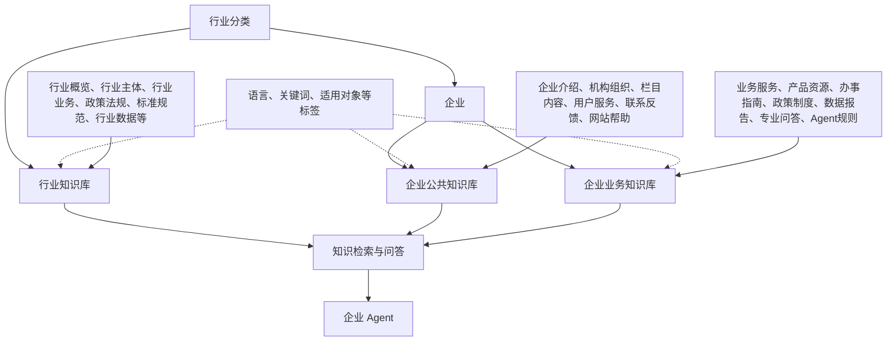
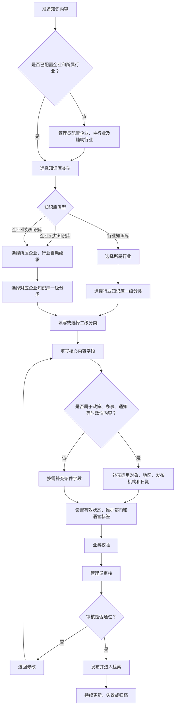
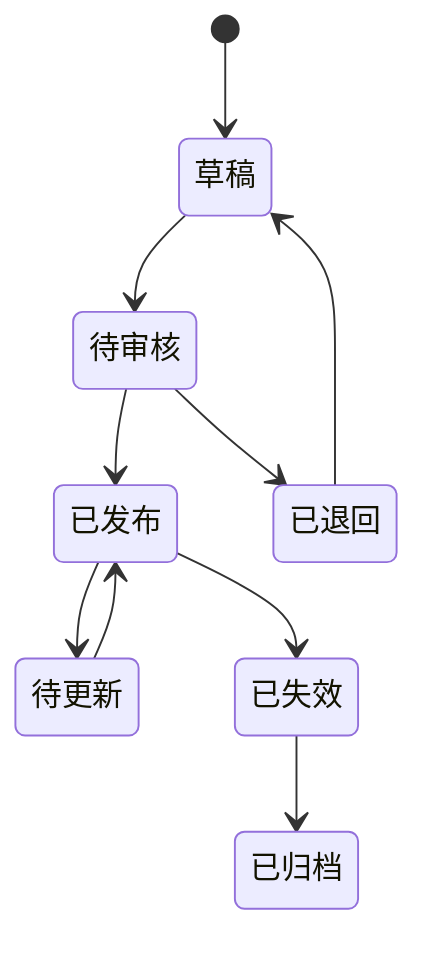

# 企业网站行业知识库分类体系说明

## 1. 文档目的

本文档用于说明《企业网站行业知识库分类体系.xlsx》的设计思路、整体架构、字段关系和实际使用方法，供业务人员、知识运营人员、企业管理员、产品经理和 Agent 建设人员共同使用。

这套体系要解决的不是“网站栏目怎样排列”，而是以下问题：

1. 不同行业的企业如何复用行业共性知识。
2. 每个企业自身的信息和业务如何独立维护。
3. 一条知识进入知识库时，应该归到哪里、填写哪些字段。
4. 多个企业、多种语言并存时，如何避免重复建设和分类混乱。
5. Agent 检索知识时，如何确定知识的适用行业、企业、业务和有效状态。

最终目标是形成一套业务人员看得懂、管理员管得住、Agent 能准确检索的知识分类和字段体系。

---

## 2. 为什么需要这套体系

### 2.1 网站栏目不能直接等同于知识分类

网站栏目主要服务于页面展示和内容导航，例如“新闻中心”“政务公开”“办事服务”。同一条知识可能同时出现在多个栏目中，也可能随着网站改版而迁移栏目。

知识库分类服务于知识复用、检索、问答和 Agent 执行，需要保持相对稳定。因此：

- 网站栏目可以作为知识来源和导航信息。
- 知识归类应按照行业、企业、知识库类型和业务主题进行。
- 网站栏目调整时，不应导致知识库整体重建。

### 2.2 行业共性知识不应在每个企业中重复建设

同一行业的多个企业通常共享大量知识，例如行业术语、政策法规、标准规范、行业主体和通用业务流程。

如果每个企业分别保存一份，会出现：

- 重复采集和重复审核。
- 不同企业的内容版本不一致。
- 政策失效后需要在多个知识库中分别更新。
- Agent 可能引用到旧版本或冲突内容。

因此需要单独建设“行业知识库”，由同一行业下的多个企业共同引用。

### 2.3 企业公共信息和企业业务信息需要分开

企业介绍、机构职责、栏目导航、注册登录和联系方式，属于企业自身的公共信息。

办事指南、业务规则、本地政策、产品服务、专业问答和 Agent 规则，属于企业自身的业务信息。

两者维护方式、变化频率和使用场景不同，因此拆分为：

- 企业公共知识库。
- 企业业务知识库。

### 2.4 语言不应成为知识树层级

同一条知识的简体中文、繁体中文和英文版本，本质上仍属于同一个行业、企业和业务分类。

如果把语言设置成知识树层级，会产生多套重复目录。因此本体系将语言作为标签：

```text
相同分类路径 + 不同语言标签 = 同一知识的不同语言版本
```

---

## 3. 总体设计原则

本体系采用：

```text
行业归属 + 企业归属 + 知识库类型 + 分类路径 + 知识内容 + 治理信息 + 辅助标签
```

其中：

- 行业归属：说明企业和知识属于哪个行业。
- 企业归属：说明知识属于哪一家企业。
- 知识库类型：区分行业共享知识、企业公共知识和企业业务知识。
- 分类路径：确定知识的一级分类和二级分类。
- 知识内容：保存标题、摘要、正文或附件、来源等实际内容。
- 治理信息：判断知识是否有效、由谁维护、何时更新。
- 辅助标签：用于语言、关键词、适用对象等交叉筛选。

一条知识的完整归类关系可以表示为：

```text
知识条目
= 所属行业
+ 所属企业（企业知识需要，行业知识不需要）
+ 知识库类型
+ 一级分类
+ 二级分类
+ 核心内容字段
+ 条件字段
+ 治理字段
+ 标签
```

---

## 4. 总体架构图



### 4.1 层级关系

每家企业应配置一个主行业，可以补充少量辅助行业。

```text
行业
└── 企业网站
    ├── 企业公共知识库
    └── 企业业务知识库

行业
└── 行业知识库（同一行业的多个企业共享）
```

需要注意：

- 行业知识库不属于某个具体企业。
- 企业公共知识库和企业业务知识库必须属于具体企业。
- 企业知识自动继承该企业所属的行业。
- 语言不在上述层级中，只作为知识标签。

---

## 5. 三类知识库的职责

### 5.1 行业知识库

行业知识库存放同一行业内可以共享的知识。

主要内容包括：

- 行业概览。
- 行业主体。
- 行业业务。
- 产品与服务。
- 政策法规。
- 标准规范。
- 办事与业务流程。
- 行业数据。
- 行业术语。
- 典型案例。
- 常见问题。
- 风险与合规。
- 行业动态。

典型归类路径：

```text
文化、旅游与体育
└── 行业知识库
    └── 政策法规
        └── 扶持政策
```

### 5.2 企业公共知识库

企业公共知识库存放企业自身的基础信息和通用使用信息。

主要内容包括：

- 企业基础信息。
- 机构与组织。
- 栏目与内容。
- 用户服务。
- 企业通用问答。
- 联系与反馈。
- 网站使用帮助。

典型归类路径：

```text
文化、旅游与体育
└── 北京市文化旅游企业
    └── 企业公共知识库
        └── 机构与组织
            └── 部门职责
```

### 5.3 企业业务知识库

企业业务知识库存放某个企业独有的业务知识。

主要内容包括：

- 业务与服务。
- 产品与资源。
- 办事指南。
- 政策与制度。
- 数据与报告。
- 专业问答。
- 动态内容。
- Agent 专用知识。

典型归类路径：

```text
文化、旅游与体育
└── 北京市文化旅游企业
    └── 企业业务知识库
        └── 办事指南
            └── 旅行社设立许可
```

---

## 6. 如何判断知识库类型

| 判断问题 | 归属知识库 |
|---|---|
| 这条知识是否适用于同一行业下的多个企业？ | 行业知识库 |
| 这条知识是否在介绍企业、机构、栏目、账户或网站使用方法？ | 企业公共知识库 |
| 这条知识是否属于某个企业的具体业务、办事、产品、政策或数据？ | 企业业务知识库 |

容易混淆的情况：

| 内容 | 归类建议 |
|---|---|
| 国家或行业通用政策 | 行业知识库 |
| 仅适用于某个企业所在地区或具体业务的政策 | 企业业务知识库 |
| 企业注册、登录、搜索和下载问题 | 企业公共知识库 |
| 某项业务的办理条件、材料和进度问题 | 企业业务知识库 |
| 行业通用术语 | 行业知识库 |
| 企业自身的机构职责和联系方式 | 企业公共知识库 |
| Agent 的工具调用和转人工规则 | 企业业务知识库 |

“常见问题”不单独决定知识库归属，需要根据问题内容判断：

- 企业使用和账户问题归入企业公共知识库。
- 业务、办事、政策和数据问题归入企业业务知识库。
- 行业共性问题归入行业知识库。

---

## 7. 一个知识录入知识库的流程



### 7.1 第一步：确认企业上下文

管理员先完成企业基础配置：

- 企业名称。
- 企业所属主行业。
- 辅助行业。
- 企业可使用的语言标签。
- 企业维护部门。

这部分不是每次知识入库都重复填写。

### 7.2 第二步：选择知识库类型

录入人员判断该知识是行业共享知识、企业公共知识还是企业业务知识。

### 7.3 第三步：选择分类路径

先选择知识库类型，再到对应分类表选择一级分类：

- 行业知识库引用 Excel 的“03_行业知识库”。
- 企业公共知识库引用 Excel 的“04_企业公共知识库”。
- 企业业务知识库引用 Excel 的“05_企业业务知识库”。

二级分类描述具体事项、对象或业务主题，可以根据行业和企业实际情况扩展。

### 7.4 第四步：填写知识内容

填写标题、摘要、正文或附件、来源和内容形式。

### 7.5 第五步：补充条件字段

政策、制度、办事指南、通知公告等内容需要补充：

- 适用对象。
- 适用地区。
- 发布机构。
- 发布日期。
- 生效日期。
- 失效日期。

### 7.6 第六步：审核与发布

业务人员负责内容正确性，管理员负责分类规范、有效状态、权限和发布审核。

---

## 8. 字段如何组合

字段分为六组。

| 字段组 | 主要字段 | 作用 |
|---|---|---|
| 归属字段 | 知识库类型、所属行业、所属企业、一级分类、二级分类 | 确定知识放在哪里 |
| 内容字段 | 知识标题、内容形式、知识摘要、正文或附件 | 描述知识是什么 |
| 来源字段 | 来源、发布机构 | 说明知识从哪里来、是否权威 |
| 适用字段 | 适用对象、适用地区 | 判断知识适用于谁和哪里 |
| 时效与治理字段 | 发布日期、生效日期、失效日期、有效状态、维护部门 | 判断知识现在能否使用、由谁维护 |
| 标签字段 | 语言标签、关键词 | 用于检索、筛选和多语言识别 |

### 8.1 三类知识库的字段差异

| 字段 | 行业知识库 | 企业公共知识库 | 企业业务知识库 |
|---|---|---|---|
| 知识标题 | 必填 | 必填 | 必填 |
| 知识库类型 | 必填 | 必填 | 必填 |
| 所属行业 | 必填 | 从企业继承 | 从企业继承 |
| 所属企业 | 不填写 | 必填 | 必填 |
| 一级分类 | 必填 | 必填 | 必填 |
| 二级分类 | 必填 | 必填 | 必填 |
| 内容形式 | 必填 | 必填 | 必填 |
| 知识摘要 | 必填 | 必填 | 必填 |
| 正文或附件 | 必填 | 必填 | 必填 |
| 来源 | 必填 | 必填 | 必填 |
| 适用对象 | 条件必填 | 可选 | 条件必填 |
| 适用地区 | 条件必填 | 可选 | 条件必填 |
| 发布机构及日期 | 条件必填 | 可选 | 条件必填 |
| 有效状态 | 必填 | 必填 | 必填 |
| 维护部门 | 可选 | 必填 | 必填 |
| 语言标签 | 可选 | 可选 | 可选 |
| 关键词 | 可选 | 可选 | 可选 |

---

## 9. 业务录入人员关注的字段

业务录入人员重点关注“知识是否正确、完整、能否被用户理解”。

### 9.1 日常录入的核心字段

| 字段 | 业务关注点 |
|---|---|
| 知识标题 | 标题是否能够脱离上下文独立表达内容 |
| 知识库类型 | 是否正确区分行业共享、企业公共和企业业务 |
| 一级分类 | 是否选择了正确的知识主题 |
| 二级分类 | 是否准确描述具体事项或业务 |
| 内容形式 | 是政策、指南、FAQ、通知还是其他内容 |
| 适用对象 | 内容面向个人、企业、机构还是其他对象 |
| 知识摘要 | 是否简明说明该知识解决什么问题 |
| 正文或附件 | 内容是否完整，附件是否可访问 |
| 来源 | 是否来自正式、可信的渠道 |
| 有效状态 | 当前是否仍可用于正式回答 |
| 语言标签 | 知识使用什么语言 |

### 9.2 业务人员不需要重复维护的字段

以下信息应由系统或企业配置自动带出：

- 企业所属行业。
- 企业名称和基础配置。
- 固定的知识库类型选项。
- 固定的一级分类。
- 管理员统一配置的内容形式和有效状态选项。

---

## 10. 管理员关注的字段

管理员重点关注“知识放得是否正确、是否可控、是否持续有效”。

### 10.1 企业配置字段

| 字段 | 管理要求 |
|---|---|
| 企业名称 | 由企业管理员创建和维护 |
| 主行业 | 每个企业原则上选择一个 |
| 辅助行业 | 仅在综合型企业中按需配置 |
| 企业二级分类 | 根据企业实际业务维护 |
| 语言标签选项 | 根据企业提供的语言版本配置 |
| 维护部门 | 明确每类知识的责任部门 |

### 10.2 分类治理字段

| 字段 | 管理要求 |
|---|---|
| 知识库类型 | 确保行业知识和企业知识不混放 |
| 一级分类 | 使用平台统一分类，不随意增加同义分类 |
| 二级分类 | 审核命名、颗粒度和重复情况 |
| 所属行业 | 确保行业知识的适用范围准确 |
| 所属企业 | 防止企业专属知识被其他企业误用 |

### 10.3 有效性治理字段

| 字段 | 管理要求 |
|---|---|
| 来源 | 优先使用官网、正式文件或审核后的材料 |
| 发布机构 | 判断知识权威性 |
| 生效日期 | 防止提前引用尚未生效的规则 |
| 失效日期 | 防止 Agent 引用过期知识 |
| 有效状态 | 决定知识能否参与正式回答 |
| 维护部门 | 确定更新和纠错责任人 |

---

## 11. 哪些内容固定，哪些可以变化

| 类型 | 内容 | 调整原则 |
|---|---|---|
| 固定标准 | 三个知识库类型、一级分类、核心字段名称、必填规则 | 平台统一维护，业务人员不能随意改名 |
| 平台可配置 | 行业分类、内容形式、有效状态、适用对象选项 | 统一评审后调整 |
| 企业可配置 | 企业名称、二级分类、业务主题、语言标签、维护部门 | 各企业根据实际业务维护 |
| 逐条填写 | 标题、摘要、正文或附件、来源、日期、关键词 | 每条知识入库时填写 |

调整分类时应优先判断：

1. 是出现了新的业务，还是只是出现了新的表述。
2. 是否可以使用现有分类加标签解决。
3. 新分类是否会与已有分类重复。
4. 是否会影响已入库知识和 Agent 检索规则。

---

## 12. 知识生命周期

建议将知识管理分为以下阶段：



各阶段建议规则：

| 阶段 | 说明 | 是否参与正式检索 |
|---|---|---|
| 草稿 | 内容尚未提交审核 | 否 |
| 待审核 | 等待业务或管理员确认 | 否 |
| 已发布 | 内容已审核并可正式使用 | 是 |
| 待更新 | 内容仍可使用，但需要复核或更新 | 视业务规则决定 |
| 已失效 | 已超过有效期或被新版本替代 | 否 |
| 已归档 | 仅用于历史查询和审计 | 否 |

当前 Excel 中的“有效状态”用于表达知识内容是否有效。后续系统建设时，可以另外增加“审核状态”，不要把内容有效性和审核流程混为一个字段。

---

## 13. 冲突和重复知识处理规则

当多条知识内容发生冲突时，建议按以下优先级处理：

```text
企业正式业务规则
> 企业所在地区的正式规则
> 国家或行业通用规则
> 行业经验和参考案例
```

同一层级内：

```text
新版本 > 旧版本
正式文件 > 政策解读 > 新闻报道
权威来源 > 审核整理内容 > 未确认内容
```

重复知识处理建议：

- 内容完全相同：保留一条主知识，其他位置通过分类或标签引用。
- 内容部分重叠：拆分为通用知识和具体业务知识。
- 新文件替代旧文件：新文件设为现行有效，旧文件设为已失效并保留历史关系。
- 不同语言版本：使用相同分类路径，分别设置语言标签。

---

## 14. Agent 使用知识时的建议顺序

企业 Agent 检索知识时，建议按照以下顺序：

```text
1. 当前企业的正式业务知识
2. 当前企业的公共知识
3. 当前企业所属行业的共享知识
4. 业务系统或接口中的实时数据
5. 必要时转人工
```

检索时至少应使用：

- 所属企业。
- 所属行业。
- 知识库类型。
- 一级分类和二级分类。
- 有效状态。
- 适用对象和地区。
- 语言标签。

以下知识原则上不能直接用于正式回答：

- 已失效知识。
- 待确认知识。
- 与当前企业或行业不匹配的知识。
- 来源不明且未经审核的知识。
- 超出适用地区、适用对象或有效期的知识。

---

## 15. 完整示例

以“北京市文旅企业扶持资金申报指南”为例。

### 15.1 分类判断

该内容：

- 属于文化、旅游与体育行业。
- 只适用于北京市文化旅游企业的具体业务。
- 内容用于指导企业申报资金。

因此归入企业业务知识库。

### 15.2 分类路径

```text
文化、旅游与体育
└── 北京市文化旅游企业
    └── 企业业务知识库
        └── 办事指南
            └── 文旅企业扶持资金申报
```

### 15.3 字段填写示例

| 字段 | 示例内容 |
|---|---|
| 知识标题 | 北京市文旅企业扶持资金申报指南 |
| 知识库类型 | 企业业务知识库 |
| 所属行业 | 文化、旅游与体育 |
| 所属企业 | 北京市文化旅游企业 |
| 一级分类 | 办事指南 |
| 二级分类 | 文旅企业扶持资金申报 |
| 内容形式 | 指南 |
| 适用对象 | 企业 |
| 适用地区 | 北京市 |
| 知识摘要 | 说明申报对象、条件、材料和办理流程 |
| 正文或附件 | 申报指南正文或正式附件 |
| 来源 | 北京市文化和旅游局官网 |
| 发布机构 | 北京市文化和旅游局 |
| 有效状态 | 现行有效 |
| 语言标签 | 简体中文 |

---

## 16. 建议后续补充的系统管理字段

当前 Excel 面向业务人员，因此没有放入 ID 和过多技术字段。系统进入建设阶段后，建议由后台自动维护以下字段，不要求业务人员手工填写：

| 建议字段 | 用途 |
|---|---|
| 系统唯一标识 | 系统内部识别知识条目 |
| 审核状态 | 区分草稿、待审核、已发布和已退回 |
| 版本号 | 管理知识更新和历史版本 |
| 创建时间、更新时间 | 审计知识变化 |
| 创建人、更新人、审核人 | 明确操作责任 |
| 更新周期、下次复核日期 | 提醒定期复核 |
| 可见范围 | 区分公开、内部或指定部门使用 |
| 敏感等级 | 控制敏感知识的访问和回答 |
| 替代知识或关联知识 | 记录新旧版本及相关知识关系 |
| 原始文件指纹 | 辅助识别重复文件 |

这些字段应尽量由系统自动生成或管理员维护，不应增加业务录入人员的日常负担。

---

## 17. Excel 各 Sheet 的使用说明

| Sheet | 用途 |
|---|---|
| 01_分类总表 | 汇总三类知识库的一级分类和适用范围 |
| 02_行业分类 | 确定企业所属行业 |
| 03_行业知识库 | 查看行业知识库的一级分类和建议二级内容 |
| 04_企业公共知识库 | 查看企业公共知识库分类 |
| 05_企业业务知识库 | 查看企业业务知识库分类 |
| 06_企业知识树 | 查看单个企业中公共知识和业务知识的组合关系 |
| 07_组合逻辑 | 查看一条知识如何形成完整分类路径 |
| 08_字段总表 | 查看字段定义、三类知识库的必填规则和取值方式 |
| 09_知识归类模板 | 供业务人员试填和整理待入库知识 |
| 10_选项配置 | 维护稳定的字段选项 |

建议使用顺序：

```text
02_行业分类
→ 07_组合逻辑
→ 03/04/05 对应知识库分类
→ 08_字段总表
→ 09_知识归类模板
```

---

## 18. 总结

这套体系的核心不是建立更多目录，而是把行业共性、企业公共信息和企业业务信息分开管理，再通过统一字段组合成一条完整知识。

核心原则可以概括为：

> 行业分类负责确定企业所属领域，行业知识库负责共性复用，企业公共知识库负责企业自身说明，企业业务知识库负责具体业务，分类路径负责主要归属，标签负责交叉筛选，治理字段负责保证知识持续有效。

按照这套体系建设后：

- 新增企业时可以直接复用所属行业的知识。
- 企业只需要补充自身公共信息和业务知识。
- 不同语言版本不需要重复建设知识树。
- 业务人员可以使用精简模板完成归类。
- 管理员能够控制分类、来源、有效期和维护责任。
- Agent 能够根据企业、行业、分类、适用范围和有效状态准确检索知识。
