# 知识库升级一期

> 文档版本：v1.1
> 编写日期：2026-08-13
> 适用项目：console-crm
> 原型目录：`/Users/simon/Documents/project/console-crm/prototype`
> 原型入口：`http://localhost:1234/knowledge-config`
> 需求基线：《知识库配置产品需求文档（PRD）》
> 文档用途：约束知识库升级一期的产品、研发、测试范围，并定义智能体通过 `rag_search` 使用知识库的方式。

## 一、文档定位

现有知识库原型覆盖概览、知识板块、知识资产目录、知识库配置、同步、问答测试、质量运营等较完整能力，但一期不能按完整原型全量建设。本文件以现有 PRD 和原型为基线，只保留本期已确认、能支撑知识入库、知识治理和智能体调用的最小闭环。

一期要形成两个相互衔接的产品能力：

1. **知识库侧**：知识能被录入、分类、解析、清洗、检索、更新和治理。
2. **智能体侧**：N3 能给智能体授权知识目录；Skill 能根据任务选择知识库类型和一、二级分类；`rag_search` 能在授权范围内精准检索并返回可引用结果。

本文是一期研发范围的唯一收敛口径。现有 PRD 或原型中与本文冲突的功能，按本文执行；本文未纳入的功能不因为原型已经展示就自动进入一期。

## 二、一期产品目标

### 2.1 解决的问题

一期重点解决以下问题：

- 企业知识分散在文档、FAQ、网站页面和行业资料中，缺少统一的入库与分类方式。
- 不同内容形式需要不同切片方式，单一切片规则无法兼顾政策、手册、FAQ、文章等内容。
- 知识入库前缺少基础去重和质量处理，重复内容会直接影响召回质量。
- 用户问了但智能客服答不上时，问题没有稳定回流为知识，需要将原“未回答”能力升级为覆盖盲区闭环。
- 知识分类已经存在，但智能体没有一套稳定方式告诉 `rag_search` 本次应该从什么知识中查找。
- 现有行业内容由企业各自维护，标准不一且重复建设；一期先统计真实使用情况，低价值内容可废弃，保留内容升级为平台统一维护，并按《行业产品详情页内容结构标准》承载。

### 2.2 一期成功标准

一期上线后，应完成以下闭环：

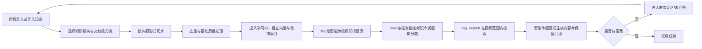

## 三、一期范围总览

| 工作域 | 一期必须交付 | 一期不展开 |
|---|---|---|
| 概览 | 知识总数、已发布上线、平均健康度、待处理 4 个指标；待处理只统计“用户问了但答不上（覆盖盲区）”，并展示下一步建议 | 其它低质、过期、同步异常等综合待办不进入一期概览 |
| 知识板块 | 固定板块；按内容形式配置切片规则；入库前去重；检索支持向量与倒排权重 | 技术参数不对客户开放；结构化数据 MCP 完整动作市场不在本文扩展 |
| 隐私处理 | 必须完成技术调研；有可靠实现条件时纳入一期 | 不作为一期上线阻断项；复杂隐私识别治理放二期 |
| 知识资产目录 | 默认知识目录、知识录入、分类筛选联动、FAQ 多问法与富文本答案、内容资产树形结构 | 完整健康体检、批量修复流水不作为一期必交付 |
| 元数据 | 文档级、板块级、切片级三层；文档级自定义字段；系统枚举保护 | 敏感词库不做 |
| 行业知识 | 统计现有企业维护行业内容的使用情况并形成保留/废弃结论；保留内容升级为平台维护，将《行业产品详情页内容结构标准》配置到每个行业的指定内容模块 | 企业侧不再各自新增或修改平台行业标准内容；一期不要求一次覆盖全部行业 |
| 存量迁移 | 旧知识目录、文档知识、Web 知识、FAQ、网站内容按新对象逐项迁移；知识库设置切换到新版配置；网站学习规则并入内容资产树 | 不保留两套配置或两套网站知识入口长期并行 |
| 智能体 | N3 知识目录授权；注册 `rag_search`；Skill 动态传入分类过滤；客服和内容生成示例 | 不新增知识资产字段；不让大模型绕过权限和有效状态 |

## 四、产品与数据边界

### 4.1 知识库归属

沿用现有 PRD 的边界：知识库归属于 `product_group_id`。同一产品组下多个门户站点共享一套知识库，不同产品组相互隔离。

所有知识查询和统计必须由服务端从当前登录上下文确定 `product_group_id`，不得相信大模型或前端自由传入其它产品组标识。

### 4.2 四类知识组织概念

一期必须明确区分以下概念：

| 概念 | 作用 | 是否由智能体直接使用 |
|---|---|---|
| 知识目录 `folderId` | 用户整理知识、N3 授权智能体可使用的最大范围 | 是，用于授权，不用于表达具体任务语义 |
| 知识板块 `section` | 决定解析、切片和检索技术处理方式 | 否，由系统内部处理 |
| 知识库类型 | 表示知识来源、权威归属与复用范围 | 是，Skill 用于选择来源 |
| 一级/二级分类 | 表示业务知识域和具体主题 | 是，Skill 用于主要和精准调用范围 |

标签用于分类内部的关键词召回增强，不另建 `skill:*` 标签体系。来源方式只表示上传、网页、平台等内容如何进入知识库，不参与 Skill 路由。

### 4.3 账户类型与权限边界

一期按两类账户实现权限，不再使用“普通客户”“运营用户”等不明确称呼：

| 账户类型 | 定义 | 默认数据范围 |
|---|---|---|
| 平台账户 `platform_user` | 平台管理员、平台知识运营人员，负责全局规则、知识板块和平台行业知识 | 按平台角色授权的产品组、企业或全平台范围 |
| 后台用户 `backend_user` | 企业后台管理员、企业知识运营人员，负责本企业知识资产 | 当前登录企业及当前 `product_group_id` |

权限总原则：

1. **知识板块全部内容仅平台账户可见。**包括知识板块列表、六个板块的处理说明、切片解析规则、清洗与质量策略、检索策略、自动元数据、结构化数据 MCP 动作及所有保存接口。后台用户不能看到菜单、页面内容或通过接口读取配置。
2. **知识资产目录两类账户均可查看。**平台账户按授权范围查看；后台用户只能查看当前企业、当前产品组有权限的资产。
3. 后台用户可以新增和维护本企业知识；对于来源为“平台”的行业知识，只能查看、采用、选择版本及按企业权限使用，不能修改平台原文、平台分类和平台版本。
4. N14 行业知识运营、新增平台行业知识、平台版本发布和企业推送仅平台账户可见、可操作。
5. 知识库配置页两类账户均可查看。后台用户对“平台维护的字段”只读，对“企业维护的字段”按企业权限编辑；平台账户可编辑平台字段。当前原型为方便评审统一展示最高权限下的完整控件，生产实现必须按账户类型禁用或隐藏操作。
6. 页面显隐不能代替服务端鉴权。每个读取、创建、更新、删除、发布、推送、重新学习接口都必须校验 `account_type`、角色、企业范围和 `product_group_id`。
7. 无权限访问页面时返回 `403` 或统一无权限页，不返回页面数据；不能仅在前端隐藏按钮后仍允许直接调用接口。

页面与操作权限按当前原型路由约束如下：

| 页面/路由 | 平台账户 | 后台用户 | 关键约束 |
|---|---|---|---|
| 概览 `/knowledge-config` | 查看 | 查看 | 数据按账户可见企业及 `product_group_id` 聚合 |
| 知识板块 `/knowledge-config/sections` | 查看、配置 | 不可查看 | 包括列表、详情、切片、清洗、检索、自动元数据和 MCP 动作 |
| 知识资产目录 `/knowledge-config/catalog` | 按授权范围查看和维护 | 查看、维护本企业资产 | 平台行业知识对后台用户只读 |
| 新增知识 `/knowledge-config/catalog/new` | 按角色创建 | 创建本企业知识、采用平台知识 | 后台用户不能创建或修改平台行业知识原文 |
| 知识详情 `/knowledge-config/catalog/:assetId` | 按授权范围查看和维护 | 查看、维护本企业资产 | 来源、版本、企业和产品组均需服务端鉴权 |
| 知识库配置 `/knowledge-config/metadata` | 查看并维护平台字段 | 查看平台字段、维护企业字段 | 后台用户对平台维护字段只读 |
| 同步状态、问答测试、对话质量运营 | 查看、操作 | 查看、操作本企业范围数据 | 不得跨企业或跨产品组读取 |
| N14 行业知识运营 `/platform/industry-knowledge` 及子页面 | 查看、创建、编辑、发布、推送 | 不可查看 | 新增、详情、版本与推送接口全部为平台权限 |

## 五、知识库一期详细需求

### 5.1 概览

概览只回答两个问题：当前有多少可用知识，以及现在最需要补什么知识。

#### 5.1.1 指标卡

一期保留四个指标：

| 指标 | 口径 | 空值表现 |
|---|---|---|
| 知识总数 | 当前产品组内未删除的知识资产数 | `0` |
| 已发布上线 | 状态为启用且已有成功学习版本的资产数 | `0` |
| 平均健康度 | 状态为启用或待更新且存在健康度结果的资产健康度平均值；草稿、停用、学习中及失败资产不进入分母 | 无可计算资产时显示 `--` |
| 待处理 | 当前仍为待处理状态的覆盖盲区主题数；相似问法聚为一个主题后只计一次 | `0` |

#### 5.1.2 待处理

一期“待处理”只展示：

```text
用户问了但答不上（覆盖盲区）
```

该能力承接原“未回答”功能，不再同时展示草稿、低质量、待更新等其它待办。

每个覆盖盲区至少包含：

- 代表问题；
- 相似问题聚类后的出现次数；
- 影响会话数；
- 最近发生时间；
- 建议知识板块；
- 当前处理状态：待处理、已补录、已忽略；
- 建议下一步。

“建议下一步”一期支持：

1. **补录知识**：跳转知识资产目录的新建 FAQ，自动带入代表问题和相似问法。
2. **忽略**：明确标记该问题无需补录，从待处理统计中移除，但保留操作记录。
3. **查看对话**：查看产生该问题的原始上下文，辅助运营编写正确答案。

覆盖盲区统计必须按语义相似问题聚类，不能把每一种表达都当成独立问题重复计数。补录或忽略后，应在一次刷新内从待处理列表和统计中移除。

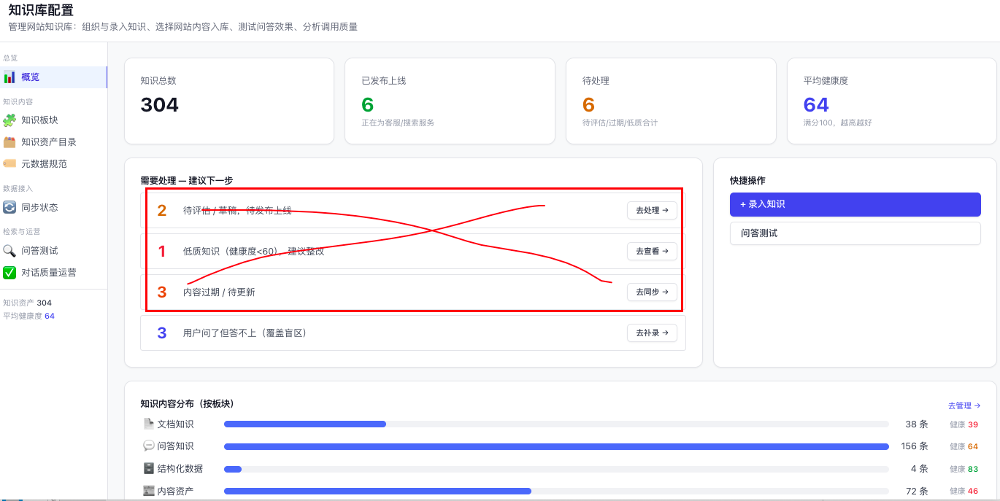

### 5.2 知识板块

知识板块沿用现有固定板块体系，板块决定内容如何解析和检索。客户不能新增或删除板块。

知识板块属于平台内部高级能力，**列表、详情和全部配置仅平台账户可见，后台用户无查看权限**。一期保留平台内部配置页面；具体默认值由研发根据技术实现确定。

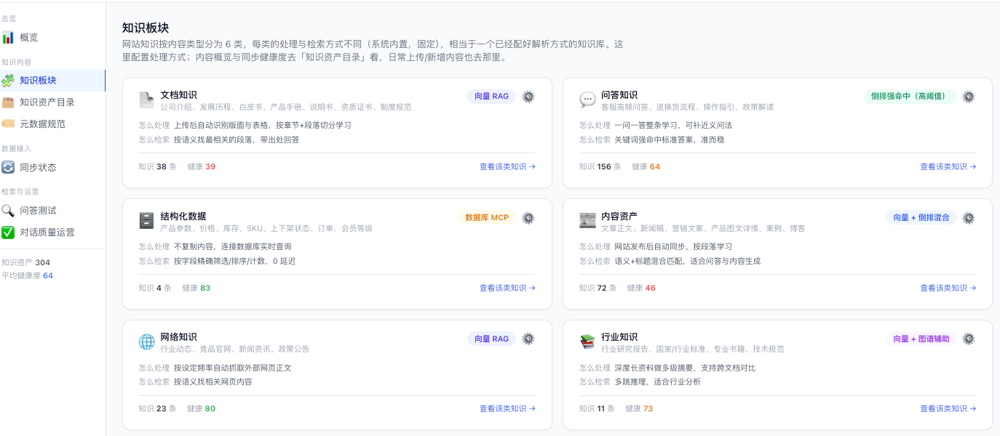

#### 5.2.1 按内容形式配置切片解析方式

同一板块可按文档级 `contentFormat` 选择不同切片规则。

规则如下：

- 每个板块有且只有一条“通用”兜底规则，不可删除。
- 可从“内容形式”系统枚举中增加专属规则。
- 同一个内容形式在同一板块内只能配置一次。
- 一个板块最多配置 5 个内容形式专属规则；“通用”规则不计入这 5 个。
- 新增内容形式规则时，初始参数复制“通用”规则，之后独立维护。
- 删除专属规则后，该内容形式的资产回落到“通用”规则。
- 资产入库或重新学习时，优先命中与自身 `contentFormat` 相同的专属规则；未命中时使用“通用”。
- 修改切片规则只影响新入库内容；已有资产必须重新学习成功后才切换到新规则。

一期不对产品参数做强制规定。研发可参考 RAGFlow，按技术条件选择分块方式、PDF 解析器、文本块大小、分隔符、父子块、PageIndex、关键词提取、问题提取等能力。产品验收重点是“内容形式能正确命中唯一规则”，而不是某个具体参数必须等于固定值。

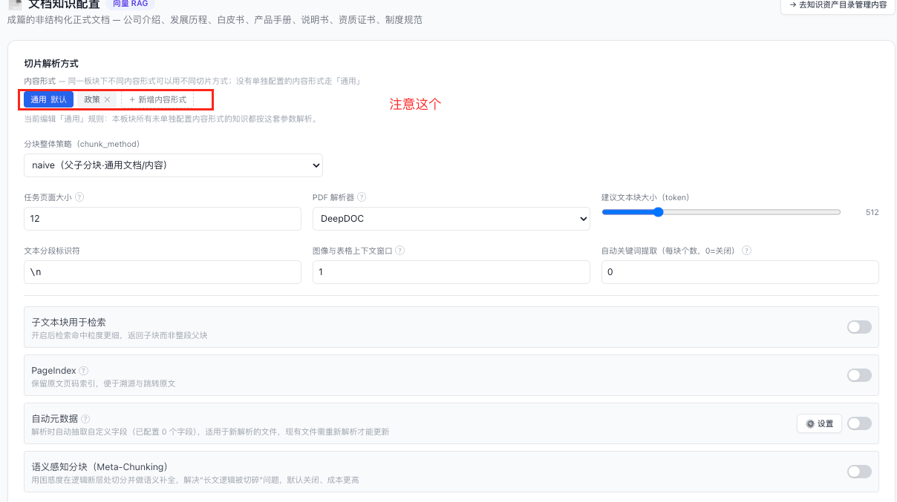

#### 5.2.2 入库前清洗与质量评估

一期必须增加入库前清洗与质量评估环节。

##### A. 去重——一期必做

一期先做同产品组内的基础去重：

- 比较范围：同一产品组，默认同一知识板块；
- 比较信息：标题、正文摘要、标签；
- 返回结果：是否疑似重复、相似资产、相似度、处理建议；
- 处理方式：不自动覆盖或删除，由用户选择取消入库、继续入库或更新已有资产；
- 具体算法和阈值由研发确定，但需支持配置或服务端调整。

重复判断必须在正式发布前完成。继续入库的重复内容要保留“已确认继续”的结果，避免每次重新学习重复阻断。

##### B. 隐私信息去除——一期调研，条件允许则实现

必须完成隐私识别方案调研，重点覆盖：

- 姓名；
- 手机号；
- 邮箱；
- API Key、Access Token 等密钥；
- 可扩展调研身份证号、银行卡号、地址等类型。

若一期实现，应在内容进入切片和索引前完成替换，例如：

```text
联系人张三，手机号13812345678，API Key 为 sk-xxxx
→ 联系人{姓名}，手机号{手机号}，API Key 为 {API_KEY}
```

一期必须输出调研结论，包括识别方式、误判风险、漏判风险、原文保留策略和性能影响。若不能达到可接受效果，则将实现移至二期，不能以不稳定方案阻断一期主流程。

##### C. 质量评估

一期保留基础质量结果：解析是否成功、是否存在空内容、是否疑似重复、切片是否生成。复杂质量健康体检、自动修复、敏感词扣分不进入一期必交付。

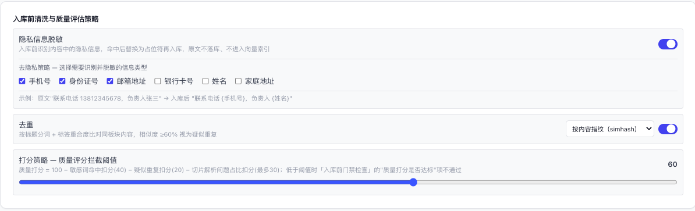

#### 5.2.3 检索策略

一期检索必须同时支持：

- 向量检索；
- 倒排/关键词检索；
- 两种模式分别设置权重；
- 合并结果后排序并返回 Top K。

产品不限制相似度阈值、Top K、Rerank、Embedding 模型和具体融合公式，研发根据技术条件确定默认值和参数范围。向量权重和倒排权重必须可分别调整；服务端可归一化处理，不要求前端强制两者之和等于 1。

#### 5.2.4 页面字段与板块差异

知识板块列表以固定板块卡片展示文档知识、问答知识、结构化数据、内容资产、网络知识和行业知识。每个板块展示板块名称、用途说明、当前处理方式、检索方式、知识数量和平均健康度；点击卡片进入已按板块筛选的知识资产目录，点击配置进入该板块详情。

非结构化板块详情按以下区域和字段展示：

| 配置区域 | 字段 | 交互与约束 |
|---|---|---|
| 切片规则选择 | 通用规则、内容形式专属规则 | 通用规则固定存在；问答知识显示“问答对”固定规则；其它板块最多增加 5 条专属规则 |
| 基础解析 | 分块整体策略 `chunk_method`、任务页面大小、PDF 解析器、建议文本块大小、文本分段标识符 | 参数范围由研发提供；PDF 解析器只对 PDF 生效 |
| 切片增强 | 图像与表格上下文窗口、自动关键词数量、自动问题数量 | 数量为 0 表示关闭；自动问题仅在支持 Doc2Query 的板块显示 |
| 高级处理 | 子文本块用于检索、PageIndex、自动元数据、语义感知分块 | 自动元数据可以选择板块级抽取字段；不适用的板块不显示对应开关 |
| 入库前处理 | 隐私信息脱敏及类型、去重及策略、质量评分拦截阈值 | 去重一期必做；隐私按调研结论落地；未通过门禁不得发布新学习版本 |
| 检索策略 | 向量权重、相似度阈值、Top K、Rerank、Embedding 模型 | 向量与倒排融合；不适用 Embedding 的板块不展示模型字段 |

结构化数据不生成通用向量切片，也不展示上述解析、清洗和检索参数，改为“MCP 动作”列表。每个动作至少展示动作名称、用途、参数说明、返回数据和启用状态；只有已完成平台数据库接入的动作可以出现，关闭后智能体不得再调用，但历史调用记录保留。

保存配置后，新入库知识使用新配置；已入库知识继续使用当前成功学习版本，只有执行“重新学习”并成功后才应用新配置。

检索参数属于平台内部技术配置，不向后台用户展示。配置变更对已有资产的生效规则由研发确定，但不得出现同一次检索混用不兼容索引版本的情况。

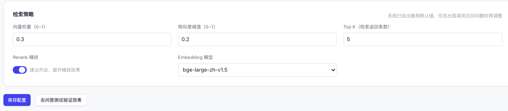

### 5.3 知识资产目录

知识资产目录是两类账户共同查看和管理知识内容的主入口。平台账户按授权范围查看，后台用户只能查看当前企业、当前 `product_group_id` 的资产；来源为“平台”的行业知识对后台用户只读。知识板块配置虽然仅平台可见，但资产目录仍展示“知识板块”字段，用于说明每条资产的处理方式。

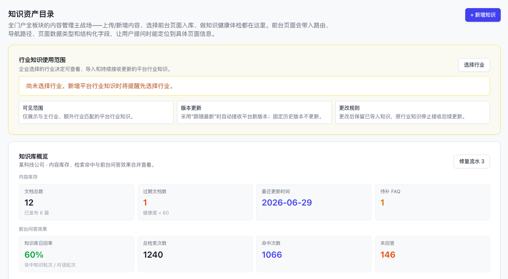


#### 5.3.1 页面结构、知识目录与行业范围

页面从上到下由以下区域组成：行业知识使用范围、知识库概览、知识健康体检、知识目录、筛选工具栏、批量处理区、知识资产列表，以及按操作打开的新增、编辑、详情、体检和日志页面。

每个产品组初始化两个知识目录：

1. **全部内容**：聚合视图，不是可写目录，不可删除、不可重命名，也不作为 N3 授权项。
2. **品牌知识**：实际目录，可重命名，用于品牌介绍、企业信息和品牌口径等内容。

用户可以新增、重命名和删除其它目录。删除目录只解除资产归类，资产转入未指定/其它知识，不删除资产。目录关联必须使用稳定 `folderId`，不能使用可修改的显示名称。目录既用于用户整理，也用于 N3 授权；不决定解析、切片或检索技术方式。

行业知识使用范围在资产目录维护：企业必须选择一个主行业，可增加最多 2 个额外行业；每项为一级行业与二级行业的完整选择，无二级的行业只选择一级。页面展示当前行业、可见范围、版本更新和更改规则。未选择行业时，“采用平台知识”不可继续，并引导用户先配置行业。

更改行业后，已采用知识保留，原行业知识停止接收后续平台版本，新行业匹配的知识进入可采用范围；同时记录变更前后值、操作人、时间和下一次允许更改时间。

#### 5.3.2 筛选、联动与列表字段

筛选项必须与当前原型一致：

| 筛选项 | 规则 |
|---|---|
| 名称 | 模糊搜索知识名称 |
| 来源方式 | 上传文件、前台页面、后台页面、外部网址、平台 |
| 知识库类型 | 行业知识库、企业公共知识库、企业业务知识库；切换后清空一级、二级分类 |
| 所属行业 | 只显示当前账户有权查看的行业 |
| 一级分类 | 由知识库类型决定；切换后清空二级分类 |
| 二级分类 | 只显示当前知识库类型和一级分类下的值 |
| 内容形式 | 使用统一内容形式；问答对和结构化记录由知识板块固定 |
| 有效状态 | 现行有效、即将生效、已失效、待确认 |
| 时效 | 实时、小时、每日、静态 |
| 适用对象 | 企业内部、所有人 |
| 语言 | 简体中文、繁体中文、英语、其他语言 |
| 标签 | 模糊搜索，任一标签包含输入词即命中 |
| 状态 | 全部、草稿、启用、停用、待更新、学习中 |
| 知识板块 | 全部、文档知识、问答知识、结构化数据、内容资产、网络知识、行业知识 |

筛选条件之间为 AND。一级、二级分类必须级联，不能从全量二级分类中直接选择。

列表字段顺序固定为：多选框、知识资产、状态、知识板块、行业、知识库类型、一级分类、二级分类、内容形式、有效状态、时效、适用对象、标签、创建时间、更新时间、体检结论、操作。前台路由不在列表页展示；体检结论放在业务字段之后。

列表必须覆盖草稿、启用、停用、待更新、学习中五种状态。空字段显示“未指定”或 `--`，不得留空。列表和编辑页不再展示“是否开启”字段，是否参与检索完全由状态决定。

#### 5.3.3 批量处理

列表支持当前页全选和“全选当前筛选（跨页）”。跨页选择必须由后端根据当前筛选条件创建选择集合或批处理任务，不能只处理前端已加载记录。

| 所选状态 | 可用批量操作 |
|---|---|
| 全部草稿 | 启用、删除、批量修改知识目录与元数据 |
| 全部启用 | 重新学习、停用、批量修改知识目录与元数据 |
| 全部停用 | 启用、删除、批量修改知识目录与元数据 |
| 全部待更新 | 重新学习、停用、批量修改知识目录与元数据 |
| 全部学习中 | 不提供状态变更和删除；可查看详情、任务进度与日志 |
| 混合状态 | 只显示共同合法操作；不提供强制状态流转 |

“批量修改知识目录与元数据”采用字段开关。仅勾选字段覆盖，未勾选字段保持每条资产原值。支持知识目录、知识库类型、一级分类、二级分类、内容形式、适用对象、有效状态、语言、时效、适用门户网站和文档标签。标签支持追加、移除、替换；跨板块，或包含问答/结构化资产时，禁止批量覆盖内容形式。

修改分类、内容属性、时效或标签后，启用资产进入待更新；仅修改知识目录或适用门户网站不触发重新学习。

#### 5.3.4 新增知识页面

新增知识为独立页面，采用“选择动作 → 选择知识板块 → 添加内容”的流程。后台用户可选择资产归属板块，但不能进入知识板块配置查看或修改技术参数。


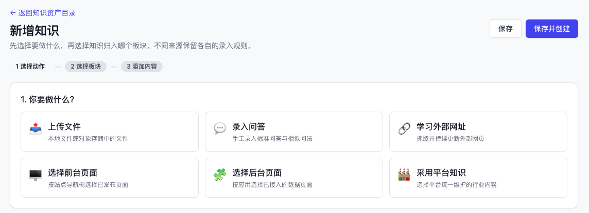

| 动作 | 可归入板块 | 内容与限制 | 来源方式 |
|---|---|---|---|
| 上传文件 | 文档、问答、结构化、网络；平台入口固定行业知识 | 本地上传或对象存储；普通文件支持 PDF、Office，FAQ 批量支持 XLSX/CSV/JSON，结构化支持 CSV/XLSX/JSON/JSONL；单文件不超过 100 MB | 上传文件 |
| 录入问答 | 问答知识 | 标准问题必填、富文本答案必填、相似问法可多条 | 后台页面 |
| 学习外部网址 | 网络知识或文档知识 | 每行一个 URL，最多 100 条；可填写来源分组 | 外部网址 |
| 选择前台页面 | 内容资产或结构化数据 | 保留“站点→导航→页面”树，展示新增/已有；已存在或数据类型不兼容时禁选 | 前台页面 |
| 选择后台页面 | 内容资产或结构化数据 | 使用“应用→页面”树，展示页面数据类型、内容数量、更新时间和新增/已有状态 | 后台页面 |
| 采用平台知识 | 行业知识 | 只显示企业所选行业匹配的已发布平台知识；允许选择最新或历史版本 | 平台 |

前台页面和后台页面只能归入内容资产或结构化数据。页面正文不能归入纯结构化数据；结构化字段不能归入内容资产；“页面正文+结构化字段”可按用户选择归入其中一种。保存页面 ID、路由/后台标识、导航路径、数据类型和结构化字段，供详情、引用与来源跳转使用。

新增阶段元数据固定为两组：

| 分组 | 字段 | 规则 |
|---|---|---|
| 业务归类 | 所属行业 | 后台用户必须选择；平台新增行业知识时拆为一级行业、二级行业且均需完整 |
| 业务归类 | 知识库类型 | 后台用户必须选择，且只能选企业公共知识库、企业业务知识库；平台行业入口固定行业知识库 |
| 业务归类 | 一级分类、二级分类 | 默认未指定；按知识库类型和一级分类联动 |
| 内容属性 | 内容形式 | 默认未指定；FAQ 固定问答对，结构化固定结构化记录 |
| 内容属性 | 适用对象 | 默认未指定；只有企业内部、所有人 |
| 内容属性 | 有效状态 | 默认未指定；与生命周期独立 |
| 内容属性 | 语言 | 默认未指定 |

新增页保留来源动作本身所需字段，不在此阶段要求填写编辑页的全部说明性字段。保存后再进入完整编辑维护。

按钮固定为：

- **保存**：生成草稿并返回资产目录的草稿筛选；
- **保存并创建**：生成草稿，清空本次内容输入并保留当前新增页面继续创建。

两个按钮都不发布、不产生待评估状态。

采用平台知识默认选择最新版本并自动跟随更新。用户可选择历史版本；保存后记录 `industrySourceId`、`industrySourceVersion`、`receiveMode=fixed_version`，并明确提示该资产不再自动更新。

平台新增行业知识复用同一页面，固定知识板块为行业知识、知识库类型为行业知识库。除上传内容和元数据外，只能选择行业知识板块已配置的切片形式；解析器、块大小、清洗、质量和检索参数继续继承板块配置，不在新增页重复配置。

#### 5.3.5 保存后的 AI 元数据分析

保存后，系统分析正文、附件、FAQ 或网页内容，补全新增阶段的文档级元数据：

1. 用户已填写值标记为“用户填写”，AI 不得覆盖。
2. 未指定字段由 AI 分析，标记为“AI 分析”。
3. 无法可靠判断时保留未指定，不得猜测。
4. AI 结果必须遵守知识库类型、一级分类、二级分类联动。
5. 用户后续编辑后，该字段永久以用户值优先；重新学习不覆盖。
6. 未补齐发布必填项时允许保留草稿，但禁止发布。

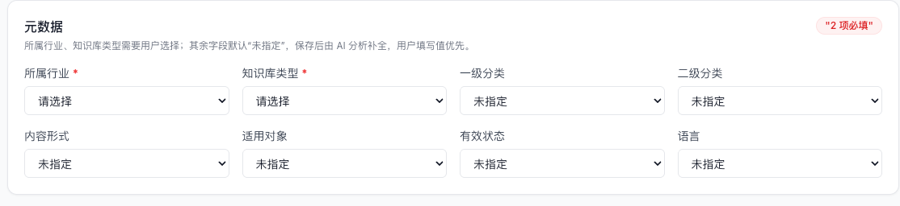

#### 5.3.6 编辑字段

编辑页面展示全部文档级字段，并按以下顺序分组：

| 分组 | 字段 |
|---|---|
| 基础信息与来源 | 知识名称、知识板块、来源方式；内容资产/结构化数据展示前台路由；页面来源补充页面 ID、导航路径、后台数据标识、页面数据类型、结构化字段和精确出处 |
| 业务归类 | 所属行业、知识库类型、一级分类、二级分类 |
| 内容属性 | 内容形式、适用对象、有效状态、语言、时效 |
| 组织与适用范围 | 所属分组（即知识目录）、适用门户网站；未选择门户表示全部门户 |
| 内容说明 | 文档标签、知识摘要、备注、来源引用 |
| 自定义元数据 | 知识库配置中已定义的全部自定义字段 |

来源方式固定为上传文件、前台页面、后台页面、外部网址、平台，没有“生成回流”。新增、编辑、详情和批量修改使用同一枚举与分类数据源。后台用户对平台行业知识只能修改本企业目录、门户范围和采用方式，不能修改平台原文、行业、分类或版本正文。

新增、编辑、详情、筛选和批量修改必须复用同一字段定义；页面可以因场景隐藏不适用字段，但不能另建同名异义字段或使用不同枚举。

| 字段 | 建议字段名 | 定义、默认值与校验 |
|---|---|---|
| 知识名称 | `name` | 文档级名称；新增时可由文件名、问题或页面标题生成，编辑页可修改 |
| 知识板块 | `section` | 固定六类板块；决定处理配置，后台用户只选择归属，不能查看或修改板块配置 |
| 来源方式 | `connect` | 上传文件、前台页面、后台页面、外部网址、平台；创建后不得任意改成另一来源 |
| 所属行业 | `industry` | 后台新增知识必填；平台行业知识拆为一级、二级行业并按行业树联动 |
| 知识库类型 | `knowledgeBaseType` | 后台新增必填且只能选择企业公共知识库、企业业务知识库；平台行业入口固定行业知识库 |
| 一级分类 | `primaryCategory` | 默认未指定；选项由知识库类型决定 |
| 二级分类 | `secondaryCategory` | 默认未指定；选项由知识库类型和一级分类共同决定 |
| 内容形式 | `contentFormat` | 默认未指定；问答知识固定问答对，结构化数据固定结构化记录；其它板块使用知识库配置统一枚举 |
| 适用对象 | `audience` | 默认未指定；可选企业内部、所有人 |
| 有效状态 | `validityStatus` | 默认未指定；可选现行有效、即将生效、已失效、待确认，与生命周期状态分离 |
| 语言 | `language` | 默认未指定；可选简体中文、繁体中文、英语、其他语言 |
| 时效 | `timeliness` | 编辑阶段维护；可选实时、小时、每日、静态 |
| 所属分组/知识目录 | `folderId` | 两个页面文案指向同一字段：编辑页显示“所属分组（知识目录）”，目录区和批量编辑显示“知识目录”；空值为未指定，“全部内容”是聚合视图，不能写入 |
| 适用门户网站 | `portalSiteIds` | 多选门户 ID；未选择表示适用于当前产品组全部门户 |
| 文档标签 | `tags` | 多值文本；筛选采用模糊包含；批量编辑支持追加、移除、替换 |
| 知识摘要 | `summary` | 文档级摘要，可由 AI 补全后由用户修改 |
| 备注 | `remark` | 运营备注，不进入面向用户的正文 |
| 状态 | `status` | 草稿、启用、停用、待更新、学习中；状态操作见 §5.3.9，不再另设“是否开启”字段 |
| 来源定位 | `sourceRef` | 保存 URL、前台路由、后台页面标识、文件或平台知识版本，用于详情和智能体引用跳转 |

必填规则以创建场景为准：所属行业和知识库类型由后台用户填写；具体内容字段按动作必填；其它统一元数据默认“未指定”且不因 AI 分析过程阻止保存草稿。发布时再校验当前场景的发布必填项。

#### 5.3.7 知识详情与切片

知识详情与 N14 文档详情复用同一页面结构：标题与合法操作、文档级元数据、更新历史、健康度分解、来源更新状态、原文与切片、入库前门禁、检索参数、来源。

详情展示编辑页全部字段；自定义元数据追加在系统字段之后。来源为内容资产、结构化数据或网页时展示可跳转路由/URL。检索参数对后台用户只读；平台账户可进入知识板块配置。

原文是文档级权威内容；切片继承文档级业务归类、有效状态、来源、权限和版本。切片弹窗字段为：解析块正文、Type、关键词、问题（可能的提问方式，用于反向问题生成）、标签、启用状态。支持切片搜索、单条编辑和批量启用、禁用、删除。切片修改后需要更新索引。

#### 5.3.8 FAQ

FAQ 一期支持：

- 一个标准答案；
- 一个主问题；
- 多个相似问题/用户问法；
- 答案区域使用富文本编辑器，不使用普通多行文本框；
- 问题为纯文本，支持新增、删除、排序；
- 至少保留一个主问题；
- 多个问题共同指向同一标准答案和同一知识资产，不复制生成多份答案。

答案富文本一期要求：

- 支持段落、标题、加粗、斜体、有序/无序列表、链接和换行；
- 支持粘贴文本，并清理来源页面携带的脚本、内联事件和不安全样式；
- 保存原始富文本 `answerRichText`，用于编辑和智能体页面展示；
- 同步生成纯文本 `answerPlainText`，用于向量化、倒排检索、去重和内容预览；
- 富文本为空或清理后没有有效文字时，不允许保存或发布；
- 智能体引用 FAQ 答案时保留段落和列表结构，不直接把 HTML 标签输出给用户。

推荐数据结构：

```json
{
  "assetId": "faq_refund_001",
  "contentFormat": "问答对",
  "primaryQuestion": "退款审核通过后多久能到账？",
  "alternativeQuestions": [
    "退款一般多久到账？",
    "为什么退款还没有收到？",
    "退款成功后钱什么时候回来？"
  ],
  "answerRichText": "<p>审核通过后，退款将在<strong>3–7个工作日</strong>内原路到账。</p>",
  "answerPlainText": "审核通过后，退款将在3–7个工作日内原路到账。"
}
```

入库时，主问题和相似问题都参与倒排及向量召回；返回结果时统一返回标准答案，并标明实际命中的问题表达。富文本入索引前应转为干净文本，但原富文本必须保留用于编辑和前端展示。

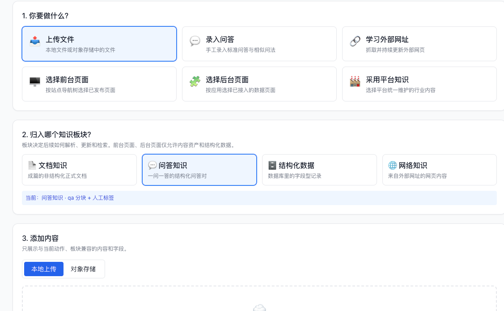

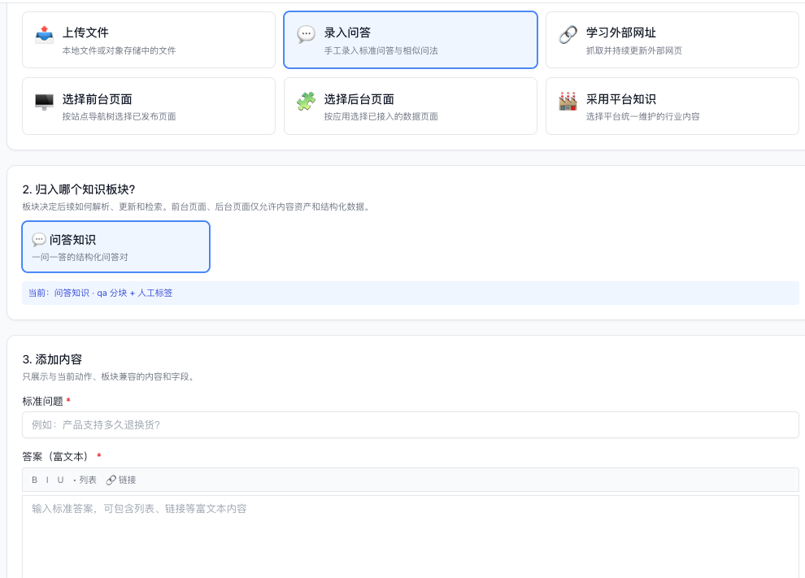

#### 5.3.9 状态与操作

一期取消“待评估”以及独立的“是否开启”开关，知识资产统一使用以下五种业务状态。只有“启用”和“待更新”状态可以使用线上成功学习版本参与正式检索；学习中使用新任务处理内容，不把半成品索引暴露给智能体。

| 状态 | 进入方式 | 列表/详情可执行操作 | 检索规则 |
|---|---|---|---|
| 草稿 | 新增知识点击“保存”或“保存并创建” | 编辑、启用、删除、查看日志 | 不参与检索 |
| 启用 | 草稿执行启用并学习成功；停用知识重新启用；待更新重新学习成功 | 编辑、重新学习、停用、查看日志 | 使用当前成功学习版本参与检索 |
| 停用 | 启用或待更新知识执行停用 | 编辑、启用、删除、查看日志 | 不参与检索；重新启用时已有成功版本可直接恢复使用，若内容需要重新处理则先进入学习中 |
| 待更新 | 启用知识的内容、分类、切片、时效或检索相关元数据发生变化 | 编辑、重新学习、停用、查看日志 | 新学习版本成功前继续使用上一成功版本；没有成功版本时不参与检索 |
| 学习中 | 草稿执行启用；启用或待更新执行重新学习 | 查看详情、任务进度和日志 | 不使用正在生成的索引；若存在上一成功版本且任务来自待更新，可继续使用上一成功版本 |

列表和详情根据状态只显示合法操作。草稿执行启用后先进入学习中；学习成功自动转为启用，失败则返回草稿并展示失败原因。停用知识执行启用时，如现有成功学习版本仍有效可直接转为启用；需要重新处理时先进入学习中。学习中不允许再次启用、停用、编辑或删除，防止并发任务覆盖。

“同步”与“重新学习”不再同时作为人工操作：来源同步是后台按来源方式执行的更新机制，页面可以展示来源更新状态，但资产列表和详情不提供“同步/立即同步”按钮。用户需要重新解析、切片、向量化并生成索引时，统一执行“重新学习”。执行后状态进入学习中；成功后自动转为启用，失败时按任务来源返回草稿或待更新，并记录失败原因。

资产内容、分类或切片修改后应标记为待更新；新学习版本成功前，线上继续使用上一成功版本，避免返回半更新内容。状态已经表达检索开关和处理进度，因此不得再增加 `enabled`、`isOpen` 等并行开关作为产品字段。

### 5.4 知识库配置

#### 5.4.0 前端展示与权限约束

知识库配置页面同时服务平台账户和后台用户，展示字段名称、当前值、状态、必要校验、产品规则说明和当前账户可执行操作。原型按最高权限展示完整配置；生产页面根据账户权限显示只读或编辑状态。服务端继承、索引写入、鉴权和任务调度等实现细节以本产品文档为准，不依赖前端说明完成控制。

权限要求：

- 后台用户展示“平台维护的字段”区域，用于查看平台统一枚举，但实际业务权限为只读，不能通过接口修改平台枚举；平台账户可编辑。为完整表达产品能力，当前原型按最高权限视图展示编辑入口。
- 平台账户展示平台字段区域，并可新增、修改、排序或停用平台枚举。已经被知识资产使用的枚举不得直接删除，应先停用或完成数据迁移。
- 行业知识库的一级分类、二级分类放在“平台维护的字段”区域，由平台维护；新增、删除、一级分类切换和二级分类联动交互与企业分类编辑保持一致。后台用户只使用平台发布的分类值，不能通过接口修改。
- 前端显隐不是权限控制。服务端必须按账户类型、角色和租户范围校验读写权限。

页面按以下顺序展示：门户网站选择 → 统一元数据字段（平台维护的字段、企业维护的字段）→ 元数据字段详情 → 健康度评分。

**门户网站选择**支持“全部门户网站”或多选具体门户；空数组表示全部门户。选择范围决定本页配置优先适用的门户，数据隔离仍以 `product_group_id` 为准。

**平台维护的字段**

| 字段组 | 当前枚举/配置 | 权限与交互 |
|---|---|---|
| 知识库类型 | 行业知识库、企业公共知识库、企业业务知识库 | 平台编辑，后台用户只读 |
| 内容形式 | 文章、政策、指南、报告、案例、通知、手册、标准、其他 | 平台编辑；问答对、结构化记录由板块固定，不放入该枚举 |
| 适用对象 | 企业内部、所有人 | 平台编辑，后台用户只读 |
| 有效状态 | 现行有效、即将生效、已失效、待确认 | 平台编辑，后台用户只读 |
| 语言标签 | 简体中文、繁体中文、英语、其他语言 | 平台编辑，后台用户只读 |
| 时效 | 实时、小时、每日、静态 | 平台编辑，后台用户只读 |
| 行业知识库分类 | 行业知识库一级分类及各一级分类下的二级分类 | 放在平台维护区域；平台可新增、删除、切换一级分类并编辑其二级分类；交互与企业分类编辑一致 |

每组枚举均显示不可删除的“未指定”。当前原型按最高权限显示编辑入口；生产环境后台用户只读，更新接口必须拒绝后台用户请求。

**企业维护的字段**只包含企业公共知识库、企业业务知识库的一级分类和二级分类。用户先选择一级分类，再维护其下二级分类；删除前检查资产引用，存在引用时禁止删除并返回引用数量。行业知识库分类不在企业区域重复展示。

**元数据字段详情**按“基础信息与来源、业务归类、内容属性、组织与适用范围、内容说明”展示系统字段，列包含字段名、说明、类别、必填状态和示例。自定义字段单独展示，列包含字段名、说明、类别、必填状态、示例和操作；新增后必须同步出现在知识编辑、详情及允许配置的新增场景。

**健康度评分**包含板块概览、四维权重和高级配置。板块概览字段为板块、知识条数、平均健康度、引用次数、最近更新、自定义元数据字段数和查看配置操作；后台用户不能通过“查看配置”进入知识板块。质量、时效、复用、反馈权重合计必须为 100 才能保存，高级配置维护扣分、阈值、基准分和统计窗口。

以下规则由研发实现并保留在产品文档中，不在用户界面展开：

- “未指定”、AI 自动补全以及用户编辑值优先的覆盖顺序；
- 文档级字段向切片继承及进入检索过滤条件的规则；
- 一级分类、二级分类和标签在 `rag_search` 中的作用；
- 健康度计算公式、阈值和统计窗口；
- 企业行业选择的可见范围、变更频率和停止更新规则；
- 平台行业知识的企业匹配、最新版本同步和固定历史版本规则。

仅在删除已使用分类、变更企业行业、固定历史版本、下线知识或发布新版本等高影响操作前展示结果型提示，不展示实现过程。

一期元数据分为三层，不新增第四套 Skill 专用字段。


#### 5.4.1 文档级元数据

文档级元数据挂在每一条知识资产上，任何知识资产都必须具备文档级元数据结构。字段是否必填可按知识库类型和内容形式做条件校验。

一期文档级核心字段以 §5.3.6 编辑分组为准，包括知识名称、知识板块、来源方式、来源与精确出处、页面来源字段、知识目录、所属行业、知识库类型、一级/二级分类、内容形式、适用对象、有效状态、语言、时效、门户范围、标签、摘要、备注、知识状态、审计字段及自定义元数据。知识是否参与检索由知识状态决定，不再维护文档级启用开关。

检索索引中的切片必须继承知识库类型、行业/企业、一级/二级分类、内容形式、有效状态、目录、标签等文档级字段，不能在切片上产生与文档不一致的副本值。


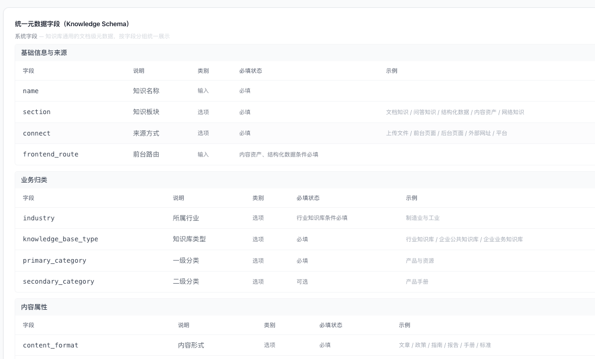


#### 5.4.2 板块级元数据

板块级元数据在知识板块配置的“自动元数据”中维护，用于指定该板块解析时自动抽取哪些信息。该能力属于平台权限，后台用户不能查看或修改。

板块级配置变更只影响后续解析或重新学习，不直接改写已发布索引。

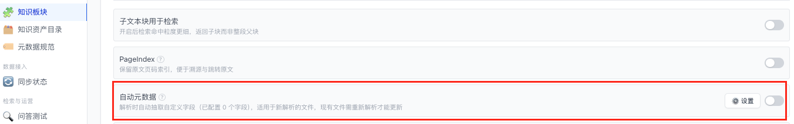

#### 5.4.3 切片级元数据

点击知识详情中的切片时，至少展示：

- 切片类型；
- 关键词；
- 自动生成的可能问题；
- 标签；
- 切片正文；
- 启用状态。

类型、关键词、问题和标签可由解析过程自动生成，用户可以编辑。修改后需要重新建立或更新索引才能用于正式检索。

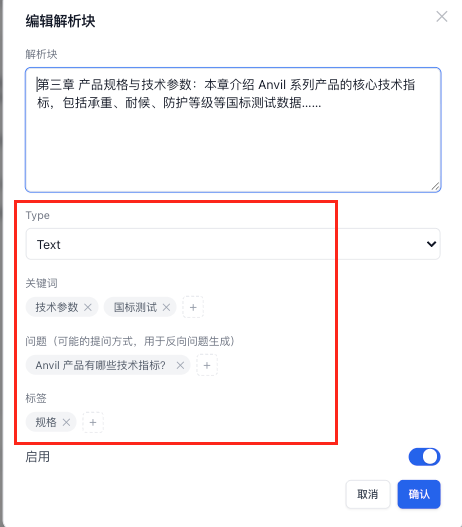

#### 5.4.4 自定义字段

知识库配置中的“自定义字段”属于文档级元数据。用户可以按业务需要增加字段；字段值在每条知识资产上填写，并随切片继承进入可过滤元数据。

自定义字段不能改变知识板块、知识库类型和一级/二级分类的既有含义，也不能代替核心系统字段。

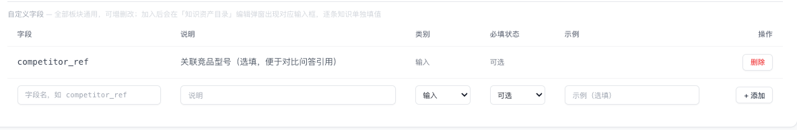

#### 5.4.5 枚举约束

- 系统预置的枚举值不可删除。
- 用户新增的枚举值若未被资产使用可以删除；已被引用时必须先调整资产取值或解除引用。
- 修改知识库类型或一级分类后，必须校验并清空不兼容的下级分类。
- 内容形式若已被切片规则引用，不允许直接删除。
- 一期不做敏感词库及其维护页面。

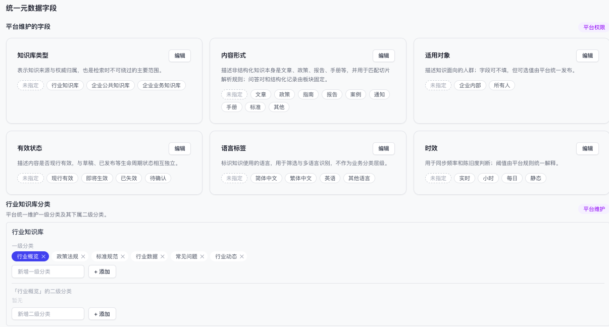

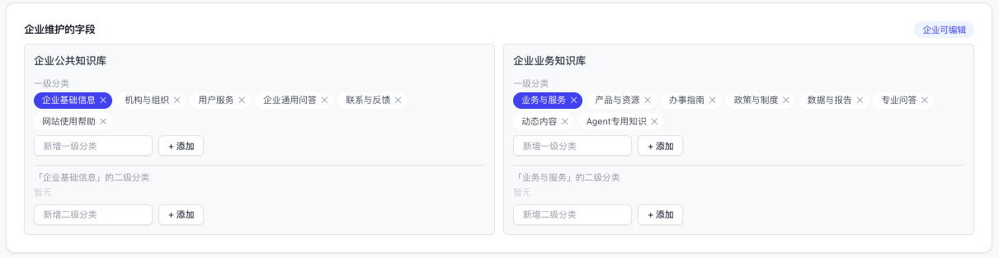


### 5.5 行业知识处理

现有行业内容由企业各自维护。一期先对这些内容做使用量盘点，低价值内容可以废弃；确认保留的行业内容升级为平台统一维护，企业侧不再分别维护一套行业标准内容。

#### 5.5.1 使用量盘点

至少统计：

- 使用过行业知识的客户数和产品组数；
- 最近 30/90 天调用次数、命中次数和实际引用次数；
- 被使用的行业、条目和内容主题；
- 当前仍依赖行业知识生成页面或回答的智能体；
- 无使用、低使用和高使用内容的分布。

产品、运营和研发根据数据形成保留/废弃结论。盘点完成前，旧企业行业内容只维持读取，不新增企业侧维护能力；决定废弃前必须确认没有仍在使用的智能体或页面引用。

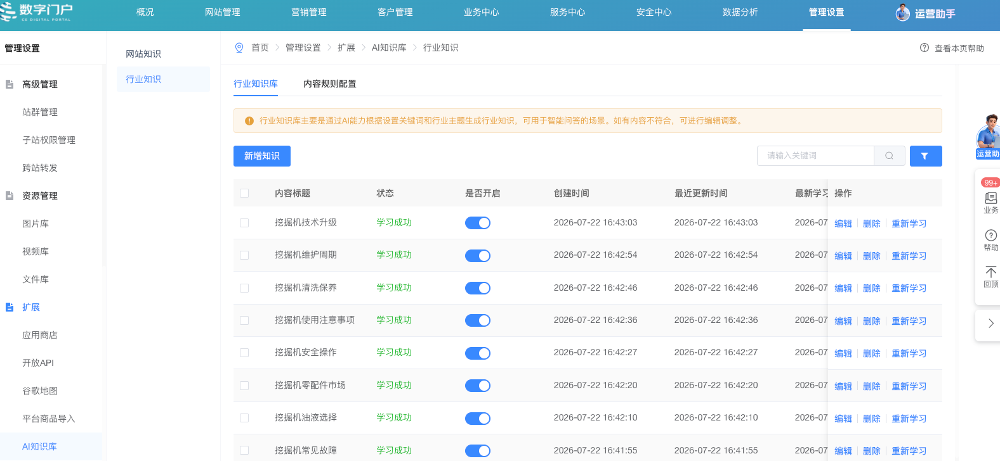

#### 5.5.2 升级为平台维护

平台内部提供行业内容维护能力，负责行业、模块、标准内容、版本、发布和下线。企业后台只能查看和使用平台已发布的行业内容，不能修改平台正文、结构或分类。

行业产品页面所需的通用内容使用《行业产品详情页内容结构标准》，按行业配置到该行业的指定内容模块中。该标准是平台维护的内容资产结构与填写规范，不再由每个企业分别编辑一份。

执行规则：

1. 每个行业明确对应的页面模块和模块标识，例如行业概述、典型痛点、应用场景、方案价值、合规提示等。
2. 《行业产品详情页内容结构标准》中的字段映射到这些指定模块，行业之间复用结构，但内容按行业分别维护。
3. 生成或更新行业产品详情页时，内容智能体读取该行业模块中的现有内容和结构要求，不得把其它行业内容混入。
4. 平台发布行业标准内容后，为使用该行业的企业提供只读引用；进入企业知识检索范围时保留平台来源和版本。
5. 页面内容发布后进入“内容资产”，沿用内容资产的来源、版本、学习和引用能力。
6. 若旧企业行业内容中存在仍有价值的内容，经过人工审核、去重和标准化后迁入平台对应行业的指定模块；企业侧旧副本停止维护，并将有效引用改绑到平台版本。

平台维护的行业内容至少记录：`industryContentId`、行业、模块标识、标准名称、正文、来源、版本、状态和更新时间。同一内容更新时 ID 不变、版本递增，已发布版本可追溯。

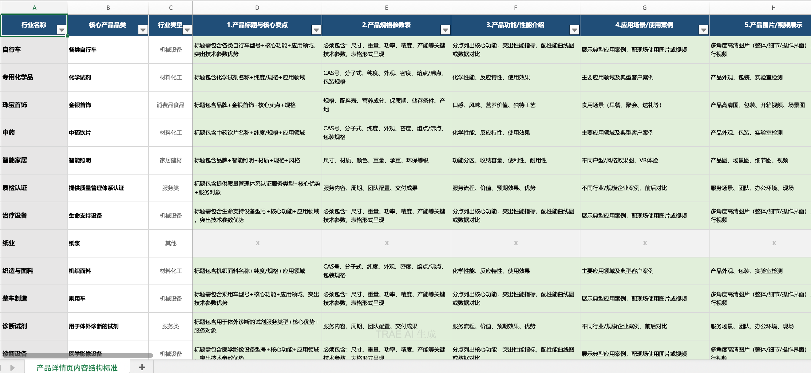

#### 5.5.3 行业知识运营后台复用规则

N14 行业知识运营及其新增、详情页面仅平台账户可见。

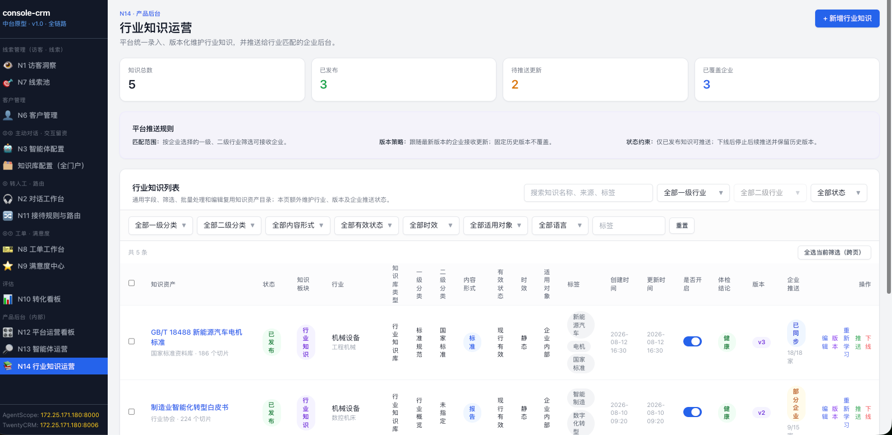

N14 不另建通用知识管理模型，以下能力直接复用知识资产目录的字段、状态和交互规则：

- 通用筛选：关键词、生命周期状态、一级分类、二级分类、内容形式、有效状态、时效、适用对象、语言和标签；
- 通用列表字段：知识名称、状态、知识板块、知识库类型、分类、内容属性、标签、创建/更新时间、启用状态和体检结论；
- 通用批量编辑：复用“批量修改知识目录与元数据”；未勾选的字段不覆盖原值。N14 属于平台内容运营，其发布、推送、版本和下线状态独立于企业知识资产目录的五状态，不复用企业端启用/停用状态机；
- 通用编辑：复用知识资产编辑字段、必填校验、枚举、门户网站、自定义元数据和保存规则；
- 通用详情：复用知识详情、原文、切片、健康度、更新历史和来源展示。

N14 顶部统计为知识总数、已发布、待推送更新、已覆盖企业。筛选项包括关键词、一级行业、二级行业、生命周期状态、一级分类、二级分类、内容形式、有效状态、时效、适用对象、语言、标签。一级/二级行业联动，一级/二级分类联动。

N14 当前页面生命周期只显示草稿、已发布、已下线三种状态：草稿可编辑、发布、删除；已发布可编辑、重新学习、推送、下线及启停检索；已下线可恢复为草稿、删除。平台新版本尚未推送给全部匹配企业时，通过“未推送/部分企业/已同步”的推送状态表达，不另建“待更新”生命周期状态。

列表字段顺序为：多选框、知识资产、状态、知识板块、行业、知识库类型、一级分类、二级分类、内容形式、有效状态、时效、适用对象、标签、创建时间、更新时间、是否开启、体检结论、版本、企业推送、操作。知识板块固定为行业知识，知识库类型固定为行业知识库。

N14 特有字段：

| 字段 | 建议字段 | 规则 |
|---|---|---|
| 一级行业 | `primaryIndustry` | 平台行业体系一级节点，必填 |
| 二级行业 | `secondaryIndustry` | 与一级行业联动；有二级选项时必填 |
| 当前版本 | `currentVersion` | 从 1 递增，代表当前生效的平台版本 |
| 推送状态 | `pushStatus` | 未推送、部分企业、已同步 |
| 匹配企业数 | `matchedTenants` | 根据企业的一级、二级行业匹配 |
| 已推送企业数 | `pushedTenants` | 当前版本已成功推送/采用的企业数 |
| 企业采用方式 | `receiveMode` | 跟随最新、固定历史版本、尚未采用 |

批量修改采用字段勾选后覆盖，至少支持知识目录、一级分类、二级分类、内容形式、有效状态、时效、适用对象、语言和标签；未勾选字段保持原值。其它状态批量操作与 §5.3.3 一致，另增加已发布知识的批量推送。

版本维护规则：

1. 发布新版本必须上传文件并填写版本说明；版本记录展示版本号、状态、说明、文件、发布时间和发布人。
2. 发布后按行业知识板块当前切片、清洗、质量和检索配置重新处理。
3. 新版本只更新“跟随最新”的企业；固定历史版本企业不覆盖。
4. 下线后停止后续推送，但保留企业已采用的历史版本和引用记录。

企业推送规则：

1. 仅已发布知识允许单条或批量推送。
2. 系统按企业配置的一级、二级行业预筛企业。
3. 推送列表展示企业名称、行业、当前版本和采用方式。
4. 跟随最新企业默认勾选；固定历史版本企业默认不勾选且不可勾选；尚未采用企业可人工选择。
5. 推送结果记录成功数、失败数和失败原因，部分失败不能标记为全部成功。

### 5.6 存量迁移与新版配置切换

#### 5.6.1 对象迁移映射

| 旧对象/入口 | 一期迁移目标 | 迁移要求 |
|---|---|---|
| 知识目录 | 新版知识资产目录中的“知识目录” | 保留目录名称、层级、排序和资产归属；生成稳定 `directoryId`，N3 授权改绑新 ID |
| 文档知识 | 新版“文档知识” | 保留文件、标题、正文、来源、状态和可映射元数据；按新版切片规则重新学习 |
| Web 知识 | 新版“网络知识” | 保留来源 URL、同步状态和有效内容；按新版网络抓取及清洗规则重新学习 |
| FAQ | 新版“问答知识” | 主问题迁为主问题，历史相似问法合并到 `alternativeQuestions`，答案迁为富文本；多个问法不得复制成多条答案 |
| 网站内容 | 新版“内容资产” | 按前台站点与导航树定位页面，保留页面 ID、路由、导航路径、站点和正文；无法定位的记录进入人工处理清单 |
| 企业维护的行业内容 | 平台维护的行业指定模块，或废弃 | 先按使用量筛选；保留内容经人工审核、去重后按《行业产品详情页内容结构标准》迁入平台模块，企业引用改绑平台内容 ID 和版本；低价值且无引用内容列入废弃清单 |

迁移必须保留旧记录 ID 与新资产 ID 的映射表，供引用、N3 授权、日志和问题追溯使用。迁移完成前后分别记录数量、失败原因和抽样校验结果；不得因迁移静默删除原内容。

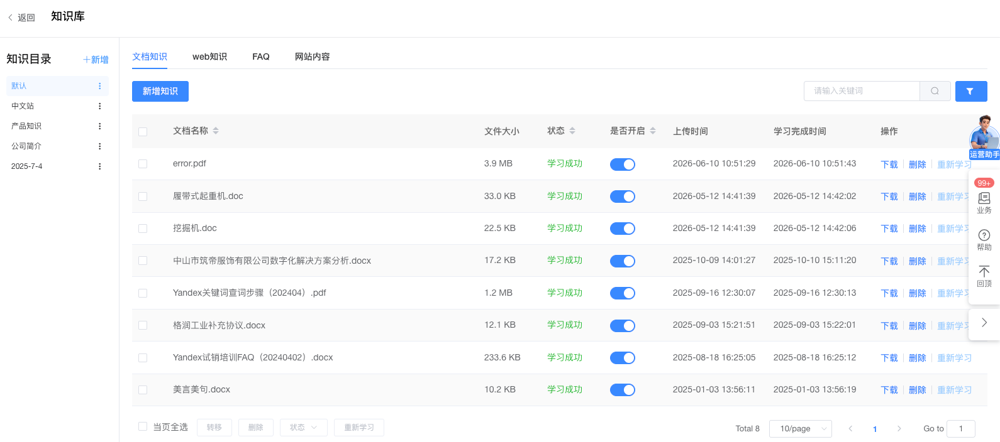


#### 5.6.2 知识库设置切换

知识库设置统一使用新版配置，包括新版知识板块配置、按内容形式的切片解析方式、入库前清洗与质量评估、检索策略和知识库配置。旧设置页面不再继续扩展，也不与新版设置长期双写。

可明确映射的旧配置值迁入新版对应项；无法映射、超出新版枚举或互相冲突的配置使用新版默认值并进入迁移确认清单。切换前需导出旧配置快照，便于核对，但上线后以新版配置为唯一生效来源。

#### 5.6.3 网站学习规则与内容资产列表合并

旧“网站知识的学习规则设置”和“网站知识列表”本质上都在管理企业自己的哪些前台页面进入学习以及如何学习，一期合并到“内容资产”，不再保留两个入口。这里的“网站知识”特指企业前台网站内容，不是来自外部 URL 的旧“Web 知识”；外部 Web 知识仍按 §5.6.1 迁入“网络知识”。

内容资产使用新增的树形结构：

```text
站点
└── 一级导航
    └── 二级导航（可继续多级）
        └── 页面内容资产
```

迁移与交互规则：

1. 旧网站内容按 `siteId + frontendPageId` 定位到树中的页面节点，原已学习页面迁移后保持选中。
2. 树节点支持展开、收起和三态勾选；勾选导航节点可批量选择其下页面。
3. 旧学习规则迁到对应页面节点或其最近的公共父节点；页面节点规则优先于父节点继承规则。
4. 同一页面存在冲突规则时不自动覆盖，进入人工确认清单；确认前继续使用旧线上成功版本。
5. 新增、取消学习、重新学习、查看同步状态和打开页面详情均在内容资产树中完成。
6. 迁移完成后，旧网站知识列表和独立学习规则入口改为只读跳转，验收完成后下线。

## 六、智能体使用知识库一期需求

### 6.1 总体原则

智能体通过一个统一工具使用非结构化知识：

```text
rag_search
```

`rag_search` 不是“搜索全部知识”的通用入口，而是一个受 N3 授权、Skill 规则和系统安全条件共同约束的检索工具。

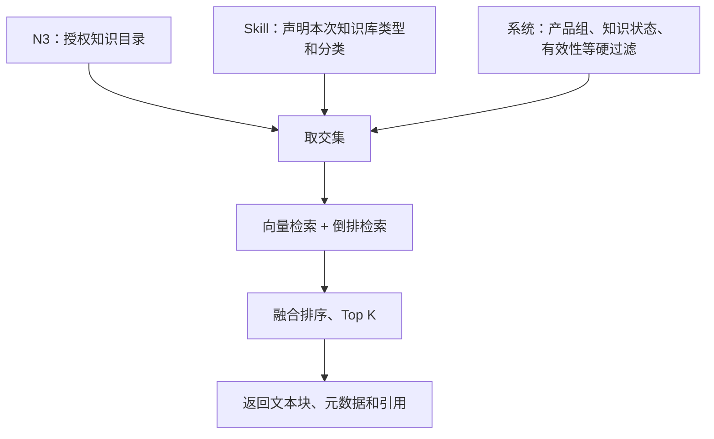

实际检索范围：

```text
N3 已授权知识目录
∩ Skill 本次请求的知识库类型和分类
∩ 当前产品组可见知识
∩ 状态为启用，或拥有上一成功版本的待更新知识
∩ 有效且存在成功学习版本的知识
```

### 6.2 字段职责

| 字段 | 在智能体调用中的职责 |
|---|---|
| 知识目录 | N3 授权和用户整理，决定智能体最多能使用哪些知识 |
| 知识库类型 | 知识来源与权威归属，区分行业、企业公共、企业业务知识 |
| 一级分类 | Skill 的主要调用范围，表达稳定业务知识域 |
| 二级分类 | Skill 的精准调用范围，表达具体知识主题 |
| 标签 | 分类内的关键词召回增强，如产品型号、品牌、专题 |
| `query` | 在上述范围内找到具体问答或文本块 |

知识板块、来源方式、解析器、同步方式不应由 Skill 传入。

### 6.3 N3 知识目录授权

N3“知识库绑定”读取当前产品组的实际知识目录，以目录列表加开关的形式配置智能体权限。

规则：

- 不显示知识板块、来源方式、知识库类型等其它开关。
- “全部内容”是聚合视图，不作为可授权目录。
- 每个实际目录独立开关。
- 开启表示智能体可以在该目录中检索，但不表示每次任务都检索该目录全部内容。
- 关闭后，该目录立即从智能体后续检索范围中移除，不删除目录或知识。
- Skill 传入的分类条件不能扩大 N3 授权。

### 6.4 `rag_search` 参数

一期建议接口：

```json
{
  "query": "用户问题或任务需要寻找的具体信息",
  "purpose": "customer_answer | content_generation",
  "filters": [
    {
      "role": "该组资料在任务中的用途",
      "knowledgeBaseType": "行业知识库 | 企业公共知识库 | 企业业务知识库",
      "primaryCategories": ["一级分类"],
      "secondaryCategories": ["二级分类"],
      "industry": "可选，行业知识检索时使用",
      "contentFormats": ["FAQ", "文章", "数据", "手册"],
      "tags": ["可选关键词标签"],
      "topK": 5
    }
  ],
  "matchMode": "strict | relaxed",
  "documentExpansion": {
    "enabled": false,
    "maxDocuments": 3
  },
  "includeCitations": true
}
```

参数规则：

- `query` 必填。
- `filters` 可包含一组或多组；内容生成通常需要多组，客服问答通常只需要一组。
- `knowledgeBaseType` 应作为主要来源限定。
- 一级、二级分类值来自知识库配置，不在 `rag_search` 代码中按业务场景写死。
- Skill 可以写入分类规则，模型根据当前任务生成具体参数。
- `tags` 只做分类内增强，不代替一、二级分类。
- `strict` 模式不自动扩大分类；未命中直接返回知识缺口。
- `relaxed` 模式可以按 Skill 规定的顺序去掉标签、内容形式、二级分类，但不得去掉知识库类型、N3 目录授权和系统硬过滤。
- `documentExpansion.enabled` 表示是否把命中切片扩展为其所属文档的完整内容，默认关闭。
- `documentExpansion.maxDocuments` 限制本次最多展开多少份文档；一期建议默认 3，服务端上限不超过 5，避免一次调用把大量无关全文放入模型上下文。
- 内容生成 Skill 可以开启完整文档扩展；智能客服 Skill 默认关闭，除非业务规则明确要求阅读完整政策或手册。

### 6.5 系统强制过滤

以下条件由服务端根据上下文自动注入，不允许大模型传入或修改：

- `product_group_id`；
- `agent_id`；
- N3 已授权 `directoryIds`；
- 资产状态必须为启用或待更新，且存在可用的成功学习版本；
- 资产必须启用检索；
- 必须存在成功学习版本；
- 有效状态必须允许正式使用；
- 客户可用的行业范围；
- 访问权限和其它安全条件。

工具必须对 Skill 传入的分类枚举做校验。不存在、已删除或不属于当前知识库类型的分类，应返回可识别错误，不得静默搜索全库。

### 6.6 返回结果

`rag_search` 至少返回：

- 本次查询；
- 实际生效的分类过滤；
- 命中文本块；
- 触发完整文档扩展的切片 ID 和命中位置；
- 资产 ID 和资产标题；
- 开启文档扩展时返回所属资产当前生效版本的完整解析正文；
- 知识库类型；
- 一级、二级分类；
- 来源名称、来源方式和来源角标类型；
- 来源于前台网站或外部网址时，返回可访问的来源 URL；
- 版本或更新时间；
- 相似度/融合分数；
- 无命中原因。

多组过滤应按 `role` 分组返回，防止模型混淆行业背景、企业事实和产品能力。

### 6.7 Skill 编写规则

每个需要知识库的 Skill 必须描述：

1. 什么情况下调用 `rag_search`；
2. 调用哪个知识库类型；
3. 使用哪个一级、二级分类；
4. 该组知识在当前任务中的用途；
5. 哪些事实只能来自指定知识库；
6. 未命中时是否允许放宽，按什么顺序放宽；
7. 是否必须展示引用；
8. 禁止模型自行补全哪些事实。
9. 是否允许命中切片后读取完整文档，以及最多展开多少份文档。

分类写在 Skill 中，不写死在 `rag_search` 工具实现里。工具只负责执行合法过滤、检索和返回结果。

### 6.8 智能体页面的知识来源角标

当智能体回答或生成内容使用了知识库结果时，智能体页面需要展示知识来源角标，让用户知道内容来自哪里。角标是 `rag_search` 引用结果的前端呈现，不新增知识资产字段。

角标数据由现有来源字段生成：

- 来源方式 `connect`；
- 业务来源 `source`；
- 精确来源 `sourceRef`；
- 前台页面路由 `frontendRoute`；
- 前台网站地址或外部网址 `siteUrl`；
- 知识资产标题和 `assetId`。

#### 6.8.1 角标类型

| 知识来源 | 角标示例 | 是否可跳转 | 跳转目标 |
|---|---|---:|---|
| 前台网站页面 | `官网 · 产品详情 ↗` | 是 | 当前产品组对应站点域名 + `frontendRoute` |
| 外部网址 | `外部网站 · 行业协会 ↗` | 是 | `siteUrl` 或校验后的 `sourceRef` URL |
| 上传文件 | `文件 · 产品白皮书` | 否，默认只展示来源 | 智能体页面不直接暴露文件存储地址；内部管理端可进入知识详情 |
| 手动 FAQ | `FAQ · 退款与售后` | 否 | 可展示 FAQ 标题，不跳转外部页面 |
| 平台行业内容 | `行业内容 · 制造业产品详情标准` | 否 | 企业页面只展示平台来源、行业模块和版本；内部后台可进入平台行业内容详情 |
| 内容资产 | `前台页面 · 618 活动页 ↗` | 已发布且有正式路由时可跳转 | 使用来源方式“前台页面”；没有正式路由时只展示不可点击角标，不新增“生成回流”来源方式 |

#### 6.8.2 展示规则

1. 智能客服回答在回答正文下方展示“知识来源”，同一资产命中多个切片时只展示一个角标。
2. 内容生成结果在引用段落旁或文末“参考资料”中展示来源角标；读取完整文档时仍只展示一次文档来源。
3. 网站来源角标带 `↗` 标识并可点击，新窗口打开，不中断当前智能体任务。
4. 跳转 URL 必须由服务端返回或根据已配置站点域名和 `frontendRoute` 生成，前端不得直接信任模型输出的 URL。
5. 外部 URL 只允许 `http`、`https`，并使用 `noopener noreferrer` 打开；无合法 URL 时降级为不可点击角标。
6. 角标名称优先使用网站名称或业务来源名称，过长时截断并通过悬浮提示展示完整标题。
7. 未引用知识、纯模型生成的表达不展示伪造来源角标。
8. 角标点击只负责查看公开来源，不改变知识命中、反馈或对话状态。

建议 `rag_search` 为每条引用返回：

```json
{
  "assetId": "asset_product_kfr35",
  "assetTitle": "KFR-35 空气滤清器图文详情",
  "sourceType": "frontend_page",
  "sourceLabel": "官网 · KFR-35 产品详情",
  "sourceUrl": "https://example.com/products/kfr-35",
  "clickable": true,
  "chunkIds": ["chunk_12", "chunk_15"]
}
```

智能体页面展示：

```text
建议每行驶 1 万公里或半年更换一次空气滤清器。

知识来源：[官网 · KFR-35 产品详情 ↗]
```

## 七、Skill 示例

### 7.1 内容生成 Skill 示例

#### 7.1.1 任务

生成《制造业企业如何通过 AI 客服提升售前转化》的官网文章。

#### 7.1.2 Skill 规则

```md
## 知识检索

生成行业解决方案、营销文章或官网内容前，必须调用 rag_search。

1. 行业背景
   - 知识库类型：行业知识库
   - 一级分类：行业概览、行业数据、行业动态
   - 来源要求：仅使用平台已发布、企业已启用的行业内容
   - 用途：行业趋势、行业痛点、公开数据和指定行业模块内容

2. 企业事实
   - 知识库类型：企业公共知识库
   - 一级分类：企业基础信息
   - 用途：公司介绍、品牌定位、公开资质

3. 产品能力
   - 知识库类型：企业业务知识库
   - 一级分类：产品与资源、业务与服务
   - 二级分类：产品信息、产品手册
   - 用途：产品功能、参数、解决方案

规则：
- 产品功能和参数只能来自企业业务知识库。
- 平台维护的行业知识只能用于行业背景和行业标准模块，不能推导企业产品能力。
- 企业介绍只能引用企业公共知识库中的已发布事实。
- 所有数字、功能承诺和案例结果必须保留引用。
- 未检索到的事实不得编造。
- 内容生成允许在切片命中后读取其所属文档的完整内容，用于理解上下文和章节关系。
- 只展开实际命中文档；同一文档被多个切片命中时只读取一次。
- 完整文档中的事实仍按该文档的知识库类型和用途使用，不因读取全文而改变来源权威性。
```

#### 7.1.3 内容生成 Agent 命中切片后读取完整文档

该能力是内容生成 Agent 的专属取证策略，不属于知识资产目录的用户配置。普通客服问答通常只使用命中的 FAQ 或局部切片；内容生成需要理解完整背景、章节关系和上下文时，可以在命中切片后读取该切片所属文档的全部内容。

内容生成 Agent 的处理规则：

1. 第一阶段仍按 `query`、知识库类型、一二级分类和标签调用 `rag_search` 检索切片。
2. 只有内容生成 Skill 明确开启 `documentExpansion.enabled=true` 时，才根据命中切片的 `assetId` 读取所属文档。
3. 只读取资产当前线上生效的成功学习版本，不读取草稿、已下线或尚未学习成功的版本。
4. 多个命中切片属于同一文档时只读取一次完整文档，并保留全部命中切片及其原文位置。
5. 多个文档同时命中时，按各文档最高切片得分排序，再按 `maxDocuments` 限制读取数量。
6. 读取全文前重新校验 N3 目录授权、产品组、知识状态、有效状态和访问权限；切片命中不能绕过文档权限。
7. `rag_search` 同时返回触发扩展的切片和完整文档，使 Agent 能说明为何选择该文档，并把最终引用定位到实际支撑事实的段落或切片。
8. 完整文档只进入当前内容任务的证据包，不写入 Agent 长期记忆，也不改变原知识的分类、来源和权威归属。
9. 结构化数据不使用全文扩展，继续通过结构化查询或 MCP 获取。

为支持以上流程，知识库底层只需保证每个切片关联 `assetId`、成功学习版本和原文位置，并允许 `rag_search` 在权限校验后读取对应版本的完整解析正文；知识资产目录不提供单独的“读取全文”配置开关。

#### 7.1.4 工具调用

```json
{
  "query": "制造业企业使用AI客服提升售前咨询效率和线索转化的行业背景、企业事实与产品依据",
  "purpose": "content_generation",
  "filters": [
    {
      "role": "industry_background",
      "knowledgeBaseType": "行业知识库",
      "primaryCategories": ["行业概览", "行业数据", "行业动态"],
      "industry": "制造业与工业",
      "contentFormats": ["文章", "数据", "案例"],
      "topK": 5
    },
    {
      "role": "company_facts",
      "knowledgeBaseType": "企业公共知识库",
      "primaryCategories": ["企业基础信息"],
      "topK": 3
    },
    {
      "role": "product_evidence",
      "knowledgeBaseType": "企业业务知识库",
      "primaryCategories": ["产品与资源", "业务与服务"],
      "secondaryCategories": ["产品信息", "产品手册"],
      "tags": ["AI客服", "智能体", "线索转化"],
      "topK": 6
    }
  ],
  "matchMode": "strict",
  "documentExpansion": {
    "enabled": true,
    "maxDocuments": 3
  },
  "includeCitations": true
}
```

#### 7.1.5 内容使用约束

文章结构建议：

- 行业问题：只使用 `industry_background`；
- 企业介绍：只使用 `company_facts`；
- 产品方案：只使用 `product_evidence`；
- 各组先根据命中切片确定相关文档，再按文档最高命中分数统一排序；本次调用合计最多读取 3 份命中文档的完整内容；
- 使用完整文档补充上下文，但引用仍定位到实际支撑事实的原文段落或切片；
- 没有产品依据的能力不写入文章；
- 文末或对应段落保留来源；网站来源以可点击角标展示。

### 7.2 智能客服 Skill 示例

#### 7.2.1 任务

回答用户关于退款条件、退款材料和退款到账时间的问题。

#### 7.2.2 知识归类

相关 FAQ 放入：

```text
知识目录：售后知识
知识库类型：企业公共知识库
一级分类：用户服务
二级分类：退款与售后
内容形式：FAQ
标签：退款、到账时间、退款材料
```

同一标准答案可以配置多个问题表达，例如：

- 退款一般多久到账？
- 为什么退款还没有收到？
- 退款成功后钱什么时候回来？

#### 7.2.3 Skill 规则

```md
## 退款问答

当用户咨询退款条件、退款材料、退款进度或到账时间时：

1. 必须调用 rag_search。
2. knowledgeBaseType 使用“企业公共知识库”。
3. primaryCategories 使用“用户服务”。
4. secondaryCategories 使用“退款与售后”。
5. contentFormats 使用“FAQ”。
6. 使用 strict 模式，不允许扩大到其它一级分类。
7. 只能根据命中的标准答案回答，不得根据常识推测退款期限。
8. 未命中时说明暂未查到明确规则，并进入覆盖盲区，不编造答案。
```

#### 7.2.4 工具调用

```json
{
  "query": "退款审核通过后多久能到账",
  "purpose": "customer_answer",
  "filters": [
    {
      "role": "refund_policy",
      "knowledgeBaseType": "企业公共知识库",
      "primaryCategories": ["用户服务"],
      "secondaryCategories": ["退款与售后"],
      "contentFormats": ["FAQ"],
      "tags": ["到账时间"],
      "topK": 3
    }
  ],
  "matchMode": "strict",
  "includeCitations": true
}
```

如果标签没有命中，但分类中存在相关 FAQ，Skill 可允许第二次调用时去掉标签；不得去掉“企业公共知识库 / 用户服务 / 退款与售后”这条分类路径。

## 八、智能客服 Pro 一期改动模块

智能客服 Pro 本期不建设另一套知识库，只引用新版知识库中已经发布、有效且被 N3 授权给当前智能体的知识。知识库负责内容维护和授权，智能客服 Pro 负责按 Skill 检索、组织回答、展示来源以及回流未命中问题。

### 8.1 智能体知识库绑定

智能客服 Pro 的智能体配置中增加“知识库”模块：

- 展示当前产品组下可授权的知识目录，每个目录提供独立开关；
- 已开启目录表示该智能体最多可以使用的知识范围，关闭后立即禁止新会话检索该目录；
- “全部内容”是聚合视图，不作为可授权选项；
- 页面展示已授权目录数量和知识库启用状态；
- 页面不再让用户逐项选择知识库类型、一级分类、二级分类和标签，这些检索条件由客服 Skill 根据问题场景决定；
- 用户没有授权任何目录时，明确提示“未配置可用知识”，不允许智能体默认搜索全部知识。

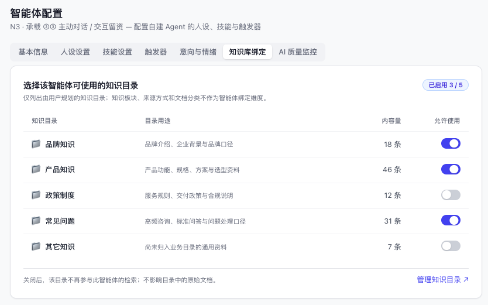

### 8.2 智能客服引用知识库流程

```text
用户提问
  → 智能客服识别意图并匹配 Skill
  → Skill 生成 query、知识库类型和一级/二级分类
  → rag_search 在 N3 已授权知识目录内检索
  → 校验知识状态、有效状态和成功学习版本
  → 使用命中的 FAQ 标准答案或知识切片组织回答
  → 在回答中展示知识来源角标
  → 无命中时进入“用户问了但答不上（覆盖盲区）”
```

智能客服默认只使用命中的 FAQ 或局部切片，不启用内容生成 Agent 的完整文档扩展。只有某个客服 Skill 明确需要跨章节理解，且经过单独评审后，才允许开启全文扩展。

### 8.3 客服 Skill 如何指定知识范围

客服 Skill 必须按业务场景写清楚以下规则：

| Skill 规则 | 产品含义 |
|---|---|
| 何时调用 `rag_search` | 哪类用户问题必须查知识库，不能仅靠模型常识回答 |
| 知识库类型 | 明确答案的来源与权威归属 |
| 一级分类 | 限定该 Skill 的主要业务范围 |
| 二级分类 | 需要精准到具体业务主题时使用 |
| 内容形式 | FAQ 场景优先限定“问答知识”，其它场景可使用文档或内容资产 |
| 标签 | 只做分类内召回增强，未命中时可以按 Skill 规则去掉 |
| `query` | 根据用户原问题改写，保留产品、业务动作和关键限定条件 |
| 无命中处理 | 明确不能编造，并决定提示语和覆盖盲区记录方式 |

例如退款问题固定检索“企业公共知识库 / 用户服务 / 退款与售后 / FAQ”。标签“到账时间”未命中时，可以去掉标签再次检索，但不能去掉一级、二级分类扩大到其它业务范围。

### 8.4 FAQ 引用规则

当命中问答知识时：

1. 用户任一相似问法命中后，统一使用该知识资产的标准答案。
2. 智能客服使用经过安全清理的富文本答案，保留段落、列表和链接等必要结构，不向用户显示 HTML 标签。
3. 回答可以根据对话语境做不改变事实的语气调整，但退款期限、金额、条件、材料等关键事实必须与标准答案一致。
4. 同时命中多条相互冲突的 FAQ 时，不自行选择对用户更有利的答案；提示需要确认，并将冲突记录到知识质量问题。
5. 没有命中有效答案时，不使用模型常识补写企业政策。

### 8.5 回答中的知识来源展示

每条使用知识生成的客服回答都要展示来源角标：

| 来源 | 客服页面展示 | 点击行为 |
|---|---|---|
| 企业官网或前台页面 | `官网 · 产品详情 ↗` | 新窗口打开对应网站页面 |
| 外部网页 | `外部网站 · 来源名称 ↗` | 新窗口打开合法来源 URL |
| 上传文档 | `文档知识 · 文件名称` | 打开当前用户有权限查看的知识详情 |
| 问答知识 | `问答知识 · 问题标题` | 打开对应问答知识详情 |
| 平台行业内容 | `行业内容 · 行业/模块/版本` | 企业侧只读查看来源信息，不允许编辑平台内容 |

展示规则：

- 来源角标显示在回答下方；一条回答引用多项知识时并列展示；
- 同一知识资产命中多个切片时只显示一个角标；
- 网站来源可跳转，链接必须来自知识资产已有来源，不允许模型自行生成 URL；
- 无合法链接时降级为不可点击角标；
- 点击来源只打开查看页面，不改变当前会话状态；
- 没有使用知识库内容的回答不得伪造来源角标。

### 8.6 未命中与覆盖盲区

当 `rag_search` 无有效命中时，智能客服 Pro：

1. 向用户说明暂未查到明确答案，根据现有人工服务能力提供转人工或留下问题的入口。
2. 不展示空白或伪造的来源角标。
3. 将问题记录到“用户问了但答不上（覆盖盲区）”，保留用户原问题、识别意图、使用的 Skill、检索分类、发生时间和未命中原因。
4. 相似问题按主题聚合，避免同一缺口形成大量重复待办。
5. 运营补录为 FAQ 并启用、学习成功后，新会话即可检索；历史会话不自动改写。

### 8.7 智能客服 Pro 页面改动汇总

| 改动模块 | 一期改动 |
|---|---|
| 智能体配置—知识库 | 增加知识目录开关、已授权数量和未配置提示 |
| 客服对话回答 | 在使用知识的回答下展示来源角标，网站来源支持跳转 |
| 来源详情 | 展示知识标题、来源类型、分类、有效版本；按权限打开原页面或知识详情 |
| 问答知识呈现 | 安全渲染富文本标准答案，保留段落、列表和合法链接 |
| 未命中处理 | 提示无明确答案，并自动进入覆盖盲区 |
| 运营补录 | 从覆盖盲区进入问答知识新增，自动带入用户问题作为主问题或相似问法 |

## 九、验收标准

### 9.1 知识库验收

1. 概览展示知识总数、已发布上线、平均健康度、待处理 4 个指标；待处理只统计覆盖盲区主题，不出现其它一期外待办。
2. 覆盖盲区支持补录 FAQ 或忽略，处理后统计同步更新。
3. 同一板块同一内容形式只能有一条切片规则，最多 5 条专属规则，未命中时正确回落通用规则。
4. 去重能返回疑似重复资产和依据，不自动删除或覆盖内容。
5. 隐私能力至少形成正式调研结论；若实现，姓名、手机号、邮箱、API Key 的测试样本能在索引前被正确处理。
6. 向量和倒排检索可独立设置权重并参与融合排序。
7. 新产品组默认出现“全部内容”和“品牌知识”；“全部内容”不可编辑。
8. 选择知识库类型后，一级分类选项正确联动；切换类型会清理不兼容分类。
9. 行业筛选只出现用户已选择或平台已分配的行业。
10. FAQ 支持一个答案对应多个问题，答案支持富文本；任一问法均能召回同一标准答案。
11. 文档级、板块级、切片级元数据职责明确，切片继承文档级分类，用户可编辑自动生成的切片关键词、问题和标签。
12. 系统预置枚举不可删除；敏感词库不进入一期。
13. 能统计现有企业行业内容的客户数、产品组数、调用、命中和引用情况，并输出保留/废弃清单。
14. 保留的企业行业内容能按《行业产品详情页内容结构标准》迁到平台对应行业的指定模块；企业侧只能使用平台发布版本，不能修改正文和结构。
15. 知识目录、文档知识、Web 知识、FAQ、网站内容均能按迁移映射进入新版对象，并保留旧 ID/新 ID 映射和失败清单。
16. 知识库设置只以新版配置生效；旧配置无法映射或发生冲突时进入确认清单，不静默覆盖。
17. 网站学习规则和网站知识列表合并到内容资产树；原已学习页面保持选中，父子规则继承与冲突处理符合 §5.6.3。
18. 命中切片可以回溯所属知识资产和当前生效学习版本；开启完整文档扩展后能返回该文档完整解析正文。
19. 后台用户的菜单不展示知识板块和 N14；直接访问知识板块列表、板块详情、N14 及平台行业知识新增/详情接口均返回无权限且不泄露数据。
20. 平台账户可以查看和维护知识板块全部配置；后台用户即使构造请求也不能读取或更新切片、清洗、检索、自动元数据和 MCP 动作配置。
21. 平台账户与后台用户均能进入知识资产目录；后台用户只能看到当前企业和产品组资产，平台账户只能看到其角色授权范围内资产。
22. 后台用户能看到知识库配置中的“平台维护的字段”，但所有平台枚举和行业知识库分类编辑接口为只读；平台账户可编辑。
23. 行业知识库一级、二级分类只在“平台维护的字段”区域出现；一级分类切换、二级分类联动、新增和删除交互与企业分类一致，企业维护区域不重复展示。
24. 知识资产目录筛选、列表、编辑、新增和详情字段与 §5.3.6 字段定义一致；同一字段在不同页面不存在枚举、必填或默认值冲突。
25. N14 能完成行业筛选、新增文件、草稿发布、版本文件上传、重新学习、企业预筛和推送；固定历史版本企业不可被覆盖。
26. 知识资产目录只使用草稿、启用、停用、待更新、学习中五种状态，列表和编辑页均无独立“是否开启”字段，也不出现“开启检索/关闭检索”的重复操作。
27. 草稿启用和重新学习后进入学习中；学习成功自动转为启用。学习中只允许查看详情、任务进度和日志，不允许重复启用、停用、编辑或删除。
28. 启用知识可重新学习或停用；停用知识可编辑、启用或删除；待更新知识可编辑、重新学习或停用。列表、详情和批量操作的可用按钮完全一致。

### 9.2 智能体验收

1. N3 从实际知识目录读取列表并独立开关，不把“全部内容”作为授权项。
2. 关闭目录后，智能体无法通过任何 Skill 参数检索该目录内容。
3. `rag_search` 支持知识库类型、一级分类、二级分类、内容形式、行业和标签过滤。
4. 非法或不兼容分类返回明确错误，不自动退化成全库搜索。
5. `strict` 模式无命中时返回知识缺口；`relaxed` 模式只按 Skill 允许的顺序放宽软条件。
6. 服务端强制过滤当前产品组、N3 授权、知识状态、有效性和成功学习版本；仅启用和拥有上一成功版本的待更新知识允许召回。
7. 多组检索结果按用途分组，包含资产、来源、分类和版本信息。
8. 内容生成示例中，行业背景、企业事实、产品能力不会混用来源。
9. 智能客服退款示例只检索“企业公共知识库 / 用户服务 / 退款与售后”，未命中时不编造答案并生成覆盖盲区。
10. 内容生成开启文档扩展后，先命中切片再按 `assetId` 去重读取完整文档；同一文档不会重复返回，未授权文档不会被扩展。
11. 智能体使用知识作答时展示来源角标；同一资产只展示一次。前台网站和外部网址来源可以点击跳转，非法或缺失 URL 自动降级为不可点击角标。
12. 智能客服 Pro 未授权任何知识目录时显示明确提示，不能默认检索全部知识。
13. 智能客服 Pro 命中 FAQ 后安全展示富文本标准答案，保留段落、列表和合法链接，不显示 HTML 标签。
14. 客服回答下方可以查看实际引用来源；网站来源能打开正确页面，文档和 FAQ 只能打开当前用户有权限查看的详情。
15. 客服问题无有效命中时不显示来源、不编造答案，并能进入覆盖盲区完成后续补录。

## 十、明确不在一期范围

- 完整知识健康体检、六类体检结论、批量修复和修复流水。
- 概览中的草稿、低健康度、内容过期、同步失败等综合待办。
- 敏感词库及敏感词扣分策略。
- 去隐私的完整产品化配置；一期实现取决于调研结果。
- 向后台用户开放底层切片、Embedding、Rerank、Top K 等平台技术参数。
- 允许企业创建或编辑平台行业标准内容。
- 一期完成全部行业内容标准化；一期按使用量优先迁移有效行业和模块。
- 新增 Skill 专用知识字段或另一套 `skill:*` 分类体系。
- 让大模型自行指定产品组、目录授权、生命周期状态或权限条件。
- 根据行业通用知识推断企业产品功能、价格或服务承诺。

## 十一、关键设计决策

| 设计决策 | 为什么这样做 | 带来的价值 |
|---|---|---|
| 一期待处理只保留覆盖盲区 | 直接闭环用户问了但答不上的核心问题，避免一期做成复杂治理平台 | 范围清晰，价值可直接验证 |
| 切片规则按内容形式配置 | 政策、FAQ、手册等结构差异大 | 提升切片质量且复用现有内容形式枚举 |
| 技术参数仅平台使用 | 后台用户无法判断参数影响，误调风险高 | 研发与平台运营可按技术条件优化，后台用户体验更简单 |
| 先做去重，隐私先调研 | 去重实现确定、收益直接；隐私识别误判和安全风险更高 | 保证一期主链路，同时为二期形成可靠方案 |
| 分类直接服务 Skill | 知识分类的目的不仅是展示，也是让智能体理解知识域 | 不增加字段，不形成两套治理体系 |
| 目录负责授权、分类负责调用 | 授权与任务语义是两种不同问题 | 用户操作简单，Skill 调用精准 |
| `rag_search` 不写死业务分类 | 不同 Skill、客户和行业需要不同范围 | 工具保持通用，业务规则可通过 Skill 演进 |
| 内容生成支持从切片扩展到完整文档 | 单个切片适合定位相关资料，但不足以支撑长内容对完整上下文和章节关系的理解 | 兼顾检索精准度与内容生成完整性 |
| 企业行业内容升级为平台维护 | 企业各自维护会重复建设且标准不一致；先以使用量筛选，再按统一结构迁移 | 平台统一质量、模块和版本，企业只使用不重复维护 |
| 网站学习入口合并到内容资产树 | 学习规则和知识列表管理的是同一批前台页面 | 用一棵站点导航树完成选择、规则、状态和详情管理 |
| 存量对象按新版模型迁移 | 旧知识类型和设置与新版入口不一致 | 避免两套入口长期并行，同时保留映射和审计能力 |
