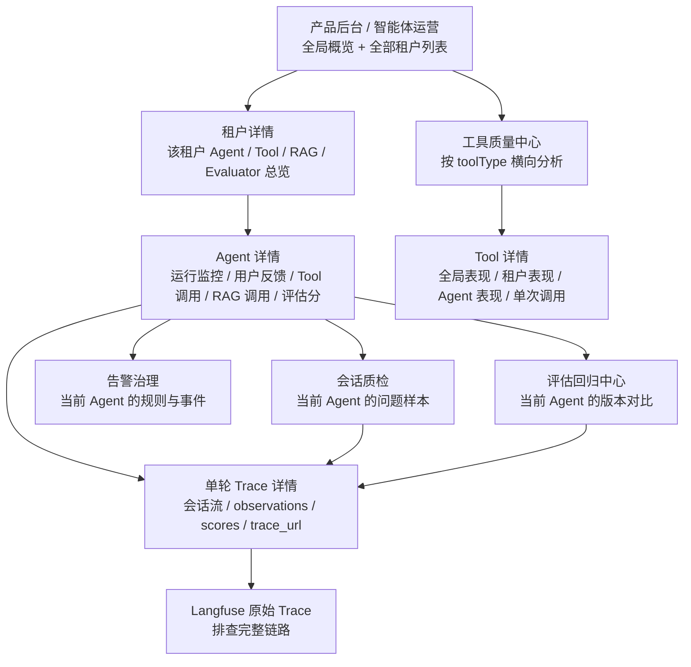
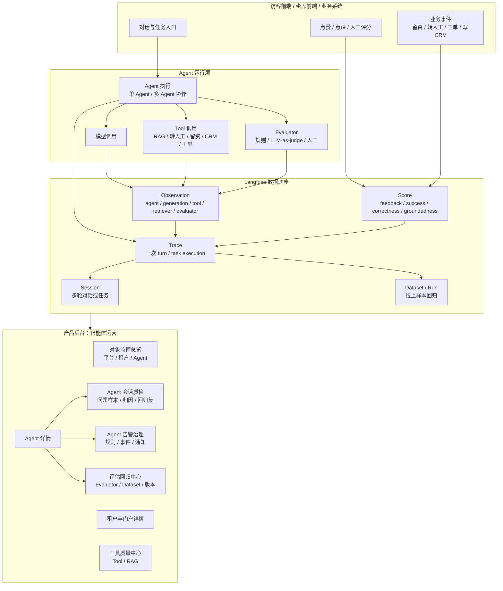
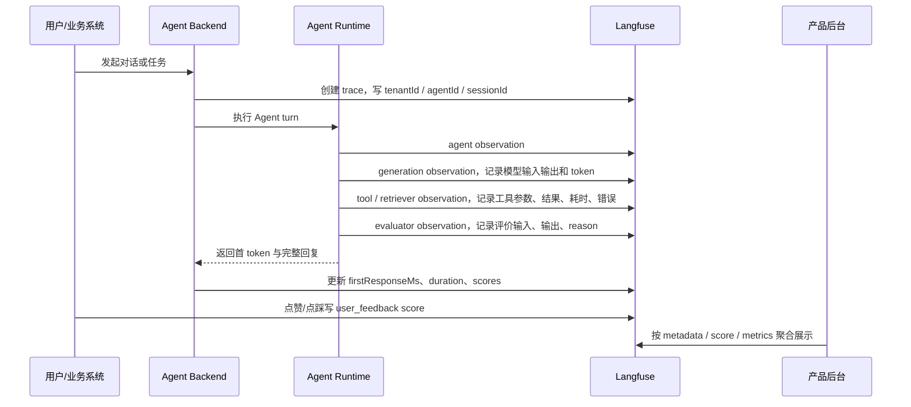
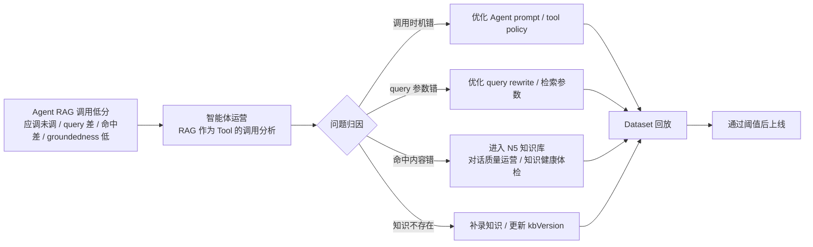
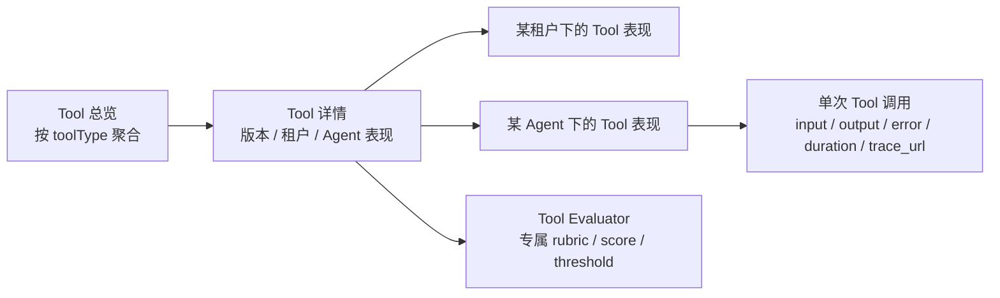
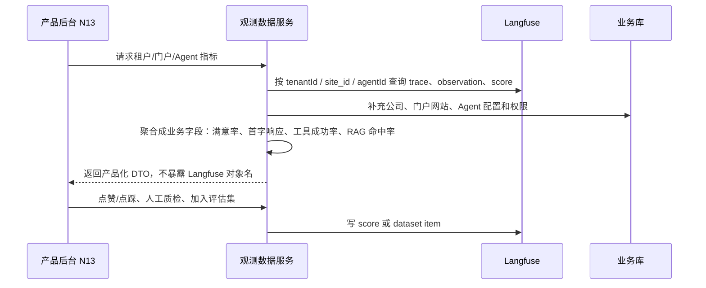
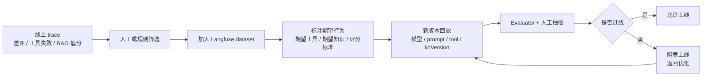

# Langfuse 智能体与知识库监控评估产品方案

> 版本：v1.2
> 适用范围：全产品 Agent、Tool、RAG 知识库调用、Evaluator、线上监控与离线回归评估
> 第一期开口：产品后台的智能体运营原型，先覆盖“智能客服 Pro”作为示例 Agent，但方案本身面向平台所有 Agent
> 参考风格：`portal-ai-saas-落地路线图.md` 的产品主文档结构 + `功能清单与技术选型.md` 的功能清单 / 技术选型口径

本文回答四件事：

1. **为什么要做**：Agent 与知识库运行已经进入黑盒区，必须从“结果可见”升级到“过程可解释、质量可评估、版本可回归”。
2. **做成什么样**：产品后台先按对象看全局、租户、Agent、Tool，进入具体 Agent 后再查看会话质检、评估回归和告警治理子项。
3. **有哪些功能**：对象监控、工具质量、RAG 调用分析、会话质检、评估回归和告警治理。
4. **如何真实落到 Langfuse**：每个业务指标都明确对应 `session / trace / observation / score / metadata / dataset / metrics` 的哪一类数据。

---

## 1. 产品定位与要解决的问题

平台会逐步出现多种 Agent：智能客服、线索分析、知识问答、工单处理、运营推荐、坐席辅助、内容生成、数据分析等。每个 Agent 都可能调用模型、工具、知识库、子 Agent 和 evaluator。只看最终回复，已经无法支撑产品运营和研发排障。

这套能力的定位不是“给 Langfuse 套一个页面”，而是：

> **全产品 Agent 与知识库质量数据底座**：用 Langfuse 采集过程数据，用产品后台把这些数据组织成平台运营、租户运营、Agent 调优、工具质量、知识库调用质量和版本回归评估的可执行工作台。

### 1.1 当前痛点

| 痛点 | 具体表现 | 不解决的后果 |
|---|---|---|
| Agent 运行黑盒 | 只知道用户问了什么、AI 回了什么，不知道中间调了哪些工具 | 错误难复盘，研发只能猜 |
| 工具调用不可解释 | 多 Agent 复用同一工具，但不知道是谁调错、哪里慢、哪里失败 | 一个工具问题会扩散到多个业务 Agent |
| RAG 质量不可评估 | 知识库命中、切片、query、返回结果、最终回答没有串起来 | 知识库看似有内容，但 Agent 仍可能答错 |
| 用户反馈无法闭环 | 点赞/点踩只停留在前端或业务库，没有进入评估数据 | 差评样本无法沉淀成回归集 |
| 版本上线无门禁 | prompt、模型、工具、知识库更新后，缺少回放对比 | 修一个问题可能引入新的质量下降 |
| 产品后台缺少全局视角 | 每个租户、Agent、工具分散查看 | 平台无法判断优先优化哪里 |

### 1.2 关键设计决策与价值

| 设计决策 | 为什么这样做 | 带来的价值 |
|---|---|---|
| Langfuse 做底层数据底座，产品后台做业务化展示 | Langfuse 擅长 trace、score、dataset，但业务角色需要按租户、Agent、Tool 看问题 | 既保留原始链路，又让运营能直接行动 |
| 产品后台先做全局，再下钻租户和 Agent | 平台需要管理所有租户，不是只看单个智能客服 | 能快速定位“哪个租户、哪个 Agent、哪个工具”出问题 |
| Tool 作为平台横向对象 | 同一个工具会被多个 Agent 调用，不能只藏在某个 Agent 详情里 | 支持跨 Agent 发现工具质量问题 |
| RAG 也是 Tool | 对 Agent 来说，知识库检索本质是一次工具调用 | 可以统一分析调用时机、参数、结果、耗时和质量 |
| Evaluator 可选启用 | 评估指标太多会淹没重点，不同 Agent 需要不同 evaluator | 第一版只启用最能解释问题的分数 |
| Dataset 从线上 trace 沉淀 | 真实问题比手写样本更有代表性 | 差评、工具失败、RAG 低分都能变成回归样本 |

### 1.3 角色与视角

| 角色 | 关心什么 | 使用入口 |
|---|---|---|
| 平台产品 / 运营 | 全部租户、全部 Agent、全部 Tool 的质量趋势 | 产品后台 / 智能体运营 |
| 算法 / 研发 | 某次 trace 为什么慢、为什么错、工具参数是否正确 | Agent 详情 / Trace 链接 / Langfuse 原始链路 |
| 知识运营 | RAG 是否该调、query 是否正确、命中了哪个文档切片 | Agent RAG 调用面板 + N5 知识库健康 |
| 工具 Owner | 某类工具被哪些 Agent 调用，是否成功、是否调对 | 工具质量中心 |
| 租户运营 | 本租户的 Agent 是否稳定、用户是否满意 | 租户详情页，后续可开放租户侧子集 |
| 人工质检 | 哪些差评、低分、风险 trace 需要复核 | 风险队列 / 会话详情 / 人工评分 |

### 1.4 第一期开口

第一期不做“所有指标都上墙”。先围绕智能客服 Pro 验证一套通用路径：

1. 产品后台可以看全部租户的 Agent 运行概览和租户列表。
2. 点击租户后，可以看该租户下的多个 Agent、Tool、RAG、Evaluator 总览。
3. 点击某个 Agent 后，可以看对话次数、平均轮次、平均耗时、首字响应、点赞/点踩、工具调用、RAG 调用、评价分。
4. 点击某个 Tool 后，可以看这个工具在全平台、某租户、某 Agent 下的调用质量。
5. 每个业务指标都能追到 Langfuse trace 或 score。

### 1.5 当前落地基线

当前已有一个局域网 Langfuse 项目和本地智能体服务，可作为第一期验证环境：

| 对象 | 当前信息 | 用途 |
|---|---|---|
| Langfuse 项目 | `http://172.25.171.180:3001/project/cmqt6lurb0006pf08lzsznwyx` | 查看原始 trace、score、dataset、evaluator |
| 本地 Agent 服务 | `http://localhost:8002/chat` | 第一期开口的智能客服 Pro 对话入口 |
| 后端路径 | `/Users/simon/Documents/project/console-crm/agent-backend` | Agent trace、Tool/RAG observation、score 接入位置 |
| 产品原型 | `/Users/simon/Documents/project/console-crm/prototype` | 产品后台智能体运营页面原型 |

当前后端已具备主 Agent 对话、分析 Agent 异步分析、RAG 检索、转人工、留资等能力。本文不重新定义这些业务能力，而是定义它们如何被监控、解释、评估和回归。

**现状与目标边界**：当前本地 Agent 已有 session、基础 trace、工具调用、RAG 结果、部分规则分数和人工质检回写；租户/门户/Agent 维度、generation TTFT、标准 retriever/evaluator observation、平台聚合接口仍是第一阶段待接入项。后文的 Langfuse 规范是目标合同，不能理解为当前后端已经全部落数。

---

## 2. 用户背景故事与产品路径

### 2.1 用户背景故事

**故事 A：平台运营发现某租户质量异常**

平台运营进入 `产品后台 / 智能体运营`，看到今天整体满意率下降。租户列表中 A 公司“差评 trace 数”和“工具失败率”同时升高。运营点击 A 公司进入租户详情，发现主要问题集中在“智能客服 Pro”的 `rag_search` 和 `request_handoff` 两类工具。继续下钻后发现：价格咨询类问题 RAG 命中率低，且高意向用户没有及时转人工。运营把这些 trace 加入 dataset，并把知识缺口同步给 N5 知识库运营。

**故事 B：研发排查单 Agent 首字响应慢**

研发进入某 Agent 详情页，看到 P95 首字响应时间变长。Trace 明细显示模型 generation 耗时正常，但 `rag_search` tool 的耗时明显上升。研发进入工具质量中心，发现同一 `kbVersion` 下多个 Agent 的 RAG tool 都慢，说明是知识库检索服务或索引版本问题，而不是单个 Agent prompt 问题。

**故事 C：工具 Owner 优化跨 Agent 工具**

`lead_capture_form` 被智能客服、活动助手、坐席辅助等多个 Agent 调用。工具 Owner 在工具质量中心看到某版本工具调用成功率正常，但 `tool_correctness` 低，说明工具本身没报错，问题是 Agent 触发时机不对。于是优化不同 Agent 的调用策略，而不是改工具服务。

**故事 D：知识运营从 Agent 全流程看 RAG**

知识运营不只看 N5 知识库的文档健康，也看智能体运营里的 RAG 调用。某批 trace 显示：Agent 对价格问题调用了 RAG，但 query 太泛，命中了产品介绍文档，没有命中价格政策切片。这个问题属于 Agent 传参和检索策略问题；如果 N5 中发现“没有任何价格政策文档”，才进入知识补录问题。

**故事 E：产品经理做版本上线门禁**

模型、prompt 或知识库版本更新前，产品经理从线上差评、工具失败、RAG 低分 trace 中抽取样本进入 dataset，跑新版本回放。若 `groundedness`、`tool_correctness` 或用户核心任务完成分低于阈值，则不建议上线。

### 2.2 产品路径

### 2.3 Agent 详情内的运营子项

会话质检和告警治理不是产品后台的一级运营模块，也不是跨 Agent 的平台能力。它们属于某个 Agent 的运行治理子项，必须继承当前 Agent 的租户、门户网站和 Agent 范围。

| 层级 | 解决的问题 | 主要内容 | 典型入口 |
|---|---|---|---|
| 平台 / 租户对象层 | “哪个租户、门户、Agent 运行得怎么样” | 平台、租户、门户网站、Agent、Tool、RAG | 全局概览 → 租户详情 → Agent 详情 |
| Agent 运行层 | “这个 Agent 调用了什么、质量如何” | 运行健康、用户反馈、Tool、RAG、业务结果、Evaluator | Agent 详情 |
| Agent 治理子项 | “这个 Agent 的问题怎么处理、异常怎么通知” | 会话质检、告警治理、当前 Agent 的评估回归 | Agent 详情 → 对应子项 |

**会话质检**的作用是处理当前 Agent 已经发生的具体问题。它把该 Agent 的点踩、低分 evaluator、工具失败、RAG 无命中、超时等样本集中到一个可筛选、可标注、可归因、可加入 Dataset 的工作台。它的最小工作单元是“当前 Agent 的问题会话 / 问题 turn”。

**告警治理**的作用是处理当前 Agent 问题的持续发生。它定义“什么指标达到什么条件时要通知谁、如何升级、是否已处理”，面向该 Agent 的错误率、响应时间、工具失败率、RAG 应调未调率、满意率和评估分等指标。它的最小工作单元是“当前 Agent 的规则 + 告警事件”；规则可以进一步限定到该 Agent 下的 Tool。

两者关系是：Agent 详情负责展示核心运行指标，告警治理负责发现该 Agent 的持续异常并派发，会话质检负责查看该 Agent 的样本和归因，评估回归负责验证该 Agent 的修复是否有效。它们共享当前 Agent 的筛选范围，但不改变 Agent 核心指标的计算口径。

### 2.4 可见范围

| 层级 | 可见对象 | 不可见对象 | 说明 |
|---|---|---|---|
| 产品后台全局 | 全部租户、全部 Agent、全部 Tool 的运行摘要 | 无 | 平台内部使用；不直接进入某个 Agent 的质检或告警 |
| 租户详情 | 单租户的 Agent、Tool、RAG、Evaluator、风险摘要 | 其他租户数据 | 先选择具体 Agent，再进入该 Agent 的质检或告警 |
| Agent 详情及子项 | 当前租户、门户网站、Agent 的运行数据、质检样本、告警规则和事件 | 其他 Agent、其他租户数据 | 会话质检和告警治理都必须继承 Agent 范围 |
| 租户客户侧 | 本租户 Agent 质量、知识库调用质量、满意度、少量评估结果 | 跨租户排行、全局工具质量、其他租户 trace | 如开放，需要做字段脱敏与权限隔离 |
| Langfuse 原始链路 | trace、observations、scores、dataset runs | 由 Langfuse 项目权限控制 | 面向研发、算法、质检高级用户 |

---

## 3. 整体架构

### 3.1 产品与数据架构

### 3.2 核心对象模型

| 产品对象 | 产品含义 | Langfuse 对齐 | 必填标识 |
|---|---|---|---|
| Tenant | 租户/客户，用于权限隔离和聚合 | trace metadata | `tenantId`、`tenantName` |
| Agent | 一个可运营的智能体实例 | trace metadata + observation type `agent` | `agentId`、`agentType`、`agentVersion` |
| Session | 一段多轮对话或长任务 | Langfuse session | `sessionId` |
| Trace | 一次 Agent turn 或 task execution | Langfuse trace | `trace_id`、`name`、`user_id` |
| Generation | 一次模型调用 | observation type `generation` | `model`、`input`、`output`、`usageDetails` |
| Tool | Agent 调用的外部能力或内部能力 | observation type `tool` | `toolType`、`toolName`、`toolVersion` |
| RAG | 一类特殊 Tool，面向知识库检索 | observation type `retriever` 或 `tool` + `toolType=rag_search` | `query`、`kbVersion`、`docId`、`chunkId` |
| Evaluator | 规则、LLM-as-judge、人工质检 | observation type `evaluator` + score | `evaluator_name`、`score_name` |
| Score | 质量判断和反馈 | Langfuse score | `name`、`value`、`dataType`、`comment` |
| Dataset | 回归样本集合 | Langfuse dataset / dataset run | `dataset_name`、`item_id`、`run_name` |

### 3.3 线上数据流程

### 3.4 知识库优化流程

---

## 4. 功能清单

### 4.1 优先级与阶段定义

- **P0**：第一期必须具备，否则无法完成“全局看得到、租户可下钻、Agent 可排查、Tool/RAG 可解释”的主干。
- **P1**：第二阶段增强，支持 evaluator 管理、dataset 回归、告警和人工质检闭环。
- **P2**：后续增强，支持跨版本实验、自动归因、租户客户侧开放。

### 4.2 页面与功能清单

| 模块 | 功能 | 优先级 | 阶段 | 页面 | Langfuse 数据来源 | 价值 |
|---|---|---|---|---|---|---|
| 全局运营 | 全平台概览：租户数、Agent 数、trace 数、满意率、错误率、P95 响应 | P0 | 第一期 | 产品后台 / 智能体运营 | trace、score、metrics | 先判断平台整体健康 |
| 全局运营 | 全部租户列表：租户、Agent 数、对话量、平均轮次、满意率、风险数 | P0 | 第一期 | 产品后台 / 智能体运营 | metadata `tenantId`、session、trace | 找到优先排查的租户 |
| 租户详情 | 租户下 Agent 列表与质量概览 | P0 | 第一期 | 租户详情 | metadata `tenantId / agentId` | 看某租户有哪些 Agent、谁有问题 |
| 租户详情 | 租户 Tool / RAG / Evaluator 汇总 | P0 | 第一期 | 租户详情 | observation + score | 判断租户级配置和工具问题 |
| Agent 详情 | 对话次数、平均轮次、平均耗时、首字响应、错误率 | P0 | 第一期 | Agent 详情 | trace、session、metadata | 排查 Agent 是否稳定和慢 |
| Agent 详情 | 点赞、点踩、满意率、差评 trace 列表 | P0 | 第一期 | Agent 详情 | score `user_feedback` | 让用户反馈进入质量闭环 |
| Agent 详情 | Tool 调用面板：次数、成功率、耗时、正确性 | P0 | 第一期 | Agent 详情 | observation type `tool`、score | 看 Agent 是否正确使用工具 |
| Agent 详情 | RAG 调用面板：调用率、query、命中文档/切片、groundedness | P0 | 第一期 | Agent 详情 | `retriever` observation、score | 从 Agent 全流程评估知识库调用 |
| Agent 子项 | 会话质检：当前 Agent 的风险样本筛选、人工评分、归因、加入 Dataset | P1 | 第二阶段 | Agent 详情 / 会话质检 | score、observation、trace、dataset | 把当前 Agent 的异常数据转成可处理、可回归的问题样本 |
| Agent 子项 | 告警治理：当前 Agent 的指标阈值、通知、升级、恢复和事件处理 | P1 | 第二阶段 | Agent 详情 / 告警治理 | metrics、score、metadata、业务通知服务 | 让当前 Agent 的持续异常自动触达责任人 |
| 工具质量中心 | 按 `toolType` 横向聚合全部工具 | P0 | 第一期 | 工具质量中心 | observation metadata `toolType` | 找跨 Agent 复用工具的问题 |
| 工具质量中心 | Tool 详情：租户、Agent、版本、单次调用下钻 | P1 | 第二阶段 | Tool 详情 | observation input/output/status | 定位工具版本或参数问题 |
| Evaluator | 可选评价器配置：context relevance、conciseness、groundedness、tool correctness | P1 | 第二阶段 | 评估回归中心 | evaluator observation + score | 避免指标泛滥，按场景启用 |
| Dataset | 从差评、工具失败、RAG 低分加入回归集 | P1 | 第二阶段 | 评估回归中心 | dataset、dataset run | 支持上线前回归 |
| 评估回归 | 配置 Evaluator、运行 Dataset、比较版本、输出失败样本 | P1 | 第二阶段 | 评估回归中心 | evaluator observation、score、dataset run | 验证修复是否有效，形成上线门禁依据 |
| 租户客户侧 | 本租户 Agent 与知识库质量视图 | P2 | 后续 | 租户侧后台 | tenant-scoped metrics | 给客户透明度，但不暴露全局数据 |

### 4.3 第一版不做什么

| 不做项 | 原因 | 替代方案 |
|---|---|---|
| 不把所有 evaluator 默认开启 | 成本高、解释复杂、容易让大盘失焦 | 默认只开用户反馈、工具成功、RAG groundedness、tool correctness |
| 不在 Agent 总览塞入所有业务指标 | 留资、转人工、建单等是具体 tool 的业务指标 | 放到 Tool 质量中心和单 Agent Tool 面板 |
| 不把会话质检、告警规则提升为产品级入口 | 它们服务于某个 Agent 的运行治理，跨 Agent 聚合会混淆责任范围 | 放在 Agent 详情下，继承 `tenantId + siteId + agentId`，Tool 作为当前 Agent 的进一步范围 |
| 不用 Langfuse 代替业务库 | Langfuse 存质量过程，不负责业务主数据 | 业务库仍存会话、线索、工单、客户等主数据 |
| 不在智能体运营里重复 N5 全部知识库健康功能 | N5 已负责知识资产、切片、健康体检 | 智能体运营只看 RAG 作为 Agent tool 的调用质量 |

---

## 5. 单 Agent 监控重点与 Langfuse 对齐

单 Agent 详情页是第一期最重要页面。指标只保留能回答业务问题、能指导排查或优化的项。

### 5.1 Agent 基础运行

| 指标 | 为什么看 | Langfuse 如何实现 | 产品后台怎么算 |
|---|---|---|---|
| 会话次数 | 判断有多少用户任务真正开始 | 多轮对话使用同一个原生 `sessionId` | 去重 `sessionId` 数 |
| 对话轮次 | 判断 Agent 被调用了多少次 | 每次用户 turn/task 创建一个 `agent-turn` trace | count agent-turn traces |
| 平均对话轮次 | 判断用户平均要聊几轮，是否存在无效来回 | 同一会话统一 `sessionId`，每轮一个 agent-turn trace | 每个 session 的 agent-turn trace 数均值 |
| 平均完整响应时间 | 判断 Agent 完整响应是否慢 | trace 自动有 start/end duration；也可写 `metadata.total_latency_ms` | avg / P50 / P95 trace duration |
| 端到端首字响应 | 流式对话体验核心指标 | 后端在收到请求到首个 SSE 文本时计时，写业务自定义字段 `firstResponseMs` | 业务聚合服务计算 avg / P95 |
| 模型首 token 时间 | 区分模型慢还是工具/编排慢 | generation observation 写 `completionStartTime`，Langfuse 计算 `timeToFirstToken` | generation 维度 avg / P95 |
| 错误率 | 判断服务稳定性 | trace 或 observation 记录 error/status；同时写 score `task_success=0/1` | `task_success=0` 占比或 error trace 占比 |
| 模型成本 | 判断模型调用成本是否异常 | generation observation 写 `model`、`usageDetails`、cost | 按 model / agent / tenant 聚合 token 与 cost |

### 5.2 用户反馈

前端必须在每条 AI 回复上提供点赞/点踩。后端返回 trace_id 给前端，前端或后端把反馈写成 Langfuse score。

| 指标 | 为什么看 | Langfuse 如何实现 | 产品动作 |
|---|---|---|---|
| 点赞数 | 找高质量样本和可复用回答 | score `user_feedback=1`，`dataType=BOOLEAN` | 收入优秀样本库 |
| 点踩数 | 找坏例和风险会话 | score `user_feedback=0`，可带 comment | 进入风险队列 |
| 满意率 | 粗看用户是否接受回答 | avg `user_feedback` | 用于 Agent / 租户对比 |
| 差评 trace 列表 | 直接进入质检和回归 | score filter `user_feedback < 1` + trace_url | 加入 dataset 或人工复核 |

官方依据：Langfuse User Feedback 文档建议后端把 trace id 返回给前端，前端把 thumbs up/down 写成与 trace 关联的 score。

### 5.3 Tool 调用

Tool 是平台横向对象。单 Agent 页看“这个 Agent 如何使用工具”；工具质量中心看“这个工具被所有 Agent 如何使用”。

| 指标 | 为什么看 | Langfuse 如何实现 | 产品后台怎么算 |
|---|---|---|---|
| Tool 调用次数 | 判断 Agent 依赖哪些能力 | 每次工具调用建 observation，`as_type=tool`，metadata 写 `toolType / toolName / toolVersion` | count tool observations |
| 每类 Tool 调用次数 | 找到高频能力和异常能力 | 同上，按 `toolType` 分组 | count by `toolType` |
| 平均每轮 Tool 调用数 | 判断是否过度调用工具 | trace 下 tool observation 数 | tool observation 数 / trace 数 |
| Tool 成功率 | 判断工具稳定性 | 写 score `tool_success=0/1`，或 observation error/status | success / total |
| Tool 调用耗时 | 判断是否工具拖慢 Agent | tool observation duration | avg / P95 duration |
| 是否调用了正确工具 | 判断 Agent 决策是否正确 | evaluator observation `tool_correctness_judge` + score `tool_correctness` | avg score + 低分 trace |
| 参数是否正确 | 工具服务没错但参数错时可定位 | tool observation input 记录结构化参数；evaluator 写 `tool_args_quality` | 低分样本列表 |

**智能客服 Pro 第一期 Tool 示例**

| toolType | 第一版监控 | Langfuse 对齐 | 放在哪里 |
|---|---|---|---|
| `rag_search` | RAG 调用率、命中率、无命中率、query 质量、命中文档/切片 | `retriever` observation 或 `tool` observation，metadata `toolType=rag_search` | Agent 详情 + RAG 面板 + Tool 质量中心 |
| `request_handoff` | 转人工率、转人工是否合理、上下文是否完整 | `tool` observation + score `handoff_correctness` | Tool 质量中心 + Agent Tool 面板 |
| `lead_capture_form` | 留资触发率、留资完成率、字段完整性 | `tool` observation + score `lead_capture_completed` | Tool 质量中心 + Agent Tool 面板 |

### 5.4 RAG 作为特殊 Tool

RAG 的监控要拆成四段：是否该调用、query 是否合理、返回是否正确、回答是否使用。

| 指标 | 为什么看 | Langfuse 如何实现 | 与 N5 的关系 |
|---|---|---|---|
| RAG 调用率 | 判断 Agent 是否依赖知识库回答 | 每次检索建 `retriever` observation | 有至少一次 retriever 的去重 agent-turn 数 / agent-turn 总数 |
| 应调未调 | 判断价格、政策、功能类问题是否漏调知识库 | evaluator score `rag_called_when_needed` | Agent 策略问题 |
| query 参数合理性 | 判断 Agent 传给知识库的问题是否准确 | retriever input 记录 `query / topK / filters`，score `rag_query_quality` | 检索策略问题 |
| 命中文档/切片 | 判断返回了哪些知识 | retriever output 记录 `docId / chunkId / score / snippet / kbVersion` | 可跳转 N5 查看文档 |
| 命中率/无命中率 | 判断知识覆盖是否足够 | retriever output `hit_count`，score `rag_hit=0/1` | 可能进入知识补录 |
| 返回内容是否被回答使用 | 判断 Agent 是否基于证据回答 | evaluator score `groundedness`，comment 写理由 | Agent 生成质量问题 |

N5 知识库继续负责“文档健康、切片质量、待补知识、知识资产目录”。智能体运营只负责“Agent 在运行过程中如何调用 RAG tool”。

### 5.5 Evaluator 评价

Evaluator 不等于指标越多越好。第一版按“能解释问题、能指导优化、成本可控”原则启用。

| Evaluator | 评价对象 | 输入 | 输出 score | 默认策略 |
|---|---|---|---|---|
| `groundedness` | RAG 后的最终回答 | 用户问题、RAG snippets、最终回答 | 0-1 + reason | RAG 场景默认开启 |
| `tool_correctness` | Tool 选择是否正确 | 用户问题、可用工具、实际工具调用 | 0-1 + reason | 智能客服 Pro 默认开启 |
| `rag_query_quality` | RAG query 是否准确 | 用户问题、query、filters | 0-1 + reason | RAG 问题抽样开启 |
| `context_relevance` | 回答是否针对上下文 | 会话上下文、回答 | 0-1 + reason | 可选 |
| `conciseness` | 回答是否简洁 | 回答文本 | 0-1 + reason | 可选 |
| `manual_quality_score` | 人工综合质检 | trace 全量信息 | 0-1 + 标签 | 风险样本开启 |

Langfuse 实现上，LLM-as-judge 本身作为 `evaluator` observation 记录输入、rubric、judge_model、reason；聚合用的结果写入 score。

### 5.6 指标计算口径与示例

产品后台所有数值按同一套分组与口径展示。默认统计范围为选中的时间、租户、门户网站和 Agent；分母排除内部事件、未完成 turn 与被采样丢弃的 trace。若生产 trace 采样率不是 100%，对话量、会话量和成本必须由业务库补齐，不能直接当作全量。

| 分组 | 指标 | 计算公式 | 示例 |
|---|---|---|---|
| 运行健康 | 会话数 | `distinct(sessionId)` | 7 天内有 1,200 个不同 `sessionId`，会话数为 1,200。 |
| 运行健康 | 对话轮次 | `count(agent-turn trace)` | 1,200 个会话共产生 5,640 个 Agent turn，对话轮次为 5,640。 |
| 运行健康 | 平均轮次 | `对话轮次 / 会话数` | `5,640 / 1,200 = 4.70` 轮/会话。 |
| 运行健康 | 平均完整响应 | `sum(trace.duration) / turn 数` | 5,640 轮总耗时 225,600 秒，平均完整响应为 40 秒。 |
| 运行健康 | P95 完整响应 | 先按 duration 升序，取 95 分位 | 100 轮中第 95 个耗时为 82 秒，则 P95 为 82 秒。 |
| 运行健康 | 端到端首字响应 | `sum(firstResponseMs) / 有首字 turn 数`，P95 同理 | 100 轮首字平均 720ms，第 95 个值 1,280ms，则 P95 为 1,280ms。 |
| 运行健康 | 错误率 | `错误 turn 数 / 已完成 turn 数` | 5,640 轮中 68 轮有 error，错误率为 `68 / 5,640 = 1.21%`。 |
| 运行健康 | 模型成本 | `sum(generation.totalCost)` | 某 Agent 下 2,100 次 generation 总成本为 ¥1,840，则页面展示 ¥1,840。 |
| 用户反馈 | 点赞 / 点踩 | `count(user_feedback=1 / 0)` | 收到 842 个赞、61 个踩，未反馈不计入满意率分母。 |
| 用户反馈 | 满意率 | `点赞数 / (点赞数 + 点踩数)` | `842 / (842 + 61) = 93.2%`。 |
| 用户反馈 | 反馈覆盖率 | `(点赞数 + 点踩数) / 对话轮次` | 903 次反馈、5,640 轮对话，覆盖率为 16.0%；满意率高但覆盖率低时不能单独下结论。 |
| 工具调用 | 工具调用次数 | `count(tool observation)` | RAG 检索 observation 有 4,216 条，调用次数为 4,216。 |
| 工具调用 | 每轮平均调用 | `工具调用次数 / Agent turn 数` | `4,216 / 5,680 = 0.74` 次/轮。 |
| 工具调用 | 工具成功率 | `成功 tool observation / 全部 tool observation` | 4,174 次成功、4,216 次调用，成功率为 99.0%。 |
| 工具调用 | 平均工具耗时 | `sum(tool.duration) / tool 调用次数` | 4,216 次检索总耗时 1,770 秒，平均耗时约 420ms。 |
| 工具调用 | 调用正确性 / 参数质量 | `sum(evaluator score) / 已评价调用数` | 100 次转人工调用平均 `tool_correctness=0.84`，表示时机仍有优化空间。 |
| RAG 质量 | RAG 调用率 | `distinct(traceId with retriever) / Agent turn 数` | 5,680 轮中 4,216 轮至少检索一次，调用率为 74.2%。 |
| RAG 质量 | RAG 命中率 | `hitCount>0 的 retrieval 数 / retrieval 数` | 4,216 次检索中 3,756 次有切片，命中率为 89.1%。 |
| RAG 质量 | 应调未调率 | `shouldCall=1 且 ragCalled=0 的 turn / shouldCall=1 的 turn` | 100 个价格问题中 12 个未检索，应调未调率为 12%。 |
| RAG 质量 | 问题改写质量 / 回答忠实度 | `sum(score) / 已评价样本数` | 50 条 RAG 样本平均 `rag_query_quality=0.82`、`groundedness=0.91`。 |
| 业务工具结果 | 留资触发率 | `distinct(sessionId with lead tool) / 会话数` | 1,200 个会话中 194 个触发留资，触发率为 16.2%。 |
| 业务工具结果 | 留资完成率 | `提交成功会话数 / 留资触发会话数` | 63 个提交、194 个触发，完成率为 32.5%。 |
| 业务工具结果 | 转人工率 | `distinct(sessionId with handoff tool) / 会话数` | 101 个会话转人工，转人工率为 `101 / 1,200 = 8.4%`。 |
| 评估与风险 | 回归总分 | `sum(样本分数 × 权重) / sum(权重)` | groundedness 0.91、工具正确性 0.88，权重各 50%，总分为 0.895。 |
| 评估与风险 | 失败样本数 | `count(任一上线必选 score < 阈值)` | 100 个样本中 2 个 groundedness 低于 0.8，失败样本数为 2。 |
| 评估与风险 | 风险样本数 | `distinct(traceId hit 任一风险规则)` | 同一轮既低分又点踩只计 1 个风险样本，避免重复放大。 |

**页面分组规则**：全局页只展示平台规模和跨租户运行摘要，租户页展示该租户的 Agent、Tool、RAG 汇总；单 Agent 页展示七组核心指标，并在 Agent 子项中进入会话质检、告警治理和当前 Agent 的评估回归。质检和告警页面必须固定当前 `tenantId + siteId + agentId`，不能通过页面筛选切换到其他 Agent。

---

## 6. Tool / RAG / Evaluator 质量中心

### 6.1 Tool 质量中心

入口：`产品后台 / 智能体运营 / 工具质量中心`。

产品结构：

不同工具有不同评价标准：

| toolType | 通用健康指标 | 专属评价 | 主要优化动作 |
|---|---|---|---|
| `rag_search` | 成功率、耗时、命中数 | query 是否合理、是否命中正确切片、是否被回答使用 | 改 query rewrite、检索参数、知识切片 |
| `request_handoff` | 成功率、耗时 | 是否该转人工、是否过早/过晚、上下文是否完整 | 改转人工策略、坐席路由、摘要模板 |
| `lead_capture_form` | 成功率、耗时 | 是否合适时机触发、字段是否完整、是否完成提交 | 改留资触发策略、字段配置 |
| `create_ticket` | 成功率、耗时 | 工单字段是否正确、分类是否合理 | 改字段抽取、分类规则 |
| `crm_write` | 成功率、耗时 | 写入对象是否正确、是否重复、是否越权 | 改 CRM adapter、幂等策略 |

### 6.2 RAG 调用分析

RAG 调用详情页不是 N5 的替代品，而是 Agent 执行链路中的 RAG 面板。

| 区域 | 展示内容 | 目的 |
|---|---|---|
| 调用时机 | 用户问题、Agent 决策、是否应调用 | 判断策略是否正确 |
| 检索参数 | query、topK、filters、kbVersion | 判断传参是否正确 |
| 检索结果 | docId、chunkId、score、snippet、hit_count | 判断命中是否相关 |
| 回答引用 | 最终回答是否使用命中内容 | 判断 groundedness |
| 问题归因 | Agent 策略、query、知识缺口、切片质量 | 决定进入 Agent 优化还是 N5 优化 |

### 6.3 Evaluator 管理

入口：`产品后台 / 智能体运营 / 评估回归中心 / Evaluators`。

| 配置项 | 说明 |
|---|---|
| evaluator_name | 如 `groundedness`、`tool_correctness` |
| scope | 全局 / 租户 / Agent / toolType |
| trigger | 全量、抽样、差评后、工具失败后、RAG 命中后 |
| judge_model | 使用的评估模型 |
| rubric | 评分标准 |
| score_type | numeric / boolean / categorical |
| threshold | 低于阈值进入风险队列或阻塞上线 |
| cost_limit | 每日评估成本上限 |

### 6.4 Agent 会话质检

入口：`产品后台 / 智能体运营 / 租户详情 / Agent 详情 / 会话质检`。

会话质检是当前 Agent 的异常样本处理流程，不承担跨 Agent 的总队列。页面打开时已经绑定租户、门户网站和 Agent，只允许在当前 Agent 内按风险等级、问题类型和时间筛选，帮助质检人员完成“发现问题 → 判断原因 → 记录结论 → 沉淀回归样本”。

| 环节 | 产品功能 | 主要数据来源 | 结果 |
|---|---|---|---|
| 进入队列 | 查看当前 Agent 的点踩、低分 evaluator、工具失败、RAG 无命中、超时样本 | score、observation status、trace duration | 形成当前 Agent 的待质检样本 |
| 样本分析 | 查看当前 Agent 的完整会话、处理过程、工具参数/结果、RAG 命中、最终回答 | session、trace、observation、score | 判断是当前 Agent 策略、Tool、RAG、模型还是业务配置问题 |
| 人工结论 | 评分、标签、责任归因、修复建议 | 人工 score、comment、业务标签 | 覆盖或补充自动评价 |
| 闭环处理 | 加入 Dataset、关联告警、跳转 Agent/Tool/N5 | dataset item、rule/event、业务链接 | 进入回归验证或责任团队处理 |

质检页只能从 Agent 详情进入，数据模型上以“当前 Agent 的问题样本”为中心；同一个 Agent 可以对应多条样本，同一条样本可以同时关联多个 Tool，但不能跨 Agent 混合展示。

### 6.5 Agent 告警治理

入口：`产品后台 / 智能体运营 / 租户详情 / Agent 详情 / 告警治理`。

告警规则不是展示指标的另一种页面，而是把当前 Agent 的指标转成持续运行的治理动作。规则默认作用于当前 Agent，也可以进一步限定到当前 Agent 的某一类 Tool；不能在此页面配置全平台或其他 Agent 的规则。

| 配置项 | 说明 | 示例 |
|---|---|---|
| 作用范围 | 当前 Agent，或当前 Agent 下的 Tool | 仅监控“智能客服 Pro / rag_search” |
| 监控指标 | 只能选择指标口径表中已有指标 | 工具成功率、P95 完整响应、应调未调率 |
| 统计窗口 | 最近 5 分钟、1 小时、1 天或自然日 | 最近 1 小时 |
| 触发条件 | 阈值、连续次数、环比变化或样本数下限 | 工具成功率 < 98%，连续 2 个窗口 |
| 通知与升级 | 责任人、团队、通知渠道、未处理升级时间 | 工具 Owner，15 分钟未确认则升级研发 |
| 恢复条件 | 指标恢复阈值或人工关闭 | 成功率恢复到 99% 以上并持续 2 个窗口 |

告警事件只负责告诉责任人“当前 Agent 哪里持续异常”，不替代质检。告警详情必须提供进入当前 Agent 会话质检的入口，用当前规则的时间窗口、对象范围和风险条件预筛样本；质检结论可以反向标记告警为误报、已修复或需要加入回归集。

---

## 7. Langfuse 实现对齐

本节把业务需求逐项落到 Langfuse 官方能力。Langfuse 负责采集和存储“发生了什么、质量如何”；产品后台负责按业务口径聚合、展示和行动。

官方依据：

- Data model：Langfuse 使用 `observations / traces / sessions` 组织数据；trace 通常代表一次请求或操作，session 可把多轮对话中的多个 trace 组合起来。
- Observation types：Langfuse 支持 `agent`、`generation`、`tool`、`retriever`、`evaluator` 等类型。
- Scores：Langfuse score 可存用户反馈、人工标注、LLM judge、程序评价，可挂在 trace、observation、session 或 dataset run 上。
- Metrics：Langfuse metrics 可基于 trace、score、token、latency、cost 做 dashboard 和 API 查询。
- Datasets：Langfuse dataset 可从生产 trace 沉淀测试样本，用于实验和回归评估。

### 7.1 Trace / Session / Observation 使用规范

| 层级 | 使用规则 | 示例 |
|---|---|---|
| Session | 一段多轮对话或一个长任务使用同一个原生 `sessionId` | `sessionId=chat_20260709_xxx` |
| Trace | 一次 Agent turn 或 task execution 创建一个 trace | `name=agent-turn` |
| Agent observation | Agent 决策和编排过程 | `as_type=agent`、`name=customer-service-pro` |
| Generation observation | 每次模型调用 | `as_type=generation`、写 `model / usageDetails` |
| Tool observation | 普通工具调用 | `as_type=tool`、metadata `toolType=request_handoff` |
| Retriever observation | RAG 检索 | `as_type=retriever`、input query、output hits |
| Evaluator observation | LLM-as-judge 或规则评价 | `as_type=evaluator`、input rubric、output reason |

### 7.2 原生属性与 Metadata 规范

原生属性优先用于 Langfuse 自己支持的筛选、会话、环境和版本分析；metadata 用于平台自定义维度。metadata 可以用于筛选和数据服务查询，但不应假设所有自定义 metadata 都能成为 Langfuse 内置 Metrics 的 group-by 维度。

| 字段 | 层级 | 用途 |
|---|---|---|
| `sessionId` | trace 原生属性 | 多轮对话聚合 |
| `userId` | trace 原生属性 | 访客/用户维度分析 |
| `environment` | Langfuse client / 环境变量 | production / staging / development 隔离 |
| `release` | Langfuse client / 环境变量 | 应用发布版本对比 |
| `version` | observation 原生属性 | prompt、工具、检索器等组件版本对比 |
| `tenantId` | trace + 传播 metadata | 租户隔离和聚合 |
| `siteId` | trace + 传播 metadata | 门户网站归属和过滤 |
| `agentId` | trace + observation metadata | Agent 维度统计 |
| `agentType` | trace metadata | 如客服、工单、推荐、分析 |
| `turnSeq` | trace metadata | 轮次排序与业务核对 |
| `userType` | trace metadata | 访客、会员、坐席、系统任务 |
| `toolType` | tool/retriever observation metadata | 工具横向分析 |
| `toolName` | tool/retriever observation metadata | 工具实例名称 |
| `kbVersion` | retriever observation metadata | 知识库版本对比 |
| `firstResponseMs` | trace metadata | 端到端首字响应统计 |

注意：Langfuse attribute propagation 的 metadata key 只应使用字母和数字，故统一采用 `tenantId`、`siteId` 这类 camelCase；值必须是短字符串。query、hits、reason 等长内容应放 input/output 或 score comment。

### 7.3 Score 规范

| score_name | 挂载对象 | 类型 | 写入来源 | 用途 |
|---|---|---|---|---|
| `user_feedback` | trace | boolean | 前端点赞/点踩 | 满意率、差评队列 |
| `task_success` | trace | boolean | 后端规则 | 错误率、成功率 |
| `tool_success` | tool observation | boolean | 工具调用结果 | 工具成功率 |
| `tool_correctness` | trace 或 tool observation | numeric | evaluator | 是否调用正确工具 |
| `tool_args_quality` | tool observation | numeric | evaluator / 规则 | 参数是否正确 |
| `rag_hit` | retriever observation | boolean | RAG 返回结果 | 命中率 |
| `rag_query_quality` | retriever observation | numeric | evaluator | query 是否合理 |
| `groundedness` | trace | numeric | evaluator | 回答是否基于知识 |
| `context_relevance` | trace | numeric | evaluator | 回答是否相关 |
| `conciseness` | trace | numeric | evaluator | 回答是否简洁 |
| `lead_capture_completed` | tool observation 或 trace | boolean | 业务事件 | 留资完成率 |
| `handoff_correctness` | tool observation 或 trace | numeric | evaluator / 人工 | 转人工是否合理 |
| `manual_quality_score` | trace | numeric | 人工质检 | 人工抽检和修正 |

### 7.4 业务指标到 Langfuse 的完整映射

| 业务指标 | Langfuse 对象/参数 | 必要配置 | 聚合口径 |
|---|---|---|---|
| Agent 会话次数 | session | 同一会话统一原生 `sessionId` | distinct sessionId |
| Agent 对话轮次 | trace | `name=agent-turn`，metadata `agentId` | count agent-turn trace |
| 平均对话轮次 | session + trace | 同一会话统一 `sessionId`，每轮写 `turnSeq` | agent-turn traces per session avg |
| 平均完整耗时 | trace duration | trace start/end 覆盖完整 turn | avg / P95 duration |
| 端到端首字响应 | trace metadata | 后端在首个 SSE 文本写 `firstResponseMs` | 业务聚合服务 avg / P95 |
| 模型首 token 时间 | generation observation | generation 写 `completionStartTime` | Langfuse `timeToFirstToken` avg / P95 |
| 用户满意率 | score | `user_feedback` boolean | avg score |
| 差评样本 | score + trace_url | 前端回写 trace_id | filter `user_feedback=0` |
| Tool 调用次数 | observation | `as_type=tool` | count observations |
| 每类 Tool 调用 | observation metadata | `toolType` | group by `toolType` |
| Tool 成功率 | score 或 observation status | `tool_success` | success / total |
| Tool 耗时 | observation duration | tool observation 包住完整调用 | avg / P95 duration |
| Tool 是否调用正确 | evaluator observation + score | `tool_correctness` | avg score + low score list |
| RAG 调用率 | retriever observation | `as_type=retriever` 或 `toolType=rag_search` | distinct traceId with retriever / agent-turn trace count |
| RAG 命中切片 | retriever output | output 写 `docId / chunkId / score` | 明细展示，不只聚合 |
| RAG 是否应调 | evaluator score | `rag_called_when_needed` | 漏调率 |
| RAG query 质量 | evaluator score | `rag_query_quality` | avg score + low score list |
| 回答忠实度 | evaluator score | `groundedness` | avg score + threshold |
| 留资触发率 | tool observation | `toolType=lead_capture_form` | distinct traceId with tool / agent-turn trace count |
| 留资完成率 | score / business event | `lead_capture_completed` | completed / triggered |
| 转人工率 | tool observation | `toolType=request_handoff` | sessions with handoff / total sessions |
| 转人工合理性 | evaluator score | `handoff_correctness` | avg score + low score list |
| 版本回归分 | dataset run scores | dataset + run name + scores | compare by `agentVersion / kbVersion / promptVersion` |

### 7.5 Langfuse 能做与业务侧要补的边界

| 能力 | Langfuse 负责 | 产品后台 / 业务侧负责 |
|---|---|---|
| 原始链路 | 保存 trace、observations、scores、dataset runs | 按租户、Agent、Tool 做业务导航 |
| 指标聚合 | metrics、score analytics、API 查询 | 定义业务口径、权限、看板布局 |
| 用户反馈 | 接收 score | 前端按钮、trace_id 回传、反馈入口 |
| Tool 分析 | 存 observation input/output/duration/error | 定义 `toolType`、业务成功、专属 evaluator |
| RAG 分析 | 存 retriever input/output 和 scores | 与 N5 文档、切片、知识补录流程打通 |
| LLM-as-judge | 存 evaluator observation 和 score | 设计 rubric、阈值、抽样策略、成本控制 |
| Dataset 回归 | 存 dataset items 和 run scores | 决定哪些样本入集、上线门禁标准 |
| 告警治理 | 可基于 metrics/score 提供聚合数据 | 规则配置、作用范围、通知对象、升级/恢复和处理流程；必要时由业务通知服务发送 |

自托管注意：当前 Langfuse Metrics API v2 为 Cloud-only；第一期产品后台不依赖它。平台数据服务优先通过项目可用的 trace / observation / score 查询接口过滤后聚合；确认实例版本和 API 能力后，再决定是否使用 Metrics API、数据导出或独立分析库。

### 7.6 隐私与权限口径

Langfuse 会保存对话、工具参数、模型输出和 evaluator reason。默认策略是“业务可追溯，但敏感信息不裸奔”。

| 风险 | 产品规则 | 实现口径 |
|---|---|---|
| 手机号、邮箱、姓名进入 trace | 默认脱敏 | 写入 Langfuse 前做 PII masking，业务库保留原文 |
| 租户数据互相可见 | 严格按 `tenantId` 隔离 | 产品后台过滤，租户侧只开放本租户数据 |
| 研发看到全部业务内容 | 按角色控制 | 普通运营看业务化摘要，研发/算法可看 trace_url |
| Dataset 带真实用户信息 | 入集前脱敏 | dataset item 只保留必要上下文 |
| 用户反馈被滥用 | 保留 trace 关联和评论 | 点踩样本进入质检队列，不直接作为单一裁决 |

### 7.7 原型展示层与 Langfuse 实现层分离

产品原型只展示业务语言，不展示 `trace`、`observation`、`score`、`metadata`、`retriever` 等实现对象。原因是 N13 面向产品后台运营、产品经理、客服主管和工具 Owner，他们要看到“公司租户、门户网站、Agent、工具、RAG、满意率、风险样本、评估结果”，不需要在页面上理解 Langfuse 数据模型。

实现层仍然必须按 Langfuse 对象落数。产品后台的每个业务指标由数据服务在后端聚合后返回，前端只消费业务化字段。

| 原型展示字段 | 页面说法 | 后端实现逻辑 | Langfuse 落点 |
|---|---|---|---|
| 对话次数 | 该租户/门户/Agent 有多少对话 | 按 `tenantId + site_id + agentId` 过滤，统计指定时间范围内 Agent turn 数 | trace count |
| 平均轮次 | 用户平均聊了几轮 | 先按 `sessionId` 聚合，再计算每个 session 下 turn 数均值 | session + trace |
| 平均用时 | 完整响应耗时 | 取每个 turn 的 start/end duration，计算均值和 P95 | trace duration |
| 首字响应 | 首个字返回时间 | 后端在流式输出第一个 token 时计算 `firstResponseMs`，数据服务聚合返回 | trace metadata |
| 满意率 | 用户是否满意回答 | 前端点赞/点踩提交后，后端写反馈分；数据服务按时间和维度求均值 | score `user_feedback` |
| 工具调用次数 | 每类工具调用了多少次 | 统计工具调用记录，按 `toolType` 分组 | tool observation |
| 工具成功率 | 工具是否稳定 | 工具调用结束后写成功/失败，聚合成功占比 | observation status 或 score `tool_success` |
| 工具正确性 | Agent 是否调对工具 | 规则或 LLM-as-judge 判断本轮是否该调用该工具，返回 0-1 分 | evaluator observation + score `tool_correctness` |
| RAG 调用率 | 是否主动查询知识库 | 统计 RAG 工具调用占 Agent turn 的比例 | retriever observation 或 `toolType=rag_search` |
| 命中文档/切片 | 查到了哪些知识 | RAG 返回结果结构化保存 `docId / chunkId / score / kbVersion` | retriever output |
| 回答忠实度 | 回答是否基于知识 | evaluator 比较用户问题、命中切片、最终回答，给出 0-1 分和原因 | evaluator observation + score `groundedness` |
| 留资完成率 | 触发表单后是否提交 | 工具触发时记录一次，表单提交时写完成状态，计算 completed / triggered | tool observation + score `lead_capture_completed` |
| 转人工率 | 多少会话进入人工 | 按 session 统计是否出现转人工工具调用 | tool observation `request_handoff` |
| 评估运行 | 版本能否上线 | 从低分、差评、工具失败样本进入 dataset，改版本后回放并写运行结果 | dataset + dataset run scores |

**实现流程**

**页面到接口的落地口径**

| 页面 | 页面职责 | 主要接口 | 后端聚合要求 |
|---|---|---|---|
| 全局总览 | 看全部公司租户 | `/api/platform/agent-observability/overview`、`/tenants` | 按租户聚合全部门户和 Agent |
| 租户详情 | 看某公司下多个门户网站 | `/tenants/{tenantId}/portal-sites`、`/agents` | 必须支持 `siteIds` 过滤；空数组代表全部门户 |
| Agent 详情 | 看单 Agent 运行质量 | `/agents/{agentId}`、`/tools`、`/rag-quality`、`/conversation-turns` | 必须同时过滤 `tenantId`、`site_id`、`agentId` |
| Tool 面板 | 看工具调用质量 | `/tools` | 按 `toolType` 聚合；RAG 也是一种工具 |
| RAG 面板 | 看知识库调用质量 | `/rag-quality` | 返回 query、命中文档、切片、分数和知识库版本 |
| 评估与回归 | 看版本是否可上线 | `/evaluation-runs` | 按 dataset run 聚合各 evaluator 分数 |

前端原型中出现的字段应该始终是业务语言，例如“回答忠实度”“工具正确性”“问题改写质量”。具体写入 `groundedness`、`tool_correctness`、`rag_query_quality` 等 score_name 的逻辑，只在本文档、接口契约和后端实现中体现。

---

## 8. 评估闭环与上线门禁

### 8.1 Dataset 来源

| Dataset | 样本来源 | 解决什么问题 |
|---|---|---|
| `agent-feedback-regression` | 用户点踩、人工低分 trace | 防止同类坏例复现 |
| `tool-quality-v1` | 工具失败、工具参数低分、tool correctness 低分 | 验证工具修复和调用策略 |
| `rag-quality-v1` | RAG 无命中、低相关、groundedness 低分 | 验证知识库和 RAG 策略 |
| `agent-task-v1` | 核心业务流程样本 | 验证 Agent 主流程是否跑通 |

### 8.2 回归流程

### 8.3 第一版上线门禁建议

| 场景 | 阈值建议 | 阻塞条件 |
|---|---|---|
| 智能客服 Pro RAG 问答 | `groundedness >= 0.8`，`rag_query_quality >= 0.75` | 价格/政策类问题低分超过阈值 |
| Tool 调用 | `tool_success >= 0.98`，`tool_correctness >= 0.8` | 核心工具失败或错调明显上升 |
| 用户反馈回归 | 差评样本不能复现同类严重错误 | 已知坏例仍失败 |
| 首字响应 | P95 不高于当前线上基线的 120% | 用户体验明显变慢 |

---

## 9. 分阶段落地

### 9.1 第一阶段：监控可见

目标：一周内让产品后台能看到全局、租户、Agent、Tool、RAG 的基础运行数据。

| 任务 | 交付物 | 验收 |
|---|---|---|
| trace/session 规范接入 | 每轮 Agent turn 有 trace，多轮有 session | Langfuse 可按 session 查看完整链路 |
| metadata 统一 | `tenantId / siteId / agentId / toolType / kbVersion / firstResponseMs` 等字段稳定，session/environment/version 使用原生属性 | 产品后台可聚合 |
| 用户反馈接入 | 点赞/点踩写 `user_feedback` score | 差评 trace 可筛选 |
| Tool/RAG observation | 工具和 RAG 有结构化 input/output/duration | 可看工具次数、耗时、成功率 |
| 产品后台原型 | 全局概览、租户列表、租户详情、Agent 详情、工具质量中心 | 主路径可点击下钻 |

### 9.2 第二阶段：评估可用

目标：把用户反馈、工具失败、RAG 低分变成可回归的评估样本。

| 任务 | 交付物 | 验收 |
|---|---|---|
| Evaluator 配置 | groundedness、tool correctness、rag query quality | 低分 trace 可解释 |
| Dataset 沉淀 | 三类第一版 dataset | 可跑回放 |
| 人工质检入口 | 人工评分、标签、归因、修复建议 | score 回写 Langfuse |
| Tool 专属评价 | handoff、lead、rag 不同 rubric | 工具评价不混用 |
| Agent 会话质检 | 当前 Agent 风险样本筛选、会话详情、人工结论、加入 Dataset | 页面固定租户、门户和 Agent 范围，并可按 Tool 完成归因 |

### 9.3 第三阶段：告警与门禁

目标：上线前能回归，上线后能告警。

| 任务 | 交付物 | 验收 |
|---|---|---|
| 版本对比 | `agentVersion / promptVersion / kbVersion` 对比 | 新旧版本得分可见 |
| Agent 告警治理 | 当前 Agent 指标阈值、作用范围、通知、升级、恢复条件 | 告警能分派到责任人，并能进入当前 Agent 会话质检 |
| 上线门禁 | dataset run 阈值 | 低于阈值不建议上线 |
| 租户侧子集 | 仅展示本租户 Agent / RAG 质量 | 不泄露跨租户数据 |

---

## 10. 第一版验收标准

### 10.1 产品验收

| 验收项 | 标准 |
|---|---|
| 全局入口 | 产品后台有 `智能体运营` 一级入口，能看到全局概览和全部租户列表 |
| 租户下钻 | 点击租户能看到该租户 Agent、Tool、RAG、Evaluator 汇总 |
| Agent 下钻 | 点击 Agent 能看到对话次数、平均轮次、平均耗时、首字响应、用户反馈、工具调用、RAG 调用 |
| Tool 横向分析 | 能按 `toolType` 看全局工具调用量、成功率、耗时、低分样本 |
| 会话质检 | 能从风险样本进入会话详情，完成评分、归因、加入 Dataset |
| Agent 告警治理 | 能在当前 Agent 范围内配置规则，并查看告警事件处理状态 |
| RAG 详情 | 能看到 query、命中文档、切片、score、kbVersion、groundedness |
| 用户反馈 | 点赞/点踩能追溯到具体 trace |
| Langfuse 跳转 | 会话详情或 trace 明细能跳转 Langfuse 原始 trace |
| 指标解释 | 每个指标都说明“为什么看、Langfuse 怎么实现、产品后台怎么聚合” |

### 10.2 技术验收

| 验收项 | 标准 |
|---|---|
| trace 规范 | 每次 Agent turn/task 都有 trace_id |
| session 规范 | 多轮对话共享 sessionId |
| observation 规范 | generation/tool/retriever/evaluator 类型清晰 |
| score 规范 | 用户反馈、工具成功、RAG 质量、人工评分都有统一 score_name |
| metadata 规范 | tenant、agent、tool、kb、version 字段可用于过滤和聚合 |
| PII 处理 | 手机号、邮箱、姓名等进入 Langfuse 前脱敏或仅存业务侧引用 |
| dataset 规范 | 差评、工具失败、RAG 低分样本可加入 dataset |

### 10.3 关键页面最小原型范围

| 页面 | 必须出现的内容 |
|---|---|
| 全局智能体运营 | 总览卡片、趋势、租户列表、全局 Tool 摘要、风险摘要 |
| 租户详情 | 租户概览、Agent 列表、Tool/RAG/Evaluator 汇总 |
| Agent 详情 | 基础运行、用户反馈、Tool 调用、RAG 调用、Evaluator 分数、trace 列表 |
| Agent 会话质检 | 当前 Agent 风险样本列表、会话详情、人工评分、问题归因、Dataset 入口 |
| Agent 告警治理 | 当前 Agent 规则列表、作用范围、阈值、通知对象、告警事件、处理状态 |
| 工具质量中心 | toolType 列表、调用量、成功率、耗时、低分样本、下钻入口 |
| RAG 调用详情 | query、filters、hits、doc/chunk、score、kbVersion、groundedness |
| Evaluator 配置 | 启用范围、rubric、threshold、抽样策略、成本上限 |

### 10.4 第一版产品默认值

| 默认值 | 说明 |
|---|---|
| Langfuse 是底层质量数据源 | 产品后台不替代 Langfuse 原始 trace，只做业务化聚合 |
| 会话详情必须能跳转 Langfuse trace | 排查时保留完整链路 |
| PII 默认脱敏后进入 Langfuse | 手机号、邮箱、姓名不直接写原文 |
| Tool 是平台横向对象 | 留资、转人工、RAG、CRM 写入、工单创建都按 toolType 聚合 |
| RAG 是特殊 Tool | 在 Agent 运营里看调用质量，在 N5 里看知识资产健康 |
| Evaluator 可选开启 | 第一版不追求所有指标全覆盖 |
| Dataset 优先来自线上 trace | 差评、工具失败、RAG 低分、人工低分优先沉淀 |
| 上线门禁先做建议阻塞 | 后续再接入强制发布流程 |

---

## 附录：Langfuse 官方能力参考

| 能力 | 官方文档 | 本方案用途 |
|---|---|---|
| Data Model | https://langfuse.com/docs/observability/data-model | session / trace / observation 的建模依据 |
| Observation Types | https://langfuse.com/docs/observability/features/observation-types | agent / generation / tool / retriever / evaluator 类型依据 |
| Metadata | https://langfuse.com/docs/observability/features/metadata | tenant、agent、tool、kb 等过滤维度 |
| User Feedback | https://langfuse.com/docs/observability/features/user-feedback | 点赞/点踩写 score |
| Scores | https://langfuse.com/docs/evaluation/scores/overview | 用户反馈、人工评分、LLM judge、规则评价 |
| LLM-as-a-Judge | https://langfuse.com/docs/evaluation/evaluation-methods/llm-as-a-judge | evaluator observation + score |
| Metrics | https://langfuse.com/docs/metrics/overview | 质量、成本、延迟、用量聚合 |
| Datasets | https://langfuse.com/docs/evaluation/experiments/datasets | 线上 trace 沉淀回归集 |
