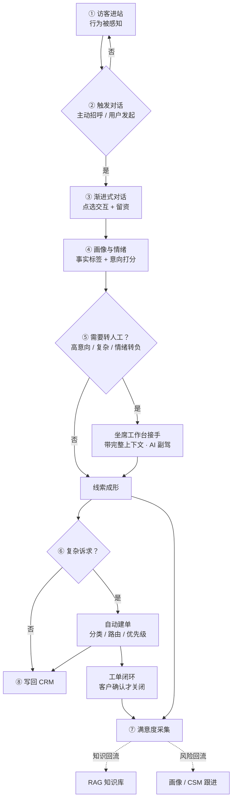
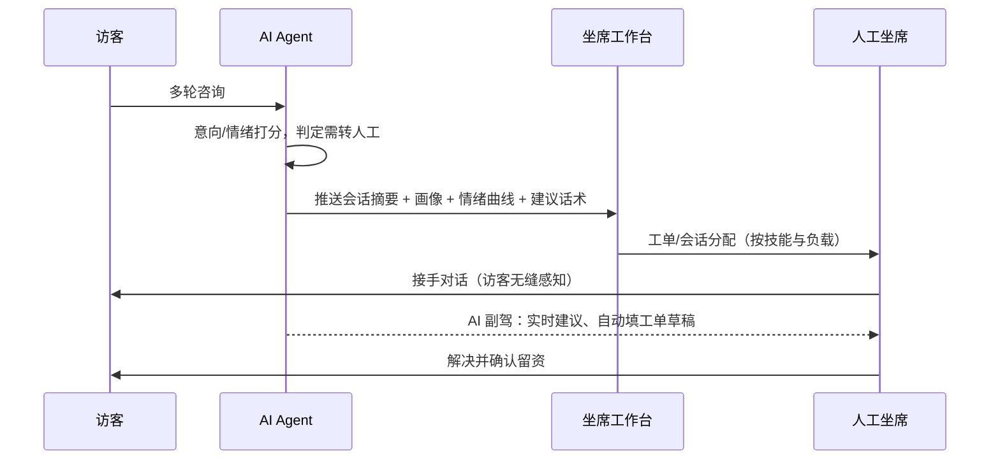
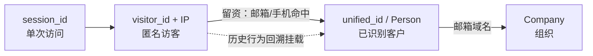
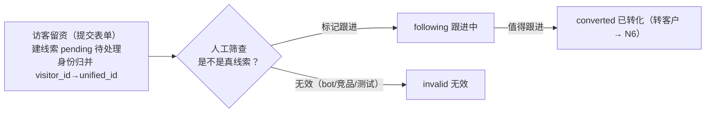
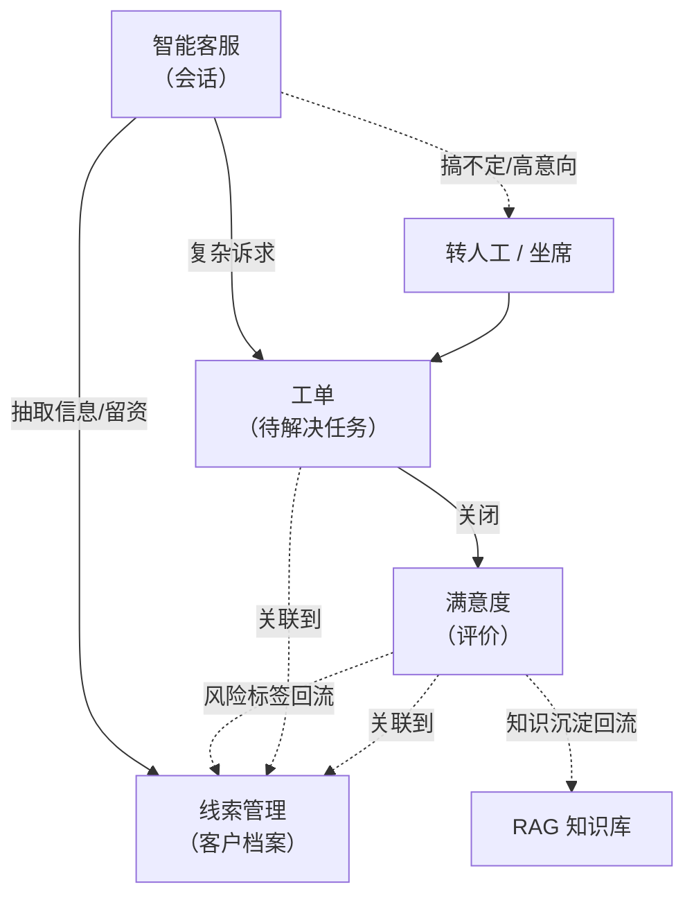
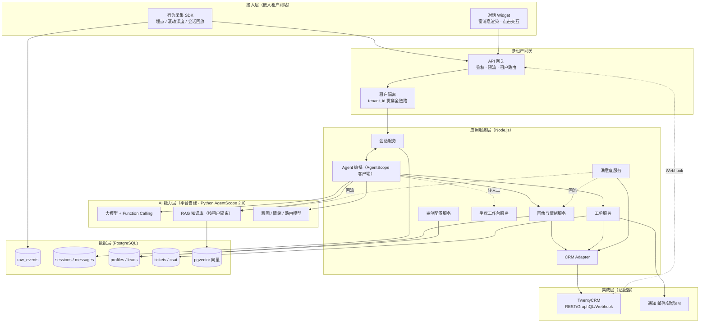
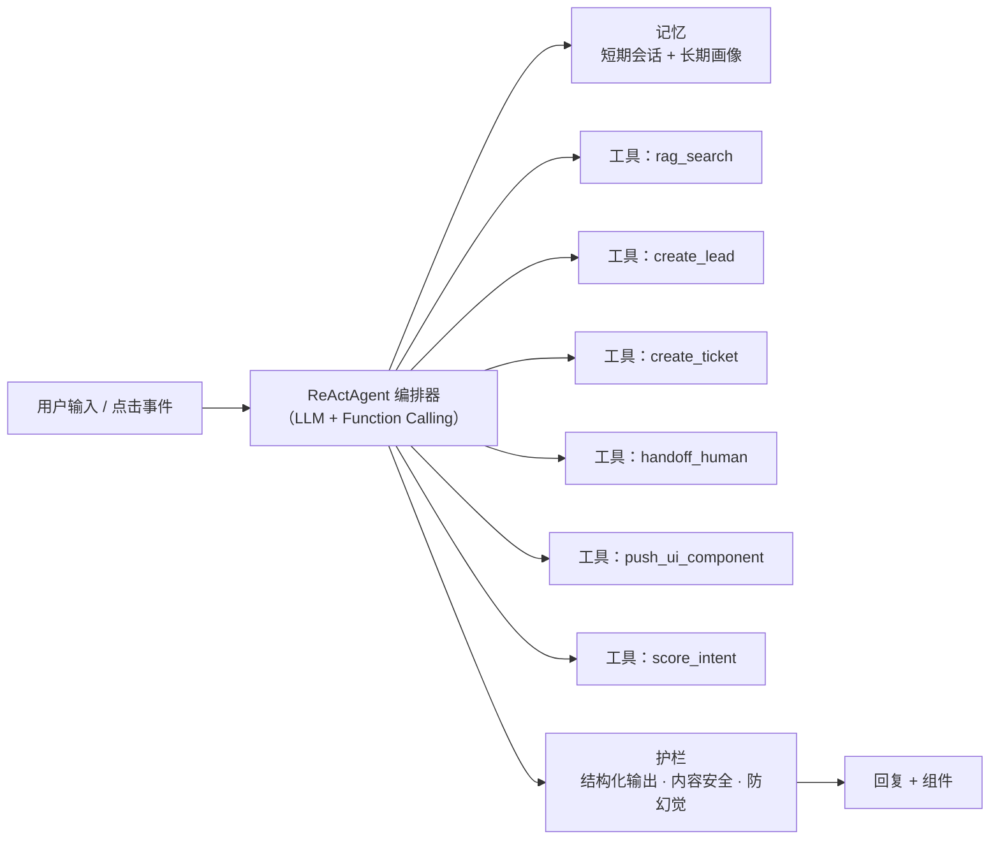
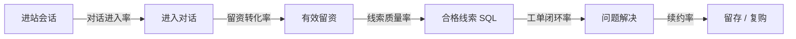

# 门户智能转化 SaaS —— 产品方案与端到端落地文档

> 版本：v4.2　日期：2026-06-24
> 配套：`系统现状.md`（线上控制台现状 + 真实对话流程基线）｜`功能清单与技术选型.md`（功能清单 + 技术栈）｜参照代码：`sale-demo/`（埋点 + 对话 Demo）、`prototype/`（中台页面原型）
> **本文是产品的唯一主文档**，由原《产品方案与功能设计》（solution）与《端到端落地方案》（路线图）合并而成。它既回答"要做成什么样"（蓝图：架构、Agent、组件协议、数据模型、评估），也回答"怎么落地、分几期做"（施工：现状改造、新页面 N1–N11、分期交付）。
> **范围说明**：平台底座（多租户、鉴权、部署、运维）由现有平台提供，本方案不涉及。本文聚焦"智能客服与转化"这一套完整功能的**端到端打通**——让访客从进站到留资、工单、满意度回流的整条链路连贯运转。

---

## 1. 产品定位与要解决的问题

本平台以 **SaaS** 形式向企业（租户）提供一整套"从访客进站到留资、工单、满意度回流"的智能转化能力。企业接入后，其网站访客在前端获得智能客服与交互式对话体验，企业的客服/销售团队在坐席工作台协同处理，所有线索与工单沉淀到 CRM。

租户买的不是"一个聊天机器人"，而是一条**把网站流量变成可跟进线索、再变成已解决工单、再变成续约客户**的自动化链路。单点功能不值钱，链路打通才值钱。核心目标只有一个：

> **整条链路通顺**——访客进站后，系统能感知行为、主动对话、点选交互、渐进留资、必要时转人工、复杂诉求自动建单、解决后采集满意度，并把线索/工单/满意度写回 CRM，形成可被销售和客服直接使用的结果。

衡量"通顺"的标准：拿一个真实访客剧本，能从头到尾不断链地跑完，且每一步产生的数据都能在下一步被用上。

**关键约束（来自业务方）**

- 交付形态为多租户 SaaS，单套平台服务多家企业，租户间数据严格隔离。
- 对话引擎（Agent）由平台自建，不依赖第三方客服 SaaS 的封闭机器人。
- CRM 当前用 **TwentyCRM**（开源、自托管）做对接验证；架构上 CRM 以适配器（Adapter）方式接入，后续可替换为企业自有 CRM。
- 智能客服对话需支持选项、按钮、卡片等点击式交互，降低用户输入成本、提升对话体验。

**角色定义**

| 角色 | 说明 |
|---|---|
| 平台方 | 运营整套 SaaS，负责 Agent、模型、基础设施、多租户隔离 |
| 租户（企业客户） | 购买并配置功能，拥有自己的知识库、坐席、工单与画像数据 |
| 坐席（客服/销售） | 租户下的人工，在工作台接手对话、处理工单 |
| 访客（终端用户） | 租户网站的访问者，与智能客服对话的人 |

---

## 2. 现状基线：线上系统其实已经很成熟

现状有两个来源，必须分清：

1. **`sale-demo`（原型）**：独立的埋点 + 对话 Demo，验证了"代码归于事实"——埋点采集四类事件、SQL 算页面指标和事实画像、AI 对话 Widget、AgentScope/TwentyCRM 联通。它是技术验证，不是线上系统。
2. **线上控制台（见 `系统现状.md`，本次重点基线）**：一套**已上线、相当成熟的外贸/多站点营销 SaaS**。已具备访客识别、智能客服对话、知识库(RAG)、转人工、线索管理、客户管理、数据分析、对话流编排等页面，以及一条真实运行的对话流程（前置识别→意图分发→7 业务子模块→满意度→数据应用，详见 `系统现状.md` §2.13）。

**用链路视角看进度**（以线上系统为准）：8 个环节里有 6 个已有载体，只是分散在不同页面、且缺关键环节。

```
①行为感知 ②主动对话 ③交互留资 ④画像情绪 ⑤转人工 ⑥工单 ⑦满意度回流 ⑧CRM写回
   🟢          🟢         🟡        🟡         🟢      🔴      🟡          🟢(站内)
```

| 环节 | 线上已有载体 | 缺口 |
|---|---|---|
| ① 行为感知 | 访客识别 + 访问轨迹（IP/地区/企业/页面轨迹/停留） | 滚动深度、CTA、流失前兆 |
| ② 主动对话 | 智能客服（开场白/主动交流技能）+ 在线会话 | 触发器精细化 |
| ③ 交互留资 | 开场白问题、快捷标签、意向收集技能、线索表单 | 富消息组件（卡片/轮播/表单/快捷选项）协议 |
| ④ 画像/情绪 | 访客识别（事实）+ 客户档案 + AI 总结 | 叙事画像、意向打分、情绪识别/弧度 |
| ⑤ 转人工 | 转人工技能、客服设置、在线会话工作台 | 技能/负载路由、AI 副驾、完整上下文交接 |
| ⑥ 工单 | —（仅转人工） | **整个工单系统缺失** |
| ⑦ 满意度回流 | 回复调研技能、未回答→知识库 | CSAT/NPS 采集与反馈分析 |
| ⑧ CRM 写回 | 线索管理 / 客户管理（站内 CRM） | 外部 CRM Adapter（按需） |

**结论**：方案约 **60–70%** 的能力线上已有载体。本次需求的本质是 **串链 + 补缺 + 重构页面**——把分散能力按端到端流程重新组织成一套新页面（第 10 节 N1–N11），并补齐工单、满意度闭环、情绪、双轨画像、富消息组件、身份归并、评估看板。

---

## 3. 端到端核心流程（一个访客的完整旅程）

主流程是一条闭环：进站 → 行为感知 → AI 渐进式对话 →（按需）转人工 → 留资/画像/情绪 → 工单（分类/路由/优先级）→ 满意度分析 → 结果回流。这也是验收时要能完整跑通的"主干流程"。



| 环节 | 访客侧体验 | 给租户客户的价值 | 当前缺口 |
|---|---|---|---|
| ① 行为感知 | 无感采集 | 知道谁在认真看、看什么、在哪流失 | ✅ 已通；补关键页重复访问、流失前兆 |
| ② 主动对话 | 合适时机被招呼/可主动发起 | 把"看一眼就走"的流量拦下来对话 | 缺对话 Widget + 触发器 |
| ③ 交互留资 | 点选项/按钮即可推进，少打字 | 留资完成率高、体验好、信息结构化 | 缺富消息组件 + 渐进式留资 |
| ④ 画像情绪 | 无感 | 销售拿到"高意向+已知痛点"的线索而非裸号码 | 事实标签已有，缺意向/情绪打分 |
| ⑤ 转人工 | 需要时无缝接到真人 | 复杂/高意向不流失，人接得住 | 缺转人工 + 坐席工作台 |
| ⑥ 工单 | 诉求被记录跟进 | 复杂问题不丢、有 SLA、可追踪 | 缺工单服务 |
| ⑦ 满意度 | 解决后一次轻量打分 | 知道好不好、坏在哪、怎么改 | 缺 CSAT 采集与分析 |
| ⑧ CRM 写回 | 无感 | 线索/工单直接进销售和客服的系统 | 缺 CRM Adapter（站内已有） |

**转人工接管时序**



---

## 4. 同一个客户：身份归并模型

整条链路要"通"，前提是系统始终知道"现在面对的是谁"，并能把一个人在不同时间、不同设备、留资前后的所有行为归到一条记录上——否则运营看到的就是一堆对不上号的碎片。

> **核心原则：访客 ≠ 线索，留资后才成线索。** 访客一进站，系统只为其建立**访客档案**（`visitor_id + IP`，记录行为轨迹），进入「访客洞察 N1」；**只有当访客留资（提交表单 / 在对话中留下联系方式）时，才产生一条线索**进入「线索池 N7」。匿名、未留资的访客只在 N1，不进 N7。留资那一刻做一次**身份归并**（见 §4.2），把该访客的历史匿名行为回溯挂到线索/客户名下。因此 N1 是**全量访客的行为视角**（含匿名噪音），N7 是**已留资线索的筛查跟进视角**，二者通过 `visitor_id / unified_id` 互通。

**两条留资路线**：

| 路线 | 进站身份 | 识别强度 | 留资后线索初始态 |
|---|---|---|---|
| **匿名访问** | `visitor_id`（浏览器）+ IP，留资补 PII | 弱→强（留资后由邮箱/手机归并） | 待处理，待筛查 |
| **登录会员** | 会员 ID（已登录） | 强（直接加载会员档案：ID/历史订单/售后记录） | 待处理 / 直接关联已有客户 |

身份分三层，由粗到精（两条路线最终都收敛到 `unified_id`）：

| 层级 | 标识 | 何时建立 | 精度 | 用途 |
|---|---|---|---|---|
| 单次访问 | `session_id` | 每次进站（sessionStorage） | 一次会话 | 关联本次浏览/对话 |
| 匿名访客 | `visitor_id`（浏览器）+ IP | **首次进站即建访客档案**（localStorage） | 同浏览器精确；同 IP 粗粒度 | 记录行为（N1）；留资前识别"同一个访客" |
| 已识别客户 | `unified_id` / Person（邮箱、手机、会员号为强键） | 留资 / 登录后 | 跨设备、跨会话归并到"一个人" | 识别"同一个人" |

### 4.1 留资前——怎么算"同一个客户"

- **主标识：浏览器 `visitor_id`**（存 localStorage）。同一浏览器再次进站不变，是最可靠的匿名标识。
- **辅助：同 IP 归并**。同一 IP 在一定时间窗内的访客，归为"疑似同一访客 / 同一组织"。
- **重要限制**：IP 会被办公室、NAT、公共网络共享。所以 **IP 只做"疑似 / 同组织"的弱提示，不做强制合并**，避免错并。运营界面把"同浏览器"和"同 IP"分开标注。

### 4.2 留资后——怎么算"同一个人"

留资发生的那一刻（写线索之前），先做一次**身份归并（identity resolve）**：

- **强键：邮箱 / 手机号**（规范化后比对——邮箱转小写去空格、手机统一格式）。命中已有客户 → 判定为同一个人。
- **归并动作**：把当前 `visitor_id` 及其全部历史匿名行为回溯挂到这个 Person 名下；若此人之前在别的设备留过资，合并到同一 `unified_id`。
- **组织归并**：按邮箱域名（如 `@acme.com`）把个人归到同一 Company。
- **冲突处理**：同一浏览器先后出现两个不同邮箱 = 两人共用设备，按最新留资为准建新 Person，保留各自历史，不强行合并。



> 与现状的关系：线上系统现以"已登录会员 / 临时访客"二分（见 `系统现状.md` §2.13 前置识别），本模型把它升级为 `session_id → visitor_id → unified_id` 三层归并。`raw_events` 已预留 `unified_id` 字段，归并逻辑就是在留资时把同一 `visitor_id`（及合并历史）统一写上同一 `unified_id`，所有查询以 `unified_id`（未留资时退化为 `visitor_id`）为聚合键。

### 4.3 线索生命周期与人工筛查

留资来的线索里既有真意向客户，也有低质/无效流量。因此线索有一条**带人工筛查的递进生命周期**（对齐线上线索池：待处理 / 跟进中 / 已转化 / 无效）：



- **pending（待处理）**：留资后建，未筛查前在此态。匿名访客未留资则不在线索池，只在 N1 访客洞察。
- **人工筛查**：运营在线索池标记「跟进」（→ `following`）或「无效」（→ `invalid`），低质流量不污染跟进队列；列表操作含 查看 / 转为客户 / 更多（标记跟进、标记无效、删除）。
- **converted（已转化 / 转客户）**：运营认为值得跟进的线索手动「转为客户」，进入 N6 客户管理持续经营。
- **售后问答类诉求**：走对话工作台（N2）→ 工单（N8）的解决流程，不作为销售线索在 N7 跟进。

> 线索状态枚举：`pending / following / converted / invalid`（见 `功能清单与技术选型.md §9`）。

### 4.4 工作人员手动合并

自动归并（邮箱/手机/会员号强键）覆盖不了所有情况——同一个人用了不同邮箱、不同设备、先匿名后留资但 PII 没对上。因此提供**手动合并**：运营在 N1 访客列表或 N7 线索池多选若干访客/线索 → 选定主记录 → 合并到同一 `unified_id`，其余记录的按天历史、会话、工单回溯挂到主记录名下。合并是高权限动作，需可审计、可回滚；**同 IP ≠ 同一人**，合并须人工确认确为同一人。

### 4.5 访客统计口径（N1 必须先定义清楚）

"一个访客有多少访问"看似简单，口径不清就会和会话数、PV 混淆。统一定义：

| 概念 | 定义 | 标识 |
|---|---|---|
| **一个访客** | 同一浏览器为一个访客；留资/登录后按 `unified_id` 跨设备合并为「同一个人」。同 IP 仅弱提示，不强制合并 | `visitor_id` → `unified_id` |
| **访问周期（会话）** | 一次会话即一个访问周期，**30 分钟无活动**即结束。一个访客可有多个周期 | `session_id` |
| **按天活跃（DAU）** | 当天去重 `visitor_id` 计一次 | — |

- **列表（多周期聚合）**：N1 访客列表每行是一个访客，「访问周期数 / 累计停留 / 关键页重访」为所选时间范围内的**跨周期聚合值**。
- **下钻（单访客）**：点访客可下钻看其详细访问数据——
  - **多周期视角**：按天历史（每天的会话数、停留、浏览页数、最深滚动、是否访问关键页），看长期回访趋势；
  - **单周期视角**：某次会话的事件时间线（page_view / scroll / click / leave）。
- **指标卡**：同时给「今日活跃访客 DAU（访客级）」与「今日进站会话（周期级）」，避免两者混淆。

**有效互动会话口径**——把"真的在认真看/互动"的会话从总会话里筛出来，用于校准跳出率。判定 = 该会话满足若干条件（任选/全选，可配置）：滚动深度 ≥ N%、停留 ≥ M 秒、发生点击/CTA、发起对话。计数单位是**会话**。

**流失前兆（churn signal）触发条件**——由 tracker 前端判定，共 3 种（枚举 `move_to_close / form_interrupt / tab_switch / none`）：

| 信号 | 触发条件（前端） | 含义 |
|---|---|---|
| `move_to_close` 移向关闭 | 鼠标在页面内快速上移并越过顶部边界（`mouseleave` 且指针 Y≤0，指向关闭/地址栏/切窗区） | 正要离开，流失前兆最强 |
| `tab_switch` 切 Tab | 页面 `visibilitychange` 转 `hidden`（切去别的标签页 / 最小化），且本会话尚未留资 | 注意力转移 |
| `form_interrupt` 表单中断 | 留资表单已聚焦输入，但提交前离开（最后一次输入后 8s 无新输入，或直接关闭/切走） | 留资放弃 |

**流失前兆统计口径**：

- **指标卡「流失前兆触发」**＝ 所选时间范围内、**按会话去重**触发任一前兆的会话数（同一会话内同类前兆只计一次，避免抖动重复计）。计数单位是**会话**，不是事件，也不是访客。
- **列表「流失前兆」列**＝ 该访客在范围内**最近一次**触发的前兆类型（`none` = 无）。
- 触发后可联动「流失拦截」做低摩擦挽回（第三期，开关在 N3 触发器）。

**这两个口径由运营方在 N1「指标口径设置」里自配置**（区别于原始埋点采集——那是后台/平台侧，见 §17.2）：

- **有效互动会话**：总开关 + 勾选生效条件（滚动阈值 / 停留阈值 / 点击 / 发起对话）+ 满足方式（全部/任一）。关闭则计全部会话。
- **流失前兆**：3 种信号各自独立开关，**开启的信号才计入「流失前兆触发」计数**；切 Tab 可设"仅未留资会话计入"、表单中断可设"无输入超时秒数"。
- 口径变更只影响**派生指标的计算与计数**，不改变底层事件采集；改完即时生效于后续统计。`[PUT] /api/metrics/config`（见 `功能清单与技术选型.md §8.11`）。

> 与"运营方不配埋点"的边界：**原始事件**（scroll/click/dwell/mouseleave/visibilitychange）始终采集，运营方不碰；运营方只调**这两个派生指标的判定阈值**——属于"看数据时的口径选择"，不是埋点采集配置。

### 4.6 多站点（独立站）维度

一个后台关联**多个独立站**（面向不同地区/语言，如中文官网 / EN Global / 东南亚站）。所有访客、线索、统计都带 `site_id` 维度：

- N1 等页面顶部提供**独立站选择器**（可选「全部站点」汇总，或单站下钻）。
- 同一个人可能跨站访问，跨站身份归并仍按 `visitor_id / unified_id`，`site_id` 只作来源标注与过滤维度，不影响归并。

---

## 5. 功能边界：智能客服 / 线索 / 工单 / 满意度

这四块经常被混为一谈，边界不清会导致数据重复、职责打架。一句话区分：

- **智能客服 = 过程**（一次对话），按会话存在，分钟级。
- **访客 = 行为**（进站即建访客档案，记录轨迹，N1）；**线索 = 谁**（**留资后才建**的持久客户档案，N7），跨会话存在，长期。
- **工单 = 什么问题**（一个待解决任务），有完整生命周期。
- **满意度 = 事后的一次评价**，必须挂在工单或会话上，不独立存在。

| 功能 | 负责什么 | 核心对象 | 生命周期 | 明确不负责 |
|---|---|---|---|---|
| 智能客服 | 感知行为、主动对话、点选交互、答疑、抽取信息 | 会话 Session / Message | 一次会话（分钟级） | 不持久保存客户档案；不跟踪问题是否解决 |
| 线索管理 | 留资后建线索、人工筛查真伪、身份归并、手动合并、历史行为/画像 | 线索 / Person | 长期（留资 → 跟进 → 转客户/无效） | 不处理具体问题流程；本身不做对话；匿名未留资访客不在此（只在 N1） |
| 工单 | 一个诉求的跟进、分类、路由、SLA、闭环 | 工单 Ticket | 建单 → 客户确认关闭 | 不代表客户；不做对话 |
| 满意度 | 解决后的评价采集与反馈分析 | CSAT 记录 | 工单关闭/会话结束后一次 | 不独立存在，必挂工单或会话 |

### 5.1 边界处的数据流



### 5.2 关键层级关系（避免混淆）

一个客户（线索）→ 多次会话（智能客服）→ 可能产生多个工单 → 每个工单关闭后一次满意度。这是一条**一对多的层级链**，线索是中心枢纽：

- 线索不是会话：一个客户来过五次、聊了五段，是五个会话、一条客户记录。
- 工单不是线索：客户"可能买"是线索的事；客户"有个具体问题要解决"是工单的事，一个客户能开多个工单。
- 满意度不是工单：满意度是对某工单/会话结果的一次打分，是度量，不参与流程推进。

---

## 6. 整体架构

平台采用分层架构：前端接入层负责采集与渲染，多租户网关做隔离与鉴权，应用服务层承载各业务能力，AI 能力层提供模型与检索，数据层做持久化，集成层对接外部 CRM 与通知渠道。



**分层职责**

- **接入层**：以 JS SDK 嵌入租户网站，采集行为事件并渲染对话 Widget；Widget 支持文本、选项、按钮、卡片等富消息。
- **多租户网关**：统一鉴权与限流，将 `tenant_id` 注入请求上下文，所有下游服务与数据查询强制带租户维度。
- **应用服务层（Node.js）**：会话、编排、工单、画像、坐席、表单、满意度、CRM 适配器，彼此通过内部 API / 事件解耦；与现有平台 + TwentyCRM 同栈，复用租户/鉴权。
- **AI 能力层（Python · AgentScope 2.0）**：自建 Agent 的核心。大模型负责对话与工具调用，RAG 提供租户私有知识，NLU 做意图分类、情绪识别与路由打分。通过 Agent Service（REST+SSE）托管，Node 会话服务作为客户端消费事件流。
- **数据层**：事件流、会话、画像、工单分库存储，pgvector 支撑 RAG。
- **集成层**：CRM 以适配器抽象，首版实现 TwentyCRM；通知渠道可插拔。

> 关于"Python Agent + Node 平台"异构：用 AgentScope 2.0 的 **Agent Service** 把 Agent 托管为 REST+SSE 服务（自带多租户/多会话并发、持久会话、凭据托管），Node 侧作为客户端消费 SSE 事件流——无需自写微服务管线，Agent 迭代与平台解耦。

---

## 7. 自建 Agent 架构（AgentScope 2.0）

Agent 是平台自建的对话大脑，采用"编排 + 工具调用 + RAG + 记忆 + 护栏"结构。



**核心组件**

- **编排器**：`ReActAgent`，开启并行工具调用，按"推理→调工具→观察→再推理"闭环；通过 Agent Service 暴露 REST+SSE。
- **事件流驱动 UI**：利用 2.0 事件系统，把 thinking / tool call / 文本增量以类型化流推到前端，Widget 边生成边渲染（打字机效果 + 工具执行状态），无需额外适配器。
- **执行安全用于关键动作**：`create_lead` / `create_ticket` / `handoff_human` 这类敏感动作配置为"交回自有后端执行"——Agent 暂停、后端做校验与落库、再让 Agent 断点续跑。天然满足"关键动作可审计、确定性事实交代码"。
- **记忆**：短期 = Agent Service 持久会话上下文；长期 = 画像库（跨会话偏好）。
- **护栏**：工具入参/出参走 JSON Schema 校验 + 2.0 执行安全的人工复核/拦截。

**工具集（Tool）**

| 工具 | 签名 | 说明 | 落地期 |
|---|---|---|---|
| `rag_search` | `(query, tenant_id, top_k)` | 知识库检索 | 第一期 ✅ |
| `lead_capture_form` | `(context, prefilled_*)` | 渐进式留资表单（字段从 analysis_config.json 读取） | 第一期 ✅ |
| `confirm_dialog` | `(prompt, options)` | 追问选项弹框 | 第一期 ✅ |
| `request_human_handoff` | `(reason)` | AI 主动转人工 | 第一期 ✅ |
| `classify_demand` | `(messages)` | 需求类型识别（分析 Agent） | 第一期 ✅ |
| `suggest_replies` | `(messages)` | 坐席回复建议（分析 Agent） | 第一期 ✅ |
| `score_intent` | `(signals)` | 意向打分（占位，当前 mock） | 第三期 |
| `create_lead` | `(structured_lead)` | 写线索 + TwentyCRM 写入（敏感，交后端） | 第三期 |
| `push_ui_component` | `(component)` | 富消息卡片/轮播/按钮 | 第三期 |
| `create_ticket` | `(summary, root_cause, category)` | 建工单（敏感，交后端） | 第三期 |

**工具定义示例（Function Calling）**

```json
{
  "name": "create_lead",
  "description": "将识别到的销售线索写入 CRM。仅在已确认公司名与联系方式后调用。",
  "parameters": {
    "type": "object",
    "properties": {
      "company": { "type": "string" },
      "name": { "type": "string" },
      "email": { "type": "string" },
      "phone": { "type": "string" },
      "intent_level": { "type": "string", "enum": ["low", "medium", "high"] },
      "pain_points": { "type": "array", "items": { "type": "string" } }
    },
    "required": ["company", "intent_level"]
  }
}
```

> **渐进式剖析（Progressive Profiling）**：不一上来索取信息，先用对话价值换信任，在多轮中逐步补全公司、岗位、技术痛点；模型以 JSON 输出（公司名/岗位/意向等级/痛点关键词），代码侧校验后入库，避免自由发挥。这套"意图分析 + 渐进式留资"是 Agent 自行判断调用 `score_intent` / `push_ui_component(form)` / `create_lead` 的核心剧本，对应现状的"意图线索收集子模块（业务7）"（见 `系统现状.md` §2.13）。

### 7.2 Multi-Agent 编排：主 Agent + 分析 Agent

上节描述的是主 Agent 对话主链路。**第一期已引入第二个常驻 Agent**——分析 Agent，在后台与主 Agent 并行运行，负责需求类型识别、意向打分（第三期激活）和坐席回复建议，不介入用户可见的对话。当前实现：`agent-backend/agents/analysis_agent.py`，通过共享 Session 对象与主 Agent 协作。

#### 整体协作结构

```
访客 Browser
    │  WebSocket / SSE
    ▼
┌──────────────────────────────────────────────────────────────┐
│  会话网关（Session Gateway · Node）                           │
│  · 维护 session_id、conv_history（Redis）                   │
│  · 按 session.mode 路由：ai / human                         │
└──────────┬───────────────────────────┬───────────────────────┘
           │ 主链路（用户可见）         │ 旁路（spawn，用户不可见）
           ▼                           ▼
┌──────────────────────┐   ┌────────────────────────────────────┐
│  ConversationAgent   │   │  AnalysisAgent                     │
│  （主 Agent）         │   │  （分析 Agent，后台）              │
│                      │   │                                    │
│  · ReActAgent 编排   │   │  · 订阅 conv_history 事件          │
│  · 与访客多轮对话    │   │  · 每轮输出需求类型 + 意向分       │
│  · 引导留资          │   │  · 人工期间输出 3 条回复建议       │
│  · 调用转人工工具    │   │  · 写 Redis，推 WebSocket 到 N2    │
└──────────┬───────────┘   └────────────────┬───────────────────┘
           │ handoff_human 信号              │ 实时推送
           ▼                                ▼
    ┌─────────────────────────────────────────┐
    │  坐席工作台 N2                           │
    │  · 完整对话上下文（含 Agent 摘要）       │
    │  · 需求类型 / 意向分 / 意向等级         │
    │  · 3 条实时回复建议（每轮刷新）         │
    └─────────────────────────────────────────┘
```

#### AgentScope 2.0 编排方式

两个 Agent 共享同一个 `agentscope.init()` 初始化上下文，各自持有独立的模型配置和系统 prompt。主 Agent 用大模型（gpt-4o），分析 Agent 用小模型（gpt-4o-mini）降成本。

```python
import asyncio
import agentscope
from agentscope.agents import ReActAgent
from agentscope.message import Msg

agentscope.init(
    model_configs=[
        {"config_name": "gpt4o",     "model_type": "openai_chat", "model_name": "gpt-4o"},
        {"config_name": "gpt4o_mini","model_type": "openai_chat", "model_name": "gpt-4o-mini"},
    ]
)

# 每个会话实例化两个 Agent（租户级 system_prompt 在运行时注入）
main_agent = ConversationAgent(
    name="main",
    model_config_name="gpt4o",
    sys_prompt=build_conversation_prompt(tenant_config),
)

analysis_agent = AnalysisAgent(
    name="analysis",
    model_config_name="gpt4o_mini",
    sys_prompt=build_analysis_prompt(skill_config),   # 来自 N3 技能配置
)

# 会话启动时后台 spawn 分析 Agent，不阻塞主对话
async def start_session(session_id: str):
    asyncio.create_task(
        analysis_agent.run_loop(session_id)   # 持续监听，直到会话结束
    )
```

`AnalysisAgent.run_loop` 在每条新消息写入 Redis 时被唤醒，单次 LLM 调用同时输出需求类型 + 意向分（structured output），减少 token 消耗：

```python
class AnalysisAgent(AgentBase):
    async def run_loop(self, session_id: str):
        while session_alive(session_id):
            await wait_for_new_message(session_id)   # Redis pub/sub 唤醒
            history = get_conv_history(session_id)
            
            result: Msg = await self(                # AgentScope __call__
                Msg(role="user", content=history, name="system")
            )
            # structured output: {"demand_type": "...", "intent_score": 82, "intent_level": "high"}
            parsed = json.loads(result.content)
            await redis.set(f"session:{session_id}:analysis", parsed)
            await ws_push(session_id, "analysis_updated", parsed)   # 推 N2
            
            if get_session_mode(session_id) == "human":
                await self._gen_reply_suggestions(session_id, history)
```

#### 分析 Agent 的两种能力配置（对应 N3 技能配置）

**需求类型识别**（`demand_classify` 技能）

| 模式 | 行为 |
|------|------|
| 预设分类 | 从 N3 配置的标签列表（如"价格咨询、案例索取、功能咨询、信息披露、购买意向"）中取最匹配一项 |
| 大模型总结 | LLM 自由输出 ≤10 字描述，不受预设约束 |

**意向打分**（`score_intent` 技能）

| 模式 | 行为 |
|------|------|
| 预设维度权重 | 每个维度由 LLM 单独打 0–100 分，按 N3 配置权重加权求和；阈值（high/medium/low 边界）可配置 |
| 大模型自动评估 | LLM 综合对话内容直接输出意向等级 + 理由，N3 中可填写"业务提示"引导评估侧重点 |

两项能力合并为一次 LLM 调用，structured output 示例：

```json
{
  "demand_type": "购买意向",
  "intent_score": 82,
  "intent_level": "high",
  "intent_reason": "明确询价并提到Q3采购计划"
}
```

#### 人机交接协议

**AI → 人工**

主 Agent 调用 `handoff_human` 工具（敏感，交后端执行）。后端在转接前构造 `ContextSnapshot` 推送到坐席工作台：

```python
snapshot = {
    "session_id": session_id,
    "conv_history": get_conv_history(session_id),  # 完整对话，含 role/content/timestamp
    "agent_summary": await main_agent.summarize(   # 主 Agent 自动生成 ≤100 字摘要
        "用户核心需求、已确认信息、待跟进问题、当前情绪"
    ),
    "demand_type":   analysis.demand_type,
    "intent_score":  analysis.intent_score,
    "intent_level":  analysis.intent_level,
    "key_signals":   analysis.key_signals,
    "suggested_replies": await analysis_agent.gen_suggestions(session_id),
}
set_session_mode(session_id, "human")
push_to_desk(agent_id, snapshot)                   # WebSocket → N2
analysis_agent.set_mode("human_assist")            # 开始每轮输出建议
```

分析 Agent 在人工期间对每条用户消息实时生成 3 条建议，风格与 N3 配置的人设 `response_style` 对齐：

- 一条偏信息/答疑
- 一条偏引导推进
- 一条偏情感共鸣

**人工 → AI（回归 Agent）**

坐席静默超时（默认 30 秒，可配置）或主动点击「交还 AI」时：

```python
# conv_history 已包含人工阶段消息（role="human_agent"），主 Agent 能区分
handback_context = Msg(
    role="system",
    name="session_gateway",
    content=f"人工坐席已结束接管。对话已更新，请基于完整上下文继续服务用户。"
            f"人工摘要：{handback_summary}",
    metadata={"conv_history": get_conv_history(session_id)}
)
await main_agent(handback_context)                 # 主 Agent 读取完整 conv_history 续接
set_session_mode(session_id, "ai")
analysis_agent.set_mode("background")             # 退出建议模式，恢复后台分析
```

主 Agent 续接时生成衔接话术（可选），例如：
> "好的，我来继续为您服务——您刚才提到的私有化部署需求，这边可以……"

#### 上下文存储规范

| 数据 | 存储 | TTL | 更新频率 | 读取方 |
|------|------|-----|----------|--------|
| `conv_history` | Redis List | 24h | 每条消息 | 主 Agent、分析 Agent、N2 |
| `analysis`（需求类型/意向分） | Redis Hash | 会话结束 | 每轮（用户消息后） | N2 实时、N7 留资时快照写入 |
| `suggested_replies` | Redis String | 5 min | 每轮（人工期间） | N2 WebSocket 推送 |
| `session.mode` | Redis String | 会话结束 | 转人工/交还时 | 会话网关路由判断 |

#### 容错与降级

| 场景 | 处理 |
|------|------|
| 分析 Agent 超时（>3s） | 使用上一轮缓存结果，不阻塞主对话，N2 显示"⚠ 分析延迟" |
| 分析 Agent crash | 主 Agent 独立运行，需求类型/意向分降级为 null，N2 显示"分析不可用" |
| 上下文超长（>模型限制） | 保留最近 N 轮（N3 可配置），其余压缩为摘要注入 system prompt |
| 人工接管后断连 | session.mode 保持 "human"，30s 无响应后自动回归 AI |

---

## 8. 交互式对话组件设计（富消息协议）

为提升对话体验，Agent 不只回复纯文本，而是按场景下发可点击组件。前端 Widget 按统一"富消息协议"渲染，用户点击后将结构化结果回传，Agent 继续推进。

### 8.1 组件类型

| 组件类型 | type 值 | 用途 | 典型场景 |
|---|---|---|---|
| 文本 | `text` | 普通回复 | 解答、引导 |
| 快捷选项 | `quick_replies` | 单选短选项，点击即发送 | 收集意向、引导分流 |
| 按钮组 | `buttons` | 触发动作（跳转/留资/转人工） | "预约 demo"、"转人工" |
| 卡片 | `card` | 图文 + 操作的信息块 | 产品/方案介绍 |
| 卡片轮播 | `carousel` | 多卡片横向滑动 | 多方案对比 |
| 表单 | `form` | 多字段一次性收集 | 渐进式留资的兜底 |
| 评分 | `rating` | 满意度/NPS 打分 | 工单闭环后调研 |

### 8.2 富消息协议（下发示例）

```json
{
  "message_id": "m_8821",
  "tenant_id": "t_acme",
  "session_id": "s_4f9c",
  "sender": "agent",
  "content": {
    "text": "了解一下您主要关注哪方面？我可以针对性介绍。",
    "components": [
      {
        "type": "quick_replies",
        "options": [
          { "label": "产品功能", "value": "intent_feature" },
          { "label": "价格方案", "value": "intent_pricing" },
          { "label": "对接集成", "value": "intent_integration" },
          { "label": "想直接咨询人工", "value": "intent_human" }
        ]
      }
    ]
  }
}
```

按钮触发动作示例：

```json
{
  "type": "buttons",
  "buttons": [
    { "label": "预约产品演示", "action": "open_form", "payload": "form_demo" },
    { "label": "下载白皮书", "action": "open_link", "payload": "https://..." },
    { "label": "转人工客服", "action": "handoff_human" }
  ]
}
```

### 8.3 用户点击回传

```json
{
  "session_id": "s_4f9c",
  "sender": "visitor",
  "event": "component_click",
  "component_type": "quick_replies",
  "value": "intent_pricing",
  "label": "价格方案"
}
```

### 8.4 交互设计原则

- **降摩擦**：能点选就不让用户打字；高频意向预置为选项。
- **渐进式**：留资字段拆散到多轮，必要时才用 `form` 一次性补全。
- **始终留出口**：任意环节提供"转人工"按钮。
- **可控渲染**：组件由后端结构化定义，前端只负责渲染，保证多端一致与可统计。

---

## 9. 功能模块详解

### 9.1 行为感知与记录

进站即采集，重点是高价值信号而非单纯 PV/UV。

- **采集事件**：页面停留时长、滚动深度里程碑（25/50/75/100%）、关键页（价格页/方案页）重复访问、文档下载、表单聚焦后中断、指针移向关闭/切 Tab（流失前兆）。
- **跳出率校准**：以滚动深度 + 真实交互时长重定义"有效互动会话"，避免 SPA / 无限滚动被误判。
- **数据落地**：事件流表以 `session_id` 为主键，预留 `unified_id` 供身份合并；确定性指标用规则/SQL 计算，不交给大模型。
- **触发器**：行为信号驱动主动招呼与流失拦截，而非定时弹窗骚扰。

### 9.2 智能客服 Agent

- **渐进式剖析**：先用对话价值换信任，多轮中逐步补全——不一上来索取信息，在对话推进过程中逐步询问/提取公司名、联系方式、需求痛点等字段，最终触发 `create_lead` 写入线索。
- **AI 推断字段区分**：对话中 AI 提取/推断的字段（需求类型、公司名等）区别于用户主动填写字段；在 N7 线索列表及详情中以 ✦ 紫色样式标注，视觉区分"AI 补全"与"用户填写"，两类字段均写入线索档案（标准列或 `custom_fields JSONB`）。
- **后台分析实时推送**：后台分析 Agent 每轮输出需求类型与意向分，实时推送 N2 坐席工作台，留资时同步快照写入 N7 线索（见 §7.2）。
- **流失拦截**：由行为信号触发低摩擦挽回（如"2 分钟免注册产品导览"）。
- **结构化留资**：模型以 JSON 输出，代码侧校验后入库。
- **交互式体验**：对话中下发选项、按钮、卡片（第 8 节）。
- **工具调用**：查知识库、建工单、转人工、写 CRM 均封装为 Agent 可调用工具（第 7 节）。

### 9.3 人工坐席工作台

- **无缝转接**：触发器明确——高意向、模型置信度低、用户明确要求、情绪转负；也支持坐席后台**手动接管**任意会话，不等 Agent 触发，立即切换至人工模式。
- **完整上下文交接**：接手即带会话摘要、已识别画像、情绪曲线、AI 建议话术；接管后分析 Agent 同步切换为建议模式，实时生成 3 条回复建议。
- **AI 副驾模式**：右栏展示「需求类型」（分析 Agent 实时推断）、意向分/意向等级、3 条回复建议（坐席可采纳/刷新）、自动工单草稿，由人工决定是否采用。
- **AI/人工自由切换**：坐席接管后可随时点击「交还 AI」，主 Agent 读取含人工阶段（`role="human_agent"`）的完整 conv_history 无缝续接，分析 Agent 同步退出建议模式回归后台分析；切换对访客无感。
- **协同能力**：会话/工单的接单、转派、内部备注、负载与技能路由。

### 9.4 留资 / 画像 / 情绪

- **双轨画像**：事实标签（SQL 算：访问频次、关键行为、企业属性）+ 叙事画像（LLM 合成：意向、关注点、预算敏感度）。
- **情绪弧度**：监控对话从开头到结尾的情绪走向；结尾仍为负 = 流失风险，自动提醒人工/CSM。
- **统一身份**：以 `unified_id` 合并多触点行为，确保打标全链路一致。

### 9.5 工单系统

- **自动建单**：判定复杂诉求时，LLM 抽取会话摘要 + 根因关键词，填模板自动建单。
- **自动分类**：按诉求类型（技术/商务/售后/投诉）多级分类。
- **智能路由**：按工单类型 + 所需技能 + 坐席负载分发。
- **优先级管理**：可解释打分 = 意向分 × 情绪分 × SLA 紧迫度。
- **SLA 与闭环**：小时/天级倒计时与超时升级；闭环标尺为"客户确认解决"，不满意自动重开。

### 9.6 满意度分析与回流

- **满意度采集**：工单关闭后推送调研（CSAT/NPS）。
- **反馈分析**：对开放反馈做情感识别 + 主题聚类，产出可执行改进建议。
- **知识沉淀飞轮**：高质量解决方案沉淀回 RAG，提升 AI 直接解决率。
- **回流闭环**：满意度与工单结果回写画像（风险标签）与知识库。

---

## 10. 新页面重构清单（本次需求核心）

把端到端流程重构成一套**新页面**。原则：延续现有控制台的信息架构与交互风格（左导航 + 顶 Tab + 卡片表单 / 三栏工作台 / 列表+状态标签页+行操作），按"客户为中心、链路连贯"的逻辑重新组织，并补齐缺失环节。

| # | 新页面 | 承载流程 | 借鉴现有页面 | 相对现状新增 | 类型 |
|---|---|---|---|---|---|
| N1 | **访客洞察**（行为视角） | ① + 4.1/4.5/4.6 | 访客识别 + 访问轨迹 | 访客/企业拆两字段、独立站选择器、按访客去重统计与统计口径、单访客按天历史下钻、手动合并访客；滚动深度/CTA/流失前兆；标注路线(匿名/会员)、IP | 重构增强 |
| N2 | **对话工作台**（坐席） | ⑤ + 4.3 | 在线会话（三栏） | **对话对象区分访客/线索/会员**（身份标签 + 地区 + 在线状态）；保留现状右上 4 按钮 **AI总结 / 访问轨迹 / 转存线索 / 退出**，AI总结弹窗含整体总结+线索信息提取+时间轴+关联会员+关联线索（带 AI 重新总结）；右栏新增 **AI 副驾**（**需求类型**（原「关注点/痛点」，分析 Agent 实时推断）、意向/情绪弧度、事实标签、**回复建议采纳 + ↻ 刷新**）；**手动接管**按钮（坐席主动接管）+ **交还 AI**（自由切换 AI/人工，主 Agent 读完整上下文续接）；转存线索 = 把当前对话对象留资/手动转存为线索（新建或更新并记录 IP/来源） | 重构增强 |
| N3 | **智能体配置**（含渐进式留资配置） | ②③ + 第 7 节 | 智能客服-智能体（Tab） | 人设/技能开关、情绪识别开关、转人工触发器；**「意向线索收集」技能内置「配置」弹窗 = 渐进式留资时机 + 可配置留资表单（必填/选填/灵活入库/映射 CRM）**；**技能按「主对话 Agent / 分析 Agent」分类标注并可筛选**；新增 **「需求类型识别」分析 Agent 技能**（可配预设分类列表或 LLM 自由总结模式）；**「意向打分」技能支持预设维度权重模式**（各维度 0–100 分 × 权重加权，high/medium/low 阈值可配）**或 LLM 自动评估模式**（综合对话直接输出等级+理由，可填业务提示） | 重构增强 |
| N5 | **知识库配置** | RAG + 知识运营闭环 | 知识库 + 未回答 | **第二期升级**：知识资产目录、知识板块配置、元数据规范、同步状态、问答测试、对话质量运营、知识健康体检；客户后台只看本客户数据，平台跨客户分析放到 N12 | 重构增强 |
| N6 | **客户管理**（列表 + 客户 360 详情，线索/客户合一） | ④ + 身份归并（第 4 节） | 客户管理（全部客户/客户分组/客户设置）+ 线索管理 + AI 总结 | **沿用现状列表**（姓名/企业名称+类型标签[个人会员/企业客户]、手机/邮箱、客户分组、来源方式[来源网站+语言+添加方式(后台添加/线索转化)]、创建时间、状态[启用/禁用/非会员]，工具栏：新增客户/更多操作/来源网站/客户类型筛选/关键字）；**本期新增**：列表加「意向等级」列与「身份归并 🔗N」标识，子导航保留全部客户/客户分组/客户设置（设置含自动归并规则）；**查看** 下钻进 **客户 360 详情**（身份归并 unified_id、双轨画像、意向等级、情绪弧度、行为时间线、关联工单/满意度） | 重构增强 |
| N7 | **线索池**（筛查跟进视角） | 留资建线索 + 4.3/4.4 | 线索管理（待处理/跟进中/已转化/无效） | **留资后才成线索**（沿用现状列：客户名称/手机号·邮箱/来源表单/来源[网站+语言]/提交时间）、状态 Tab 待处理/跟进中/已转化/无效、操作 查看·转为客户·更多(标记跟进/标记无效/删除)、线索字段设置（与 N3 留资表单同源）、人工筛查、手动合并多线索→客户、按来源/提交时间/关键词检索；**智能客服 Pro 来源线索的 AI 需求类型（`aiDemandType`）以 ✦ 紫色前缀标注**，区别于用户填写的需求类型；线索详情「线索信息」区 **customFields 自定义表单字段可折叠展开**（折叠时预览前 2 个字段名）；来源会话摘要区新增 **「💡 AI 总结」按钮**（整体总结 + 线索信息提取 + 时间轴，格式与 N2 AI总结一致）；线索详情「**需求类型**」（原「关键意向信号」，字段名与 N2 统一） | 重构 |
| N8 | **工单工作台**（售后服务为主） | ⑥（9.5） | 线索管理列表范式 | **全新**：自动建单 + **手动新增工单**（标题/工单类型/关联客户/优先级/负责人/描述）、**可自定义工单类型配置（售后为主：产品故障/退换货/物流配送/发票账单/账号权限/投诉建议；Agent 按类型说明自动归类 + 人工可调整）**、**关联客户**（建单选客户，客户 360 可见）、智能路由、可解释优先级、SLA 倒计时与升级、客户确认闭环 | 全新 |
| N9 | **满意度中心** | ⑦（9.6） | 数据分析 + 回复调研技能 | **全新**：CSAT/NPS 采集、反馈情感识别+主题聚类、改进建议、回流画像/知识库 | 全新 |
| N10 | **转化看板**（评估体系） | 第 16 节评估 | 数据分析 | 北极星(LCR/CSAT/留存)、评估漏斗下钻、A/B 显著性、分群分析 | 重构增强 |
| N11 | **接待规则与路由** | ⑤ 路由/SLA | 客服设置（接待与分配） | 技能与负载路由、**转人工触发器（参数可填写：意向阈值/轮次/关键词/情绪分）+ 转人工行为设置（提示语/携带上下文/排队超时/无坐席回退）**、SLA 策略集中配置 | 重构增强 |
| N12 | **平台运营看板**（产品后台） | 全租户监控 | — | **全新**：跨租户客户健康度监控（按客户/行业/套餐汇总，识别高风险/沉睡/待运营客户）；AI 质量监控（知识库召回率/AI 回复率/RAG 准确率/未回复原因分类/转人工归因）；客户质量排行榜（召回率/回复率/准确率/满意度/线索贡献）；低质量回答复盘池；知识库待补主题榜（影响客户数/建议板块/优先级）；产品力质量看板（召回率/回复率/准确率/CSAT/转人工率趋势） | 全新 |

> N6「客户 360」是这次重构的枢纽——把现有分散的"访客识别 / 线索管理 / 客户管理 / AI 总结"按身份归并合并成以客户为中心的视图。N8 工单、N9 满意度是两块**全新**模块，是补缺重点。
>
> **N12「平台运营看板」是平台方视角**（高于单租户控制台）：运营方看全部租户（谁是标杆、谁要流失、AI质量如何、知识库哪里要补），支撑产品迭代、销售成交和客户成功。与 N1–N11「租户控制台」（单租户看自己的数据）分开建设，**不混入租户控制台页面**。
>
> **不做独立「对话流/组件库编排」页**：快捷选项/按钮等富消息能力内置于对话 Widget + Agent `push_ui_component` 工具，无需可视化编排页；③ 交互留资的核心——**渐进式留资 + 可配置留资表单**——并入 N3「意向线索收集」技能的配置弹窗。（原 N4 页面已撤销。）
>
> **N1 / N7 / N6 是同一条「客户漏斗」的三个递进阶段**，但**只有留资（提交表单）之后才产生线索**——访客不等于线索：

> | 阶段 | 页面 | 视角 | 人群 | 核心职责 | 闸门动作 |
> |---|---|---|---|---|---|
> | 访客 | N1 访客洞察 | **行为视角** | 全量访客（含噪音，匿名+已识别） | 流量/行为分析，发现高意向与流失信号 | **留资（提交表单）→ 成线索** → N7 |
> | 线索 | N7 线索池 | **筛查跟进视角** | 已留资线索（含噪音） | 人工筛查真伪、跟进，回答"真不真/跟到哪" | 人工判断值得跟进 → **转客户** → N6 |
> | 客户 | N6 客户管理 | **经营视角** | 精筛（值得跟进） | 深度画像 + 工单/满意度 + 持续跟进 | — |
>
> 两个关键闸门：① **留资 → 成线索**（访客留下表单/联系方式才进 N7，匿名访客只在 N1）；② **N7「转客户」**（运营认为值得跟进时手动转客户，之后在 N6 经营）。三页按 `visitor_id / unified_id` 互通；N6「查看」下钻为单客户 360 全景聚合。
>
> **「客户漏斗」可视化不放在这些表单/列表页**（避免干扰），统一在 **N10 转化看板**的「转化漏斗」中体现（进站会话/访客 → 有效留资/线索 → 合格线索/转客户 → 工单闭环 → 续约）。
>
> **左侧菜单分组**（对齐现状 IA）：`线索管理`（含 N1 访客洞察 + N7 线索池）、`客户管理`（N6，单独一组），其余页面仍按链路环节分组。

### 10.1 新页面与链路环节对应

```
①行为感知 → N1 访客洞察
②主动对话 → N3 智能体配置
③交互留资 → N3 智能体配置（意向线索收集技能 → 渐进式留资 + 可配置表单）→ 留资落到 N7 线索池
④画像情绪 → N6 客户360（身份归并枢纽）
⑤转人工   → N2 对话工作台 + N11 接待规则
⑥工单     → N8 工单工作台（全新）
⑦满意度   → N9 满意度中心（全新）
评估       → N10 转化看板（运营方关键数据：北极星/漏斗/AI质量/邀请归因/分群）
知识/回流  → N5 知识库
平台监控   → N12 平台运营看板（产品后台，跨租户全局监控）
```

### 10.2 第二期：知识库配置优化专项

该批需求作为第一期之后的**第二期**承接，不并入当前第一期。目标是把 N5 从"可用的知识库/RAG 页面"升级为客户自己的知识运营后台：运营能录入、组织、同步、测试、查看质量、发现待补知识，并形成"发现问题 → 查看对话 → 补录知识 → 指标改善"的闭环。

#### 10.2.1 页面边界

- **客户后台 N5：单客户视角**。当前客户只看自己的知识资产、门户网站、对话记录、未命中主题、健康体检和待办，不出现客户/行业筛选。
- **平台后台 N12：跨客户视角**。跨客户、跨行业、跨套餐的质量诊断、客户风险队列、行业排行、共性知识盲区统一放在 N12 平台运营看板，不混入 N5。

#### 10.2.2 N5 第二期范围

- **知识资产目录**：统一管理全部知识内容，支持多来源录入、分组、编辑元数据、状态流转、健康度查看、知识详情下钻。
- **知识板块配置**：6 类板块固定，运营不可增删板块，但可以配置切片解析、入库前清洗与质量评估、检索策略和内容概览。
- **元数据规范**：门户网站范围选择放在元数据规范顶部；业务标签统一改为业务用途；维护行业、业务用途、场景、敏感词库和统一元数据字段。
- **健康度评分配置**：健康度总分由质量、时效、复用、反馈四个维度加权得到；权重可配置，高级配置用于调整各维度扣分参数和阈值，并实时预览影响。
- **同步状态**：按实时同步、定时同步、手动更新三类展示运行状态；同类型内容支持多选批量操作，定时同步支持批量调整频率。
- **问答测试**：运营像用户一样提问，可选择测试范围，验证某个板块或某组知识的召回与回答效果。
- **对话质量运营**：当前客户智能客服前台对话分析页，展示对话轮次、知识库召回率、AI 回复率、RAG 准确率、满意度、回复率损耗归因和未回答问题聚类；指标口径用 `?` hover 解释，详细规则放 PRD。
- **知识健康体检**：当前客户内容库存体检页，展示文档总数、过期文档、最近更新时间、待补 FAQ、未命中主题 Top 10 和相关对话样本。

#### 10.2.3 指标与闭环

- **指标术语统一**：命中率统一为知识库召回率；好评率拆为满意度和点踩率；未回答问题统一沉淀为未命中主题/待补 FAQ。
- **未命中主题 Top 10**：只统计当前客户前台用户反复问、但智能客服没有答上来的问题；按本客户出现次数、影响会话数、最近提问时间排序；已回复但被点踩的问题归入回答质量复盘，不进入未命中主题 Top。
- **查看对话**：健康体检页可从未命中主题打开相关原始对话，看到用户问题、是否回复、是否命中知识、未回复原因。
- **去补录**：未命中主题可跳转知识资产目录，默认带入问题主题和建议板块；补录后主题从待处理变为已补录。
- **忽略**：运营判断问题超出业务范围或不需要回答时，可忽略该主题，忽略后不再进入健康体检 Top。

> 注：本控制台是给**运营方看数据**用的，运营方只看关键数据，不在此配置埋点。埋点采集什么/带哪些维度，由后台/平台侧配置（见 §17.2），不做成运营 UI 页面。

> 现状 7 业务子模块（在线问答/转人工/售后工单/产品询价/产品推荐/AI搜索/意图线索收集）→ 新页面的完整映射见 `系统现状.md` §2.13.1。

---

## 11. 数据模型（关键实体）

所有业务表均含 `tenant_id` 实现多租户隔离。

| 实体 | 关键字段 | 说明 |
|---|---|---|
| Tenant | `tenant_id`, name, plan, config | 企业租户 |
| Visitor | `visitor_id`, `unified_id`, tenant_id | 终端访客 |
| Event | `event_id`, session_id, type, payload, ts | 行为事件流（`raw_events`） |
| Session | `session_id`, visitor_id, channel, status | 会话 |
| Message | `message_id`, session_id, sender, content(json) | 含富消息组件 |
| Profile | `profile_id`, unified_id, facts(json), narrative, sentiment_arc | 双轨画像 |
| Lead | `lead_id`, profile_id, intent_level, custom_fields(json), crm_ref_id | 线索（映射 CRM） |
| Ticket | `ticket_id`, category, priority, assignee, sla_due, status | 工单 |
| CSAT | `csat_id`, ticket_id, score, feedback, themes | 满意度 |
| Agent(坐席) | `agent_id`, tenant_id, skills, load | 人工坐席 |
| KnowledgeAsset | `asset_id`, tenant_id, section, status, health_score, recall_rate | 知识资产（增加 tenant_id 维度） |
| KBCallLog | `log_id`, tenant_id, customer_id, question, cited_chunks, is_replied, no_reply_reason, is_handoff, feedback | 知识库调用记录（增加客户维度与 AI 质量字段） |
| KBBlindSpot | `spot_id`, tenant_id, cluster, count, affected_customer_count, suggested_board, handling_status | 未命中主题（运营任务化） |

### 11.1 知识库相关表结构补充（对齐智能客服 Pro）

**KBCallLog（知识库调用记录）** — 新增字段：

| 字段 | 类型 | 说明 |
|---|---|---|
| `customer_id` | UUID | 关联客户标识（必须，支撑客户维度分析） |
| `is_replied` | BOOLEAN | AI 是否给出回复 |
| `no_reply_reason` | ENUM | 未回复原因：knowledge_missing / low_recall / rule_blocked / model_refused / system_error |
| `is_handoff` | BOOLEAN | 是否转人工 |
| `handoff_reason` | TEXT | 转人工原因 |
| `cited_chunks` | JSONB | 引用片段 ID 列表（`[{chunk_id, similarity, asset_id}]`） |
| `feedback` | ENUM | 用户反馈：thumbs_up / thumbs_down / none |

**KBBlindSpot（覆盖盲区/未命中主题）** — 新增字段：

| 字段 | 类型 | 说明 |
|---|---|---|
| `affected_customer_count` | INT | 影响客户数（去重统计） |
| `suggested_board` | ENUM | 建议补到哪个板块（document/faq/structured/content/web/industry） |
| `handling_status` | ENUM | 处理状态：pending / recorded / ignored |
| `priority` | INT | 优先级（按影响客户数自动计算） |

### 11.1 可配置留资表单

**字段配置（运营后台可设）** — `form_field_config` 表：

| 字段 | 含义 |
|---|---|
| `field_key` | 字段标识（如 email、company、budget） |
| `label` | 显示名（多语言） |
| `type` | text / email / phone / select / multiselect / textarea / number |
| `required` | 是否必填 |
| `options` | 选项（select 类用，JSONB） |
| `order` | 排序 |
| `enabled` | 是否启用 |
| `crm_field` | 映射到 TwentyCRM 的字段（标准或自定义） |

**灵活入库（关键）**：`leads` 表 = **固定列**（name/email/phone/company 等强字段，便于查询与归并）+ **`custom_fields JSONB`**（承载其它/自定义字段）。新增字段无需改表结构——配置即生效。

```
配置驱动表单 → 用户填写 → 校验必填 → 标准字段入固定列 / 其它字段入 custom_fields(JSONB) → 映射写 TwentyCRM
```

---

## 12. CRM 集成（TwentyCRM）

TwentyCRM 为开源、自托管 CRM（React / Node.js / PostgreSQL），提供 REST 与 GraphQL 两套 API、Metadata API、API Key 鉴权、实时 Webhook；新建自定义对象会自动生成对应端点。

> 注意：TwentyCRM 没有静态 API 文档，端点按 workspace schema 自动生成，实际路径与字段以 `Settings → API & Webhooks` 中生成的文档为准。

### 12.1 集成方式

- **认证**：创建 API Key（Bearer Token），可绑定角色限定权限。
- **读写**：REST 适合简单 CRUD，GraphQL 适合嵌套关系查询与批量 upsert。
- **建模**：用 Metadata API 新增自定义对象/字段（线索意向分、情绪标签、来源会话 ID）。
- **事件回传**：用 Webhook 订阅 CRM 侧变更，回流画像/坐席工作台。
- **抽象层**：平台侧实现 `CRM Adapter` 接口，TwentyCRM 为首个实现，便于替换企业自有 CRM。

### 12.2 对象映射（平台 → TwentyCRM）

| 平台实体 | TwentyCRM 对象 | 说明 |
|---|---|---|
| 访客/联系人 | Person | 姓名、邮箱、电话 |
| 企业线索 | Company | 公司名、域名、行业 |
| 商机 | Opportunity | 意向等级、阶段、金额 |
| 画像/情绪标签 | 自定义字段 | 经 Metadata API 扩展 |
| 工单 | 自定义对象 Ticket | 经 Metadata API 创建 |
| 会话摘要 | Note | 关联到 Person/Company |

---

## 13. 分阶段路线图

不按基建分期，按"链路连贯度"分期——每一期结束都能拿出一条比上一期更完整、可端到端演示的链路。

### 13.0 第一期（当前研发版本）

第一期聚焦三件事：**让访客被 AI 对话、被引导留资、坐席可随时接管**。比原规划 MVP 范围更聚焦，不含意向打分、TwentyCRM 写入、身份归并与 A/B 验收框架——这些顺延到后续 CRM/工单阶段与线索系统整体升级时一并落地。

**第一期包含（双 Agent 架构已实现）：**

1. **双 Agent 架构**：主 Agent（Anvil助手）实时对话；分析 Agent 后台异步识别需求类型、人工接管时生成回复建议。`agent-backend/` 已上线，FastAPI + AgentScope 2.0。
2. **Agent 基本信息 → system prompt**：N3 智能体配置（名称/描述/人设）追加到主 Agent 系统提示，运营可自定义智能体人格。
3. **需求类型识别技能**（N3 配置）：分类标签可配（预设+可新增）或 LLM 自动总结模式；结果实时推送 N2，留资时快照写入 N7。`analysis_config.json` 驱动，热重载。
4. **意向收集技能配置弹窗**（N3 配置）：弹窗中展示与 N7「线索字段设置」同源的表单字段（只读）；留资后存入 N7 线索池。
5. **前端渐进式留资表单**（chat.html，已实现）：AI 触发 `lead_capture_form` 后对话内嵌表单，字段从配置动态读取。
6. **前端追问弹窗 confirm_dialog**（chat.html，已实现）：意图不明时展示多选项引导卡；访客选择后内容以用户消息进入对话。
7. **N2 人工接管/交还 AI**（operator-test.html，已实现）：右上角按钮切换；接管时分析 Agent 生成 3 条回复建议；交还后 AI 读取人工阶段对话无缝续接。
8. **页面上下文注入**：访客每次切换页面，前端采集当前页 TDK/URL，静默推送到 Agent（hidden 消息，不在聊天框展示）；Agent 因此感知访客正在看哪款商品，直接给出精准答案。
9. **智能客服对话埋点**：session 维度采集三项指标——对话轮次、首字响应时间（ms）、对话时长；`/api/sessions/{sid}/analytics` 接口对外暴露，后续接 N10 转化看板。

**第一期不做**：意向打分、TwentyCRM 线索写入、身份归并、客户 360、A/B 框架、工单、满意度、埋点增强（地域/邀请归因）。

**第一期验收**：坐席在 N2 可接管会话、查看需求类型、使用回复建议；访客在商品页问商品时 Agent 可直接给出精准答案；`/analytics` 接口返回对话轮次与首字响应时间；`analysis_config.json` 修改不重启即生效。

#### 第一期 · 三个转化提升角度

> 第一期的核心目的是**提升客户转化率**，九项功能最终归结为四件事：

**① 对话更拟人化 → 访客留得住**

机械感是最大的信任杀手。访客感知到"这是机器人"，就会降低留资意愿并提前离开。

第一期让运营在 N3 配置「智能体名称 / 描述 / 人设」，这些文字直接注入 AI 的 system prompt——AI 从此用一致的品牌口吻对话，有名字、有性格、有专业定位。对话拟人化带动信任感提升，访客更愿意继续沟通，留资意愿随对话深度自然增长。

**② 留资更无感 → 信息收集更顺畅**

直接弹留资表单是高拒绝率的根源——访客感知为"被套信息"，本能抵触。

第一期改为两步：先用 **confirm_dialog 选择题**（"您是对价格感兴趣，还是想了解方案案例？"）以正常对话的形式收集背景；再在若干轮后自然插入**渐进式表单**，只有姓名和手机必填。全程访客感觉在"咨询"而非"填表格"——留资拒绝率下降，线索带背景信息，销售跟进命中率更高。

**③ 回复建议 → 坐席接管质量更高**

坐席接管陌生会话时，快速读完对话、手动组织回复既慢又容易答非所问；大额谈判等高价值场景的成交率直接受首轮回复质量影响。

第一期在接管瞬间自动生成 3 条回复建议（情感安抚 / 精准解答 / 引导留资），配合「需求类型」标注（如「价格咨询」）。坐席点击建议填入输入框、微调即发——首次响应时间大幅下降，回答有针对性，高价值场景留资率 / 成交率提升。

**④ 页面上下文精准感知 → 消除无效来回**

外贸访客浏览习惯：先在商品详情页反复看参数，然后打开对话窗口直接问"这个多少钱"——他默认 AI 知道自己在看什么，但过去 AI 只能反问"请问您指哪款产品"。每多一次无效来回，访客流失的概率都在上升。

第一期让前端在每次页面切换时，静默把当前页的标题、描述、URL 推送给 Agent（完全不打扰访客，对话框里看不到）。Agent 因此在第一轮就知道上下文，可以直接回答"X200 冷锻机定价 $3,800/台，起订量 10 台，我们可以安排寄样"——而不是浪费一轮来确认商品。

### 13.1 第二期 · 知识库配置优化专项

第二期承接 N5 知识库配置升级。它的目标不是继续扩展对话转化链路，而是把客户后台里的知识库运营能力补完整，让客户能自己管理知识、查看质量、定位未回答问题并完成补录闭环。

**本期包含**：

1. **知识资产目录重构**：统一管理全部知识资产，支持多来源录入、分组、元数据编辑、状态流转、健康度查看和知识详情下钻。
2. **知识板块配置**：6 类板块固定，运营可配置切片解析、入库前清洗与质量评估、检索策略和内容概览。
3. **元数据规范优化**：门户网站范围选择前置；业务标签统一为业务用途；支持维护行业、业务用途、场景、敏感词库和统一元数据字段。
4. **健康度评分配置**：质量、时效、复用、反馈四维权重可调；高级配置用于调整扣分参数和阈值，并提供预览。
5. **同步状态增强**：按实时同步、定时同步、手动更新三类展示运行状态；同类型内容支持批量操作。
6. **对话质量运营**：以当前客户智能客服前台对话为基础，展示召回、回复、准确率、满意度、回复损耗和未回答问题聚类。
7. **知识健康体检**：展示内容库存健康情况、过期文档、待补 FAQ、未命中主题 Top 10，并可查看相关对话和跳转补录。
8. **N12 平台运营看板同步优化**：跨客户、跨行业的质量诊断放在 N12，不混入客户后台 N5。

**本期不做**：跨客户筛选放到 N12；N5 不做客户/行业维度筛选；不做真实满意度中心、不做工单闭环、不做 CRM 写回。

**本期验收**：客户能完成"选择门户网站范围 → 录入/同步知识 → 配置元数据与健康度规则 → 问答测试 → 查看对话质量 → 健康体检发现未命中主题 → 查看原始对话 → 去补录"的完整闭环；N12 能展示平台跨客户质量诊断入口。

### 13.2 第三期 · 打通对话与 CRM 主干

把②③④⑧四环完整接上：TwentyCRM 线索写入、身份归并（visitor_id → unified_id）、意向打分、客户 360 最小版、工单系统、交互组件扩展（卡片/轮播/表单）、情绪识别、流失前兆+主动挽回、AI 副驾完整版（含意向分）、A/B 验收框架、埋点增强（地域/语言/邀请归因）。

> 对应新页面：N1 访客洞察、N2 对话工作台完整版、N6 客户 360、N7 线索池完整、N8 工单工作台、N11 接待规则与路由。
> **价值**：租户看到"访客自动对话→意向打分→线索自动进 CRM→复杂场景人工接住"——链路完整，A/B 数据证明 LCR 提升。

### 13.3 第四期 · 全域内容池与跨智能体协同 + 平台运营看板

租户做多了几个营销智能体后，生成的产品文案、FAQ、案例故事、广告素材，如果每个地方各存各的会互相看不见——访客问「有什么应用场景」，其实内容生成智能体早就写过一篇案例，但客服智能体不知道。第四期解决的就是这个："全域内容池"把各个智能体产出的内容统一成一套共享知识库，让不同智能体可以相互引用彼此的知识，访客问案例、客服自动引用营销智能体生成的内容。同步做跨智能体对话：多个智能体协同完成一件事（访客问价，客服答，营销生成报价单，客服发给访客）。

**N12 平台运营看板（本期新增）**：
- **全租户监控**：按客户/行业/套餐汇总，识别高风险/沉睡/待运营客户
- **AI 质量监控**：知识库召回率/AI 回复率/RAG 准确率/未回复原因分类/转人工归因
- **客户质量排行榜**：按召回率/回复率/准确率/满意度/线索贡献排序，支撑客户成功跟进
- **低质量回答复盘池**：汇总各客户差评/未回复案例，指导产品迭代
- **知识库待补主题榜**：跨客户聚类待补知识，识别产品力短板
- **产品力质量看板**：给产品/商务的统一质量证据

> 对应新页面：N9 智能体协同配置、N10 全域内容池、**N12 平台运营看板**。
> **价值**：租户体感"内容可以相互引用了"，我们能"看到哪些客户用得好/差、产品哪里需要补"。

### 13.4 第五期 · 接上满意度与智能闭环

把⑦环和回流接上：满意度采集（CSAT/NPS）、反馈分析 + 主题聚类、叙事画像、情绪弧度 + 风险预警、知识/画像回流、转化看板高级下钻。

> 对应新页面：N9 满意度中心（如第四期未做）、N10 转化看板、N5 知识库回流。
> **价值**：链路形成飞轮——解决越多、知识越全、AI 直接解决率越高，体现在续约和 LTV。

---

## 14. 必须先补的两个"链路前提"

这两件不归基建，是功能链路自己要用的，第三期（对话主干接 CRM）前置：

- **会话与消息的数据模型 + 富消息协议**：第 8 节定义了组件协议，但还没有持久化的 `Session` / `Message` 表和下发/回传接口（当前 agent-backend 用内存存储）。接 TwentyCRM 和 N7 线索前必须先定。
- **SDK 的事件可靠性**：现 tracker 用 `fetch keepalive` 静默失败、丢事件无重试。对话和留资全量上线后丢事件 = 丢线索，需补本地缓冲 + 批量重发；关键页重复访问、表单中断、流失前兆也在这时补齐。

---

## 15. 复用现有系统与 Demo 资产

不重写，直接用。

**线上系统（最大资产，见 `系统现状.md`）：**

- 访客识别 + 访问轨迹 → N1 底座。
- 知识库 + 未回答→转移 → N5 直接复用。
- 在线会话三栏工作台 → N2 骨架。
- 智能体配置（人设/技能/知识库/开场白）→ N3 范式与容器。
- 线索管理 + 客户管理 + AI 总结 → 合并重构为 N6/N7。
- 数据分析 → N10 起点。
- 全局组件（多网站切换 / 面包屑 / 卡片表单 / 开关式技能卡）→ 所有新页面沿用。

**sale-demo 原型：**

- `raw_events` 表 + `props JSONB` → 事件流底座，补 `unified_id`。
- `page-metrics` / `visitor/:id` 的 SQL → "事实画像"与"评估漏斗"查询底座。
- `portal-tracker.js` 四类事件采集 → SDK 核心，补可靠性 + 新增信号。
- AI 对话 Widget + AgentScope/TwentyCRM 联通链路 → 第一期对话主干的可用参照实现。

---

## 16. 效果评估体系

核心问题：**怎么证明"按这套方式做"确实提升了留资转化、满意度与留存？**

### 16.1 评估方法论（避免自欺）

- **先立基线**：上线前取 4–8 周历史数据算基线值与波动区间。
- **优先随机对照（A/B / Holdout）**：随机对照是唯一能把"相关"变"因果"的方法。
- **无法随机时**：用"前后对比 + 同期对照组"（双重差分 DiD），扣除季节性。
- **统计显著性**：转化率类用标准误差 σ = √(p(1−p)/n) 与置信区间判断；样本量按租户真实基准转化率测算，不套经验值。
- **分群分析**：按行业、渠道、设备、新老访客分层，防辛普森悖论。
- **指标防作弊**：留资以"有效留资"为准（去重/去测试/去无效号），闭环以"客户确认"为准。

### 16.2 三大北极星指标

| 北极星 | 定义 | 性质 |
|---|---|---|
| 留资转化率 LCR | 有效留资数 ÷ 进站会话数（或 UV） | 结果，短期见效 |
| 客户服务满意度 | CSAT（满意占比）/ NPS（推荐净值） | 结果，中期见效 |
| 客户留存 / LTV | 续约率 / 复购率、生命周期价值 | 滞后，需队列追踪 |

> 留存是滞后指标。用领先代理指标（工单闭环率、CSAT、情绪弧度正向比例、FCR）作早期信号。

### 16.3 评估漏斗



### 16.4 分步骤评估指标

| 步骤 | 过程指标（领先） | 结果指标（滞后） | 关联北极星 |
|---|---|---|---|
| ① 行为感知 | 事件采集覆盖率、关键事件捕获率、有效互动会话识别准确率 | 校准后跳出率、关键页→对话触发率 | 留资（数据底座） |
| ② AI 智能客服 | 对话进入率、平均轮次、意图识别准确率、RAG 命中率、首响时长 | 对话→留资转化率、AI 直接解决率、会话放弃率 | 留资、满意度 |
| ②a 交互组件 | 组件曝光/点击率、点击 vs 打字完成率、留资步骤完成率 | 留资步骤流失下降、平均完成时长 | 留资（体验） |
| ②b 流失拦截 | 拦截触发率、挽回点击率 | 濒临流失会话挽回率 | 留资 |
| ③ 转人工/坐席 | 转人工率、等待时长、上下文交接完整度、AI 副驾采纳率 | 转人工后解决率/留资率、平均处理时长 | 满意度、留资 |
| ④ 留资/画像/情绪 | 画像覆盖率、字段完整度、情绪识别准确率 | 高意向线索占比、线索质量（MQL→SQL） | 留资质量、留存 |
| ⑤ 工单系统 | 自动建单率、分类/路由准确率、SLA 达成率 | 工单闭环率、FCR、平均解决时长、超时率、重开率 | 满意度、留存 |
| ⑥ 满意度回流 | 调研回收率、知识沉淀条数、FAQ 迭代数 | CSAT/NPS、AI 直接解决拦截率提升 | 满意度、留存 |

### 16.5 各步骤因果验证设计

- **②/②a/②b（对话与交互）**：访客随机 A/B，实验组开 Agent/组件/拦截，对照组旧版或纯文本，比 LCR 与留资完成率。
- **③（转人工）**：对"判定需转人工"的会话随机分流（立即转 vs 维持 AI），比解决率/留资率/CSAT。
- **④（画像/情绪）**：线索质量回测——画像/意向分给销售，统计采纳率与 MQL→SQL；情绪准确率用人工标注离线评估。
- **⑤（工单）**：分类/路由准确率人工复核抽样；闭环率/FCR/超时率/重开率用上线前后 + 对照租户 DiD。
- **⑥（满意度/留存）**：CSAT/NPS 持续追踪；留存按"留资月份队列"做 cohort 分析。

### 16.6 验收口径（分期）

- **第一期**：功能上线前内部验收——需求类型识别准确率 ≥ 85%（随机抽 20 个对话人工核对）、建议生成时效 ≤ 10s、配置热更新不重启即生效。上线后跟踪 2 周效果：平均对话轮次提升 ≥ 15%，留资完成率提升 ≥ 25%，坐席首次响应时长 ≤ 30s，AI 机械感内部盲测 ≤ 3/10 段被判断为机器人。本期无 A/B 随机对照，采用上线前后对比。详细用例见 `第一期研发需求边界.md`。
- **第二期**：客户可在 N5 完成"选择门户网站范围 → 录入/同步知识 → 配置元数据与健康度规则 → 问答测试 → 查看对话质量 → 健康体检发现未命中主题 → 查看原始对话 → 去补录"的完整闭环；N12 可查看平台跨客户知识质量诊断入口。
- **第三期**：访客随机 A/B，实验组开对话、对照组纯静态，"对话→留资转化率 LCR"提升达统计显著才算通过；线索带意向标签写入 TwentyCRM 且可在客户 360 查看完整历史；对"需转人工"会话随机分流，比转人工后解决率/CSAT；工单分类/路由准确率人工抽样。
- **第五期**：CSAT/NPS 持续追踪；按留资月份队列做留存 cohort，看续约曲线；AI 直接解决拦截率随知识沉淀上升。

> 每项能力上线都预设"成功判据"，达标才全量，未达标回到对应步骤过程指标排因。

---

## 17. 数据埋点与分析体系（可配置）

> 来源：现网 `智能客服Pro` 数据复盘（`data-analysis/` 看板截图 + 埋点建议）。本节把"埋点采什么、看什么"沉淀为产品能力。**本控制台定位为运营方"看数据"——运营方只看关键数据，不在此配置埋点**；埋点采什么/带哪些维度由后台/平台侧配置（§17.2），关键数据落在 N1/N5/N9/**N10（运营方关键数据看板，主承载）**。核心结论：现有数据能回答"整体好不好"，回答不了"谁好谁不好、为什么、在哪改"——缺的是**按主体下钻的明细 + AI 质量补全 + 维度补全**。

### 17.1 三个统计主体（先分清，否则指标打架）

所有埋点与看板都落在三个互不相同的主体上，**两套"互动率"含义完全不同，不可混淆**：

| 主体 | 是谁 | 代表指标 | 归属视角 |
|---|---|---|---|
| **A · 客户（租户/账号）** | 买了应用的企业租户 | 有互动客户率 73%、转线索客户率 41%、连带率 2% | **平台运营方**（跨租户，超出单租户控制台范围，见 §17.6） |
| **B · 用户/访客** | 租户网站上的终端访客 | 接待→互动 6.46%、互动→线索 ~17% | 租户控制台（N1/N7/N10） |
| **C · AI / 知识库质量** | AI 应答本身 | 召回率 ≈99%、回复率 ≈87% | 租户 + 平台（N5/N9/N10） |

> 客户互动率 73%（多少账号在用）与访客互动率 4%（访客里多少和 AI 聊了）是两个主体，复盘/对外必须分清。

### 17.2 埋点可配置（后台/平台侧，非运营 UI）

埋点不写死，由配置驱动——但**不作为运营控制台的页面**（运营方只看数据，不配埋点）。配置走后台/平台侧（配置文件 / 平台运营后台 / API `PUT /api/tracking/config`）：

- **事件开关**：`page_view / scroll_depth / click / page_leave / form_interrupt / churn_signal / ai_reply / invite_shown / invite_accept …` 每类可启停。
- **维度开关**：给事件附带可配置维度——`site_id（独立站）/ 地区 / 语言 / account_id / 行业 / 套餐档位 / 设备端 / 文案版本`。底层已有但未进看板的字段（地区、语言、所属企业），开启即接入，**几乎零采集成本**。
- **采集规则**：主动邀请触发阈值（停留秒/滚动%）、有效互动会话判定（滚动+交互时长校准跳出率）、关键页清单。
- **看板可见性**：哪些指标卡/维度对运营方可见。

> 这些配置项与运营方无关，故不在 N1–N11 里做 UI；运营方在 N10 等页面直接看采集后的关键数据即可。

### 17.3 AI 应答质量指标体系（主体 C）

现网已追踪**召回率(≈99%)**与**回复率(≈87%)**，但"找到知识 ≠ 答对"，二者间有约 12pt 损耗。需在其上补：

| 指标 | 现状 | 落地页 |
|---|---|---|
| 知识库召回率（检索是否命中） | ✅ 已有 | N5 |
| AI 回复率（是否给出回答） | ✅ 已有 | N5/N10 |
| **RAG 准确率**（命中且未点踩/未转人工 = 答得对） | 🆕 补 | N10 |
| **回复率损耗归因**（召回未用 / 兜底，解释 99%→87%） | 🆕 补 | N10 |
| **转人工率 / 原因分布** | 🆕 补 | N10/N11 |
| **CSAT 满意度** | 🆕 补 | N9 |
| **Top 未命中主题** → 回流知识库补全清单 | 🆕 补 | N5（未回答→知识库） |

每次 AI 回答落一条日志：`会话id｜提问｜命中片段id｜引用文档｜相似度｜是否兜底｜用户反馈(赞/踩)｜是否转人工｜是否重复提问`；弱标签：点踩/随后转人工/重复提问 → 判"答得不好"。质量指标支持按 account/行业/地区下钻。

### 17.4 维度补全与归因

- **地域 / 语言（P1，近零成本）**：底层已有 IP→地区、语言识别，接进 N1/N10 即解锁"区域特性"（如中东接待量小但互动/转化双高 → 高价值区）。
- **邀请归因 + A/B（P1）**：现网邀请接受率仅 1.44%，5 类策略均 <2.5%。记录每次邀请的 `触发策略/阈值/文案版本/页面/设备/是否接受`，在 N3 配触发器、N10 看 A/B（换钩子文案 + 调触发时机可把接受率翻 3 倍）。
- **漏斗逐跳归因（P2）**：把"接待→互动→线索"补全为"曝光→邀请→接受→互动→留资→转客户"每一跳，定位流失节点。

### 17.5 埋点优先级（承接复盘建议）

| 优先级 | 埋点项 | 解锁的问题 | 落地成本 | 落地页 |
|---|---|---|---|---|
| P0 | 客户分层明细（account 维度） | 谁在用/核心用户/沉睡客户/频率 | 低（已有客户主档） | 平台运营看板（§17.6） |
| P0 | AI 质量补全（准确率/CSAT/转人工） | 用得怎么样/产品力证明 | 中 | N10/N9/N5 |
| P1 | 地域与语言 | 区域特性 | 低（底层已有） | N1/N10 |
| P1 | 邀请归因 + A/B | 改进点（提升 1.44% 接受率） | 中 | N3/N10 |
| P2 | 频率分布 / 漏斗逐跳归因 | 频率/核心用户/流失定位 | 中 | N10 |

### 17.6 智能客服专项埋点（第一期，agent-backend 侧）

与行为感知 SDK 的事件埋点不同，以下三项是**对话质量埋点**，在 agent-backend 内部采集，通过接口暴露，后续接 N10 转化看板。

| 指标 | 采集位置 | 字段 | 说明 |
|---|---|---|---|
| **对话轮次** | agent_runner.py · ReplyEndEvent | `session.turns_count` | 每轮 AI 完整回复后 +1；人工接管期间不计 |
| **首字响应时间** | agent_runner.py · 首个 text_delta | `session.first_token_ms_list[]` | 记录每轮从收到用户消息到发出第一个 token 的毫秒数；SSE 同时发 `timing_start` 事件供前端端到端计时 |
| **对话时长** | session_store.py | `session_duration_ms` = `last_activity_at − created_at` | 每次活动更新 `last_activity_at` |

**接口**：`GET /api/sessions/{sid}/analytics` 返回全部指标；`GET /api/sessions` 列表接口附带 `turns_count` 和 `first_token_ms_avg`，供坐席工作台快速识别高活跃会话。

**后续**：第三期 N10 转化看板接入此接口，按时段展示全局平均首字响应时间趋势、对话深度分布、留资与轮次的关联分析。

### 17.7 关于"客户分层"的范围说明（已定）

P0「客户分层（account 维度）」是**平台运营方视角**（运营方看全部 807 家租户：谁是标杆、谁要流失、商务按客户促活），它**高于单租户控制台**。本方案 N1–N11 是**租户控制台**（一个租户看自己的访客/转化/AI 质量）。

**决策（2026-06-16）**：客户分层放到**独立的平台运营后台**，与运营控制台 N1–N11 分开建设，不混入本方案页面。本控制台是给**运营方看数据**的，运营方只看关键数据（访客/转化/AI 质量，主看板 N10），不在此配置埋点；account 级跨租户分层、连带率、商务促活清单等归平台运营后台。埋点采什么/带哪些维度由后台/平台侧配置（§17.2），同样不做成运营 UI。

---

## 18. 开发进展（2026-06-24）

### 18.0 agent-backend — 双 Agent AI 客服后端（第一期核心，新增）

| 项目 | 状态 | 说明 |
|---|---|---|
| 双 Agent 架构 | ✅ 完成 | 主 Agent（Anvil助手）+ 分析 Agent（后台异步），FastAPI + AgentScope 2.0，端口 8001 |
| SSE 流式对话 | ✅ 完成 | `agent_runner.py` 将 AgentScope 事件转为 SSE（thinking/text/tool/form/confirm/handoff） |
| 渐进式留资表单 | ✅ 完成 | `lead_capture.py` 字段从 `analysis_config.json` 动态读取，前缀 `__FORM__:{}` |
| confirm_dialog 追问弹窗 | ✅ 完成 | `confirm_dialog.py`，前缀 `__CONFIRM__:{}` |
| 需求类型识别 | ✅ 完成 | 分析 Agent 调用 `classify_demand.py`，结果写入 session.analysis |
| 回复建议生成 | ✅ 完成 | 人工接管时分析 Agent 生成 3 条建议，坐席工作台 2s 轮询获取 |
| 人工接管/交还 AI | ✅ 完成 | `/handoff`、`/ai_resume` 接口；交还后主 Agent observe 人工期间对话续接 |
| analysis_config.json | ✅ 完成 | 热重载：需求类型标签 / 意向打分维度（占位）/ 留资字段，修改不重启 |

### 18.1 sale-demo — 前端演示套件

| 项目 | 状态 | 说明 |
|---|---|---|
| 行为埋点 SDK | ✅ 运行中 | `portal-tracker.js`，四类事件→ PostgreSQL，前端 http://localhost:8002 |
| 后端 API 服务 | ✅ 运行中 | `server/index.js`，端口 8005，含埋点/页面指标/访客画像/线索同步 |
| chat.html 访客对话页 | ✅ 完成 | SSE 流式 + 思考块 + 工具卡片 + 留资表单 + confirm_dialog + 人工转接黄色横幅 |
| operator-test.html 坐席工作台 | ✅ 完成 | 三栏布局（会话列表 / 对话 / AI副驾）；接管/交还AI按钮；回复建议；分析面板 |
| TwentyCRM 集成（旧 sale-demo） | 🟡 保留参考 | Ubuntu 旧链路（GraphQL CreatePerson）；第三期重构为 CRM Adapter |

### 18.2 prototype — 中台控制台原型（Vite + React 18 + TS + Tailwind + shadcn/ui，:1234）

| 页面 | 编号 | 对应期 | 状态 |
|---|---|---|---|
| 智能体配置 | N3 | **第一期** | ✅ 原型完成（需求类型识别技能；意向打分预设维度/LLM两种模式；渐进式留资技能） |
| 对话工作台 | N2 | **第一期**（接管/建议/需求类型）| ✅ 原型完成（手动接管+交还AI；回复建议+↻刷新；AI总结含时间轴） |
| 线索池 | N7 | **第一期**（留资存入）/ 第三期（完整） | ✅ 原型完成（AI需求类型✦紫色标注；customFields可展开；来源会话💡AI总结弹窗） |
| 访客洞察 | N1 | 第三期 | ✅ 原型完成（独立站/统计口径/按天下钻/合并/指标口径设置） |
| 知识库 | N5 | 第一期（RAG复用）/ 第二期（知识库配置升级） | ✅ 原型完成 |
| 客户 360 | N6 | 第三期 | ✅ 原型完成 |
| 工单工作台 | N8 | 第三期 | ✅ 原型完成（售后为主：手动新增工单 + 关联客户 + 可配置工单类型 + AI 归类/人工调整） |
| 满意度中心 | N9 | 第五期 | ✅ 原型完成 |
| 转化看板 | N10 | 第三期 | ✅ 原型完成（AI 质量/邀请归因/地区语言分群） |
| 接待规则与路由 | N11 | 第三期 | ✅ 原型完成（转人工触发器参数化） |

> 共 **10 个页面（N1–N3、N5–N11）**。原 N4「交互组件编排」已撤销——渐进式留资 + 可配置表单并入 N3「意向线索收集」技能的配置弹窗。

### 18.3 关键架构决策

**agent-backend 双 Agent 通信**：主 Agent 与分析 Agent 共享内存中的 Session 对象（`session_store.py`），分析 Agent run_loop 读取 `session.messages`，结果写入 `session.analysis` 和 `session.suggested_replies`；坐席工作台 2s 轮询 `/analysis` 和 `/reply-suggestions` 接口获取最新数据。

**LLM 接入**：`agent-backend` 通过 `.env` 配置 `LLM_BASE_URL`（支持 DashScope Qwen 或任意 OpenAI 兼容代理），不依赖旧 Ubuntu AgentScope Service。

**身份贯通**：`portal-tracker.js` 生成并存储 `pt_visitor_id`（localStorage），`chat.html` 创建 Session 时传入 visitor_id，实现行为事件与 AI 对话的访客身份统一（第三期身份归并接 unified_id）。

---

## 19. 合规与注意事项

- **个人信息合规**：留资与画像均处理个人信息，须遵循《个人信息保护法》《数据安全法》——明确告知同意、数据最小化、可删除/可导出；隐私弹窗默认选最隐私选项。
- **不做高风险获客**：不采用"抓取招聘/公开渠道 + SMTP 探测决策人邮箱"这类自建获客链路（PIPL 风险高、技术不可靠），如需意图数据走合规采购。
- **多租户安全**：`tenant_id` 必须贯穿所有查询与模型上下文，严防跨租户泄露；CRM API Key 按租户与角色最小授权。
- **模型边界**：确定性事实交代码（SQL/规则），叙事交模型；模型输出经 schema 校验后入库，关键动作（建单、写 CRM、转人工）需可审计。
- **不轻信外部经验数字**：行业白皮书的具体转化/成本数字仅作参考，平台指标以自有 A/B 实验为准。

---

## 附录：关键指标（建议监控）

| 指标 | 含义 |
|---|---|
| LCR（线索转化率） | 访问 → 高价值线索的比例 |
| 有效互动会话率 | 经滚动/交互校准后的真实参与 |
| 留资完成率 | 进入对话 → 完成留资 |
| 转人工率 / 接管时长 | 人机协同效率 |
| 工单闭环率 | 客户确认解决的比例 |
| 首次解决率（FCR） | AI/首次接触即解决 |
| CSAT / NPS | 客户满意度与推荐意愿 |
| AI 直接解决拦截率 | 无需人工即解决的比例 |

---

## 一句话给老板/客户的版本

> 第一期（当前研发）：AI 客服双 Agent 后端已上线，访客可被流式对话、被引导渐进式留资、坐席随时接管并获得 AI 回复建议——核心链路跑通。第二期升级知识库配置，客户能管理知识、查看对话质量、发现未命中主题并补录闭环；第三期接上 TwentyCRM、意向打分、身份归并，线索带标签自动进 CRM；后续补满意度与智能闭环，形成从流量到续约的完整链路。分期交付，每期都能演示比上一期更完整的链路。
