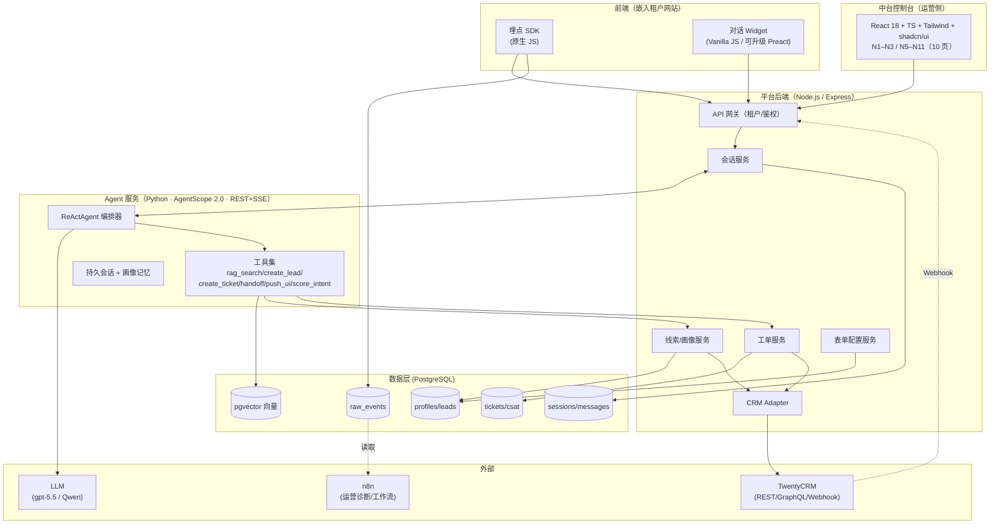
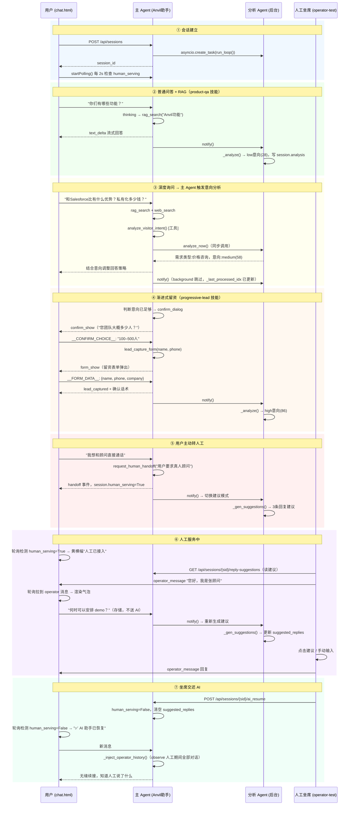

# 功能清单 与 技术选型

> 配套：`portal-ai-saas-落地路线图.md`（产品方案与落地主文档）｜`系统现状.md`（线上现状 + 真实对话流程）
> 版本：v2.3　日期：2026-06-24
> 本文回答三件事：**(1) 为什么这样做**（价值主张与核心决策）；**(2) 有哪些功能**（带优先级 / 阶段 / 对应页面）；**(3) 选用哪些技术**（栈 + 理由 + 输入输出契约）。产品逻辑、流程、评估体系见主文档，不在此重复。
> 框架定调：Agent 用 **AgentScope 2.0**，CRM 用 **TwentyCRM**，留资表单支持可配置必填/选填字段与灵活入库。

---

# 第零部分 · 为什么这样做·产品价值主张

## 0. 核心出发点

> **现状问题**：外贸 / 跨境电商企业的官网访客每天有几百到几千人，但销售团队只跟进其中极少数——因为不知道谁是真正有意向的人、不知道他们关心什么、也没有在对话的关键时刻留下联系方式。
>
> **我们要解决的是**：让对的人在对的时刻被识别、被跟进、被转化。

## 0.1 关键设计决策与价值

### 行为感知层：找到「对的人」

| 设计决策 | 为什么这样做 | 带来的价值 |
|---------|------------|---------|
| 埋点采集停留 / 滚动 / CTA 点击 / 页面轨迹 | 停留时间 + 滚动深度是访客真实兴趣的代理指标，比 PV 更可靠 | 区分「真实阅读」与「误点进来」，有效跳出率比传统跳出率更精准；为意向打分提供行为信号 |
| 访客去重 + 身份归并（visitor_id → unified_id） | 同一个人可能用不同设备 / IP / 时段多次访问；留资前是匿名访客，留资后变线索，需要打通历史 | 销售看到的是完整的「人」而不是碎片化的「会话」；人均行为数据更准确 |
| 流失前兆感知（移向关闭 / 切 Tab / 表单中断） | 用户在离开前 3–5 秒往往有可被检测的行为信号 | 触发挽回对话的时机窗口；减少高意向访客静默流失 |

### 对话与留资层：在「对的时刻」留下信息

| 设计决策 | 为什么这样做 | 带来的价值 |
|---------|------------|---------|
| **页面上下文注入**（访客切换页面时，TDK/URL 静默同步给 Agent，不在聊天框显示） | 访客常在商品详情页问"这个多少钱"，但 Agent 不知道当前页面是哪个商品，只能反问"请问您指哪款"——每次无效反问都增加流失风险 | Agent 直接感知访客正在看的商品，给出精准答案，减少无效来回；访客体验更流畅，信任感更强 |
| **AI 智能体人设**（名称 / 描述 / 人设追加到 system prompt） | 机械感对话是信任杀手——访客一感受到"我在和机器说话"，信任感下降，留资意愿随之降低；品牌需要一个"有名字、有性格"的 AI 顾问 | 对话拟人化，访客信任感提升，对话轮次加深；品牌形象与 AI 语气统一，减少因机械感导致的早期流失 |
| **confirm_dialog 选择题引导**（先以多选了解背景，再渐进留资） | 直接弹留资表单要求"填名字和手机"，访客感觉"被套信息"，本能抵触，拒绝率高；先问偏好和需求，是正常对话行为 | 访客感知为"AI 在帮我了解需求"而非"被套信息"，信息收集更无感；背景信息随对话自然沉淀，线索质量更高，销售跟进命中率提升 |
| **渐进式留资**（confirm_dialog 了解背景后，对话内嵌最小化表单） | 直接弹联系方式表单会造成高拒绝率；访客需要先感受到价值才愿意留信息 | 与直接弹表单相比，留资转化率有显著提升；收集到的信息质量更高（带背景的线索更易跟进） |
| **可配置表单**（必填/选填/自定义字段） | 不同行业 / 业务阶段需要收集不同信息；强制填写过多字段会流失用户 | 运营自主配置，无需开发；线索信息完整性可控；灵活入库（JSONB）避免频繁改表 |
| **AI 推断字段 ✦ 紫色标注** | 对话中 AI 提取的信息（如"公司是外贸型"）与用户主动填写的信息可信度不同 | 销售一眼区分「确认信息」与「推断信息」，避免用错误假设开场；AI 推断可持续校准 |
| **RAG 知识库 + 工具调用** | 单纯的 LLM 会编造产品参数和价格；访客问的具体问题必须有准确依据 | 回答准确率大幅提升；减少因错误信息导致的信任损失；知识库可运营维护 |

### 意向与路由层：把资源集中在「对的线索」

| 设计决策 | 为什么这样做 | 带来的价值 |
|---------|------------|---------|
| **分析 Agent 独立运行**（后台常驻 asyncio Task，不阻塞主对话） | 意向分析是 LLM 调用，耗时 1–3s；如果放在主对话流里会显著增加响应延迟 | 主对话响应速度不受影响；坐席实时看到意向分（每条用户消息后后台更新）；接管时有决策依据 |
| **意向打分两种模式**（预设维度权重 / LLM 综合评估） | 刚上线的客户希望有明确可控的规则（我能理解分数怎么来的）；成熟客户希望 AI 自动综合判断 | 预设模式：可解释、可审计、可调参数；LLM 模式：零配置、自动适应新意向信号；两者在 N3 可切换 |
| **需求类型识别**（价格咨询 / 案例索取 / 功能咨询等） | 不同需求类型对应不同的跟进话术和销售策略；坐席接管前需要快速定位访客关心什么 | 坐席接管时直接看到「这个人在问价格 vs 想要案例」；线索写入 N7 时带需求标签方便分配 |
| **analyze_visitor_intent 工具**（主 Agent 自主决定何时分析） | 不是每条消息都需要分析；由 AI 判断「对话信息已足够」时才触发，减少不必要 LLM 调用 | 节省 token 成本；分析有意义（对话信息足够多时才分析更准确）；主 Agent 可用分析结果调整策略 |

### 人机协同层：复杂场景有人兜底

| 设计决策 | 为什么这样做 | 带来的价值 |
|---------|------------|---------|
| **AI/人工自由切换**（主动转人工 + 坐席手动接管 + 交还 AI） | 纯 AI 无法处理所有场景（大额谈判、情绪激动、复杂定制）；纯人工成本太高 | 混合模式：AI 处理 80% 标准问题，人工处理 20% 高价值场景；人工成本降低的同时客户体验不损失 |
| **chat.html 始终轮询**（感知后台接管/归还状态变化） | 坐席手动接管时，用户侧不应该还在等待 AI 回复 | 坐席接管后用户侧 2s 内感知（黄色横幅）；归还 AI 后同步恢复；无需用户刷新页面 |
| **AI 回复建议**（接管时自动生成 3 条建议 + 实时显示需求类型） | 坐席接管陌生会话时，上下文长、时间紧；手打回复慢且容易答非所问，在大额谈判 / 复杂定制等高价值场景中，成交率直接受坐席首轮回复质量影响 | 接管首次响应时间大幅降低（点击微调比手打快 3–5 倍）；需求类型标注（如「价格咨询」）让坐席答案有针对性；情感安抚 / 精准解答 / 引导留资三种风格按场景选用，高价值场景留资率 / 成交率提升 |
| **人工期间上下文注入**（交还 AI 后 observe 人工阶段对话） | AI 恢复时如果不知道人工说了什么，会重复问题或与坐席答复矛盾 | AI 续接对话自然；用户不需要再解释刚才说的内容；体验无缝 |

### 透明度层：AI 行为可观测、可优化

| 设计决策 | 为什么这样做 | 带来的价值 |
|---------|------------|---------|
| **turn_log**（每轮对话记录 thinking / tool calls / 结果） | AI 的思考过程和工具调用是「黑盒」；坐席和产品需要知道 AI 为什么这么回答 | 坐席接管时有完整上下文（看 operator-test 聊天区的工具卡）；产品发现 AI 错误用工具时可针对性优化 prompt；建立用户对 AI 的信任 |
| **analysis_config.json 热重载**（不重启生效） | 意向打分维度和需求类型分类需要根据实际对话数据持续调整 | 运营可以当天修改配置、当天看效果；A/B 测试不同配置更方便 |
| **operator-test 富渲染**（thinking 块 + tool 卡片） | 测试阶段需要直观看到 AI 的完整决策链路，不能只看最终文字 | 发现 AI 调错工具、thinking 不合理、tool 结果有问题时能快速定位；减少调试成本 |

## 0.2 整体产品价值链

```
访客进站（行为感知）
    ↓  埋点识别兴趣、来源、设备
对话触发（智能对话）
    ↓  AI 答疑 → RAG 保证准确 → 技能指导时机
意向识别（分析 Agent）
    ↓  需求类型 + 意向分 实时输出给坐席
渐进留资（可配表单）
    ↓  confirm_dialog 了解背景 → lead_capture_form 收集信息
线索建档（身份归并）
    ↓  visitor → unified_id → lead，带意向标签入库
人工接管（AI副驾兜底）
    ↓  高价值 / 复杂场景，坐席有建议支撑
CRM 写入（TwentyCRM）—— 第三期
    ↓  Person / Opportunity，完整历史可追溯
转化验收（A/B 看板）—— 第三期
    ↓  LCR 提升达统计显著 → 第三期验收
```

---

# 第一部分 · 功能清单

## 1. 优先级与阶段定义

- **优先级**：P0 = 第一期必备（不做就跑不通主干）；P1 = 次期（让链路能解决复杂问题）；P2 = 增强（闭环与智能）。
- **阶段**：第一期（当前研发版本，约 6–8 周）→ 第二期（知识库升级，约 4–6 周）→ 第三期（人机协同+工单+CRM，约 6–8 周）→ 第四期（闭环与智能，约 6 周）。
- **页面编号**（N1–N3、N5–N11，共 10 页；原 N4 已撤销并入 N3）对应主文档第 10 节「新页面重构清单」。

## 2. 功能优先级清单

| 模块 | 功能 | 优先级 | 阶段 | 页面 | 现状 |
|---|---|---|---|---|---|
| 行为感知 | 埋点采集（停留/滚动/CTA/页面轨迹） | P1 | 第三期 | N1 | 🟡 增强现有访客识别 |
| 行为感知 | 多站点（独立站）维度 + 站点选择器 | P1 | 第三期 | N1 | ⬜ |
| 行为感知 | 访客去重统计口径（DAU/会话周期）+ 单访客按天历史下钻 | P1 | 第三期 | N1 | 🟡 |
| 行为感知 | 手动合并访客（识别为同一人） | P1 | 第三期 | N1/N7 | ⬜ |
| 行为感知 | 有效互动会话 / 校准跳出率 | P1 | 第三期 | N1/N10 | 🟡 |
| 行为感知 | 流失前兆（移向关闭/切Tab/表单中断，触发条件+按会话去重口径见主文档 §4.5） | P1 | 第三期 | N1 | ⬜ |
| 行为感知 | 指标口径自配置（有效互动会话 / 流失前兆，运营方设阈值与开关，开启才计数） | P1 | 第三期 | N1 | ⬜ |
| 对话 | 对话 Widget（text+快捷选项+按钮，前端组件，即 chat.html/chat-widget.js） | P0 | 第一期 | 前端 Widget（配置在 N3） | 🟢 已实现 |
| 对话 | **双 Agent 架构**（主 Agent 对话 + 分析 Agent 后台异步；AgentScope 2.0 ReAct）| P0 | 第一期 | N3 | 🟢 已实现 |
| 对话 | RAG 知识库检索（`rag_search`） | P0 | 第一期 | N5 | 🟢 已实现 |
| 对话 | 开场白/主动招呼触发器 | P0 | 第一期 | N3 | 🟢 复用增强 |
| 对话 | **confirm_dialog 追问弹框**（意图不明时展示多选项引导卡，访客选择/输入后以用户消息进入对话） | P0 | 第一期 | chat.html | 🟢 已实现 |
| 对话 | 富消息组件（快捷选项/按钮/卡片）内置 Widget + `push_ui_component`，**不做独立编排页** | P1 | 第三期 | Widget/N3 | ⬜ |
| 对话 | 流失拦截主动挽回 | P1 | 第三期 | N3 | ⬜ |
| 留资 | **渐进式留资表单**（chat.html 内嵌，字段从 analysis_config.json 动态读取） | P0 | 第一期 | chat.html / N3 | 🟢 已实现 |
| 留资 | **意向收集技能配置弹窗**（N3 内，表单字段与 N7「线索字段设置」同源，只读不可编辑，留资后存到 N7） | P0 | 第一期 | N3/N7 | 🟡 进行中 |
| 留资 | **意向打分**（行为+对话；预设维度权重或 LLM 自动评估，与线索系统升级一并做） | P1 | 第三期 | N3/N6/N7 | ⬜ |
| 留资 | **AI 推断字段颜色区分**（N7 线索列表及详情中 ✦ 紫色前缀标注 AI 推断字段） | P1 | 第三期 | N7 | ⬜ |
| 线索 | **留资后建线索（提交表单/留联系方式才成线索）** | P0 | 第一期 | N7 | 🟡 进行中 |
| 线索 | 人工筛查（有效/无效）+ 售后类转工单 | P1 | 第三期 | N7 | ⬜ |
| 线索 | 手动合并多线索 → 同一客户 | P1 | 第三期 | N7 | ⬜ |
| 线索 | **表单自定义字段可展开**（线索详情 customFields 折叠/展开，折叠时预览前 2 个字段名） | P1 | 第三期 | N7 | ⬜ |
| 线索 | **来源会话 AI 总结**（N7 来源线索提供「💡 AI 总结」按钮） | P1 | 第三期 | N7 | ⬜ |
| 身份 | 身份归并（进站 visitor_id/IP → 留资/登录后 PII → unified_id） | P1 | 第三期 | N6/N7 | 🟡 现状会员/访客二分 |
| 画像 | 事实标签（SQL） | P1 | 第三期 | N6 | 🟢 复用增强 |
| 画像 | 客户 360 视图（历史/会话/画像合一） | P1 | 第三期 | N6 | 🟡 重构合并 |
| 画像 | 叙事画像（LLM 合成） | P2 | 第四期 | N6 | ⬜ |
| 画像 | 情绪识别（单点） | P1 | 第三期 | N2/N6 | ⬜ |
| 画像 | **需求类型识别**（N3 可配预设分类列表或 LLM 自由总结模式；结果实时推送 N2；留资时快照写入 N7） | P0 | 第一期 | N3/N2/N7 | 🟢 已实现（analysis_config） |
| 画像 | 情绪弧度 + 风险预警 | P2 | 第四期 | N2/N6 | ⬜ |
| CRM | TwentyCRM 线索写入（Person/Company/Opportunity） | P1 | 第三期 | N7 | ⬜ |
| CRM | 工单/满意度回写 + 自定义对象 | P1 | 第三期 | N8/N9 | ⬜ |
| CRM | Webhook 事件回流 | P1 | 第三期 | N6 | ⬜ |
| 对话 | **页面上下文注入**（访客每次页面切换，前端采集 TDK/URL 静默同步到 Agent；隐藏消息不在聊天框展示；Agent 据此感知访客当前正看哪款商品） | P0 | 第一期 | chat.html / agent-backend | 🟡 进行中 |
| 埋点 | **智能客服对话埋点**（session 维度：对话轮次 / 首字响应时间 / 对话时长，`/analytics` 接口暴露，后续接 N10 看板） | P0 | 第一期 | agent-backend / N10 | 🟡 进行中 |
| 坐席 | **N2 人工接管/交还 AI**（右上角按钮；接管后 AI 暂停 + 生成回复建议；交还后输入框不可输入，AI 读取人工期间对话续接） | P0 | 第一期 | N2 | 🟢 已实现（operator-test.html） |
| 坐席 | **AI 副驾（回复建议 + 需求类型）**（人工接管期间 3 条建议 + ↻刷新，点击填入输入框） | P0 | 第一期 | N2 | 🟢 已实现 |
| 坐席 | 对话工作台完整版（AI总结/访问轨迹/转存线索/工单草稿/坐席对象区分） | P1 | 第三期 | N2 | 🟡 原型完成待接后端 |
| 坐席 | 技能与负载路由 | P1 | 第三期 | N11 | 🟡 现有客服设置增强 |
| 坐席 | 转人工触发器参数化 + 转人工行为设置 | P1 | 第三期 | N11 | ⬜ |
| 工单 | 自动建单 + **手动新增工单**（关联客户/工单类型/优先级/负责人/描述） | P1 | 第三期 | N8 | 🔴 全新 |
| 工单 | 可自定义**工单类型**配置（售后为主，Agent 自动归类 + 人工调整） | P1 | 第三期 | N8 | 🔴 全新 |
| 工单 | 自动分类 / 智能路由 / 可解释优先级 | P1 | 第三期 | N8 | 🔴 全新 |
| 工单 | SLA 倒计时与超时升级 / 客户确认闭环 | P1 | 第三期 | N8 | 🔴 全新 |
| 知识库 | **知识资产目录与知识板块配置**（统一管理知识资产；6 类板块固定，支持配置切片、清洗、质量评估、检索策略） | P0 | 第二期 | N5 | ⬜ 知识库升级 |
| 知识库 | **元数据规范优化**（门户网站范围选择前置；业务标签改为业务用途；维护行业、场景、敏感词库和统一元数据字段） | P0 | 第二期 | N5 | ⬜ 知识库升级 |
| 知识库 | **健康度评分权重与高级配置**（质量/时效/复用/反馈四维权重可调；扣分参数和阈值可配置并预览影响） | P0 | 第二期 | N5 | ⬜ 知识库升级 |
| 知识库 | **同步状态增强**（实时同步、定时同步、手动更新三类状态；同类型内容支持多选批量操作） | P0 | 第二期 | N5 | ⬜ 知识库升级 |
| 知识库 | **问答测试**（选择测试范围，验证板块或知识组的召回与回答效果） | P0 | 第二期 | N5 | ⬜ 知识库升级 |
| 知识库 | **对话质量运营**（单客户视角，展示召回率、回复率、RAG 准确率、满意度、回复率损耗和未回答问题聚类） | P0 | 第二期 | N5 | ⬜ 知识库升级 |
| 知识库 | **知识健康体检**（文档数、过期文档、待补 FAQ、未命中主题 Top 10；可查看相关对话并跳转补录） | P0 | 第二期 | N5 | ⬜ 知识库升级 |
| 平台运营 | **N12 知识库跨客户质量诊断**（跨客户/行业/套餐看召回、回复、准确率、待补主题和客户质量排行） | P0 | 第二期 | N12 | ⬜ 知识库升级同步优化 |
| 满意度 | CSAT/NPS 采集 | P1 | 第四期 | N9 | 🟡 现有回复调研增强 |
| 满意度 | 反馈情感识别 + 主题聚类 + 改进建议 | P2 | 第四期 | N9 | 🔴 全新 |
| 满意度 | 知识/画像回流 | P2 | 第四期 | N5/N6 | 🟡 未回答转移已有 |
| 评估 | 转化漏斗 + 北极星指标 | P1 | 第四期 | N10 | 🟡 现有数据分析增强 |
| 评估 | A/B 实验框架 + 显著性 | P2 | 第四期 | N10 | ⬜ |
| 埋点 | 埋点可配置（事件 / 维度 / 采集规则 / 看板可见性） | P1 | 第三期 | **后台/平台侧**（非运营 UI） | ⬜ |
| 埋点 | AI 应答质量看板（召回率/回复率已有 + 准确率/CSAT/转人工/损耗归因） | P1 | 第三期 | N10（主）/N5/N9 | 🟡 召回率/回复率已有 |
| 埋点 | 地域 / 语言维度接入看板 | P1 | 第三期 | N1/N10 | 🟡 底层已有 |
| 埋点 | 邀请归因 + A/B（提升主动邀请接受率） | P1 | 第三期 | N3/N10 | ⬜ |
| 埋点 | 客户分层（account 维度，平台运营视角） | P0 | 第四期 | N12 | ⬜ |
| 埋点 | 频率分布 / 漏斗逐跳归因 | P2 | 第四期 | N10 | ⬜ |

## 3. 第一期范围（当前研发版本）

第一期聚焦三件事：**让访客被 AI 对话、被引导留资、坐席可随时接管**。比原规划 MVP 范围更聚焦——第二期先做知识库升级；意向打分、TwentyCRM 写入、身份归并、客户 360、A/B 验收框架顺延至第三期，与线索系统整体升级时一并落地。

**第一期包含（全部 P0，当前研发）：**

1. **双 Agent 架构**（已实现）：主 Agent（Anvil助手）与访客实时对话；分析 Agent 在后台异步循环，每轮消息后识别需求类型，人工接管时生成 3 条坐席回复建议。
2. **Agent 基本信息 → system prompt**：N3 智能体配置中的「智能体名称 / 简要描述 / 人设设置」作为系统提示追加到主 Agent，运营可自定义智能体人格。
3. **需求类型识别技能**（N3 配置）：分类标签可配置（预设分类可新增）或 LLM 自动总结模式两种；分析 Agent 实时识别，结果推送到 N2 坐席工作台右侧，留资时快照写入 N7 线索。
4. **意向收集技能配置弹窗**（N3 配置）：技能配置弹窗中展示线索字段设置（与 N7「线索字段设置」页同源，只读不可编辑）；留资表单字段从 `analysis_config.json` 动态读取；留资后存入 N7 线索池。
5. **前端渐进式留资表单**（chat.html/Widget，已实现）：AI 触发 `lead_capture_form` 后，对话内嵌可配置表单，字段含必填/选填/类型，支持文本/手机/邮箱/单选/多行。
6. **前端追问弹窗 confirm_dialog**（chat.html，已实现）：意图不明时 AI 调用 `confirm_dialog` 展示多选项引导卡；访客选择或手动输入后，内容以用户消息形式进入对话上下文。
7. **N2 在线会话 · 人工接管/交还 AI**（已实现）：对话框右上角「人工接管」按钮暂停 AI 回复并触发生成回复建议；「交还 AI」后访客输入框不可输入，主 Agent 读取人工期间对话历史无缝续接。

**第一期不做（顺延至后续阶段）：**

- 意向打分（待线索系统升级时一并做）
- TwentyCRM 线索写入 / CRM Adapter
- 身份归并（visitor_id → unified_id）
- 客户 360 最小版
- A/B 验收框架
- 工单系统、满意度采集、叙事画像、情绪弧度
- 富消息卡片/轮播
- 埋点增强（地域/语言/邀请归因）

**第一期验收**：坐席在 N2 可人工接管任意会话、看到实时需求类型、选用 AI 回复建议；访客侧留资表单提交后线索可在 N7 查看；配置改 `analysis_config.json` 不重启即生效。

### 3.1 第一期 · 三个客户转化提升角度

> 从产品价值角度看，第一期的七项功能最终服务于三件事：让访客愿意聊、愿意留信息、复杂场景也能接住。

---

**① 对话更拟人化 → 访客留得住**

**过去的问题**：AI 每轮回复风格一致、语气机械，访客一眼看出"这是机器人"→ 信任感下降 → 不愿继续对话 → 早早离开，高意向访客就这样静默流失。

**第一期做了什么**：运营在 N3 填写「智能体名称 / 简要描述 / 人设设置」（如：*名称=Anvil顾问，人设=专业亲切的外贸销售顾问，擅长跨境询盘*），这三段文字直接追加到主 Agent 的 system prompt——AI 从此有名字、有性格、有专业定位，用一致的品牌口吻对话。

**转化意义**：对话拟人化 → 访客信任感提升 → 对话轮次加深 → 留资意愿增强。人设配置修改 `analysis_config.json` 即生效，运营可快速 A/B 测试不同人设对转化率的影响。

---

**② 留资更无感 → 信息收集更顺畅**

**过去的问题**：直接弹出留资表单，要求填姓名和手机，访客感知为"被套信息"→ 本能抵触 → 高拒绝率，大量已产生兴趣的访客因此流失；即便填了，也只有联系方式，没有背景，销售跟进无从下手。

**第一期做了什么**：两步替代一步——

1. **confirm_dialog 选择题**：AI 先问"您是对价格感兴趣，还是想了解方案案例？"访客感知为正常对话，轻松点选；选择结果进入对话上下文，AI 据此调整策略。
2. **渐进式表单**：对话若干轮后，AI 在聊天框内自然插入留资表单——只有姓名和手机必填，其余字段按场景出现；访客全程感觉在"咨询"而非"填表格"。

**转化意义**：留资拒绝率下降；背景信息随对话自然沉淀 → 线索质量更高，销售拿到的不是冷冰冰的手机号，而是"问价格、公司是外贸型、预算中等"的完整画像，跟进命中率大幅提升。

---

**③ 回复建议 → 坐席接管质量更高**

**过去的问题**：坐席接管一个陌生会话时，需要快速阅读完整对话记录、理解访客诉求、手动组织回复——响应慢、容易答非所问；在大额谈判、复杂定制等高价值场景中，首轮回复质量直接影响是否能留住客户。

**第一期做了什么**：接管的瞬间，分析 Agent 自动生成 3 条回复建议（情感安抚 / 精准解答 / 引导留资三种风格），并在右侧面板同步显示「需求类型」标注（如「价格咨询」）。坐席点击建议填入输入框，微调后发送；同类对话累积后还可点击 ↻ 刷新，基于最新上下文重新生成。

**转化意义**：接管首次响应时间显著降低（点击微调比手打快 3–5 倍）；回答有针对性，客户感受到"这个人真的理解我的问题"→ 高价值场景的留资率 / 成交率提升。

---

**④ 页面上下文感知 → 回答更精准，减少无效来回**

**过去的问题**：访客在产品详情页问"这个多少钱"，AI 不知道当前页面是哪款产品，只能反问"请问您指哪款产品"——每多一次确认，访客流失的概率就高一分；外贸场景中，访客往往直接关掉窗口而不是耐心解释。

**第一期做了什么**：每当访客切换页面，前端自动采集当前页的标题、描述、关键词和 URL，静默推送给 Agent——全程不打扰访客、不在对话框展示。Agent 因此在第一轮就知道访客正在看什么，可以直接给出精准答案。

**转化意义**：消除"请问您指哪款"的无效摩擦 → 对话响应更直接，访客感受到"AI 真的在帮我" → 对话继续深入，留资意愿提升。同时，精准的上下文让 RAG 检索更有方向（可直接以商品名为关键词查知识库），回答准确率随之提升。

### 3.2 第一期 · 测试用例与验收指标

> 详细用例见配套文档 [`第一期研发需求边界.md`](第一期研发需求边界.md) §五、§六。本节列核心指标。

**功能验收（上线前，内部测试通过标准）：**

| 测试项 | 目标 |
|---|---|
| 人工接管 → 建议生成时效 | ≤ 10s（10 次接管取均值） |
| 需求类型识别准确率 | ≥ 85%（随机抽取 20 个对话，人工核对） |
| 语言跟随用户（中/英/多语言） | 分别用中/英文发消息，AI 以对应语言回复；特殊符号不触发语言切换 | 100% |
| 配置热更新（改 analysis_config.json 不重启） | 新会话立即生效，100% |
| 人设注入后 AI 回复无乱码/截断 | 100%（测试 10 种不同人设配置） |
| 页面上下文感知（商品页问商品） | Agent 直接回答商品相关信息，不反问"您指哪款"，100% |
| 对话埋点三指标有值 | 完成 3 轮对话后 `/analytics` 返回 `turns_count=3`、`first_token_ms_list` 三项、`session_duration_ms > 0` |

**转化效果验收（上线后跟踪 2 周，与上线前基线对比）：**

| 指标 | 定义 | 目标 |
|---|---|---|
| 平均对话轮次 | ≥3 轮会话的平均轮数 | 提升 ≥ 15% |
| 留资完成率 | 进入对话 → 完成留资表单 | 提升 ≥ 25% |
| 坐席首次响应时长 | 接管 → 第一条坐席消息（中位数） | ≤ 30s（现估计 60–90s） |
| AI 机械感评分 | 内部盲测 10 段对话，被判断「明显像机器人」的段数 | ≤ 3/10 |

> 本期不做 A/B 随机对照（框架在第三期落地），采用上线前后对比。

## 3A. 第二期范围（知识库升级）

第二期聚焦 N5 知识库配置升级，目标是让客户在自己的后台完成知识运营闭环：选择门户网站范围、维护知识内容、配置元数据与健康度规则、测试问答效果、查看对话质量、发现未命中主题并补录。

**第二期包含（知识库升级）：**

1. **知识资产目录与知识板块配置**：统一管理知识内容，支持多来源录入、状态流转、元数据编辑、健康度查看；6 类知识板块固定，运营可配置切片、清洗、质量评估、检索策略和内容概览。
2. **元数据规范优化**：门户网站范围选择前置到元数据规范顶部；“业务标签”统一改为“业务用途”；维护行业、业务用途、场景、敏感词库和统一元数据字段。
3. **健康度评分配置**：健康评分按质量、时效、复用、反馈四个维度分配权重；高级配置提供扣分参数、阈值和预览，让用户直接调整数值。
4. **同步状态增强**：实时同步、定时同步、手动更新三类状态分开展示；同类型内容支持多选批量操作。
5. **问答测试**：支持选择测试范围，验证某个门户网站、板块或知识组的召回与回答效果。
6. **对话质量运营**：客户只看自己智能客服前台对话抽出的指标，包括知识库召回率、AI 回复率、RAG 准确率、满意度、回复率损耗和未回答问题聚类。
7. **知识健康体检**：展示文档总数、过期文档、待补 FAQ、未命中主题 Top 10；未命中主题可查看相关对话、跳转补录或忽略。
8. **N12 平台运营看板同步优化**：跨客户、跨行业、跨套餐的质量诊断放在 N12，不进入客户后台 N5。

**第二期不做**：N5 不做客户/行业筛选；不做 CRM 写回、工单闭环、真实满意度中心；跨客户分析统一放 N12。

**第二期验收**：客户能完成“选择门户网站范围 → 录入/同步知识 → 配置元数据与健康度规则 → 问答测试 → 查看对话质量 → 健康体检发现未命中主题 → 查看原始对话 → 去补录”的完整闭环；N12 能展示平台跨客户知识质量诊断入口。

---

## 4. 现状 7 业务模块 → 功能清单的承接

线上系统已有一条真实对话流程（见 `系统现状.md` §2.13），本次功能清单是对它的"串链 + 补缺"。对应关系：

| 现状子模块 | 承接功能 | 主要落地页面 | 状态 |
|---|---|---|---|
| 前置识别（身份+地域） | 埋点采集 + 身份归并 | N1 / N6 | 🟡 升级为三层归并 |
| 在线问答（原有）/ AI 搜索（业务6） | RAG 知识库检索 | N5 | 🟢 复用 |
| 产品推荐（业务5） | 富消息卡片（Widget + push_ui）+ 行为驱动触发 | Widget / N1 | ⬜ |
| 产品询价（业务4） | 渐进式留资 + 可配置表单 | N3 / N7 | ⬜ |
| 意图线索收集（业务7） | 意向打分 + create_lead + 身份归并 | N3 → N6/N7 | ⬜ |
| 转人工（业务2） | 一键转人工 + 坐席工作台 + 路由 | N2 / N11 | 🟡 增强 |
| 售后工单（业务3） | 工单系统（建单/分类/路由/SLA） | N8 | 🔴 全新 |
| 满意度调研 / 二次服务 | CSAT/NPS + 反馈分析 + 回流 | N9 | 🔴 全新 |
| 数据存储分析 / 数据应用 | 转化看板 + 北极星 + A/B | N10 | 🟡 增强 |

---

# 第二部分 · 技术选型

## 5. 总体架构与技术栈

沿用现有平台技术栈（Node.js + React + PostgreSQL，与 TwentyCRM 同构），新增一个 Python 的 Agent 服务（AgentScope）。两者通过 HTTP（REST+SSE）通信。



## 6. 各部分技术选型与理由

| 部分 | 选型 | 理由 |
|---|---|---|
| 埋点 SDK | 原生 JS（演进自 `portal-tracker.js`），打包 gzip<15KB | 无框架依赖、可嵌任意网站；补本地缓冲+重发保证不丢事件 |
| 对话 Widget | Vanilla JS IIFE（现状 `chat-widget.js`），可升级 Preact + Vite 独立打包 | 独立 bundle 不污染宿主页面；现状已有 SSE 流式 + 留资表单可用参照 |
| 中台控制台 | **Vite + React 18 + TypeScript + Tailwind + shadcn/ui + React Router 6** | `prototype/` 已落地 5 个页面原型，组件库 radix-ui，图标 lucide-react |
| 平台后端 | Node.js（Express，沿用现有；现状 `server/index.js`） | 与现有平台 + TwentyCRM 同栈，复用租户/鉴权 |
| **Agent 编排** | **AgentScope 2.0（Python）** | 生产级框架。ReAct 范式 + 原生异步并行工具调用；**事件系统**（每步 text/thinking/tool call/result 以类型化流输出，直接驱动 Widget 富消息渲染）；**执行安全**（敏感工具可拦截/人工复核、交回自有后端执行后断点续跑、沙箱）；**Agent Service**（REST+SSE 托管、多租户多会话并发、可恢复流、持久会话、定时运行、凭据托管）；MCP 协议；FastAPI 部署生态 |
| LLM | gpt-5.5（现状经 vveai.com 代理）；Qwen 备选（多语言/外贸友好） | 外贸多语言场景；可按租户/成本切换 |
| RAG 向量库 | pgvector（复用现有 PostgreSQL） | 不引入新组件；现有知识库"学习"流程对接 embedding |
| **CRM** | **TwentyCRM（自托管）** | Core API(REST+GraphQL) 做 CRUD、Metadata API 建自定义对象/字段、Webhook 回流；自定义对象自动生成端点 |
| 主数据库 | PostgreSQL（复用） | 与 TwentyCRM 同库技术；事件、会话、画像、工单统一 |
| 事件可靠性 | SDK 缓冲队列 + 后端幂等（event_id 去重） | 丢事件=丢线索 |
| 工作流/运营诊断 | n8n（`workflow-b-diagnosis.json`） | 对内分析与自动化，与对外 Agent 互补 |
| 消息/异步 | Redis（轻量队列，可选） | 转人工通知、Webhook 处理、CSAT 推送解耦 |

> 异构说明：AgentScope 是 Python、平台是 Node。用 AgentScope 2.0 的 **Agent Service** 把 Agent 托管为 REST+SSE 服务（自带多租户/多会话并发、持久会话、凭据托管），Node 会话服务作为客户端消费 SSE 事件流——无需自写微服务管线，Agent 迭代与平台解耦。

## 7. AgentScope 2.0 Agent 设计

- **双 Agent 架构**（第一期已实现）：
  - **主 Agent**（Anvil助手）：ReAct 范式，面向访客实时对话；Toolkit 在 Session 闭包中组装，PermissionMode.BYPASS 跳过人工审批。
  - **分析 Agent**：后台常驻 `asyncio.Task`，独立 run_loop；每条用户消息后异步执行需求识别 + 意向分析；人工接管时额外生成坐席回复建议。两 Agent 共享 Session 对象，分析 Agent 先于主 Agent 初始化。
- **事件流驱动 UI**：`agent_runner.py` 将 AgentScope 事件转换为 SSE（`thinking_delta / text_delta / tool_start / tool_result / form_show / confirm_show / handoff / done`），前端边生成边渲染。
- **工具集（第一期）**：

  | 工具 | 归属 | 说明 | 状态 |
  |---|---|---|---|
  | `rag_search` | 主 Agent | 知识库检索（knowledge/ 目录全文匹配） | 🟢 已实现 |
  | `lead_capture_form` | 主 Agent | 生成渐进式留资表单（字段从 analysis_config.json 读取） | 🟢 已实现 |
  | `confirm_dialog` | 主 Agent | 追问选项弹框（`__CONFIRM__:{}`） | 🟢 已实现 |
  | `request_human_handoff` | 主 Agent | AI 主动转人工（`__HANDOFF__:{}`） | 🟢 已实现 |
  | `classify_demand` | 分析 Agent | 需求类型识别（分类标签从 config 读取） | 🟢 已实现 |
  | `suggest_replies` | 分析 Agent | 生成坐席回复建议（3 条，人工接管期间） | 🟢 已实现 |
  | `score_intent` | 分析 Agent | 意向打分（当前 mock，第三期激活） | 🟡 占位 |
  | `create_lead` | 主 Agent | 写线索到 N7（接后端，第一期对接 session 存储，第三期对接 TwentyCRM） | 🟡 进行中 |

- **运行时配置**：`analysis_config.json` 热重载——分类标签、评分维度、留资字段修改后立即生效，无需重启。
- **记忆**：短期 = Session 内 ChatMessage 列表；长期画像库 = 第三期对接。

## 8. 各部分输入输出（I/O 契约）

### 8.1 埋点 SDK
- 输入：浏览器事件（load/scroll/click/pagehide）。
- 输出：`POST /webhook/track`，JSON `{event_id, event_type, session_id, visitor_id, tenant_id, page_url, props{...}, timestamp}`。
- 事件类型枚举：`page_view / scroll_depth / click / page_leave`；流失前兆 `move_to_close / form_interrupt / tab_switch`。

### 8.2 会话服务 ↔ Agent 服务
- 会话服务 → Agent：
  ```json
  {
    "tenant_id": "t_acme", "session_id": "s_4f9c",
    "visitor_id": "v-abc", "unified_id": "u_123 | null",
    "message": { "type": "text|component_click", "text": "...", "value": "intent_pricing" },
    "context": { "history": [...], "profile_facts": {...}, "agent_config": {...} }
  }
  ```
- Agent → 会话服务：
  ```json
  {
    "reply": { "text": "...", "components": [ {"type":"quick_replies","options":[...]} ] },
    "actions": [ {"tool":"create_lead","status":"ok","lead_id":"l_1"} ],
    "intent_level": "high|medium|low", "trace_id": "..."
  }
  ```

### 8.2.1 对话工作台（N2）
- **会话对象**：`entity_type` ∈ `visitor | lead | member`；列表/表头展示身份标签 + 归属地区 + 在线状态（在线/已离线）。同一会话可随留资/登录从 visitor → lead → member 升级。
- **AI总结** `[GET] /api/conversations/{id}/ai-summary` → `{ updated_at, overall, lead_info:{email,phone,other_contact,company,contact_name}, timeline:[{date,text}], member:{bound,member_id?}, lead:{lead_id,status,company,phone,email,contact_name,other_contact}|null }`（字段缺失返回空串，前端显示"未提供"）。
- **AI 重新总结** `[POST] /api/conversations/{id}/ai-summary/regenerate`。
- **访问轨迹** `[GET] /api/conversations/{id}/visit-track` → `[{time,page,stay}]`（完整轨迹跳 N1 访客洞察 `?unified_id=`）。
- **转存线索** `[POST] /api/conversations/{id}/save-as-lead`：把当前对话对象留资/手动转存为线索，已关联线索则更新，否则新建（记录 IP/来源/已识别联系方式）。
- **退出会话** `[POST] /api/conversations/{id}/exit`。
- **接手 / 发送 / 采纳建议**：见 §8.2 与现状转人工接口。
- **需求类型**（原「关注点 / 痛点」）：由分析 Agent 每轮实时推送（WebSocket），N2 右栏「AI 副驾」区展示当前会话推断出的需求类型标签。
- **刷新回复建议** `[POST] /api/conversations/{id}/reply-suggestions/refresh`：坐席手动触发分析 Agent 重新生成 3 条建议（信息型 / 引导型 / 情感共鸣型，风格对齐 N3 人设 `response_style`）。
- **手动接管** `[POST] /api/conversations/{id}/takeover`：坐席后台主动接管，`session.mode` 改为 `"human"`，分析 Agent 同步切换建议模式。
- **交还 AI 客服** `[POST] /api/conversations/{id}/handback-ai`：坐席主动交还，`session.mode` 回 `"ai"`，主 Agent 收到含 `handback_context`（`role="system"`）的消息、读取完整 conv_history 续接对话；分析 Agent 退出建议模式回归后台分析。

### 8.3 RAG 检索工具
- 输入：`{query, tenant_id, top_k}`。
- 输出：`{chunks:[{text, doc_name, score}], sources:[...]}`（租户维度过滤）。

### 8.4 可配置留资表单（本次重点，配置入口在 N3「意向线索收集」技能）

> 运营在 N3 技能设置点「意向线索收集」的「配置」→ 弹窗设置渐进式留资时机（渐进式 / 表单兜底、触发轮次）与下列表单字段。

**字段配置** — `form_field_config` 表：`field_key / label / type / required / options / order / enabled / crm_field`。
`type` 枚举：`text / email / phone / select / multiselect / textarea / number`。

- **渐进式留资策略** `[PUT] /api/agents/{agent_id}/lead-capture`：`{timing:"progressive|form_fallback", trigger_rounds, fields:[...]}`。
- **提交输入**：`{form_id, session_id, values: {field_key: value, ...}}`。
- **校验**：后端按配置校验必填/类型；缺必填则拒绝并返回缺失项。
- **灵活入库**：`leads` 表 = 固定列（name/email/phone/company）+ `custom_fields JSONB`。新增字段无需改表结构。
- 输出：`{lead_id, unified_id, crm_ref_id}`。

### 8.5 留资建线索 + 身份归并

**访客 ≠ 线索，留资后才建线索**：访客进站只建访客档案（行为，N1）；留资（提交表单 / 对话中留联系方式）时才建线索（N7），并同时做身份归并。

- **留资建线索** `[POST] /api/leads/from-submit`
  - 输入：`{visitor_id, ip, source_form, source_site, lang?, session_id, pii:{customer_name,phone?,email?}, custom_fields?}`。
  - 逻辑：先做身份归并（见下）；命中已有 Person 则更新其线索/客户记录，否则新建线索，状态 `pending`（待处理）；会员路线直接关联已有客户档案。
  - 输出：`{lead_id, unified_id|null, status:"pending"}`。
- **身份归并（留资 / 登录）** `[POST] /api/identity/resolve`
  - 输入：`{visitor_id, ip, pii:{email,phone}, member_id?}`。
  - 逻辑：按 email/phone/会员号规范化匹配已有 Person → 命中则合并到同一 `unified_id` 并把该 `visitor_id` 历史匿名行为回溯挂载，邮箱域名归 Company。
  - 输出：`{unified_id, merged_visitor_ids:[...]}`。
- **人工筛查** `[PATCH] /api/leads/{lead_id}`：`{status: "following|invalid"}`。
- **转为客户** `[POST] /api/leads/{lead_id}/convert`：值得跟进的线索转客户（→ N6）。
- **删除线索** `[DELETE] /api/leads/{lead_id}`。
- **线索字段设置** `[PUT] /api/lead-fields`：配置留资表单收集字段与必填规则；与 N3「意向收集」技能的渐进式留资可配置表单同源。
- **手动合并** `[POST] /api/leads/merge`：输入 `{primary_unified_id, merge_lead_ids:[...]}`，把多条线索历史回溯挂到主客户；高权限、可审计、可回滚。
- **列表检索** `[GET] /api/leads?status=&source=&from=&to=&q=`：状态 Tab（待处理/跟进中/已转化/无效）、来源、提交时间范围、关键词。

**N1 访客洞察（行为视角，见主文档 §4.5/§4.6）**：

- **访客列表（多周期聚合）** `[GET] /api/visitors?site_id=&range=&type=`
  - 输出：每行一个访客 `{visitor_id, unified_id?, visitor_name?, company{name,source:"ip|lead"}?, ip, region, site_id, route, session_count, key_page_repeat_visits, total_dwell_seconds, churn_signal, intent_level, last_visit_time}`；统计口径为时间范围内跨周期聚合。
  - 站点维度：`site_id` 支持 `all` 汇总或单站；DAU = 当天去重 visitor_id。
- **单访客下钻 · 按天历史** `[GET] /api/visitors/{visitor_id}/daily-stats`
  - 输出：`[{date, sessions, dwell_seconds, pages_viewed, max_scroll_percent, had_key_page}]`（多周期视角）。
- **单访客下钻 · 单次会话事件** `[GET] /api/visitors/{visitor_id}/events?session_id=`（单周期视角，事件时间线）。
- **手动合并访客** `[POST] /api/visitors/merge`：`{primary_visitor_id, merge_visitor_ids:[...]}`，按天历史/会话合并到主访客，统一 `unified_id`；同 IP ≠ 同一人，需人工确认。

### 8.6 CRM Adapter ↔ TwentyCRM
- 输入：标准化对象 `{type:"lead|ticket|csat", payload:{...}, custom_fields:{...}}`。
- 处理：标准字段 → Person/Company/Opportunity（REST/GraphQL）；自定义字段 → Metadata API 预建字段；工单 → 自定义对象 Ticket。
- 输出：`{crm_object, crm_ref_id}`；订阅 Webhook 回流阶段变更。

### 8.7 工单服务（第三期，售后服务为主）
- **自动建单（Agent）** 输入：`{session_id, summary, root_cause, category, intent_score, sentiment}`。
- **手动新增工单** `[POST] /api/tickets`：输入 `{title, category, unified_id?(关联客户), priority, assignee?, description}`；`unified_id` 关联后该工单在客户 360（N6）可见；`assignee` 留空走智能路由自动分配。
- 输出：`{ticket_id, priority, assignee, sla_due, status, category_by:"ai|human", category_confidence}`；关闭时触发 CSAT。
- 枚举：`category`（工单类型）= **可配置 key**（售后为主，默认 `product_fault/return_exchange/logistics/billing/account/complaint`，可自定义增删）；`priority = urgent/high/medium/low`；`status = open/in_progress/pending_confirm/closed`；`sla_state = normal/warning/overdue`。
- **工单类型配置** `[PUT] /api/ticket-categories`：输入 `[{key, label, desc, color, enabled}]`。`desc` 作为提示注入 Agent，对话中 Agent 据此**自动判断工单类型**（带置信度）；坐席可在工单详情 `[PATCH] /api/tickets/{id} {category, category_by:"human"}` **人工调整**。

### 8.7.1 转人工触发器（N11，参数可填写）
- **保存触发器** `[PUT] /api/routing/triggers`：输入 `{triggers:[{key, enabled, params:{...}}], settings:{...}}`。
- 触发器参数（可填写）：高意向阈值 `intent>=N`、连续未命中 `rounds=N` + `min_conf`、用户要求 `keywords`、情绪分 `sentiment<X`、高敏关键词 `keywords`。
- 转人工行为设置：`greeting`（提示语）、携带上下文 `carry_summary/profile/sentiment/suggestion`、`queue_timeout_min`、`no_seat_fallback = leave_message|queue|ai_continue`。

### 8.8 满意度（第四期）
- 输入：工单关闭事件 `{ticket_id, unified_id}`。
- 输出：CSAT 记录 `{score, feedback, themes:[...]}`；回流画像（风险标签）+ 知识库。

### 8.9 转化看板（评估）
- 输入：events/sessions/leads/tickets/csat 聚合查询（带 A/B 分组）。
- 输出：北极星（LCR/CSAT/留存）+ 漏斗各级转化率 + 显著性。
- 枚举：`ab_test_status = running/significant/not_significant/ended`。

### 8.10 埋点配置（后台/平台侧）+ AI 质量看板（见主文档 §17）
> 埋点配置不做运营 UI 页面；运营方在 N10 等页面直接看采集后的关键数据。
- **埋点配置** `[PUT] /api/tracking/config`（后台/平台调用，非运营页面）
  - 输入：`{events:[{key, enabled}], dimensions:[{key, enabled}], rules:{invite_threshold:{dwell_sec, scroll_pct}, effective_session:{min_dwell_sec, require_interaction}, key_pages:[...]}, board_visibility:[...]}`。
  - 可配置事件 key：`page_view/scroll_depth/click/page_leave/form_interrupt/churn_signal/ai_reply/invite_shown/invite_accept`。
  - 可配置维度 key：`site_id/region/language/account_id/industry/plan/device/copy_version`。
- **AI 回答质量日志** `[POST] /webhook/ai-reply-log`
  - 输入：`{session_id, question, hit_chunk_ids:[...], cited_docs:[...], similarity, is_fallback, feedback:"up|down|none", handoff_after, repeated}`。
  - 弱标签：`feedback=down` / `handoff_after` / `repeated` → 判"答得不好"。
- **AI 质量看板** `[GET] /api/quality?dim=account|industry|region`
  - 输出：`{recall_rate, reply_rate, rag_accuracy, reply_loss:{recall_unused, fallback}, handoff_rate, csat, top_miss_topics:[...]}`（可按维度下钻）。
- **邀请归因** `[GET] /api/invites/attribution`：按 `策略/阈值/文案版本/页面/设备` 聚合曝光/接受/接受率，支持 A/B。
- **地域语言** `[GET] /api/analytics/region`：按地区/语言聚合接待/互动/转化/邀请接受率。

### 8.11 指标口径配置（N1，运营方可设置）
> 区别于 §8.10 埋点采集（后台侧）：这里是**运营方**对两个派生指标的判定口径自配置，开启的条件/信号才计入计数；不改底层采集。
- **保存口径** `[PUT] /api/metrics/config`
  - 输入：
    ```json
    {
      "effective_session": { "enabled": true, "match_mode": "all|any",
        "scroll": {"on": true, "min": 50}, "dwell": {"on": true, "min": 30},
        "click": {"on": true}, "chat": {"on": false} },
      "churn": {
        "move_to_close": {"on": true},
        "tab_switch": {"on": true, "only_unsubmitted": true},
        "form_interrupt": {"on": true, "idle_sec": 8} }
    }
    ```
  - 行为：`effective_session.enabled=false` → 计全部会话；`churn.*.on=false` 的信号不计入「流失前兆触发」。改完即时生效于后续统计。

## 9. 关键状态枚举汇总（数据契约）

> 来源于 `prototype/` 各页面 TypeScript 类型定义，作为前后端共享的状态契约。

| 维度 | 枚举值 |
|---|---|
| 访客类型 | `all / anonymous / identified` |
| 线索路线 / 访客路线 | `anonymous`（匿名访问）/ `member`（登录会员） |
| 站点维度 | `site_id`：`all`（全部站点）或具体独立站 id |
| 企业来源 | `ip`（IP 识别）/ `lead`（留资填写） |
| 事件类型 | `page_view / scroll_depth / click / page_leave` |
| 流失前兆 | `move_to_close / form_interrupt / tab_switch / none` |
| 意向等级 | `high / medium / low` |
| 会话渠道 | `ai / human` |
| 线索状态 | `pending`（待处理·留资后建）/ `following`（筛查有效·跟进中）/ `converted`（已转化·转客户）/ `invalid`（无效） |
| 留资状态 | `anonymous`（未留资）/ `submitted`（已留资·已识别） |
| 线索来源 | `ai_chat / form / manual` |
| CRM 同步状态 | `not_synced / syncing / synced / error` |
| 工单状态 | `open / in_progress / pending_confirm / closed` |
| 工单类型 | **可配置 key**（售后为主，默认 `product_fault / return_exchange / logistics / billing / account / complaint`，可自定义增删） |
| 类型归属 | `ai`（Agent 自动归类，带 confidence）/ `human`（人工调整） |
| 工单优先级 | `urgent / high / medium / low` |
| SLA 状态 | `normal / warning / overdue` |
| A/B 状态 | `running / significant / not_significant / ended` |

## 10. 落地顺序建议（技术视角）

**第一期（当前研发，进行中）：**

1. ✅ 双 Agent 架构（agent-backend FastAPI + AgentScope 2.0）。
2. ✅ 主 Agent 工具集：`rag_search`、`lead_capture_form`、`confirm_dialog`、`request_human_handoff`。
3. ✅ 分析 Agent 后台循环：`classify_demand`、`suggest_replies`。
4. ✅ N2 人工接管/交还 AI（operator-test.html）。
5. 🟡 Agent 基本信息（N3 名称/描述/人设）→ system prompt 追加。
6. 🟡 N3 意向收集技能配置弹窗（展示 N7 线索字段，只读）；留资表单字段与 N7 保持同源。
7. 🟡 N3 需求类型识别技能配置（预设分类可新增 / LLM 模式切换）。

**第二期（知识库升级）：**

1. N5 知识资产目录与知识板块配置。
2. N5 元数据规范、门户网站范围选择、业务用途字段统一。
3. N5 健康度评分权重与高级配置。
4. N5 同步状态、问答测试、对话质量运营、知识健康体检闭环。
5. N12 平台运营看板补跨客户知识质量诊断。

**第三期（接 CRM 与工单）：**

1. 定数据契约：`sessions/messages` 持久化表 + `form_field_config` + `leads(固定列+JSONB)`。
2. 意向打分（配为交后端执行，与线索系统一起做）。
3. 身份归并（visitor_id → unified_id）+ 客户 360 最小视图。
4. 接 TwentyCRM：Metadata API 建自定义字段/对象，写 CRM Adapter。
5. A/B 框架 + 留资漏斗 SQL，进入第三期验收。
6. 工单系统（建单/分类/路由/SLA）。

> 纪律：确定性事实（意向规则、必填校验、归并匹配）交代码/SQL；叙事与多轮对话交 LLM；所有工具出入参 JSON Schema 校验、关键动作可审计。

## 11. 本地服务端口规划

| 服务 | 端口 | 启动命令 |
|---|---|---|
| sale-demo 后端 API | 8005 | `npm run server`（sale-demo/，即 `node server/index.js`） |
| sale-demo 前端静态 | 8002 | `npm run dev`（sale-demo/，即 `npx serve public --listen 8002`） |
| prototype 中台原型 | 1234 | `npm run dev`（prototype/） |

---

# 第三部分 · 当前实现进展（2026-06-05）

## 12. 已实现的技术组件

| 组件 | 文件 | 实现状态 | 说明 |
|---|---|---|---|
| 行为埋点 SDK | `sale-demo/public/tracker/portal-tracker.js` | ✅ 运行 | 四类事件（page_view/scroll/click/leave）→ PostgreSQL `raw_events` |
| 后端 API | `sale-demo/server/index.js` | ✅ 运行 | Express，端口 8005，含埋点接收/页面指标/访客画像/AI对话/线索同步 |
| AI 对话 Widget | `sale-demo/public/widget/chat-widget.js` | ✅ 完成 | 纯 Vanilla JS IIFE，SSE 流式 Bot，留资表单，TwentyCRM 同步徽章 |
| AgentScope 连接 | `server/index.js POST /api/ai/session` | ✅ Session 管理 | 已在 Ubuntu:8000 创建 Agent（Anvil）和 Credential（gpt-5.5） |
| LLM 透传代理 | `server/index.js POST /v1/chat/completions` | ✅ 完成 | OpenAI 兼容代理，供 Ubuntu AgentScope 调用避开网络隔离 |
| AI 流式对话 | `server/index.js POST /api/ai/chat` | ✅ 完成 | AgentScope `/chat/` SSE → OpenAI delta → 浏览器 |
| TwentyCRM 连接 | `server/index.js POST /api/crm/lead` | ✅ 线索写入 | GraphQL `createPerson`，含 name/email/phone(CN)/company |
| 中台原型（N1） | `prototype/src/pages/N1-VisitorInsightsPage.tsx` | ✅ 原型 | 访客洞察页面，shadcn/ui |
| 中台原型（N6） | `prototype/src/pages/N6-Customer360Page.tsx` | ✅ 原型 | 客户管理列表（沿用现状列 + 意向等级/归并标识）+ 客户 360 详情 |
| 中台原型（N2） | `prototype/src/pages/N2-AgentDeskPage.tsx` | ✅ 原型 | 对话工作台；需求类型（原关注点/痛点）、↻ 刷新回复建议；AI总结弹窗含时间轴 |
| 中台原型（N3） | `prototype/src/pages/N3-AgentConfigPage.tsx` | ✅ 原型 | 智能体配置；技能 agentType 分类标注+筛选；需求类型识别技能；意向打分两种模式可配置 |
| 中台原型（N7） | `prototype/src/pages/N7-LeadPoolPage.tsx` | ✅ 原型 | 线索池；AI需求类型✦紫色标注；customFields可展开；来源会话💡AI总结弹窗；需求类型字段统一 |
| 中台原型（N8） | `prototype/src/pages/N8-TicketWorkbenchPage.tsx` | ✅ 原型 | 工单工作台 |
| 中台原型（N10） | `prototype/src/pages/N10-ConversionDashboardPage.tsx` | ✅ 原型 | 转化看板 |

## 13. AgentScope 已配置资源（Ubuntu 172.25.171.180:8000）

| 资源 | ID | 说明 |
|---|---|---|
| Credential | `83281c3b0699413aaf819582fb5154f2` | openai_credential，name=gpt-5.5，base_url 指向 Mac 代理 `http://172.25.170.96:8005/v1` |
| Agent | `809b3501f76c41b197a91b4427bed0b9` | name=Anvil，关联上述 Credential |

> AgentScope Session 在 Widget 初始化时通过 `POST /sessions/` 创建，`x-user-id: user-001`。实际 LLM 推理：Ubuntu AgentScope → Mac `/v1/chat/completions` 代理 → vveai.com（Ubuntu 无外网，经 Mac 出网）。
> ⚠️ AgentScope 服务重启后 credential `base_url` 可能回退为 `https://api.vveai.com/v1`，需重新 PATCH 指回 Mac 代理。

## 14. TwentyCRM 已配置（Ubuntu 172.25.171.180:8006）

- 认证方式：JWT Bearer Token（API Key）
- 写入对象：`Person`（标准对象），字段 name / emails / phones（countryCode: CN）/ jobTitle（公司名）
- 接口：`POST /graphql`，mutation `CreatePerson`

---

# 第四部分 · Agent 产品逻辑 · 泳道图 · 测试流程

> 本部分说明四类角色的介入时机与决策规则，配合泳道图和连续测试用例覆盖全部 Agent 能力边界。

## 15. 四角色与介入时机

| 角色 | 实现文件 | 介入条件 | 停止条件 |
|---|---|---|---|
| **用户**（访客） | `chat.html` | 任何时候 | — |
| **主 Agent**（Anvil助手） | `agent_runner.py` | `human_serving = False` 且用户发消息 | `human_serving = True`（人工或 handoff 工具触发） |
| **分析 Agent**（后台常驻） | `analysis_agent.py` | 每条用户消息后 `notify()`；主 Agent 显式调用 `analyze_visitor_intent` 工具 | 会话结束 / `_terminated=True` |
| **人工坐席** | `operator-test.html` | `human_serving = True` 后坐席主动输入 | 坐席点击「交还 AI」 |

### 为什么这样分工，带来什么价值

**主 Agent 只在无人工时运行**：避免 AI 与人工同时回复造成混乱；坐席接管时 AI 立即停止，逻辑清晰。

**分析 Agent 与主 Agent 完全解耦**：意向分析是单独的 LLM 调用（1–3s），若串行会拖慢主对话响应；异步独立运行，主对话零延迟，坐席实时获得意向分。

**`analyze_visitor_intent` 工具让主 Agent 自主决策**：后台分析是"盲目"更新的，主 Agent 调用工具是"有目的"的——在判断要推留资或转人工之前主动获取分析结果，决策有依据而不是凭感觉。

---

## 16. Agent 调用决策规则

### 16.1 RAG 知识库（`rag_search`）

| 触发 | 不触发 |
|---|---|
| 用户询问 Anvil 功能、价格、版本差异 | 打招呼 / 纯情绪表达 |
| 用户询问部署方式（SaaS / 私有化） | 问题与产品无关 |
| 用户对比竞品（先 rag_search 了解自身） | 上下文已有足够信息，无需重复调用 |

**价值**：LLM 会编造价格和参数，RAG 保证回答有依据；知识库可运营方自主维护，更新无需改代码。

### 16.2 网络搜索（`web_search`）

仅在用户提到竞品名称或分享外部链接时触发；用于了解竞品信息后做对比，不用于查询自身产品（那是 RAG 的职责）。

### 16.3 渐进式留资：`confirm_dialog` → `lead_capture_form`

**触发条件（需同时具备）**：

- 用户追问了价格细节 / 版本差异，或主动对比多方案
- 用户提到了公司名称、团队规模、预算区间或决策场景
- 用户明确要求演示、试用、报价单或实施方案
- 对话已进行 3 轮以上且用户持续深入提问

**操作流程**：先 `confirm_dialog`（了解一个维度的背景，等用户回复后再继续），再 `lead_capture_form`（只收必填：姓名 + 手机，其余选填）。

**为什么两步走**：直接弹表单拒绝率高；先用确认对话框了解背景，让访客感受到被理解而不是被推销，留资转化率更高，且收到的线索带有背景标签，销售跟进效率翻倍。

### 16.4 意向分析（`analyze_visitor_intent`）

**主 Agent 自行判断是否调用**，不是每轮都调：

| 调用时机 | 不调用时机 |
|---|---|
| 访客主动问价格 / 版本差异 / 采购预算 | 首轮打招呼或基础功能询问 |
| 对话已进行 3 轮以上，需判断策略 | 已完成留资，进入售后阶段 |
| 访客提到公司名、团队规模、决策周期 | 用户刚回答 confirm_dialog，信息仍在收集中 |
| 考虑是否推留资表单或转人工顾问 | — |

**调用后策略**：高意向（≥75）→ 直接推留资表单或转人工；中意向（45–74）→ 引导 Demo / 深入介绍；低意向（<45）→ 专注答疑，建立信任，暂不推销。

### 16.5 人工转接（`request_human_handoff`）

**必须转接**：用户明确要"真人" / 情绪激动 / 大额商务谈判。
**建议转接**：AI 连续 2 次无法回答同一问题；涉及合同细节或 SLA 条款。

---

## 17. 泳道图：完整会话生命周期



---

## 18. 完整连续测试流程

> 以下测试用例设计为**连续场景**——在同一个浏览器 session 中按序执行，复现一个访客从进站到留资到人工跟进的完整链路。每个用例都有独立可验证的检查点。

### 前置准备

```
启动 agent-backend:  cd agent-backend && python main.py   # :8001
启动静态文件服务:   cd sale-demo && npx serve public --listen 8002
打开用户对话框:    http://localhost:8002/chat
打开坐席面板:      http://localhost:8002/operator-test.html
```

---

### TC-01　基础功能询问 → RAG 调用 → 不推留资

**用户操作**：打开 chat.html，输入 `"Anvil 有哪些主要功能？"`

**预期主 Agent 行为**：
1. thinking 块出现（含推理过程）
2. 调用 `rag_search`，tool card 显示工具名和查询参数
3. 流式输出功能介绍，不弹留资表单

**预期分析 Agent 行为**：后台静默运行 `_analyze()`，`/api/sessions/{sid}/analysis` 返回 `intent_level: "low"`

**检查点**：
- [ ] thinking 块可见
- [ ] tool card 显示 `rag_search`
- [ ] 回答内容基于知识库，无编造
- [ ] 无 `form_show` 事件
- [ ] `/analysis` 接口有分析结果，`intent_level = "low"`

---

### TC-02　价格随口询问 → 回答但不推销

**用户操作**：紧接 TC-01，输入 `"你们多少钱一年？"`

**预期主 Agent 行为**：
1. `rag_search("Anvil 价格方案")`
2. 回答价格区间
3. 自然结尾（可问一个跟进问题），**不出现** `confirm_dialog` 或 `lead_capture_form`

**检查点**：
- [ ] 无 `confirm_show` 事件
- [ ] 无 `form_show` 事件
- [ ] 价格信息有据可查（来自 RAG 结果）

---

### TC-03　多轮深度询问 → 分析 Agent 意向分升级

**用户操作（3 条消息连续发送）**：
1. `"你们支持私有化部署吗？实施周期大概多长？"`
2. `"和 HubSpot 比你们有什么优势？"`
3. `"我们公司 200 人，做外贸，现在在评估几款 CRM"`

**预期主 Agent 行为**：
- 第 1 条：`rag_search`（私有化部署信息）
- 第 2 条：`rag_search` + `web_search`（竞品）
- 第 3 条：`analyze_visitor_intent` 工具出现（对话信息足够，主动分析）

**预期分析 Agent 行为**：后台三次更新，意向分依次上升：`low → medium → medium/high`

**检查点**：
- [ ] 第 3 条消息触发 `analyze_visitor_intent` tool card
- [ ] tool card 结果中显示需求类型（如"功能咨询"或"价格咨询"）和意向等级
- [ ] `/analysis` 接口 `intent_score ≥ 45`，`intent_level = "medium"` 或 `"high"`
- [ ] 主 Agent 根据意向结果调整策略（中意向：引导 Demo，不强推）

---

### TC-04　高意向信号 → confirm_dialog → 用户选择

**用户操作**：输入 `"你们有没有专属顾问可以给我们出一份方案书？预算大概 20 万以内"`

**预期主 Agent 行为**：
1. `analyze_visitor_intent` → 高意向（≥75）
2. 读取渐进式留资技能
3. 调用 `confirm_dialog`（自拟问题，如"您目前倾向哪种采购方式？"）
4. **本轮在 `confirm_show` 事件后立即结束**，不继续调用其他工具

**用户操作**：在弹出的确认选项中点击其中一项（如"SaaS 订阅"）

**检查点**：
- [ ] `confirm_show` 事件出现，选项卡渲染正确
- [ ] 主 Agent 收到 `__CONFIRM_CHOICE__:` 后继续下一步
- [ ] `/analysis` 接口 `intent_level = "high"`

---

### TC-05　留资表单 → 提交 → lead_captured

**（紧接 TC-04 用户选择后）**

**预期主 Agent 行为**：
1. 收到用户确认选择
2. 调用 `lead_capture_form`（必填：name、phone，选填：email、company、requirement）
3. `form_show` 事件推出表单

**用户操作**：填写表单（姓名 + 手机，可选填公司），点击提交

**预期主 Agent 行为**：
1. 收到 `__FORM_DATA__:` 消息
2. 验证必填字段（name + phone 已填）→ `lead_submitted = True`
3. 触发 `lead_captured` 事件
4. 回复确认话术，告知后续步骤

**检查点**：
- [ ] `form_show` 事件出现，表单字段正确
- [ ] 提交后 `lead_captured` 事件出现，data 含 name / phone
- [ ] `/api/sessions/{sid}` 返回 `lead_submitted: true`
- [ ] 主 Agent 确认话术出现，不再追问留资信息

---

### TC-06　用户主动转人工

**用户操作**：输入 `"我想和顾问直接通话，现在有人吗？"`

**预期主 Agent 行为**：
1. 判断需转人工（用户明确要真人）
2. 回复过渡语"为您接入人工客服，请稍候…"
3. 调用 `request_human_handoff(reason="用户要求真人顾问")`
4. `handoff` 事件 → `session.human_serving = True`

**预期分析 Agent 行为**：`notify()` → `_gen_suggestions()` → `session.suggested_replies` 非空

**预期用户侧（chat.html）**：2s 轮询检测到 `human_serving=True` → 显示黄横幅"🤝 人工客服已接入"

**检查点**：
- [ ] `handoff` SSE 事件出现
- [ ] chat.html 黄色横幅显示
- [ ] `/api/sessions/{sid}` 返回 `human_serving: true`
- [ ] `/api/sessions/{sid}/reply-suggestions` 返回 3 条建议，非空
- [ ] 建议内容中包含信息型 / 引导型 / 情感共鸣型三种风格

---

### TC-07　人工服务中：坐席发消息 → 用户侧实时显示

**坐席操作**（operator-test.html）：
1. 在会话列表中找到该 session，点击选中
2. 查看 AI 副驾区：需求类型 + 意向分 + 3 条建议
3. 点击建议一发送，或手动输入 `"您好！我是您的专属顾问，方便现在通话吗？"`

**预期用户侧**：2s 内轮询拉到 operator 消息，渲染为人工气泡

**用户操作**：输入 `"方便，请问什么时候？"`（此时 human_serving=True，消息仅存储）

**预期分析 Agent 行为**：`notify()` → 重新 `_gen_suggestions()`，建议更新

**坐席操作**：刷新建议（点击 ↻），查看新建议，再回复

**检查点**：
- [ ] 坐席发送消息后用户侧 ≤2s 显示
- [ ] 用户发消息后无 AI 回复（仅存储）
- [ ] `/reply-suggestions/refresh` POST 后建议内容变化
- [ ] 建议内容贴合当前对话上下文

---

### TC-08　坐席手动接管（未经 AI 转接）

> 此用例单独新开一个 session 测试（与上方 TC-01–07 独立）。

**操作步骤**：
1. 用户在 chat.html 发消息并与 AI 正常对话（2 轮）
2. **坐席**不等 AI 触发转人工，直接在 operator-test 点击"接管"按钮（调用 `POST /handoff`）
3. 观察 chat.html

**预期**：
- chat.html 在 2s 内显示黄横幅（`human_serving` 由 `false` → `true`）
- AI 后续不再响应用户消息
- `/reply-suggestions` 有建议（分析 Agent 已 `notify()`）

**检查点**：
- [ ] 未经 AI handoff 工具，chat.html 仍能感知接管
- [ ] 接管后 AI 停止回复

---

### TC-09　坐席交还 AI → 上下文注入验证

**（紧接 TC-07 人工服务后）**

**坐席操作**：点击"交还 AI"按钮（`POST /ai_resume`）

**预期用户侧**：2s 内轮询检测 `human_serving = False` → 显示"✅ AI 助手已恢复服务"横幅

**用户操作**：输入 `"好的，那我们约明天下午 2 点，你们能提前发一份产品介绍吗？"`

**预期主 Agent 行为**：
1. `_inject_operator_history()`：将人工服务期间所有消息（用户消息 + 坐席消息）通过 `agent.observe()` 注入
2. AI 回复应**知道人工阶段说了什么**（如提到了"专属顾问"、通话安排等内容）
3. 不重复问已经回答过的问题

**检查点**：
- [ ] AI 回复中引用人工期间的上下文信息（如顾问姓名 / 约好的时间）
- [ ] `_injected_up_to` 正确推进（不重复注入）
- [ ] 无缝续接，用户不感知切换

---

### TC-10　边界：表单必填未完整提交

**用户操作**（在 TC-05 表单弹出后）：只填姓名，不填手机，点击提交

**预期主 Agent 行为**：
1. 收到 `__FORM_DATA__:` 中 phone 为空
2. `lead_submitted` 保持 `False`
3. 无 `lead_captured` 事件
4. AI 提示继续引导完成填写

**检查点**：
- [ ] 无 `lead_captured` 事件
- [ ] `/api/sessions/{sid}` 返回 `lead_submitted: false`
- [ ] AI 提示引导补充手机号

---

### TC-11　边界：人工期间用户连续发消息

**操作**（TC-07 人工服务中）：用户连续快速发送 3 条消息

**预期**：
- 每条消息均仅存储，无 AI 回复
- 分析 Agent 每条消息后 `notify()` 一次，但多次快速触发只运行最新一次
- 建议内容基于最新消息重新生成

**检查点**：
- [ ] `chat_log` 中 3 条 user 消息正确存储
- [ ] `suggested_replies` 最终反映最新消息内容
- [ ] 无重复分析（`_last_processed_idx` 机制生效）

---

## 19. 测试覆盖矩阵

| 能力 | TC | 已覆盖 |
|---|---|---|
| RAG 知识库调用 | TC-01、TC-02 | ✅ |
| 竞品搜索（web_search） | TC-03 | ✅ |
| 分析 Agent 后台自动运行 | TC-01、TC-02、TC-03 | ✅ |
| 主 Agent 主动调用意向分析工具 | TC-03、TC-04 | ✅ |
| 首次询价不推销（边界） | TC-02 | ✅ |
| confirm_dialog 渐进收集 | TC-04 | ✅ |
| lead_capture_form 留资 | TC-05 | ✅ |
| 表单必填校验（边界） | TC-10 | ✅ |
| 用户主动转人工 | TC-06 | ✅ |
| 坐席手动接管（无 AI handoff） | TC-08 | ✅ |
| chat.html 轮询感知接管/归还 | TC-06、TC-08、TC-09 | ✅ |
| AI 副驾建议生成 | TC-06、TC-07 | ✅ |
| 坐席发消息 → 用户侧显示 | TC-07 | ✅ |
| 人工期间用户消息仅存储 | TC-07、TC-11 | ✅ |
| 建议刷新（↻ 刷新按钮） | TC-07 | ✅ |
| 坐席交还 AI | TC-09 | ✅ |
| 人工期间上下文注入（observe） | TC-09 | ✅ |
| 多消息连续触发分析防重（边界） | TC-11 | ✅ |
