# 智能客服 Pro 售前场景升级研发需求

> 版本：v1.0  
> 日期：2026-09-04  
> 页面范围：N3「智能体配置 → 人设设置 / 技能设置」、N2 在线会话、`sale-demo/public/operator-test.html`  
> 配套材料：N3 智能体配置原型 / `operator-test-demo.html` / 售前演示话术 Excel  
> 本文作为本次售前升级研发交付边界的单一来源；页面功能以最新原型为准。

---

## 一、背景与目标

现有智能客服能够回答知识库内容、识别用户需求类型并完成留资，但对话仍以单次问答为主。售前沟通需要同时解决两个问题：客户这轮想问什么，以及客户与企业已经沟通到什么程度。

本次将售前客服定位为：

> 先解决客户当前问题，再根据已确认的信息、客户所处阶段和临时情况，持续推动一个合适的下一步。

默认业务目标：

> 识别客户需求，提供匹配的产品或方案，并推动形成明确的后续业务安排。

默认完成标准可选：有效留资、完成演示或沟通预约、提交报价或方案需求、成功转接销售人员。默认规则为“满足任一标准”；客户可改为“满足全部标准”。

设计原则：

1. 当前问题优先。不能为了推进流程而不回答客户的问题。
2. 阶段表示沟通成熟度，不要求客户按 S0–S5 的顺序提问。
3. 找人工、报价、演示、投诉等临时情况优先处理，不强行补齐前置问题。
4. 产品、参数、案例、价格边界等事实来自已绑定知识库；话术只决定表达方式与追问方向。
5. 客户拒绝留资或继续沟通时，停止同类引导，仍可正常答疑。

---

## 二、整体架构

### 2.1 两个 Agent 的分工

| 角色 | 面向谁 | 主要工作 | 不做什么 |
|---|---|---|---|
| 主 Agent | 客户 | 回答问题、读取知识库、选择话术、引导下一步、留资、预约、转人工 | 不自行判断阶段分数或改写特殊情况处理结果 |
| 分析 Agent | 系统后台 | 判断是否为售前、需求分类、行业术语、阶段达成情况、特殊情况 | 不直接回复客户，不执行留资、预约或转人工 |

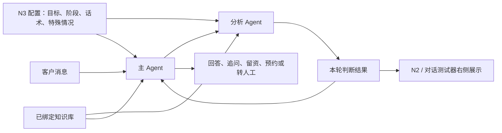

### 2.2 全业务客服与售前判断

智能客服服务全部业务，不是所有会话都进入售前流程。

- 所有会话：显示需求类型、意向判断和三条推荐回复。
- 命中售前场景：额外使用售前目标、阶段、话术和特殊情况处理，并展示售前成熟度、当前异常和阶段证据。
- 售后、技术支持等非售前会话：继续按原有业务能力服务，不展示售前阶段信息。

### 2.3 主 Agent 本轮策略

主 Agent 每轮回复前接收分析 Agent 的判断结果，并按以下内容组织本轮策略：

```text
本轮策略 = 用户当前问题
         + 需求分类
         + 售前成熟度
         + 全局事件路线
         + 知识库事实与客户话术
```

处理顺序固定为：

```text
投诉、安全与无法承诺的问题
> 明确找人工、要联系方式、询价、要演示
> 回答客户当前问题
> 推进一个售前下一步
```

“推进一个下一步”只代表回答结尾自然留出一个继续交流的入口，不代表每轮都索要联系方式。

---

## 三、N3 原型功能

### 3.1 人设设置

选择“售前客服”人设后，当前角色区域展示业务目标、完成标准和“售前设置”入口。点击后打开售前设置弹窗。

售前设置规划五个配置区，其中多语言配置为下期范围：

| 配置区 | 客户配置内容 | 平台默认值 |
|---|---|---|
| 目标设置 | 业务目标、完成标准、满足任一/全部标准 | 已提供默认售前目标与四项完成标准 |
| 阶段设置 | 启用或关闭阶段；编辑阶段名称、目标、达成条件 | 预置 S0–S5 六个阶段 |
| 话术设置 | 启停系统预设；新增、上传、编辑、删除企业话术；绑定适用阶段 | 预置售前通用话术 |
| 多语言配置（下期） | 新增、上传、编辑行业标准词及翻译 | 无系统预设；本次不开发、不验收 |
| 特殊情况处理 | 查看系统预设；新增、编辑企业处理方式 | 预置常见售前偏离情况 |

特殊情况处理属于售前人设设置，不单独作为客户可见技能。它与阶段、话术共同决定售前对话在出现临时问题后如何继续。

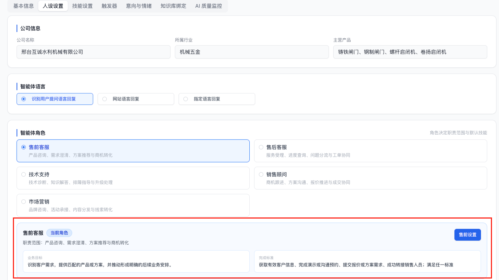


### 3.2 阶段设置与客户进度识别评分

阶段设置负责维护“要确认什么”。客户进度识别负责维护“确认后如何计分”。两者使用同一批达成条件，不允许在评分页另建一套评分项。

| 位置 | 可配置内容 |
|---|---|
| 人设设置 → 售前设置 → 阶段设置 | 阶段名称、阶段目标、达成条件；阶段可开启或关闭，不可删除 |
| 技能设置 → 客户进度识别 → 配置 | 为每条既有达成条件设置得分、是否必须满足、进入该阶段的达成分数 |

规则：

- S0 为自动进入的接待阶段，不配置得分、必需条件或达成分数。
- 其它阶段：已满足条件的得分累加；达到“进入阶段的达成分数”且所有“必须满足”的条件均已满足，才进入该阶段。
- 达成条件来自客户原话或业务执行结果，不能用客服自己的回复作为证据。
- 客户可在阶段设置中增删改条件；新条件会同步出现在客户进度识别的评分配置中。
- 阶段关闭后，新会话跳过该阶段；至少保留一个启用阶段。

### 3.3 技能设置

技能设置展示完整技能列表，每项明确执行 Agent 和适用人设；不展示“全部技能”“当前人设”等说明。筛选可按 Agent 类型或适用人设进行。

本次与售前直接相关的技能如下：

| 执行 Agent | 技能 | 适用人设 | 用户操作 |
|---|---|---|---|
| 主 Agent | 售前处理 | 售前客服 | 启用/关闭；配置进入售前设置 |
| 分析 Agent | 需求类型识别 | 全部人设 | 启用/关闭；维护需求分类 |
| 分析 Agent | 客户进度识别 | 售前客服 | 启用/关闭；配置条件得分、必须满足和阶段达成分数 |
| 主 Agent | 产品推荐、AI 搜索、产品询价、意向收集、转人工 | 按原有适用人设 | 保持现有能力与开关 |

### 3.4 知识库关系

| 内容 | 来源或保存位置 | 使用方式 |
|---|---|---|
| 产品、参数、案例、价格边界、FAQ | 已绑定企业知识库 | 主 Agent 回答事实问题时检索 |
| 行业术语、别名和专业表达 | 已绑定企业知识库 | 分析 Agent 理解客户表达；主 Agent 检索时使用标准说法 |
| 营销话术 | 企业业务知识库 / 业务与服务 / 营销话术 | 主 Agent 按阶段和场景选择表达方式 |
| 多语言翻译（下期） | 企业公共知识库 / 多语言与版本 / 多语言配置 | 下期再确定与智能客服的接入位置，本次不读取 |

话术设置页面是营销话术的维护入口：系统预设只能启停或复制为企业话术；企业话术支持新增、上传、查看、编辑和删除。上传模板字段为：话术名称、使用场景、客服回复、追问话术；上传后在页面绑定一个或多个适用阶段。

### 3.5 目标设置

目标设置保留业务目标和完成标准，不把内部运行规则暴露给客户。

| 配置项 | 默认值 | 页面规则 |
|---|---|---|
| 业务目标 | 识别客户需求，提供匹配的产品或方案，并推动形成明确的后续业务安排 | 文本输入，可修改 |
| 完成标准 | 获取有效客户信息、完成演示或沟通预约、提交报价或方案需求、成功转接销售人员 | 多选，至少保留一项 |
| 完成方式 | 满足任一标准 | 可切换为“满足全部标准” |

目标完成后，主 Agent 负责确认结果和后续安排，不再重复推动留资或预约。客户继续提问时，仍需正常答疑。

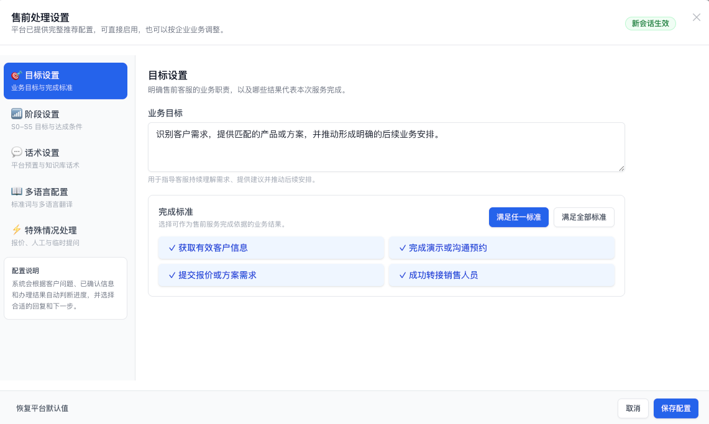

### 3.6 阶段设置页面

阶段列表字段为：阶段、阶段目标、达成条件、使用状态、操作。

- 平台固定提供 S0–S5 六个阶段，客户不能新增、删除或拖动排序。
- 阶段可关闭；关闭后保留配置和已绑定话术，再次开启可恢复。
- 点击“编辑”打开阶段弹窗，可修改阶段名称、阶段目标，并增删改达成条件。
- 阶段编辑弹窗不显示得分；得分、必须满足和阶段达成分数统一在“客户进度识别”技能中配置。
- 达成条件修改后，新会话使用新配置；已存在会话沿用创建时的配置。

阶段编辑弹窗字段：

| 字段 | 必填 | 说明 |
|---|---|---|
| 阶段名称 | 是 | 用于配置页和右侧成熟度展示 |
| 阶段目标 | 是 | 说明本阶段要获得什么结果 |
| 达成条件 | 是 | 至少保留一条；应能由客户表达或业务结果判断 |

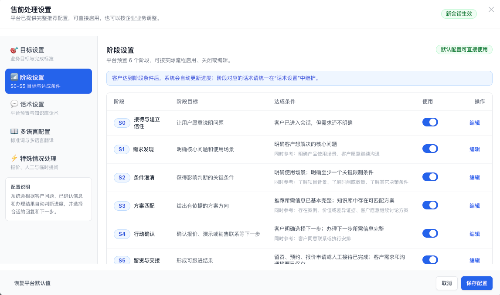

### 3.7 话术设置页面

话术设置用于维护不同阶段和场景下的客服表达。页面顶部说明保存位置：

```text
企业业务知识库 / 业务与服务 / 营销话术
```

页面提供来源筛选、阶段筛选、关键词搜索、上传话术和新增话术。列表字段：

| 字段 | 说明 |
|---|---|
| 话术名称 | 便于运营识别 |
| 分类 | 系统预设 / 用户新增 |
| 适用阶段 | 支持多选 |
| 使用场景 | 说明什么情况下使用 |
| 客服回复 | 主体回答内容，列表中最多展示两行 |
| 使用 | 启用或关闭 |
| 操作 | 查看；系统预设可复制新增；用户新增可编辑、删除 |

新增和编辑使用同一个弹窗，字段为：话术名称、适用阶段、使用场景、客服回复、追问话术、启用状态。保存后同步到营销话术目录。

系统预设不能直接编辑，避免平台升级后难以区分默认内容与企业内容。客户认为默认话术不合适时，点击“复制新增”，在企业副本上修改。用户新增话术可以编辑和删除。

上传文件满足模板要求时直接进入列表；不满足格式的内容不展示，并提示缺少的字段。页面不展示来源文件行号，操作记录只需保留文件名。

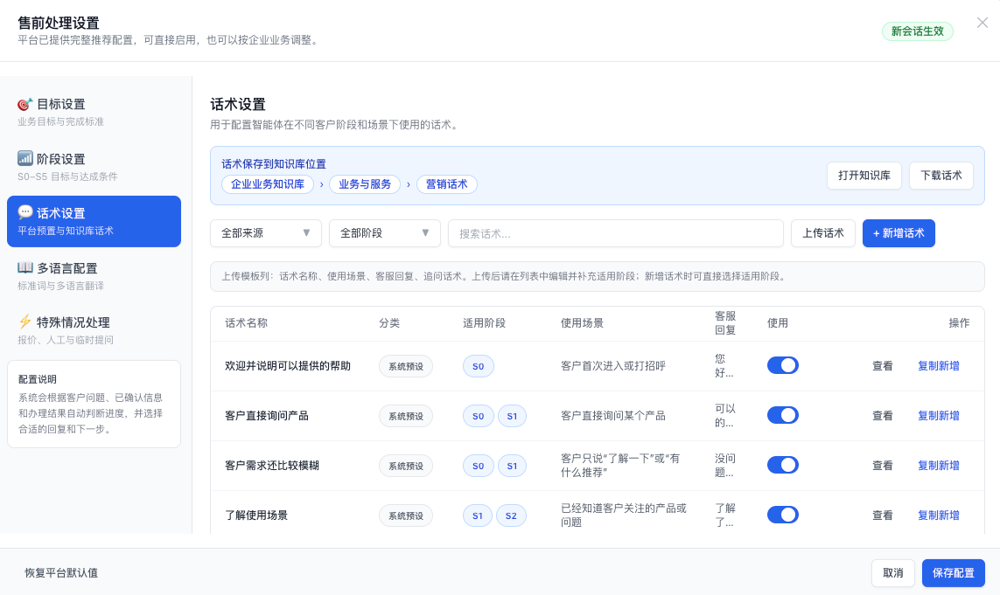

话术 CSV 模板：

```csv
话术名称,使用场景,客服回复,追问话术
客户首次咨询,客户首次进入或打招呼,"您好，我可以帮您了解产品、选型、案例和报价。",您这次更想先了解哪一方面？
```

### 3.8 多语言配置页面（下期）

> 优先级：下期。本次保留需求设计和现有原型示意，不安排智能客服侧开发、数据接入或验收。后续实施前，需要再次确认该能力应放在知识库、企业基础配置还是智能客服中。

多语言配置不提供系统预设。企业可在页面新增、上传、编辑、删除和启停词条。

列表字段：主语言/标准词、其它语言、备注、使用状态、操作。新增和编辑弹窗包含：

| 字段 | 说明 |
|---|---|
| 主语言 | 先选择标准词所属语言 |
| 标准词 | 企业希望系统统一理解和使用的表达 |
| 其它语言 | 可添加多个语言；不需要的语言可以留空 |
| 备注 | 说明使用语境、歧义或行业含义 |

规划保存位置：

```text
企业公共知识库 / 多语言与版本 / 多语言配置
```

规划 CSV 模板：

```csv
主语言,标准词,翻译语言,译文,备注
简体中文,螺杆启闭机,英文,Screw hoist,水利闸门启闭设备
```

同一个标准词有多种翻译时，可以使用多行；导入后合并到同一词条。具体同步方式下期确认。

### 3.9 特殊情况处理页面

特殊情况处理解决的是：客户没有按照阶段预设路径交流时，当前问题处理完成后应该回到哪里。

列表字段为：场景、客户表现、解决措施、处理后、使用状态、操作。系统预设和企业新增都支持“查看”；系统预设可关闭或复制新增，企业新增可编辑和删除。

新增和编辑弹窗字段：

| 字段 | 说明 |
|---|---|
| 场景 | 特殊情况名称 |
| 客户表现 | 分析 Agent 用于判断的自然语言描述 |
| 解决措施 | 主 Agent 应先做什么 |
| 处理后 | 回到原进度 / 转到指定阶段 / 按新需求重新判断 / 交由人工 / 结束售前推进 |
| 何时继续 | 立即继续 / 客户主动提供新信息后继续 / 本次不再主动推进 |
| 使用 | 启用或关闭 |

字段联动：

- 选择“转到指定阶段”时，显示阶段选择。
- 选择“交由人工”时，显示最长等待和超时处理；默认等待 1 分钟。
- 只有“交由人工”存在等待状态，其它方式不显示等待时间和超时处理。
- 选择“结束售前推进”时，不显示继续时间、等待时间或超时处理。
- 选择“客户主动提供新信息后继续”时，不配置固定等待轮数，由分析 Agent 判断客户是否补充了资料、新需求或继续沟通意愿。

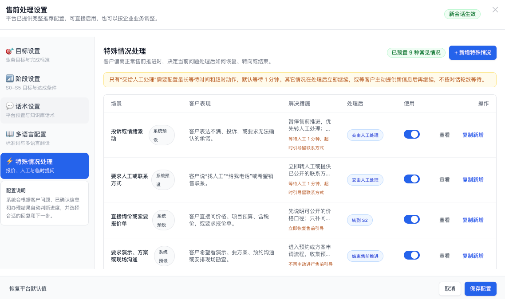


### 3.10 客户进度识别配置页面

入口：技能设置 → 客户进度识别 → 配置。

页面按 S0–S5 展示阶段。S0 显示“客户进入会话后自动进入接待阶段”，其它阶段展示：

| 字段 | 说明 |
|---|---|
| 阶段 | 来自人设中的阶段设置 |
| 达成条件与得分 | 条件文案只读；客户为每项设置得分 |
| 必须满足 | 客户决定某项是否为阶段硬性条件 |
| 进入阶段的达成分数 | 累计得分达到该值后，再校验必须满足项 |

页面不显示“条件总分 100 分”或“满分 100 分”等额外概念。若需要新增、删除或修改条件，点击“前往阶段设置”。

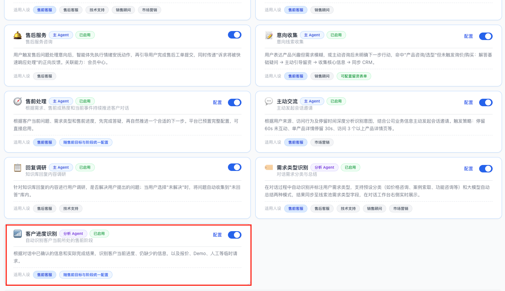

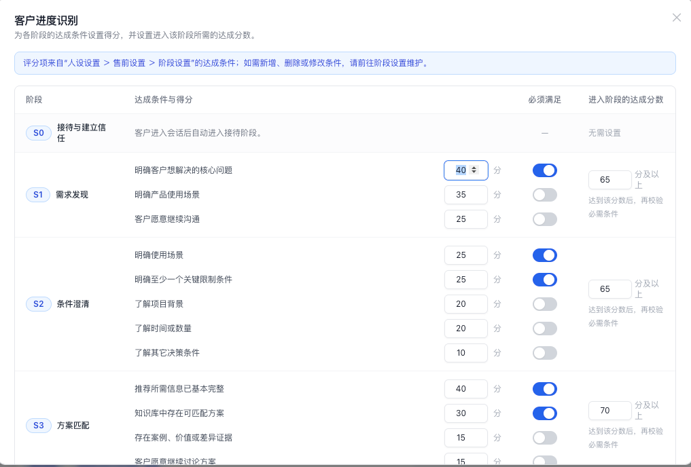

---

## 四、六个阶段默认配置

以下为新建售前客服的默认配置。客户可修改条件名称、增加或删除条件，并在“客户进度识别”中调整每条条件得分、必须满足和阶段达成分数。

| 阶段 | 阶段目标 | 默认达成条件 | 默认评分与达成分数 |
|---|---|---|---|
| S0 接待与建立信任 | 让客户愿意说明问题 | 客户进入会话，需求尚不明确 | 自动进入，无需评分 |
| S1 需求发现 | 明确核心问题和使用场景 | 明确核心问题；明确使用场景；客户愿意继续沟通 | 核心问题 40 分（必须满足）；使用场景 35 分；继续沟通 25 分；达到 65 分 |
| S2 条件澄清 | 获得影响判断的关键条件 | 使用场景；至少一个关键限制条件；项目背景；时间或数量；其它决策条件 | 使用场景 25 分（必须满足）；关键限制条件 25 分（必须满足）；项目背景 20 分；时间或数量 20 分；其它 10 分；达到 65 分 |
| S3 方案匹配 | 给出有依据的方案方向 | 推荐所需信息基本完整；存在可匹配方案；有案例、价值或差异依据；客户愿意继续讨论方案 | 推荐信息 40 分（必须满足）；可匹配方案 30 分（必须满足）；案例/价值依据 15 分；继续讨论 15 分；达到 70 分 |
| S4 行动确认 | 确认报价、演示或销售联系等下一步 | 客户明确选择下一步；办理该事项所需信息完整；客户同意联系或执行安排 | 选择下一步 40 分（必须满足）；所需信息完整 30 分（必须满足）；同意联系/安排 30 分；达到 70 分 |
| S5 留资与交接 | 形成可跟进结果 | 留资、预约、报价申请或人工接待已完成；沟通摘要已保存 | 业务结果 70 分（必须满足）；摘要保存 30 分（必须满足）；达到 100 分 |

补充规则：

- S3 的“存在可匹配方案”必须来自实际知识库检索结果，不能由 Agent 主观判断。
- S5 的两个条件必须来自留资、预约、报价申请、人工接待或摘要保存的成功结果，不能只依据客户口头表达。
- 客户首轮直接要报价、电话或演示时，可处理当前请求，但不因此跳过 S1–S3 的成熟度判断。

---

## 五、运行时默认策略（研发预置）

本节直接使用原型中客户实际保存的四类配置，不增加原型之外的阶段配置字段：

| 原型配置 | 运行时用途 |
|---|---|
| 目标设置 | 约束整段售前对话的目标和结束条件 |
| 阶段设置 | 提供阶段名称、阶段目标和达成条件 |
| 话术设置 | 提供适用阶段、使用场景、客服回复和追问话术 |
| 特殊情况处理 | 提供客户偏离正常推进时的解决措施、处理后去向和恢复方式 |

主 Agent 的回答内容由本轮客户问题、分析结果、知识库事实和话术列表共同生成。阶段对应的表达与继续交流方式，直接来自下方系统预设话术或客户新增话术，不在代码中额外写一套文案。

### 5.1 系统预设话术

以下内容作为系统预设写入话术列表。表中的客服回复和追问分别保存，不直接拼成固定答案；主 Agent 根据上下文自然表达。

| 适用阶段 | 话术名称 | 使用场景 | 客服回复 | 追问话术 |
|---|---|---|---|---|
| S0 | 欢迎并说明可以提供的帮助 | 客户首次进入或打招呼 | 您好，我可以帮您了解产品、选型、案例和报价，也可以安排销售顾问进一步沟通。 | 您这次更想先了解哪一方面？ |
| S0、S1 | 客户直接询问产品 | 客户直接询问某个产品 | 可以的，我先为您介绍这款产品的主要用途和适用范围。为了避免推荐偏差，我也会根据您的实际场景补充说明。 | 您准备把它用在什么场景？ |
| S0、S1 | 客户需求还比较模糊 | 客户只说“了解一下”或“有什么推荐” | 没问题，我可以根据使用场景帮您缩小范围，不需要您一次提供很多信息。 | 您目前更关注解决什么问题？ |
| S1、S2 | 了解使用场景 | 已经知道客户关注的产品或问题 | 了解了。不同使用场景对产品规格和方案选择会有影响，我先帮您把范围理清。 | 这个产品主要会用在什么项目或现场？ |
| S1 | 确认核心问题 | 客户描述了现状但目标不明确 | 我理解您当前的情况。为了给出更贴合的建议，我需要先确认这次最希望改善的问题。 | 您现在最想优先解决的是哪一个问题？ |
| S1、S2、S3 | 解释行业术语 | 客户使用简称、别名或专业术语 | 您提到的这个说法在不同地区可能对应不同规格，我会按您所在行业的常用定义来理解。 | 您说的是哪种用途或结构形式？ |
| S2 | 补充关键参数 | 方案判断还缺少规格参数 | 目前的场景已经比较清楚，还需要一个关键参数才能进一步判断适合的规格。 | 方便确认一下主要尺寸或承受条件吗？ |
| S2、S4 | 确认数量和时间 | 客户准备采购或询价 | 数量和期望时间会影响备货、交付和报价方式，我可以先按大致范围为您判断。 | 预计需要多少套，计划什么时候使用？ |
| S1、S2 | 客户暂时不知道参数 | 客户无法提供专业参数 | 没关系，参数暂时不清楚也可以继续。您可以提供现场情况、图纸或照片，我们再协助确认。 | 您现在方便描述现场情况，还是稍后补充资料？ |
| S3 | 给出方案方向 | 信息足够，可以推荐方向 | 结合您目前的使用场景和条件，更适合优先考虑这一方案。它的优势是匹配当前需求，同时保留后续调整空间。 | 您想先看配置差异，还是相似项目案例？ |
| S1、S2、S3 | 用案例帮助客户判断 | 客户希望了解案例或实际效果 | 我们有相近场景的应用案例，可以重点参考使用条件、配置方式和最终效果。 | 您更想看同行业案例，还是相近参数的案例？ |
| S3 | 说明方案差异 | 客户在多个方案之间比较 | 这几个方案都可以使用，主要区别在适用条件、投入和后续维护方式，我可以按您的优先级做取舍。 | 您更看重价格、交付时间还是长期使用成本？ |
| S2、S3、S4 | 承接报价申请 | 客户明确要求报价 | 可以为您准备报价。为了让报价可直接参考，需要先确认产品、数量和主要规格。 | 我先帮您核对数量和规格，可以吗？ |
| S3、S4 | 预约演示或方案沟通 | 客户希望进一步演示或沟通 | 可以安排顾问结合您的场景做一次针对性介绍，并提前准备相关产品和案例。 | 您希望哪一天、哪个时间段沟通？ |
| S4 | 确认联系安排 | 客户同意后续联系 | 好的，我们会按您确认的方式安排专人联系，并同步您已经说明的需求，避免重复沟通。 | 请问用电话还是微信联系更方便？ |
| S5 | 确认已经完成的安排 | 留资、预约或报价申请已完成 | 已经为您记录完成，我再确认一下：我们将根据当前需求准备资料，并按约定方式与您联系。 | 目前还有哪项信息需要一起补充？ |
| S4、S5 | 说明后续交接 | 已经转交销售或人工客服 | 您的需求和已确认信息已经同步给负责同事，对方可以在此基础上继续沟通。 | 需要我再补充备注什么重点吗？ |
| S3、S4、S5 | 邀请补充资料 | 客户可能还有图纸、照片或清单 | 如果后续方便，您可以继续补充图纸、现场照片或采购清单，顾问会结合资料进一步确认。 | 您更方便补充哪一类资料？ |

每轮默认规则：

1. 先回答当前问题，再自然提出一个相关问题或选项。
2. 每轮最多推进一个下一步；不连续追问多个字段。
3. 相同问题连续两轮内不重复。
4. 未知专业参数可以记录为“待确认”，不能阻断正常答疑。
5. 客户拒绝时停止同类引导；客户之后补充资料、提出新需求或再次表达继续了解意愿时，再恢复推进。

---

## 六、特殊情况处理默认配置

特殊情况用于处理客户不按正常售前节奏交流的情况。它不替代话术：主 Agent 仍要回答客户当前问题；特殊情况只决定处理后回到哪里、是否恢复售前引导。

| 场景 | 客户表现 | 默认解决措施 | 处理后 |
|---|---|---|---|
| 投诉或情绪激动 | 投诉、不满、要求无法确认的承诺 | 暂停售前推进，优先转人工；AI 只说明可处理范围 | 交由人工；默认等待 1 分钟，超时提示留下联系方式 |
| 要求人工或联系方式 | “找人工”“给我电话”“让销售联系” | 转人工或提供已公开联系方式 | 交由人工；默认等待 1 分钟，超时提示留下联系方式 |
| 直接询价或索要报价单 | 问价格、预算、含税价、报价单 | 先说明公开价格口径；只补问一个最缺的报价条件 | 转到 S2，并立即继续 |
| 要求演示、方案或现场沟通 | 要 Demo、方案、预约、勘查 | 进入预约或方案申请流程，收集必要信息 | 结束本次售前推进，等待业务结果 |
| 拒绝留资或继续追问 | “先不留电话”“别再问了” | 停止索取信息，继续答疑 | 保留原进度；客户主动提供新信息后恢复 |
| 缺少参数、图纸或需要技术确认 | 参数不清、需要找图纸或照片 | 保留已确认信息，说明可补充资料 | 转到 S2；客户补充资料后恢复 |
| 中途更换产品或需求 | 改变产品、场景或项目目标 | 以新需求重新判断，保留仍然有效的信息 | 按新需求重新判断 |
| 项目暂缓或需要内部确认 | 暂不采购、未立项、内部讨论 | 不催促成交或留资，保留沟通摘要 | 结束本次售前推进 |
| 中途询问产品、参数或案例 | 临时插问产品、交期、案例、资质 | 优先回答当前问题 | 回到原进度并继续 |

只有“交由人工处理”有等待时间和超时处理。其它处理方式不按固定轮数等待：要么当前问题处理后立即继续，要么等客户主动补充新信息后再继续。

---

## 七、Agent 如何使用页面配置

### 7.1 配置进入 Agent 的方式

保存售前设置后，系统为新会话保存一份配置快照。已有会话继续使用创建时的版本，避免同一段对话前后规则变化。

| 页面配置 | 分析 Agent 使用方式 | 主 Agent 使用方式 |
|---|---|---|
| 人设、企业信息、语言、沟通风格 | 判断客户表达的业务语境 | 决定称呼、语气和回复边界 |
| 业务目标、完成标准 | 判断是否已形成可跟进结果 | 决定是否继续推进或确认交接 |
| 阶段名称、目标、达成条件、得分、必须满足、达成分数 | 逐项判断条件是否满足，计算当前阶段 | 接收当前阶段、已确认信息和下一项缺失信息 |
| 话术设置 | 不生成话术 | 按当前阶段、需求分类和特殊情况选择候选话术 |
| 已绑定知识库中的行业术语 | 识别别名、简称和行业术语 | 用标准说法理解客户问题，并扩展知识库检索 |
| 特殊情况处理 | 判断是否命中、应走哪种处理方式 | 按处理方式回答、转人工、预约或恢复推进 |

### 7.2 每轮协作流程

1. 客户发送消息，主 Agent 先确认本轮是否需要售前分析。
2. 分析 Agent 识别是否属于售前场景；非售前会话只返回通用需求分类和意向判断。
3. 若为售前场景，分析 Agent 完成五项判断：
   - 当前需求分类；
   - 命中的行业术语及标准说法；
   - 每个阶段条件是否满足，以及对应的客户原话证据；
   - 当前成熟度、下一项最需要补充的信息；
   - 是否命中特殊情况，以及处理后的去向。
4. 系统根据已配置的条件得分、必须满足和阶段达成分数，确认阶段结果；特殊情况按照预置或企业配置确认处理方式。
5. 分析 Agent 把结果传给主 Agent。主 Agent 只使用结果，不自行重算阶段。
6. 主 Agent 读取知识库事实和适用话术，先回答客户当前问题，再执行允许的下一步。
7. 留资、预约、报价申请、转人工等执行完成后，系统把结果回写；分析 Agent 用执行结果更新 S5 和目标完成状态。

分析 Agent 传给主 Agent 的信息采用以下业务结构：

```text
是否售前场景
需求分类与行业术语
当前阶段、阶段目标、已确认信息、下一项缺失信息
当前特殊情况、处理后去向、可以执行的下一步
目标是否完成及完成方式
阶段证据摘要
```

### 7.3 两个 Agent 的默认工作说明

分析 Agent 的工作说明：

```text
你负责后台判断，不直接回复客户。
先判断是否为售前场景；若是，识别客户当前需求和行业术语。
只以客户明确表达和系统执行结果作为阶段证据，不补全、不猜测。
逐项判断当前阶段及下一阶段的达成条件，按配置的得分、必须满足和达成分数确定成熟度。
识别找人工、报价、演示、投诉、拒绝留资、需求变化等特殊情况。
输出阶段、证据、缺失信息和处理方式，交给主 Agent。
```

主 Agent 的工作说明：

```text
你面向客户服务。
先回答客户当前问题；产品、参数、案例、价格和交期必须以知识库事实为准。
根据分析结果选择当前阶段和场景下的话术，但需要结合上下文自然表达。
每轮最多推进一个下一步，并在结尾留下一个与当前问题相关的继续交流入口。
命中特殊情况时优先按处理方式执行；客户拒绝后停止同类引导。
不得自行改变阶段、编造事实、强行留资或承诺无法确认的内容。
```

### 7.4 研发实现约定

为保证实现一致，研发按以下职责实现即可：

| 名称 | 归属 | 作用 |
|---|---|---|
| `analyze_visitor_intent` | 主 Agent 调用入口 | 获取本轮分析结果；同一轮重复调用直接复用结果 |
| `classify_demand` | 分析 Agent | 输出需求分类与售前场景判断 |
| `lookup_industry_terms` | 分析 Agent | 从已绑定知识库查询行业术语、别名和专业表达 |
| `score_sales_progress` | 分析 Agent | 按页面配置的条件得分、必须满足和达成分数计算阶段 |
| `resolve_sales_route` | 分析 Agent | 按特殊情况配置确定当前处理方式与恢复位置 |
| `search_sales_talk` | 主 Agent | 按阶段、需求分类和特殊情况选择已启用话术 |
| `rag_search` | 主 Agent | 查询产品、参数、案例、FAQ 和商务边界 |
| 留资、预约、转人工能力 | 主 Agent | 仅在客户同意且当前处理方式允许时执行 |

实现要求：

- 分析结果在主 Agent 回复前生成；同一条客户消息只分析一次。
- 阶段计算必须使用当前会话保存的配置快照，不能读取后来修改的规则。
- S3 的知识匹配、S5 的留资/预约/人工接待等状态使用真实执行结果。
- 分析失败时保留上一阶段，主 Agent 仍正常答疑；不得自动执行留资、报价承诺等高风险操作。

### 7.5 页面配置与提示词占位符

页面保存的是业务配置，不让客户直接编辑完整提示词。新会话创建时，系统将配置放入对应占位符。

| 页面内容 | 占位符 | 使用方 |
|---|---|---|
| 企业名称、行业、产品、人设、语言和沟通风格 | `{{company_profile}}`、`{{persona_profile}}` | 主 Agent |
| 业务目标、完成标准、完成方式 | `{{sales_goal}}` | 主 Agent、分析 Agent |
| 已启用阶段、目标、达成条件和评分设置 | `{{sales_stages}}` | 分析 Agent |
| 当前会话的上一阶段和已有证据 | `{{previous_sales_state}}` | 分析 Agent |
| 已启用特殊情况及处理后策略 | `{{special_situations}}` | 分析 Agent |
| 行业词条和本轮命中的标准词 | `{{industry_terms}}` | 分析 Agent、主 Agent |
| 分析 Agent 本轮输出 | `{{sales_analysis}}` | 主 Agent |
| 当前阶段可用话术 | `{{talk_candidates}}` | 主 Agent |
| 产品、参数、案例等知识检索结果 | `{{knowledge_context}}` | 主 Agent |
| 留资、预约、报价申请、转人工结果 | `{{business_results}}` | 分析 Agent、主 Agent |

分析 Agent 提示词模板：

```text
你是 {{company_profile}} 的后台分析 Agent，不直接回复客户。

售前目标：{{sales_goal}}
阶段配置：{{sales_stages}}
上一轮状态：{{previous_sales_state}}
特殊情况配置：{{special_situations}}
行业词条：{{industry_terms}}
业务执行结果：{{business_results}}

请按以下顺序判断：
1. 当前消息是否属于售前场景；
2. 客户本轮的主要需求分类；
3. 客户使用的行业术语及标准说法；
4. 每条阶段条件是否满足，并引用客户原话或业务结果；
5. 按配置得分、必须满足和阶段达成分数确认当前阶段；
6. 是否命中特殊情况，以及处理完成后回到哪里；
7. 输出下一项最需要补充的信息。

不得生成面向客户的回复，不得把客服说过的话当作客户证据，不得猜测缺失信息。
```

主 Agent 提示词模板：

```text
你是 {{company_profile}} 的智能客服。
人设与语言：{{persona_profile}}
售前目标：{{sales_goal}}
本轮分析：{{sales_analysis}}
候选话术：{{talk_candidates}}
知识库事实：{{knowledge_context}}
业务执行结果：{{business_results}}

先直接回答客户当前问题，再根据本轮分析推进一个合适的下一步。
产品、参数、案例、价格和交期必须以知识库事实为准。
候选话术是表达参考，需要结合上下文自然改写，不得拼接多条话术。
命中特殊情况时先按处理方式完成当前事项，再按配置恢复、重判或结束推进。
每轮最多提出一个问题或一个选择，不重复询问已经确认的信息。
留资、预约和转人工需要客户明确同意；目标完成后只确认安排，不重复推动。
```

所有占位符必须在运行前替换。没有配置时传空对象或平台默认值，不能把未替换的占位符发送给模型。

### 7.6 分析 Agent 何时传递什么信息

分析 Agent 在每条客户消息进入主 Agent 回复前执行一次。右侧副驾与主 Agent读取同一份分析结果，不能各自再判断一次。

| 时间点 | 分析 Agent 处理 | 传给主 Agent |
|---|---|---|
| 客户发送普通消息 | 判断售前场景、需求分类、术语、阶段条件和特殊情况 | 本轮完整分析结果 |
| 客户中途询价、要人工或要演示 | 保留原成熟度，输出当前特殊情况及处理后去向 | 优先处理方式、恢复阶段、可执行事项 |
| 客户否定原信息或更换需求 | 标记失效证据，按新需求重新判断 | 新需求分类、保留信息、失效信息和新阶段 |
| 客户拒绝留资或继续追问 | 标记暂停该类引导 | 继续答疑，但不再索取信息；恢复条件 |
| 主 Agent 完成知识检索 | 根据实际命中结果确认 S3 的方案匹配条件 | 更新后的阶段结果 |
| 留资、预约、报价申请或人工接待完成 | 根据真实执行结果确认 S5 与目标状态 | 目标是否完成、完成方式和确认内容 |

本轮分析结果至少包含：

```json
{
  "is_pre_sales": true,
  "demand_type": "选型与方案咨询",
  "matched_terms": ["远程启闭", "水位监测"],
  "current_stage": "S2",
  "stage_goal": "获得影响判断的关键条件",
  "confirmed_information": ["农田灌溉渠道", "远程启闭"],
  "next_missing_information": "项目所在地或渠道尺寸",
  "stage_evidence": [
    { "condition": "明确使用场景", "met": true, "evidence": "我们在做农田灌溉渠道改造" }
  ],
  "current_situation": null,
  "after_handling": "继续当前阶段",
  "goal_completed": false
}
```

主 Agent 不需要接收全部评分过程，只需要当前阶段、已确认信息、最重要缺失项、特殊情况处理结果和证据摘要。完整计算明细保存在会话中，供右侧阶段证据查看和问题排查。

### 7.7 `score_sales_progress` 的实现口径

`score_sales_progress` 的评分规则必须来自“技能设置 → 客户进度识别”中当前客户保存的配置，不能在 Agent 提示词或后端代码中写死默认分数。

新建企业首次启用时，平台把第四章的默认分数写入该企业配置；客户修改并保存后，新会话读取客户版本。阶段设置新增或删除达成条件时，客户进度识别中的评分项同步增删，不能继续保留已经不存在的条件。

该能力本身不理解客户语言，只计算分析 Agent 已经判定为“满足/未满足”的条件。

输入：当前客户的进度识别配置、当前及前置阶段、各条件判断、已有有效证据、业务执行结果。输出：每个条件是否计分、阶段得分、必须满足项是否通过、最终阶段和未满足原因。

配置读取顺序：

```text
当前会话保存的“客户进度识别”配置
→ 当前阶段的达成条件、每项得分、必须满足、阶段达成分数
→ 分析 Agent 对每项条件的满足判断与证据
→ score_sales_progress 计算结果
```

如果当前会话没有评分配置，使用创建会话时写入的企业默认配置；不能临时回退到代码中的另一套分值。配置缺失或条件无法对应时，保持上一阶段并记录配置异常。

客户保存“客户进度识别”时形成以下配置；会话创建时将其复制到会话配置中，`score_sales_progress` 每轮读取该副本：

```json
{
  "skill": "sales_progress_analysis",
  "stages": [
    {
      "stage_id": "S2",
      "achievement_score": 65,
      "conditions": [
        { "condition_id": "usage_scene", "score": 25, "required": true },
        { "condition_id": "key_constraint", "score": 25, "required": true },
        { "condition_id": "project_context", "score": 20, "required": false },
        { "condition_id": "time_quantity", "score": 20, "required": false },
        { "condition_id": "other_condition", "score": 10, "required": false }
      ]
    }
  ]
}
```

其中 `condition_id` 与人设中阶段设置的达成条件一一对应。页面修改条件文案不改变对应关系；删除条件时同时删除评分项；新增条件时必须先补充分数和“必须满足”设置，保存后才能发布到新会话。

计算规则：

```text
阶段得分 = 所有“已满足”条件的配置得分之和

阶段达成 = 阶段得分达到配置值
         且所有“必须满足”条件已满足
         且前置启用阶段已经达成
```

S0 不参与计算，客户进入会话后自动为 S0。

S2 示例：

| 条件 | 配置得分 | 必须满足 | 本轮判断 | 本轮得分 |
|---|---:|---|---|---:|
| 明确使用场景 | 25 | 是 | 已满足 | 25 |
| 明确至少一个关键限制条件 | 25 | 是 | 已满足 | 25 |
| 了解项目背景 | 20 | 否 | 已满足 | 20 |
| 了解时间或数量 | 20 | 否 | 未满足 | 0 |
| 其它决策条件 | 10 | 否 | 未满足 | 0 |

阶段达成分数为 65，本轮得到 70 分，两个必须满足条件均通过，且 S1 已达成，因此进入 S2。

反例：如果得到 75 分，但“明确使用场景”未满足，因为该条件配置为必须满足，仍不能进入 S2。

### 7.8 `resolve_sales_route` 的实现口径

该能力根据特殊情况配置选择本轮处理方式，不生成客服回复。

输入：分析 Agent 告知的特殊情况、当前阶段、处理是否完成、人工是否接待、客户是否补充新信息。输出：当前情况、先处理什么、处理后去向、何时恢复。

示例一：客户首轮要求销售电话。

```json
{
  "situation": "要求人工或联系方式",
  "current_stage": "S0",
  "handle_first": "提供公开联系方式或发起转人工",
  "after_handling": "保留 S0",
  "wait_for_human_minutes": 1,
  "timeout": "提示客户留下联系方式"
}
```

示例二：客户在 S2 中途询问案例。

```json
{
  "situation": "中途询问产品、参数或案例",
  "current_stage": "S2",
  "handle_first": "回答案例问题",
  "after_handling": "回到 S2",
  "resume": "当前问题回答后立即继续"
}
```

示例三：客户拒绝继续留资。

```json
{
  "situation": "拒绝留资或继续追问",
  "current_stage": "S4",
  "handle_first": "停止索取信息并继续答疑",
  "after_handling": "保留 S4",
  "resume": "客户主动补充新信息或重新表达联系意愿后继续"
}
```

联系方式已直接展示但没有发起人工接待时，不进入一分钟等待；只有真正进入人工接待流程后才开始计时。

### 7.9 会话中需要保存的状态

| 状态 | 用途 |
|---|---|
| 当前需求分类 | 决定知识检索和回答重点 |
| 当前成熟度 | 决定阶段话术和下一步 |
| 各阶段条件证据 | 支持跨轮判断和右侧查看 |
| 当前特殊情况 | 决定是否暂停正常阶段推进 |
| 暂停前阶段和恢复条件 | 特殊情况处理完成后恢复 |
| 已使用话术和上轮追问 | 避免重复表达和重复提问 |
| 目标完成状态 | 避免重复留资、预约或转接 |
| 会话配置版本 | 保证对话中途规则不变化 |

### 7.10 Skill 划分

本次不为六个阶段分别创建 Skill。建议在现有 AgentScope 项目中按 Agent 分开维护：

```text
agent-backend/skills/
├── main/
│   └── pre-sales-handling/SKILL.md
└── analysis/
    ├── demand-classify/SKILL.md
    └── sales-progress-analysis/SKILL.md
```

| Skill | 所属 Agent | 内容 |
|---|---|---|
| `pre-sales-handling` | 主 Agent | 先回答当前问题；读取阶段、特殊情况和话术；每轮只推进一步；留资和转人工需客户同意 |
| `demand-classify` | 分析 Agent | 判断是否售前、输出一个主要需求分类、使用知识库词条统一行业表达 |
| `sales-progress-analysis` | 分析 Agent | 逐项判断阶段条件、保存证据、识别特殊情况、调用阶段计算和处理路线能力 |

主 Agent 的 `pre-sales-handling` Skill 读取：

```text
{{sales_goal}}
{{sales_analysis}}
{{talk_candidates}}
{{knowledge_context}}
{{business_results}}
```

分析 Agent 的 `sales-progress-analysis` Skill 读取：

```text
{{sales_stages}}
{{previous_sales_state}}
{{special_situations}}
{{industry_terms}}
{{business_results}}
```

两个 Agent 只加载各自目录中的 Skill。分析 Agent 不加载话术回复规则；主 Agent 不加载阶段评分规则，避免职责混淆。

---

## 八、对话示例

本节参考[水利智能客服 FAQ 及完整售前演示话术](<./智能客服pro二期优化，增加话术/水利智能客服FAQ及完整售前演示话术.xlsx>)，用于说明正常推进和中途跳转时两个 Agent 分别做什么。

### 8.1 正常推进

| 轮次 | 客户与主 Agent 对话 | 分析 Agent 判断 | 结果 |
|---|---|---|---|
| 1 | 客户：你们主要有哪些水利产品？<br>主 Agent：我们提供闸门、启闭机、清污机等产品。您这次更想了解产品、选型、案例，还是报价？ | 售前场景；产品与能力了解；没有具体需求 | S0 |
| 2 | 客户：我们在做农田灌溉渠道改造，想采购闸门，但还没确定用哪种。<br>主 Agent：可以，我先按渠道改造场景帮您缩小范围。您更关注远程启闭、普通电动，还是暂时都不确定？ | 核心问题、使用场景已确认；S1 达成 | S1 |
| 3 | 客户：希望远程开关，最好以后还能看水位。<br>主 Agent：可以优先看智能测控方向。项目在哪个地区？渠道大概多宽？ | 已确认关键限制条件；S2 仍缺项目背景或时间/数量 | 保持 S1，向 S2 推进 |
| 4 | 客户：河南新乡，渠道约 2 米宽，先采购 2 套。<br>主 Agent：这些信息已经可以初步匹配方案。您更想先看相似案例，还是确认报价准备项？ | 项目背景、数量补齐；S2 达成；知识库可匹配方案 | S2，可向 S3 推进 |
| 5 | 客户：先看类似案例。<br>主 Agent：知识库中有相近的灌区远程启闭案例，可以重点参考控制方式和现场尺寸；最终型号仍需结合图纸确认。您希望继续准备报价，还是安排技术沟通？ | 客户愿意讨论方案；知识库命中可匹配案例；S3 达成 | S3 |
| 6 | 客户：安排本周三下午沟通。<br>主 Agent：可以。为了安排对接，请留下联系人和手机号，项目名称可以选填。 | 客户确认下一步为预约沟通；进入行动确认 | S4 |
| 7 | 客户：王工，13800001234，新乡灌区改造。<br>主 Agent：已登记项目、2 套设备、远程启闭和水位监测需求，并安排本周三下午沟通。后续有图纸或现场照片，可以继续补充。 | 留资与预约执行成功，摘要已保存 | S5，目标完成 |

### 8.2 中途要联系方式

| 客户与主 Agent 对话 | 分析 Agent 判断 | 主 Agent 行为 | 阶段 |
|---|---|---|---|
| 客户：把销售电话给我，我想直接问产品。 | 售前场景；命中“要求人工或联系方式” | 提供已公开电话或发起人工转接，不继续追问需求 | 保持原阶段 |
| 客户：现在转人工。 | 人工接待请求；等待人工处理 | 发起转人工；超时后按配置提示留下联系方式 | 成熟度不因转接自动提高 |

### 8.3 中途询价

| 客户与主 Agent 对话 | 分析 Agent 判断 | 主 Agent 行为 | 阶段 |
|---|---|---|---|
| 客户：这个大概多少钱？ | 命中“直接询价”；已有阶段不变 | 回答公开价格口径，只补问一个最缺的报价条件 | 回到或保持 S2 |
| 客户：预计 2 套，三个月内用。 | 数量与时间已确认 | 基于知识库说明影响报价的因素，并给出报价申请或销售联系选项 | 继续按成熟度推进 |

### 8.4 中途询问案例后恢复

| 客户与主 Agent 对话 | 分析 Agent 判断 | 主 Agent 行为 | 阶段与路线 |
|---|---|---|---|
| 客户：渠道大概 2 米宽。对了，你们做过类似项目吗？ | 新增渠道尺寸证据；同时命中“中途询问案例” | 先检索并回答案例，不追问其它参数 | 保持 S2，临时进入案例回答 |
| 主 Agent：有相近灌区项目案例，但是否适用还需结合控制方式。您希望远程启闭还是普通电动？ | 当前问题已回答，可以恢复原阶段 | 回到 S2，只追问一个关键条件 | 恢复 S2 |

### 8.5 中途更换需求

| 客户与主 Agent 对话 | 分析 Agent 判断 | 主 Agent 行为 | 阶段与路线 |
|---|---|---|---|
| 客户：闸门先不看了，我们泵站还需要处理漂浮垃圾。 | 原闸门需求暂停；新需求为清污设备选型 | 切换知识检索范围，不继续使用闸门尺寸作为清污设备条件 | 按新需求重新判断 |
| 主 Agent：可以先按泵站进水口的清污需求判断。您现场主要是树枝、塑料袋，还是水草较多？ | 新需求已有场景，仍缺垃圾类型和现场条件 | 进入新需求的轻量澄清 | 新需求 S1 |

### 8.6 拒绝留资后继续服务

| 客户与主 Agent 对话 | 分析 Agent 判断 | 主 Agent 行为 | 阶段与路线 |
|---|---|---|---|
| 客户：先不留电话，我只想看看参数。 | 命中“拒绝留资或继续追问” | 停止留资，继续回答参数 | 保留原阶段，暂停留资引导 |
| 客户：如果能满足远程控制，我之后可以让销售联系。 | 客户重新表达联系意愿 | 恢复行动确认，但仍需客户明确授权和联系方式 | 恢复原阶段推进 |

---

## 九、右侧对话展示

位置：N2 在线会话和 `sale-demo/public/operator-test.html` 右侧 AI 副驾。

| 会话类型 | 展示内容 |
|---|---|
| 全部业务会话 | 需求类型、意向判断、分析 Agent 推荐的 3 条回复 |
| 售前会话 | 在通用信息基础上增加：售前成熟度、当前正常状态或异常、可点击查看的阶段对话证据 |

阶段证据只展示客户原话和系统执行结果。点击任一阶段可查看该阶段已获得的证据；未达到的阶段显示暂无证据。特殊情况单独展示为“当前异常”，不改写成熟度。

页面不展示内部提示词、工具名、评分过程或“主 Agent 建议动作”。原有三条分析 Agent 推荐回复必须保留。非售前会话直接隐藏售前区域，不向客户展示“未命中售前场景”等内部判断文案。


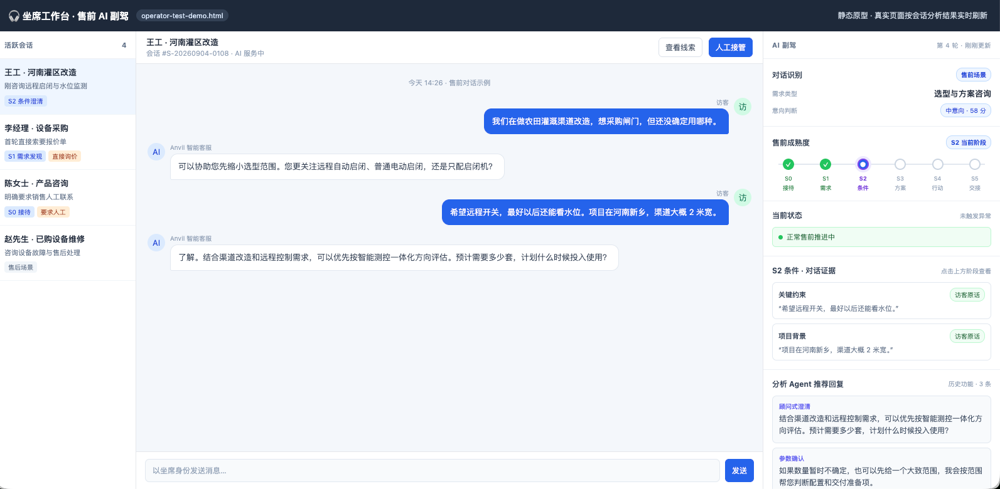

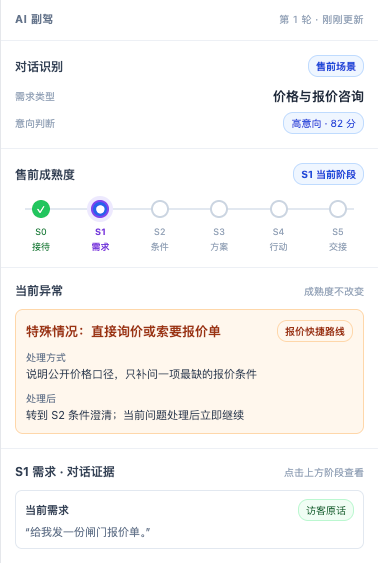

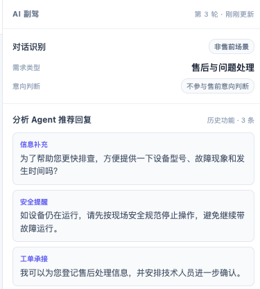

---

## 十、研发改造范围

### 10.1 N3 智能体配置

| 改造位置 | 研发内容 |
|---|---|
| 人设设置 | 售前客服角色增加业务目标、完成标准和“售前设置”入口 |
| 售前设置 | 本次实现目标、阶段、话术、特殊情况四个配置区并写入默认值；多语言配置保留原型，下期再做 |
| 技能设置 | 每张技能显示执行 Agent 和适用人设；增加主 Agent“售前处理”和分析 Agent“客户进度识别” |
| 客户进度识别 | 增加评分配置页；条件来自阶段设置；支持得分、必须满足、阶段达成分数 |
| 数据保存 | 配置修改保存版本，新会话读取最新版本 |

### 10.2 Agent 后端

改造位置：`agent-backend`。

| 模块 | 研发内容 |
|---|---|
| 分析 Agent | 增加售前场景判断、阶段逐项判断、特殊情况识别；每轮把结果写入会话 |
| 主 Agent | 加载售前处理技能；回复前读取分析结果；按阶段、知识和话术回答 |
| 阶段计算 | 根据客户配置的得分、必须满足和阶段达成分数输出结果 |
| 特殊情况处理 | 根据配置输出处理后去向与恢复条件 |
| 知识与话术 | 查询行业术语、产品事实和当前阶段适用话术 |
| 会话状态 | 保存阶段、证据、特殊情况、暂停位置、目标状态和配置版本 |

### 10.3 N2 与对话测试器

改造位置：N2 在线会话及 `sale-demo/public/operator-test.html`。`operator-test-demo.html` 为本次展示原型。

- 通用区域保留需求类型、意向判断和三条推荐回复。
- 售前场景增加阶段条、当前状态/异常和阶段证据。
- 阶段可点击；点击后查看该阶段对应客户原话和系统结果。
- 正常推进与特殊情况都需要有展示状态。
- 页面信息应保持简洁，不向用户解释内部 Agent 协作和判断方式。

### 10.4 配置文件与模板

交付以下初始化数据：

- 六个阶段及默认条件、得分、必须满足和阶段达成分数；
- 系统预设售前话术；
- 九种特殊情况处理默认值；
- [售前话术 CSV 模板](<./智能客服pro二期优化，增加话术/导入模板/售前话术导入模板.csv>)；
- [多语言配置 CSV 模板](<./智能客服pro二期优化，增加话术/导入模板/多语言配置导入模板.csv>)（下期预留，本次不开发）。

---

## 十一、明确不在本次范围

| 功能 | 说明 |
|---|---|
| 任意流程画布 | 不支持客户自由拖拽、排序或新建阶段 |
| 为每个阶段创建独立 Agent | 六个阶段由同一个分析 Agent 和同一个主 Agent 处理 |
| 客户编辑完整系统提示词 | 页面只维护业务配置，提示词由系统模板生成 |
| 客户开发自定义工具 | 仅使用平台已有业务能力 |
| 知识库管理能力重做 | 本次只约定所需知识和保存目录，知识库能力由其它项目提供 |
| 用意向分替代成熟度 | 意向分只用于运营参考，不决定售前阶段 |
| 多语言翻译配置 | 降低优先级，下期重新确认产品归属；本次不接入智能客服运行流程 |

---

## 十二、测试用例

### 12.1 页面配置

| 编号 | 测试项 | 操作 | 预期结果 |
|---|---|---|---|
| TC-N3-01 | 售前设置入口 | 选择售前客服 | 展示业务目标、完成标准和售前设置按钮 |
| TC-N3-02 | 阶段编辑 | 修改 S2 目标并新增一条条件 | 保存成功；新条件同步出现在客户进度识别配置中 |
| TC-N3-03 | 阶段关闭 | 关闭 S3 | 新会话跳过 S3；阶段和话术配置仍保留 |
| TC-N3-04 | S0 评分 | 打开客户进度识别配置 | S0 显示自动进入，不显示得分、必须满足或达成分数 |
| TC-N3-05 | 评分来源 | 打开客户进度识别配置 | 只能看到阶段设置中的条件，不能新增其它评分项 |
| TC-N3-06 | 必须满足 | 将 S2 使用场景设为必须满足 | 该项未满足时，即使其它条件得分达到阈值也不能进入 S2 |
| TC-N3-07 | 系统话术 | 查看系统预设话术 | 可查看、启停、复制新增，不可直接编辑或删除 |
| TC-N3-08 | 企业话术 | 新增并保存话术 | 列表出现用户新增项，可查看、编辑和删除，并同步知识库 |
| TC-N3-09 | 话术导入失败 | 上传缺少“客服回复”的文件 | 不进入列表，提示缺失字段 |
| TC-N3-11 | 特殊情况联动 | 选择“交由人工” | 仅此时显示等待时间和超时处理，默认 1 分钟 |
| TC-N3-12 | 非人工处理 | 选择“回到原进度” | 不显示等待时间和超时处理 |

### 12.2 Agent 判断与回复

| 编号 | 测试项 | 客户输入或前提 | 预期结果 |
|---|---|---|---|
| TC-A-01 | 非售前会话 | “去年买的启闭机限位失灵” | 按售后问题处理，不展示售前阶段 |
| TC-A-02 | S0 自动进入 | 新建售前会话 | 当前阶段为 S0，不进行评分 |
| TC-A-03 | 阶段证据 | 客户只说“你们有闸门吗” | 不把 Agent 的追问计为客户证据 |
| TC-A-04 | S2 达成 | 满足 S2 70 分、两个必需条件和 S1 | 进入 S2，并保留每项客户原话证据 |
| TC-A-05 | 必需条件未满足 | S2 得分达到 75，但使用场景未确认 | 保持原阶段，说明缺少使用场景 |
| TC-A-06 | 知识匹配 | 客户信息完整但知识库未找到可匹配方案 | 不判定 S3 达成，主 Agent说明需要进一步确认 |
| TC-A-07 | 行动确认 | Agent 建议预约，但客户没有同意 | 不判定 S4 达成 |
| TC-A-08 | 真实业务结果 | 客户口头说“我已经提交了”但系统无记录 | 不判定 S5 达成 |
| TC-A-09 | 每轮一个推进 | 客户询问产品参数 | 先回答参数，只追加一个相关问题或选择 |
| TC-A-10 | 拒绝留资 | “先不留电话” | 停止留资，继续答疑；不重复索取联系方式 |

### 12.3 特殊情况与展示

| 编号 | 测试项 | 客户输入或操作 | 预期结果 |
|---|---|---|---|
| TC-E-01 | 直接询价 | 首轮说“给我报价” | 先回答公开口径并补一个报价条件；成熟度不直接跳 S4 |
| TC-E-02 | 要联系方式 | “把销售电话给我” | 提供公开电话或转人工；保持原成熟度 |
| TC-E-03 | 人工等待 | 确认发起人工接待 | 开始 1 分钟等待；超时执行已配置处理方式 |
| TC-E-04 | 仅展示电话 | 只展示公开电话，未转人工 | 不进入等待状态 |
| TC-E-05 | 中途插问 | S2 时询问案例 | 先回答案例，随后恢复 S2 |
| TC-E-06 | 更换需求 | 从闸门切换为清污设备 | 重新分类；不继续使用冲突的闸门证据 |
| TC-E-07 | 阶段证据点击 | 点击右侧 S2 | 展示 S2 的客户原话证据；未达到阶段显示暂无证据 |
| TC-E-08 | 推荐回复保留 | 打开任意会话 | 右侧保留分析 Agent 三条推荐回复 |

---

## 十三、验收标准

1. 选择售前客服后可进入售前设置，并可使用默认配置直接启用。
2. 人设配置、阶段评分和技能入口与最新 N3 原型一致。
3. 六个阶段、系统话术和九种特殊情况均有完整默认值。
4. 分析 Agent 每轮提供售前场景、需求分类、术语、阶段证据、成熟度、缺失信息和特殊情况结果。
5. 主 Agent 只负责回答与执行，能够使用知识库事实和当前阶段话术完成自然推进。
6. 正常推进、临时插问、直接询价、找人工、拒绝留资和更换需求均按本文规则运行。
7. 非售前会话不展示售前区域；售前会话可查看阶段、正常/异常状态和阶段证据。
8. 话术页面维护内容能够同步到约定的营销话术目录；多语言配置不计入本次验收。
9. 所有测试用例通过，配置变更只影响新会话，已有会话保持稳定。
