# 第一期研发需求边界

> v1.0 · 2026-06-24
> 配套文档：`功能清单与技术选型.md` / `portal-ai-saas-落地路线图.md`
> 本文档作为研发交付边界的单一权威来源，第一期范围以本文为准。

---

# 一、背景与核心目标

**核心目的：提升客户转化率。**

现有智能客服在三个环节直接拉低转化率：

| 问题 | 现状表现 | 本期要达成的目标 |
|---|---|---|
| **对话机械感** | AI 回复语气千篇一律，访客一眼判断"这是机器人"，信任感下降，提前离开 | 对话有名字、有性格、语气自然；访客更愿意深入沟通 |
| **留资转化低** | 直接弹表单要求填手机，访客感知为"被套信息"，本能拒绝；信息收集后缺乏背景 | 先用选择题自然摸清背景，再在对话中无感出现表单，留资完成率提升 |
| **人工接管质量低** | 坐席接管陌生会话需要快速通读长对话，手打回复慢且易答非所问；高价值场景成交率受损 | 接管瞬间自动给出 3 条针对性建议，坐席点击微调即发，响应快且有针对性 |

---

## 二、功能范围

### 2.1 双 Agent 架构

**现状**：单个对话智能体，承担对话 + 分析所有职责，相互阻塞。

**本期改为**：

```
主 Agent（Anvil助手）         ← 面向访客，实时回复，工具调用
  └── 工具：rag_search / lead_capture_form / confirm_dialog / request_human_handoff

分析 Agent（后台，每轮异步）  ← 不干扰主对话，独立运行
  └── 工具：classify_demand / suggest_replies
```

- 主 Agent 与访客对话，分析 Agent 每轮用户消息后后台异步运行。
- 两者共享同一个 Session 对象，分析结果写入 `session.analysis`，坐席工作台 2s 轮询读取。
- 分析 Agent 不阻塞主 Agent 的流式回复。

**边界**：分析 Agent 暂不做意向打分（`score_intent`），仅做需求类型识别（`classify_demand`）和回复建议（`suggest_replies`）。

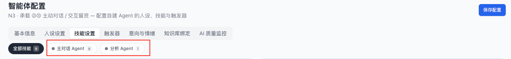


---

### 2.2 智能体技能配置升级（N3 配置页）

#### 2.2.1 意向收集技能 · 配置弹窗

**当前**：意向收集技能无独立配置弹窗，表单字段写死在代码中。

**本期要做**：

- N3「智能体配置 → 技能设置 → 意向线索收集」增加「配置」入口按钮，点击弹出配置弹窗。
- 弹窗内展示线索表单字段列表，字段来源为「线索管理 → 线索字段设置」同一份数据。
- **字段列表只读**：字段名称、类型、是否必填均不可编辑（不是复制一份，是展示同源数据）。与 N7 线索字段设置页保持实时一致。
- 字段提供「启用/禁用」开关：禁用的字段不出现在访客侧留资表单。
- 弹窗支持预览：右侧展示当前配置对应的表单样式（可选，优先级次之）。
- 配置保存后写入 `analysis_config.json → lead_capture.fields`（或对应接口），修改后新会话立即生效，无需重启。

**接口约定**（mock 阶段）：
```json
// analysis_config.json → lead_capture.fields
[
  { "field_key": "name",  "label": "姓名",  "type": "text",  "required": true,  "enabled": true, "order": 1 },
  { "field_key": "phone", "label": "手机号", "type": "tel",   "required": true,  "enabled": true, "order": 2 },
  { "field_key": "email", "label": "邮箱",   "type": "email", "required": false, "enabled": true, "order": 3 }
]
```

**留资后存线索**：访客提交表单后，agent-backend 在 `session.captured_lead` 中存储完整信息，并触发写入 N7 线索池（第一期用内存/session 存储；TwentyCRM 写入在第二期）。

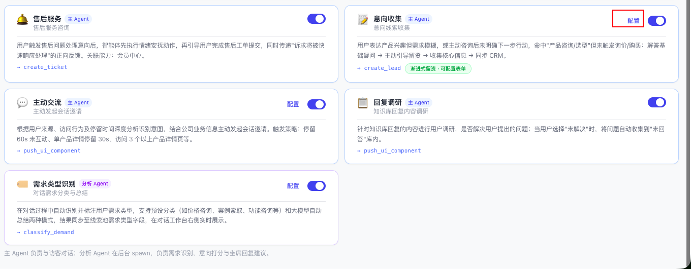

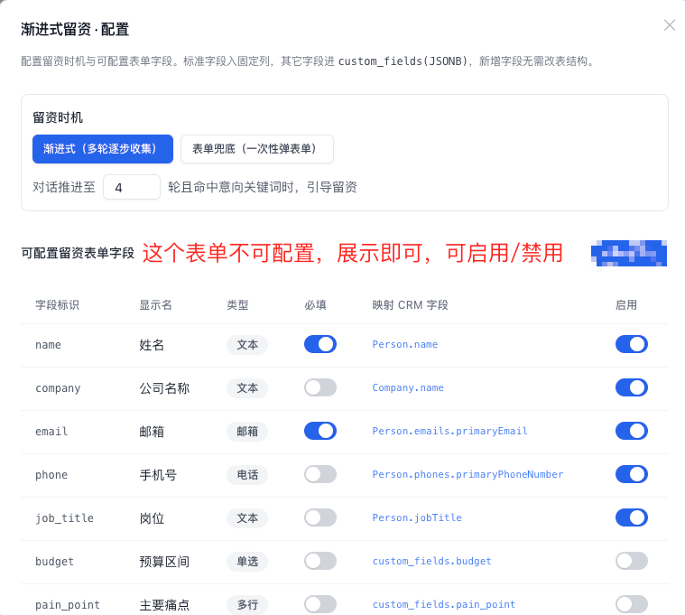


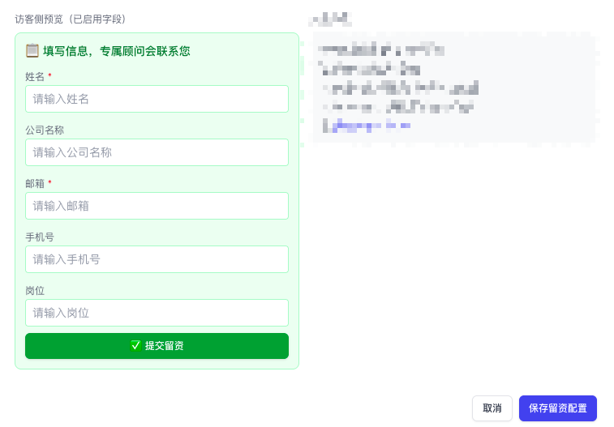


---

#### 2.2.2 需求类型识别 · 可配置分类标签

**当前**：需求类型标签写死，无法增加或修改。

**本期要做**：

- N3「智能体配置 → 技能设置 → 需求类型识别」支持两种模式，运营可切换：

  **模式 A · 预设分类**（默认）：
  - 显示当前标签列表（如「价格咨询 / 案例索取 / 功能咨询 / 定制需求 / 售后问题」）
  - 支持新增标签（输入标签名，点击确定）
  - 支持删除标签（点击标签右侧 × 图标）
  - 分析 Agent 从当前列表中选最匹配的标签输出
  - 配置写入 `analysis_config.json → demand_type.categories`

  **模式 B · LLM 自动总结**：
  - 分析 Agent 不选固定标签，直接输出一句话自由描述（如「用户正在询问 OEM 定制的起订量和价格」）
  - 适合需求类型不规律、分类难以穷举的场景

- 两种模式在 N3 配置页以单选切换，保存后新会话立即生效。

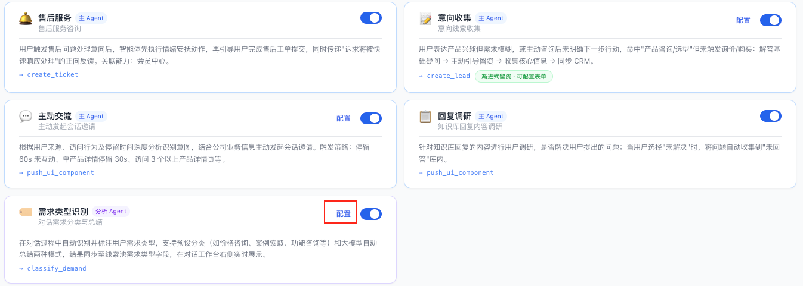

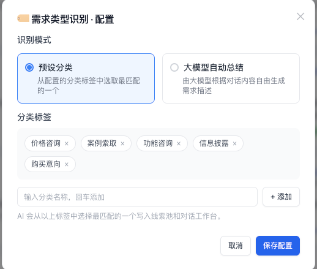

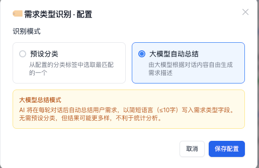


---

### 2.3 对话 Agent 升级：基本信息 → system prompt

**当前**：主 Agent 使用固定 system prompt，无法体现商家智能体的品牌人格。

**本期要做**：

N3「智能体配置 → 基本信息」区域的三个字段：

| 字段 | 示例 | 说明 |
|---|---|---|
| 智能体名称 | Anvil 顾问 | 作为 AI 自称使用 |
| 简要描述 | 专注外贸询盘的智能助手 | 用于对外介绍 |
| 人设设置 | 专业、亲切、懂外贸；用指定语言回复，语气自然不生硬 | 核心人格约束 |

- 三个字段拼接后**追加到主 Agent system prompt 末尾**（不替换基础指令，追加在后）。
- 拼接格式：
  ```
  ---
  你的名称是「{name}」。{description}
  人设要求：{persona}
  ```
- 配置修改后，**新建会话立即生效**（已有会话不受影响）。
- 不填时保持原有默认 prompt，不报错。

**明确边界**：人设注入的是 system prompt 追加段，不覆盖工具调用指令、RAG 引用规则等核心逻辑。


---

### 2.4 前端对话页（chat.html）

#### 2.4.1 渐进式留资表单

**逻辑**：主 Agent 在合适时机调用 `lead_capture_form` 工具，工具返回 `__FORM__:{…}` 前缀字符串，agent_runner 识别后下发 `form_show` SSE 事件，chat.html 在对话流中内嵌留资表单。

**表单渲染要求**：
- 表单内嵌在聊天气泡中（不弹窗，不跳页），视觉上像 AI 说话的一部分。
- 字段来源：`analysis_config.json → lead_capture.fields`，只展示 `enabled: true` 的字段，按 `order` 排序。
- 必填字段有红色星号 `*` 标注。
- 未填必填字段点击提交：字段边框变红，显示提示文字，不发送。
- 提交成功：表单变为只读收起状态，显示"已提交 ✓"；触发 `lead_captured` SSE 事件。

**访客身份感知**：表单提交后 agent-backend 将 `captured_lead` 写入 session；坐席工作台轮询时可在副驾面板看到"已留资"标记。

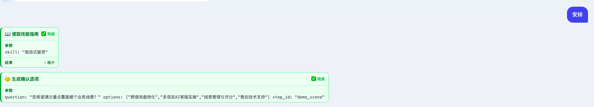

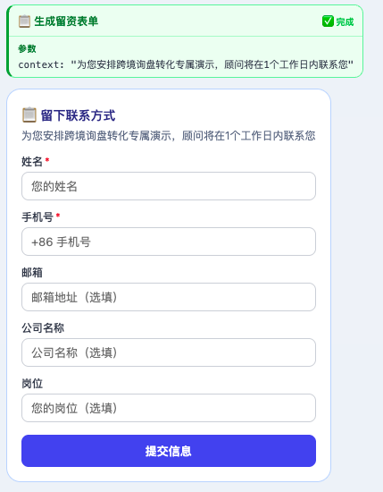

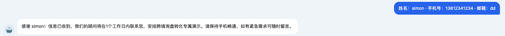

---

#### 2.4.2 追问弹窗 confirm_dialog

**逻辑**：主 Agent 意图不明确时（如访客第一句话过于模糊），调用 `confirm_dialog` 工具，返回 `__CONFIRM__:{…}` 前缀字符串，下发 `confirm_show` SSE 事件。

**弹窗渲染要求**：

- 在对话框内以卡片形式展示，而非系统弹窗（`alert`/`modal`）。
- 卡片包含：一行引导文字（如"请问您更关心以下哪方面？"）+ 2–4 个选项按钮 + 一个文本输入框（用于自由填写）。
- 点击选项 **或** 在输入框填写后点击「发送」：
  - 内容以**用户消息**的形式出现在聊天流中（而非弹窗直接消失）。
  - 主 Agent 收到该消息后继续对话。
- 卡片提交后变为不可操作（灰显）。

**Spec 格式**（来自 `confirm_dialog` 工具）：
```json
{
  "type": "confirm",
  "question": "您更关心哪方面？",
  "options": ["价格与起订量", "案例与交货期", "定制方案"],
  "allow_input": true,
  "input_placeholder": "或直接输入您的问题"
}
```

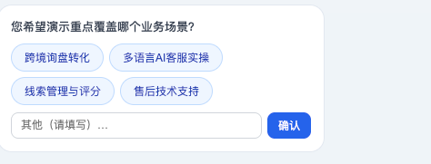


---

### 2.5 在线会话页（N2）— 人工接管 / 交还AI / 回复建议

**当前**：N2 在线会话无人工接管/交还 AI 操作入口；坐席接管后无建议辅助。

#### 2.5.1 人工接管 / 交还AI 按钮

位置：N2 对话区域**右上角**（对话框顶部，固定可见）。

**人工接管**：
- 状态：AI 对话中（按钮显示蓝色「人工接管」）。
- 点击后：
  - 调用 `POST /api/sessions/{sid}/handoff`。
  - 主 Agent 停止响应新消息（下一条用户消息不再触发 AI 回复）。
  - 坐席输入框变为可输入（如果之前不可输入）。
  - 分析 Agent 接到通知，生成 3 条回复建议。
  - 顶部出现黄色状态横幅「人工服务中」。
  - 按钮变为灰色「已接管」（不可再点击）；「交还AI」按钮变为可点击。

**交还AI**：
- 状态：人工接管中（「交还AI」按钮蓝色可点击）。
- 点击后：
  - 调用 `POST /api/sessions/{sid}/ai_resume`。
  - 坐席输入框**变为不可输入**（灰显，显示"AI 服务中"提示）。
  - 主 Agent 恢复响应，system 中注入人工期间的对话历史（`observe` 方式）。
  - 黄色横幅消失；「人工接管」按钮恢复可点击；「交还AI」变灰。

**边界**：访客侧（chat.html）2s 轮询感知接管状态，接管后顶部出现黄色横幅「当前由人工为您服务」；交还后横幅消失。

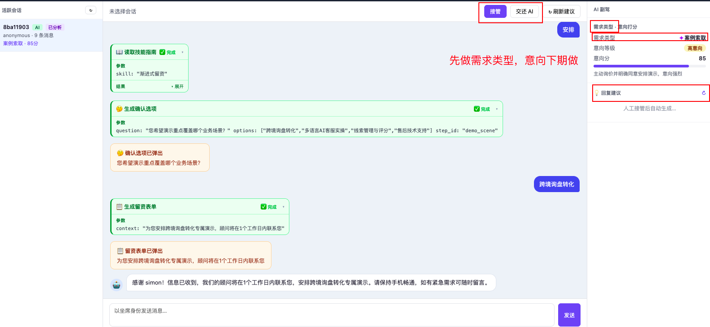


---

#### 2.5.2 坐席回复建议

位置：N2 右侧「AI 副驾」面板。

**触发时机**：
1. 人工接管后自动触发（分析 Agent 基于当前对话历史生成）。
2. 点击副驾面板的 ↻ 刷新按钮，手动重新生成。

**建议内容**：
- 3 条，每条 1–3 句话。
- 风格多样：情感安抚型 / 精准解答型 / 引导留资型（由分析 Agent 自动判断场景给出）。
- 每条建议显示简要风格标注（如「解答型」「引导型」）。

**操作**：
- 点击建议 → 内容填入输入框（原有内容替换，可继续编辑后再发送）。
- ↻ 刷新 → 显示 loading 状态（「生成中…」），刷新完成后替换显示。
- 建议生成中：显示 loading 占位（不影响坐席发消息）。

**需求类型展示**（同一面板）：
- 显示分析 Agent 识别到的最新需求类型标签（或 LLM 模式下的一句话描述）。
- 每条用户消息后异步更新，2s 内刷新。


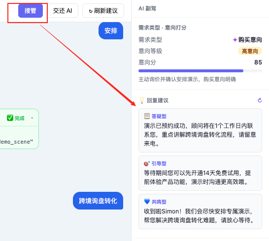

---

### 2.6 页面上下文注入（访客当前页面信息 → Agent）

**背景**：访客在商品页问「这个商品多少钱」，Agent 不知道当前页面是哪个商品，只能泛泛回答。

**本期要做**：

访客每次进入新页面（含 SPA 路由切换），前端自动采集当前页面信息并静默同步给 Agent，Agent 因此能感知访客当前正在看什么。

**前端职责（chat.html / chat-widget.js）**：
- 监听页面加载（`DOMContentLoaded`）和路由变化（`popstate` / `hashchange`），每次触发采集：
  - `page_title`：`document.title`
  - `page_url`：`window.location.href`
  - `meta_description`：`<meta name="description">` content
  - `meta_keywords`：`<meta name="keywords">` content
  - `og_title`：`<meta property="og:title">` content（商品页常见）
  - `og_description`：`<meta property="og:description">` content
- 若当前 session 已创建，立即 `POST /api/sessions/{sid}/page_context` 发送上述信息。
- 若 session 尚未创建（用户未打开对话窗口），先缓存，等 session 创建后补发。

**后端职责（agent-backend）**：
- 新增接口 `POST /api/sessions/{sid}/page_context`，body：`{ page_title, page_url, meta_description, meta_keywords, og_title, og_description }`。
- 将信息拼成一条「隐藏用户消息」注入 session 的 Agent 上下文，格式：
  ```
  [系统：访客当前页面已更新]
  页面标题：{page_title}
  URL：{page_url}
  页面描述：{meta_description}
  关键词：{meta_keywords}
  ```
- 调用 `main_agent.observe([hidden_user_msg])` 让 Agent 消化这条上下文（不触发完整 reply 流程）。
- 同时写入一条隐藏 assistant 消息（如 `[已更新页面上下文]`）作为 observe 的 ack。
- 两条消息均带 `hidden: true` 标记，**不出现在 `GET /api/sessions/{sid}/messages` 的返回结果中**，前端不渲染。

**明确边界**：
- 页面上下文是「补充背景」，不替换用户的真实提问，Agent 依然以用户消息为主体生成回复。
- 若页面 TDK 为空（纯后台页、无 meta 标签），仅发 `page_url`，不报错。
- 每次页面切换只做 observe，不触发 SSE 流，不占用对话轮次计数。

---

### 2.7 智能客服对话埋点（三项核心指标）

**背景**：目前无法量化 AI 对话的体验质量，上线后无法判断「首字响应是否变快、对话是否变深」。

**本期要做**：在 session 维度采集三项指标，通过 `/api/sessions/{sid}/analytics` 接口对外暴露，后续接入 N10 转化看板。

#### 指标定义

| 指标 | 字段 | 定义 | 计算方式 |
|---|---|---|---|
| **对话轮次** | `turns_count` | 一个 session 中完成的 user→AI 交换轮数 | 每次 ReplyEndEvent 触发后 +1 |
| **首字响应时间** | `first_token_ms_list` | 每轮从用户发送消息到收到第一个 `text_delta` 的毫秒数 | 后端记录每轮开始时间戳 `t0`，第一个 `text_delta` 时记录 `t1`，`t1-t0` 入列 |
| **对话时长** | `session_duration_ms` | session 创建时间 → 最后一次活动时间的总毫秒数 | `last_activity_at - created_at` |

#### 接口

新增 `GET /api/sessions/{sid}/analytics`，返回：
```json
{
  "session_id": "abc123",
  "turns_count": 5,
  "first_token_ms_list": [1200, 980, 1450, 870, 1100],
  "first_token_ms_avg": 1120,
  "session_duration_ms": 342000,
  "created_at": 1750000000.0,
  "last_activity_at": 1750000342.0
}
```

`GET /api/sessions` 列表接口同步补充 `turns_count` 和 `first_token_ms_avg` 字段，供坐席工作台列表显示。

#### SSE 时间戳事件（前端侧计时用）

在每轮流式回复开始时，于第一个 `text_delta` 之前增发一个 `timing_start` 事件：
```json
{ "type": "timing_start", "server_ts": 1750000001234 }
```
前端记录用户点击发送的本地时间 `t0`，收到 `timing_start` 时记录 `t1`，端到端首字感知延迟 = `t1 - t0`（含网络传输）。前端可将此数据上报到埋点系统（第二期统一），本期后端侧记录服务端维度即可。

---

## 三、已有问题修复

### 3.1 前端优化

| 问题 | 本期修复内容 | 验收标准 |
|---|---|---|
| 聊天窗口不能放大，输入内容多了不方便 | 右上角增加「全屏」/「恢复」切换按钮 | 点击全屏后窗口占满浏览器视口；再点恢复，回到原始尺寸 |
| 窗口位置不可移动 | 窗口标题栏支持拖拽定位 | 鼠标拖动标题栏，窗口跟随移动；释放后停留在新位置 |
| N2 左右栏宽度固定 | 左侧（会话列表）/ 右侧（副驾面板）可拖拽边界调整宽度 | 拖拽边界线，对应栏宽变化；有最小/最大宽度限制 |
| 输入框高度固定 | 输入框上方分割线可拖拽（上下），扩大/缩小输入区高度 | 拖动分割线，输入框高度实时变化 |

---

### 3.2 Agent 优化

| 问题 | 根因 | 本期修复内容 |
|---|---|---|
| 回答机械化，明显像机器人 | system prompt 无人格约束 | 智能体人设注入 system prompt（见 §2.3）；配合流式 SSE 输出（已实现），消除等待感 |
| 同一问题不同问法就答非所问 | RAG 仅关键词匹配，语义覆盖弱 | 等下一期做 |
| 售后意图误判，自动分流失效 | 固定标签无法覆盖多样售后语义 | 需求类型分类标签可自定义（见 §2.2.2），运营可针对高误判类别调整标签；LLM 模式适合复杂售后场景 |
| 输入英文符号触发英文回复 | prompt 未明确语言规则 | system prompt 增加明确指令：「分析用户的语言，选择一种语言进行回复」 |

---

### 3.3 转人工升级（企业微信）

**当前问题**：
- 转人工渠道仅支持 QQ / 微信 / 电话 / 邮件，不支持企业微信。
- 表单配置与三方工具配置互斥（单选），无法组合使用。

**本期要做**：
- 转人工配置页「接待渠道」增加「企业微信」选项，支持配置企业微信客服账号/二维码/链接。
- 修改为**多选**：表单留资 + 三方渠道引导可同时开启（如：先展示留资表单，同时提供企业微信二维码）。
- 转人工时展示逻辑：按运营配置的渠道组合渲染（表单优先展示，渠道链接/二维码附后）。

---

## 四、明确不在本期范围

以下功能**不在第一期**，顺延至第二/三期：

| 功能 | 计划期 | 备注 |
|---|---|---|
| 意向打分（`score_intent`） | 第二期 | 与线索系统整体升级一并做 |
| TwentyCRM 线索写入 | 第二期 | 需要 CRM Adapter 和数据契约 |
| 身份归并（visitor_id → unified_id） | 第二期 | — |
| 客户 360 视图 | 第二期 | — |
| A/B 实验框架 | 第二期 | — |
| 工单系统（N8） | 第二期 | — |
| 满意度（N9）、叙事画像 | 第三期 | — |
| 埋点增强（地域/邀请归因/频率分布） | 第二期 | — |
| 富消息卡片/轮播 | 第二期 | — |

---

## 五、测试用例

格式：`TC-{模块}-{编号}` · 前提 / 操作 / 预期结果

---

### 5.1 对话拟人化（人设注入）

| 编号 | 测试项 | 前提 | 操作 | 预期结果 |
|---|---|---|---|---|
| TC-P-01 | 人设生效 | N3 配置「名称=Anvil顾问；人设=专业亲切的外贸销售顾问」 | 新建访客会话，发送「你好」 | AI 自称「Anvil顾问」或符合人设称谓，不出现「我是AI助手」类机械语句 |
| TC-P-02 | 风格一致性 | 同上人设 | 进行 ≥8 轮对话，话题随机（价格/案例/定制） | 每轮回复语气风格与人设一致，不出现人设以外的语言风格 |
| TC-P-03 | 语言跟随用户 | 默认人设 | 先发中文「你好」；再开新会话发英文「What is your MOQ?」；再开新会话发西班牙语「¿Cuál es el precio?」 | 每个会话 AI 自动识别并以对应语言回复（中/英/西班牙语）；不因用户语言而出错 |
| TC-P-04 | 英文符号不触发语言错乱 | 默认人设，用户用中文对话 | 输入「价格是多少？$50起？！@#」发送 | AI 以中文正常回答，不因 `$@#` 等符号切换语言或输出乱码 |
| TC-P-05 | 热更新生效 | 已有会话 A（旧人设）；修改人设并保存 | 新建会话 B，发送「你好」 | 会话 B 使用新人设；会话 A 不受影响 |
| TC-P-06 | 不填人设不报错 | N3 基本信息三个字段均留空 | 新建会话，发送任意消息 | AI 正常回复，无 500 错误，使用默认 prompt |

---

### 5.2 留资无感（渐进式表单 + confirm_dialog）

| 编号 | 测试项 | 前提 | 操作 | 预期结果 |
|---|---|---|---|---|
| TC-L-01 | confirm_dialog 展示 | 主 Agent 判断意图不明 | 发送模糊开场白（如「我想了解一下」） | 对话框内出现引导卡（问题文字 + 选项按钮 + 输入框） |
| TC-L-02 | 选项点击转用户消息 | confirm_dialog 已展示 | 点击选项「价格与起订量」 | 聊天框出现用户消息「价格与起订量」；主 Agent 据此继续对话 |
| TC-L-03 | 文本输入转用户消息 | confirm_dialog 已展示 | 在自由输入框写「我想做 OEM」，点「发送」 | 聊天框出现用户消息「我想做 OEM」；卡片变为灰显不可操作 |
| TC-L-04 | 渐进式表单触发时机 | `trigger_rounds` 配置为 4 | 进行 4 轮对话 | 第 4 轮 AI 回复后，表单出现在对话流中 |
| TC-L-05 | 表单字段与配置一致 | `lead_capture.fields` 中 enabled: phone=true, budget=false | 留资表单展示 | 显示姓名/手机/邮箱等 enabled 字段；「预算区间」不显示 |
| TC-L-06 | 必填校验 | 姓名、手机为 required | 不填手机，点提交 | 手机字段边框变红，提示「必填」，不发送请求 |
| TC-L-07 | 提交后表单状态 | 姓名+手机已填 | 点击提交 | 表单变为只读收起，显示「已提交 ✓」；触发 `lead_captured` 事件 |
| TC-L-08 | 线索写入 session | 同上 | 提交后查 `/api/sessions/{sid}` | `captured_lead` 字段包含完整表单数据（姓名/手机/邮箱等）|
| TC-L-09 | 字段配置热更新 | 已有配置 `email: enabled=true` | 改为 `email: enabled=false`，新建会话触发表单 | 新会话的留资表单中「邮箱」字段不显示 |

---

### 5.3 坐席回复建议

| 编号 | 测试项 | 前提 | 操作 | 预期结果 |
|---|---|---|---|---|
| TC-R-01 | 接管后 AI 停止 | AI 对话中 | 点击「人工接管」 | 后续用户消息不再触发 AI 回复；输入框变为可输入 |
| TC-R-02 | 建议生成时效 | 人工接管后 | 等待副驾面板 | ≤10s 内出现 3 条回复建议 |
| TC-R-03 | 建议内容相关性 | 对话主题为「询问价格」后接管 | 查看建议 | 至少 2 条建议内容与价格相关，不是通用问候语 |
| TC-R-04 | 点击建议填入输入框 | 建议已生成 | 点击第 2 条建议 | 输入框内容替换为该建议文本，光标置于末尾，可继续编辑 |
| TC-R-05 | 刷新重新生成 | 建议已显示 | 点击 ↻ 刷新 | 显示「生成中…」loading；完成后显示新的 3 条建议（内容与上次不完全相同） |
| TC-R-06 | 交还 AI 后输入框禁用 | 人工接管中 | 点击「交还AI」 | 输入框变灰、不可输入；显示「AI 服务中」提示 |
| TC-R-07 | AI 续接不重复 | 人工期间坐席回复了「价格是 $500/件」 | 交还 AI 后，访客发「那最小起订量呢」 | AI 的回复不重复询问价格，知道已回答过 $500，直接答起订量 |
| TC-R-08 | 状态横幅展示 | chat.html 同步轮询 | 接管后 2s 内刷新 chat.html | chat.html 顶部出现「当前由人工为您服务」黄色横幅 |
| TC-R-09 | 交还 AI 后横幅消失 | chat.html 显示横幅 | 点击「交还AI」，2s 内刷新 chat.html | 横幅消失；AI 回复恢复正常 |

---

### 5.4 需求类型识别

| 编号 | 测试项 | 前提 | 操作 | 预期结果 |
|---|---|---|---|---|
| TC-D-01 | 预设模式识别准确 | 预设分类包含「价格咨询」 | 访客发「你们的报价是多少」 | 副驾面板「需求类型」标注为「价格咨询」 |
| TC-D-02 | 多轮后识别更新 | 对话从闲聊转为「我要定制产品」 | 继续对话 | 需求类型在用户发送「定制」相关消息后更新为「定制需求」 |
| TC-D-03 | 新增标签生效 | 在 N3 新增标签「样品申请」 | 访客发「我想先要个样品看看」 | 需求类型识别出「样品申请」 |
| TC-D-04 | LLM 模式输出 | N3 切换为 LLM 自动总结模式 | 任意对话 | 需求类型显示为一句话描述（如「用户正在询问 OEM 定制的起订量」），而非固定标签 |
| TC-D-05 | 实时性 | N2 已打开 | 访客发送一条消息 | ≤5s 内 N2 副驾面板的需求类型更新 |
| TC-D-06 | 留资快照写入 | 需求类型已识别为「价格咨询」 | 访客完成留资表单提交 | session.captured_lead 中包含 `demand_type: "价格咨询"` 字段 |

---

### 5.5 N3 意向收集技能配置弹窗

| 编号 | 测试项 | 前提 | 操作 | 预期结果 |
|---|---|---|---|---|
| TC-N-01 | 弹窗可打开 | N3 已有「意向线索收集」技能 | 点击技能「配置」按钮 | 弹窗正常打开，显示字段列表 |
| TC-N-02 | 字段与 N7 一致 | N7「线索字段设置」有 5 个字段 | 打开配置弹窗 | 弹窗中显示相同 5 个字段（名称、类型、必填状态与 N7 一致） |
| TC-N-03 | 字段只读 | 弹窗已打开 | 尝试修改字段名称或类型 | 字段不可编辑（灰显/无输入焦点） |
| TC-N-04 | 启用/禁用开关 | 「邮箱」字段当前 enabled | 关闭「邮箱」开关，保存 | 新会话留资表单中「邮箱」字段不出现 |
| TC-N-05 | N7 新增字段同步 | 弹窗已打开 | 去 N7 新增字段「公司网站」，返回刷新弹窗 | 弹窗字段列表中出现「公司网站」 |

---

### 5.6 前端优化

| 编号 | 测试项 | 操作 | 预期结果 |
|---|---|---|---|
| TC-U-01 | 全屏按钮 | 点击聊天窗口右上角「全屏」图标 | 窗口扩展至浏览器视口全屏；再点「恢复」，回到原始尺寸 |
| TC-U-02 | 窗口拖拽 | 鼠标按住标题栏拖动 | 窗口跟随鼠标移动，释放后停留在新位置 |
| TC-U-03 | N2 左侧栏拖拽 | 拖拽左侧/右侧栏边界线 | 对应栏宽实时变化；最小宽度 120px，最大宽度为总宽 50% |
| TC-U-04 | 输入框高度拖拽 | 拖拽输入框上方分割线 | 输入框高度实时变化；对话列表同步缩放 |
| TC-U-05 | 英文符号输入 | 在中文对话中输入「价格是多少，$50 起？！@#」并发送 | AI 以中文正常回复，不因特殊符号切换语言或输出乱码 |

---

### 5.7 企业微信转人工

| 编号 | 测试项 | 操作 | 预期结果 |
|---|---|---|---|
| TC-W-01 | 配置项显示 | 打开转人工配置页 | 渠道列表中出现「企业微信」选项 |
| TC-W-02 | 企业微信配置保存 | 填入企微客服账号/二维码链接，保存 | 保存成功；刷新后配置仍显示 |
| TC-W-03 | 多选并存 | 同时勾选「留资表单」+ 「企业微信」 | 两者均可保存，不互斥 |
| TC-W-04 | 转人工时展示 | 配置了企微 + 表单 | AI 发起转人工时 | 展示留资表单 + 企微二维码/链接（按配置顺序展示） |

---

### 5.8 页面上下文注入

| 编号 | 测试项 | 前提 | 操作 | 预期结果 |
|---|---|---|---|---|
| TC-C-01 | 页面信息被 Agent 感知 | 访客在商品详情页（title=「Anvil X200 冷锻机」，description 含「起订量 50 台」） | 打开对话窗口后问「这个产品多少钱」 | Agent 回复中提及「X200」或相关信息，而非泛问「请问您指的是哪款产品」 |
| TC-C-02 | 页面切换时 Agent 上下文更新 | 先在 A 页面打开对话，再跳转到 B 页面（不同商品） | 在 B 页面问「刚才那款和这款哪个好」 | Agent 能区分两个页面的产品，不混淆 |
| TC-C-03 | 隐藏消息不在前端渲染 | 触发页面上下文注入 | 查看 chat.html 对话记录 | 对话界面中无「系统：访客当前页面已更新」或类似系统消息出现 |
| TC-C-04 | 接口幂等无报错 | 同一页面快速刷新 3 次 | 连续发送 3 次 page_context | 后端均返回 200，不报错；Agent 只消化最新一条 |
| TC-C-05 | TDK 为空时不报错 | 目标页无 meta description / keywords | 访问该页面，触发上下文注入 | 后端正常处理，只传 `page_url` 和 `page_title`，不崩溃 |
| TC-C-06 | session 未创建时缓存后补发 | 用户先浏览页面再打开对话窗口 | 浏览 2 个页面后才点击打开对话 | session 创建后自动补发最新页面的 page_context |

---

### 5.9 对话埋点（三项指标）

| 编号 | 测试项 | 前提 | 操作 | 预期结果 |
|---|---|---|---|---|
| TC-M-01 | 对话轮次计数 | 新建 session | 完成 3 轮 user↔AI 对话 | `GET /analytics` 返回 `turns_count: 3` |
| TC-M-02 | 首字响应时间记录 | 新建 session | 发送一条消息，等待 AI 回复完成 | `first_token_ms_list` 有一个元素，值在 100–5000ms 合理范围内 |
| TC-M-03 | 多轮首字响应均有记录 | 完成 3 轮对话 | 查 analytics | `first_token_ms_list` 有 3 个值；`first_token_ms_avg` = 三者均值 |
| TC-M-04 | 对话时长计算 | session 创建后对话 5 分钟 | 查 analytics | `session_duration_ms` ≈ 300000，误差 < 2s |
| TC-M-05 | timing_start SSE 事件 | 开始 AI 回复 | 抓取 SSE 流 | 第一个 `text_delta` 之前有 `timing_start` 事件，含 `server_ts` 字段 |
| TC-M-06 | 人工接管轮次不计入 | 人工接管期间坐席发了 2 条消息 | 交还 AI 后再完成 1 轮 | analytics 中 `turns_count` 只计 AI 轮次，人工期间不累加 |
| TC-M-07 | 列表接口含统计字段 | 有活跃 session | `GET /api/sessions` | 每个 session 条目含 `turns_count` 和 `first_token_ms_avg` 字段 |

---

## 六、验收成功指标

### 6.1 功能验收（上线前，内部测试）

| 指标 | 定义 | 目标 | 测量方式 |
|---|---|---|---|
| 建议生成时效 | 人工接管 → 首次出现 3 条建议的时长 | ≤ 10s | 计时器记录（10 次接管取平均） |
| 需求类型识别准确率 | 与人工判断一致的比例 | ≥ 85% | 随机抽取 20 个对话，人工逐一核对 |
| 语言跟随识别准确率 | 分别用中/英/阿拉伯语发消息，AI 以对应语言回复的比例 | 100%（3 种语言各 3 条） | 人工逐一核对 |
| 特殊符号不触发语言错乱 | 含 $@#! 等符号的对话，AI 语言不切换、无乱码 | 100% | 发送 10 条含符号的消息 |
| 配置热更新生效 | 修改 analysis_config.json 后，新会话立即使用新配置 | 100%，无需重启 | 实测 3 次 |
| 人设注入无乱码 | 新会话 AI 第一条回复中无乱码/截断 | 100% | 实测 10 次不同人设配置 |

### 6.2 转化效果验收（上线后，跟踪 2 周）

| 指标 | 定义 | 基线（上线前测量）| 目标 | 测量方式 |
|---|---|---|---|---|
| 平均对话轮次 | ≥ 3 轮的会话平均对话轮数 | 上线前 2 周均值 | 提升 ≥ 15% | 服务端 session 日志 |
| 留资完成率 | 进入对话→完成留资表单/比例 | 上线前 2 周均值 | 提升 ≥ 25% | `lead_captured` 事件 ÷ `session_start` 事件 |
| 坐席首次响应时长 | 接管 → 第一条坐席消息的时长中位数 | 估计 60–90s | ≤ 30s | 服务端时间戳差值 |
| AI 机械感评分 | 内部盲测：随机取 10 段对话，测试者判断「是否明显像机器人」 | 上线前实测 | ≤ 3/10 段被判断为明显机器人 | 内部盲测（3 人以上参与） |

> **注意**：本期不做 A/B 随机对照实验（A/B 框架在第二期落地），转化效果采用「上线前后对比 + 同期感知评估」。
