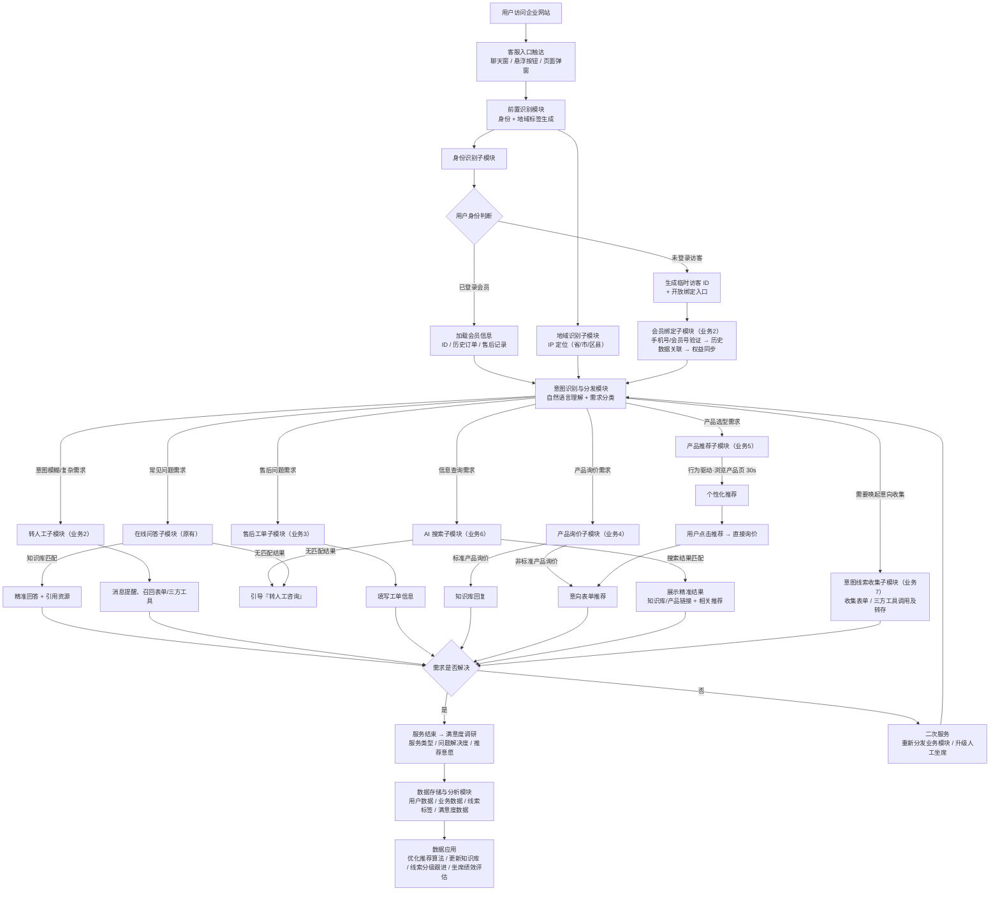

# 现有系统现状梳理（基于 my-website 截图）

> 来源：`document/my-website/` 16 张控制台截图
> 日期：2026-06-04（2026-06-05 补充 Demo 与原型进展）
> 目的：盘点现有线上系统已具备的功能与页面，作为本次"按方案重构新页面"的基线与灵感来源

---

## 0. 总体判断

现有系统**不是空白**，而是一套已上线、相当成熟的**外贸/多站点营销 SaaS 控制台**（界面含 WhatsApp、外贸客户咨询、多语言 ZH_CN/EN、多网站切换）。它已经覆盖了产品方案里相当一部分能力：访客识别、智能客服对话、知识库（RAG）、转人工、线索管理、客户管理、数据分析、对话流编排都已存在。

这意味着本次需求的真实定位不是"从零搭建"，而是：**把方案描述的端到端闭环流程，参照现有系统的信息架构与交互风格，重构为一套新页面**——补齐缺失环节（工单、满意度闭环、情绪、双轨画像、富消息交互组件、身份归并、评估看板），并把现有分散的能力串成一条连贯的价值链。

---

## 1. 信息架构（左侧导航）

系统主导航在"客户管理"大模块下，分四组：

- **线索管理**：全部线索
- **客户管理**：全部客户 / 客户分组 / 客户设置
- **会员管理**：会员列表 / 机构会员列表 / 会员等级 / 会员设置 / 会员登录方式
- **在线沟通**：在线客服 / 智能客服(Pro) / 高级功能

进入"在线沟通"后，有一组二级子导航（本次重构的主战场）：

> 在线会话 ｜ 智能客服 ｜ 知识库 ｜ 未回答 ｜ 客服设置 ｜ 消息订阅 ｜ 访客识别 ｜ 数据分析

几乎所有页面右上角都有「切换网站」（多站点）和「查看本页帮助」，顶部是面包屑导航。整体为浅色、卡片式、蓝色主色调的企业控制台风格。

---

## 2. 已有页面逐个盘点

### 2.1 在线会话（客服工作台）

实时对话工作台，三栏布局：

- **左栏 · 会话列表**：访客卡片，含国家/地区旗标、归属地区、匿名 ID（如 `anony2605...`）、语言标签（ZH_CN / EN）、状态（[离线]文字）、最近消息时间。
- **中栏 · 筛选**：消息类型（全部访客）、时间范围（最近 7 天 / 自定义日期）。
- **右栏 · 对话面板**：顶部显示对话对象（匿名访客 / 线索 / 会员均可）的名称/匿名 ID、归属地区、在线/离线状态，右侧工具按钮 **AI总结 / 访问轨迹 / 转存线索 / 退出** 四个；消息气泡支持「点击翻译」；底部输入框带 **手动 / 自动** 切换与「发送」。
  - **AI总结**（弹窗）：含「整体总结」（叙事摘要 + 线索信息提取：邮箱/手机/其它联系方式/访客公司名称/联系人姓名，缺失显示"未提供"）、「时间轴总结」（按日期的多次会话要点）、「关联会员」（是否绑定会员）、「关联线索」（线索ID + 状态 + 公司/手机/邮箱/姓名/其它联系方式）；顶部有「AI 重新总结」按钮与最新生成时间。

> 已具备：人工对话、AI 总结（整体+时间轴+关联会员/线索）、访问轨迹查看、一键转存线索、多语言翻译。对话对象可为访客/线索/会员。这是方案"坐席工作台"的雏形。

### 2.2 访问轨迹（弹窗）

从在线会话「访问轨迹」按钮唤起，按次展示访客行为：

- 每次访问一张卡片：**访客来源**（直接访问）、**访问页面数**、**停留总时长**（如 4.4s / 39.7s）、**访客 IP**（IPv6）、时间戳。
- **浏览轨迹**：入口页面、页面名称、单页停留秒数。
- 顶部可按访问时间、访客来源筛选；标注「每 10 分钟更新一次」。

> 已具备：方案 4.1「行为感知」的核心——停留时长、页面轨迹、来源、IP。缺：滚动深度、CTA 点击、流失前兆等更细信号。

### 2.3 访客识别

匿名访客清单 + 企业识别：

- 顶部：**企业识别额度（剩余/总数）89/100**、去充值。
- 筛选：来源网站、访客类型、最近访问时间、升降序、导出。
- 表格列：**访客 id**（anony…）、**归属 IP**、**归属地区**、**所属企业**、**最近访问时间**、**访问轨迹**（查看）、**访问记录**（查看对话）、**来源网站**。Total 157，分页。

> 已具备：匿名访客身份 + IP/地区/企业归属 + 轨迹与对话入口。这正是方案身份归并"留资前以 IP/匿名 ID 识别"的现成载体；「所属企业」说明已接入 IP→企业的识别服务。

### 2.4 智能客服 —「智能体」配置

AI 数字员工配置，顶部切换「智能体 / 对话流」，六个子标签：

- **基本信息**：名称（2–20 字）、简要描述（5–200 字）；**开场白设置**（启用开关 / AI 动态生成 / 自定义；动态开场白可识别新老用户生成个性化开场白）；**开场白问题**（如"请问您有哪些产品"）。
- **人设设置**：行业关键词；**智能体语言**（识别用户语言 / 网站语言 / 指定语言）；**智能体角色**（售前 / 售后 / 技术支持 / 销售顾问 / 市场营销）；**响应风格**（即时指令型 / 专业严谨型 / 温暖亲和型 / 协作统筹型）。
- **技能设置**（开关式）：产品推荐、AI 搜索、转人工、产品询价、售后服务、意向收集、主动交流、回复调研。
- **知识库设置**：绑定知识库目录（手动添加默认目录 / 教育知识 / 其它知识）。
- **快捷标签**、**会员中心**（标签可见，未展开）。

> 已具备：方案第 6 节自建 Agent 的配置面——人设、角色、风格、技能（含转人工 / 意向收集）、知识库绑定、开场白。技能是开关式插件，扩展性好。

### 2.5 智能客服 —「对话流」编排

场景化客服流编排：

- 说明：「每个站点限创建 2 个客服流，同一个触点仅限 1 个客服流。AI 客服开启后自动回复待接话术失效。」
- 卡片式管理：新建 AI 客服（+）、WhatsApp（已启用）、智能客服（已启用）、test（草稿）、售后（草稿）、简体中文站 222（草稿）、网站 AI 客服（已停用）。每张卡可查看流程 / 设置 / 启用停用。

> 已具备：方案"Agent 编排 / 工具调用流程"的可视化容器。缺：方案第 5 节的富消息交互组件协议（卡片 / 轮播 / 表单 / 快捷选项）的结构化下发。

### 2.6 知识库

RAG 知识库管理：

- 左侧**知识目录**（可新增）：手动添加默认目录、教育知识、其它知识。
- 标签页：**文档知识 / web 知识 / FAQ / 网站内容**。
- 表格：文档名称、文件大小、**状态（学习成功）**、是否开启（开关）、上传时间、**学习完成时间**、操作（下载 / 删除 / 重新学习）。支持批量转移 / 删除 / 重新学习。

> 已具备：方案 P0「RAG 私有知识库」——多来源（文档 / web / FAQ / 网站抓取）、学习状态、按目录组织。已是较完整的知识库。

### 2.7 未回答

AI 未能回答的问题记录：

- 表格：回复内容 / 问题、提问时间、操作（**删除 / 转移**）。如"请问有哪些产品""镀锌板的工艺流程""H2C 技术相比传统技术有哪些优势特点"。Total 146。

> 已具备：方案 4.6「知识沉淀飞轮」的入口——未回答问题可「转移」进知识库，闭环 RAG。

### 2.8 客服设置

人工接待规则配置，顶部五个标签：**客服设置 / 接待与分配 / 全局设置 / 用户调度 / 接待时间配置**。当前页（话术设置）：

- 话术来源：默认话术 / 自定义话术。
- **简洁问候**：问候语设置（多条）、话术内容间隔（秒）、问候语播发次数。
- **无应答设置**：企业无应答间隔 / 话术、访客无应答间隔 / 话术。
- **AI 客服提醒设置**：开启转人工提醒（开关）。

> 已具备：接待分配、话术、无应答兜底、转人工提醒。这是方案"转人工触发 + 坐席协同"的规则层。

### 2.9 数据分析

运营看板：

- 时间范围：当日 / 最近 7 天 / 最近 30 天 / 自定义；可导出报告；切换网站。
- 指标卡（含环比）：**接待访客数 38、互动访客数、线索转化数、未回答数、邀请会话数、接受邀请数、接受邀请率、转人工次数**。
- **访客趋势**折线图：接待访客 / 互动访客 / 线索转化。

> 已具备：基础转化漏斗指标。缺：方案第 10 节的北极星指标（LCR/CSAT/留存）、领先 vs 滞后分层、A/B 显著性、分群下钻。

### 2.10 线索管理

留资线索池：

- 顶部：线索字段设置；筛选（线索信息、来源 [全部表单/网站]、提交时间、估计价值 $、线索日期）。
- 状态标签页：**待处理(11) / 跟进中(4) / 已转化(0) / 无效(0)**。
- 表格：客户名称、手机号、来源表单、来源、提交时间、操作（**查看 / 转为客户 / 更多**）。来源含"外贸客户咨询""在线客服-xiaoying"等，带来源网站链接与中文站标识。

> 已具备：方案"留资→线索"的落点；线索分阶段（待处理/跟进中/已转化）+「转为客户」。这是身份归并"留资后"的承接页。

### 2.11 客户管理

正式客户档案：

- 新增客户、更多操作；筛选（来源媒体、客户群类型、关键字）。
- 表格：姓名/企业名称（标注个人客户/企业）、手机/邮箱、客户分组、**来源方式**（含中文站 / 线索转化标识）、创建时间、**状态（启用/未启用）**、操作（查看/编辑/更多/删除）。

> 已具备：客户主档；来源方式可追溯到"线索转化"。这是身份归并后的"客户"实体。

### 2.12 在线客服（联系入口 / 真人客服配置）

网站上的联系组件与真人客服渠道：

- **添加客服组**、**客服热线设置**；客服组列表（如"11""测试"）可添加客服/编辑/删除。
- **添加客服**弹窗：客服名称、**客服类型（WhatsApp 等渠道）**、账号、状态开关。
- **选择切换模板**：模板一~四 + 自定义（不同样式的悬浮联系卡片，含热线、邮箱、WhatsApp、二维码等）。

> 已具备：网站侧联系 Widget 与多渠道（WhatsApp 等）真人客服。与"智能客服对话 Widget"是两条并行入口。

---

## 2.13 智能客服对话流程现状（真实运行主干）

> 来源：`history/mermaid.pdf`。这是现有智能客服**实际运行的对话决策流程**，比产品方案的"①–⑧ 链路"更贴近线上真相。它用产品自己的"**新增业务 2–7**"编号组织子模块，是本次重构的"地面真相"基线。

整条流程：**入口触达 → 前置识别（身份+地域）→ 意图识别与分发 → 7 个业务子模块 → 需求是否解决 → 满意度 / 二次服务 → 数据存储分析 → 数据应用**。

**七个业务子模块（现状编号）**

| 编号 | 子模块 | 触发场景 | 关键动作 |
|---|---|---|---|
| 原有 | 在线问答 | 常见问题需求 | 知识库匹配 → 精准回答 + 引用资源；无匹配转人工 |
| 业务2 | 转人工 / 会员绑定 | 意图模糊/复杂；未登录需绑定 | 消息提醒、召回表单；手机号/会员号验证关联历史 |
| 业务3 | 售后工单 | 售后问题需求 | 填写工单信息 |
| 业务4 | 产品询价 | 产品询价需求 | 标准→知识库回复；非标准→意向表单推荐 |
| 业务5 | 产品推荐 | 产品选型需求 | 行为驱动（浏览 30s）个性化推荐 → 引导询价 |
| 业务6 | AI 搜索 | 信息查询需求 | 搜索匹配→精准结果+推荐；无匹配→转人工 |
| 业务7 | 意图线索收集 | 需要唤起意向收集 | 收集表单 / 三方工具调用及转存 |

> **前置识别**（身份+地域）是所有子模块的入口前提：身份分"已登录会员 / 临时访客 + 绑定入口"，地域走 IP 定位。这与产品方案第 4 节"身份归并模型"是同一件事的现状版——现状以"会员/访客"二分，方案升级为 `session_id → visitor_id → unified_id` 三层归并。

### 2.13.1 现状 7 模块 → 产品方案的对齐映射

把现状真实流程的 7 个子模块，对齐到产品方案的"①–⑧ 链路 / N1–N11 页面 / 自建 Agent 工具"，作为"现状→改造"的桥梁：

| 现状子模块 | 链路环节 | 新页面 | 自建 Agent 工具 | 改造要点 |
|---|---|---|---|---|
| 前置识别（身份+地域） | ① 行为感知 + 身份归并 | N1 / N6 | 代码侧：身份归并 / IP 识别 | 会员/访客二分 → `unified_id` 三层归并 |
| 在线问答（原有） | ② 主动对话 / 答疑 | N5 知识库 | `rag_search` | 复用为主，补命中率统计 |
| AI 搜索（业务6） | ② 主动对话 | N5 知识库 | `rag_search` | 与在线问答统一到 RAG 检索 |
| 产品推荐（业务5） | ③ 交互留资（行为驱动） | Widget / N1 | `push_ui_component(card/carousel)` | 30s 浏览触发 → 富消息卡片下发（Widget 内置，无独立编排页）|
| 产品询价（业务4） | ③ 交互留资 | N3 / N7 | `push_ui_component(form)` | 非标询价 → 渐进式留资（配置在 N3 意向线索收集技能）|
| 意图线索收集（业务7） | ③ 交互留资 → ④ 画像 | N3 → N6/N7 | `create_lead` + `score_intent` | 表单转存 → 结构化线索 + 意向打分 + 身份归并 |
| 转人工（业务2） | ⑤ 转人工 | N2 / N11 | `handoff_human` | 补技能/负载路由、完整上下文交接、AI 副驾 |
| 售后工单（业务3） | ⑥ 工单 | N8 工单工作台 | `create_ticket` | 补自动分类/路由/SLA/可解释优先级/客户确认闭环 |
| 满意度调研 / 二次服务 | ⑦ 满意度回流 | N9 满意度中心 | 代码侧：CSAT 采集 | 补 NPS、情感识别、主题聚类、回流画像/知识库 |
| 数据存储分析 / 数据应用 | 评估体系 | N10 转化看板 | — | 补北极星指标、漏斗下钻、A/B 显著性 |

---

## 3. 现有能力 vs 产品方案的对应关系

| 方案环节 | 现有系统对应 | 成熟度 |
|---|---|---|
| ① 行为感知 | 访客识别 + 访问轨迹（IP/地区/企业/页面轨迹/停留） | 🟢 较成熟，缺滚动/CTA/流失前兆 |
| ② 主动对话 | 智能客服（开场白/主动交流技能）+ 在线会话 | 🟢 已有 |
| ③ 交互留资 | 开场白问题、快捷标签、技能-意向收集；线索表单 | 🟡 有，但缺富消息组件（卡片/轮播/表单/快捷选项）协议 |
| ④ 画像/情绪 | 访客识别（事实）+ 客户档案；AI 总结 | 🟡 缺叙事画像、意向打分、情绪识别/弧度 |
| ⑤ 转人工/坐席 | 技能-转人工、客服设置、在线客服、在线会话工作台 | 🟢 已有雏形，缺技能/负载路由、AI 副驾 |
| ⑥ 工单 | —（仅转人工，无独立工单系统） | 🔴 缺失 |
| ⑦ 满意度回流 | 技能-回复调研、未回答→知识库转移 | 🟡 知识回流有，CSAT/NPS 采集+分析缺 |
| ⑧ CRM 写回 | 线索管理 / 客户管理（站内 CRM） | 🟢 站内已有，外部 CRM Adapter 视需要 |
| 身份归并 | 匿名 anony ID + IP + 所属企业；线索「转为客户」 | 🟡 有要素，缺显式 unified_id 归并规则 |
| 知识库/RAG | 知识库（文档/web/FAQ/网站内容 + 学习状态） | 🟢 成熟 |
| 评估看板 | 数据分析（接待/互动/转化/转人工趋势） | 🟡 缺北极星/漏斗/A/B/分群 |

**结论**：方案约 60–70% 的能力在现有系统已有载体，但分散在不同页面、且缺少"工单、满意度闭环、情绪、双轨画像、富消息组件、身份归并、评估体系"这几块。本次重构应**串链 + 补缺**，而非推倒重来。

---

## 4. 可借鉴的设计资产（重构新页面时复用）

- **三栏对话工作台**（在线会话）→ 直接作为新"坐席工作台"的骨架，扩展情绪曲线、AI 副驾、工单草稿区。
- **Tab 式配置页**（智能客服：基本信息/人设/技能/知识库）→ 新页面延续这种"左导航 + 顶 Tab + 卡片表单"的配置范式。
- **开关式技能卡片**（技能设置）→ 新增能力（工单、满意度、情绪）可沿用同款开关卡片接入。
- **列表 + 状态标签页 + 行操作**（线索管理 待处理/跟进中/已转化）→ 工单列表、满意度列表沿用此模式。
- **指标卡 + 趋势图**（数据分析）→ 评估看板沿用，叠加北极星与漏斗下钻。
- **访问轨迹卡片**（按次访问 + 浏览轨迹）→ 客户 360 视图里的"行为时间线"组件。
- **多网站切换 / 面包屑 / 切换站点**全局组件 → 所有新页面保持一致。

---

## 5. 当前 Demo 与原型完成情况（2026-06-05）

### 5.1 sale-demo — 行为采集演示站（已运行）

`sale-demo/` 完成了以下能力的落地验证：

| 能力 | 组件 | 访问地址 |
|---|---|---|
| 行为事件采集（4类） | `portal-tracker.js` → PostgreSQL | http://localhost:8002/demo.html |
| 页面指标 API（跳出率/停留/滚动） | `GET /api/page-metrics` | http://localhost:8005 |
| 访客画像 API（事实标签） | `GET /api/visitor/:id` | http://localhost:8005 |
| **AI 对话 Widget（SSE 流式）** | `chat-widget.js` | 右下角浮窗，demo.html 嵌入 |
| AgentScope Session 管理 | `POST /api/ai/session` | → Ubuntu:8000 |
| **LLM 推理（gpt-5.5 流式）** | `POST /api/ai/chat` | → vveai.com（Mac 代理） |
| **TwentyCRM 线索写入** | `POST /api/crm/lead` | → Ubuntu TwentyCRM:8006 |

> **架构要点**：Ubuntu 服务器网络隔离，无法直连 vveai.com。LLM 推理由 Mac 本机 server.js 代理，AgentScope 仅做会话管理，TwentyCRM 走 GraphQL `createPerson`。

### 5.2 prototype — 中台控制台原型（已运行）

`prototype/` 基于 Vite + React + TypeScript + Tailwind + shadcn/ui，已实现 **10 个 N 系列页面原型**（http://localhost:1234）：

| 页面编号 | 页面名称 | 对应方案环节 | 文件 |
|---|---|---|---|
| N1 | 访客洞察 | ① 行为感知 | `N1-VisitorInsightsPage.tsx` |
| N2 | 对话工作台 | ⑤ 转人工 | `N2-AgentDeskPage.tsx` |
| N3 | 智能体配置（含渐进式留资配置） | ②③ 主动对话/交互留资 | `N3-AgentConfigPage.tsx` |
| N5 | 知识库 | RAG | `N5-KnowledgeBasePage.tsx` |
| N6 | 客户管理（列表 + 客户 360 详情） | ④ 画像/身份归并 | `N6-Customer360Page.tsx` |
| N7 | 线索池 | 留资后建线索 | `N7-LeadPoolPage.tsx` |
| N8 | 工单工作台 | ⑥ 工单（全新） | `N8-TicketWorkbenchPage.tsx` |
| N9 | 满意度中心 | ⑦ 满意度（全新） | `N9-SatisfactionPage.tsx` |
| N10 | 转化看板 | 评估体系 | `N10-ConversionDashboardPage.tsx` |
| N11 | 接待规则与路由 | ⑤ 路由/SLA | `N11-RoutingRulesPage.tsx` |

> 原 N4「交互组件编排」已撤销：对话流/组件库不做独立页，渐进式留资 + 可配置留资表单并入 N3「意向线索收集」技能的配置弹窗。

### 5.3 能力对照更新

| 方案环节 | 现有系统对应 | Demo/原型验证 | 下一步 |
|---|---|---|---|
| ① 行为感知 | 访客识别 + 访问轨迹 | ✅ portal-tracker 运行，N1 原型 | 补流失前兆信号 |
| ② 主动对话 | 智能客服开场白 | ✅ chat-widget AI 对话已通 | N3 智能体配置原型已实现，待接后端 |
| ③ 交互留资 | 意向收集技能 | ✅ Widget 内置留资表单 | N3「意向线索收集」技能内置可配置留资表单（原型已实现）|
| ④ 画像/情绪 | 访客识别+客户档案 | ✅ N6 客户360 原型 | 意向打分/情绪识别待接入 |
| ⑤ 转人工 | 在线会话工作台 | ✅ N2 对话工作台原型 | 接后端转人工 + 路由 |
| ⑥ 工单 | 缺失 | ✅ N8 工单工作台原型 | 后端工单服务待实现 |
| ⑦ 满意度 | 回复调研技能 | — | N9 满意度中心原型待实现 |
| ⑧ CRM 写回 | 站内线索管理 | ✅ TwentyCRM GraphQL 已通 | Webhook 回流待接入 |
